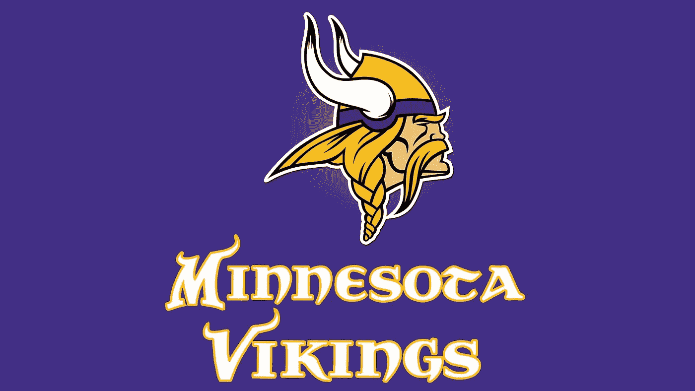
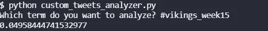
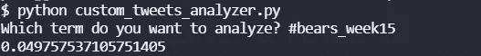

# NLP 分析推特预测 NFL 比赛:维京人在熊队，第 15 周

> 原文：<https://blog.devgenius.io/nlp-analysis-of-twitter-to-predict-nfl-games-vikings-at-bears-week-15-52bf79fa83bf?source=collection_archive---------15----------------------->

推特情绪能预测 NFL 比赛结果吗？第六集

[来自 BlogSpot 的图片](http://odinarvica.blogspot.com/2016/11/vikingos-deportistas.html)

到目前为止，我们已经对五场比赛、四场赛前情绪和一场半场情绪进行了情绪分析。到目前为止，赛前情绪较高的球队四次输了四次。最初，我假设推特人气高的团队会赢。数据显示，到目前为止，四次中有四次是错误的，然而，有一次我们做了半场分析(狮子队的红雀队，第 15 周)，情绪较高的队赢了。

这一集，我们来检验一下赛前情绪较低的队伍会赢的假设。两支球队的推特都是在东部时间晚上 8 点，比赛开始前 15 分钟被检索到的。按照这个关于[如何使用 Python](https://pythonalgos.com/2021/12/02/search-twitter-from-your-command-line-with-python/) 从命令行搜索 Twitter 的指南来检索推文。

## 关于维京人的推特情绪

关于维京人的推特情绪，第 15 周，作者图片

我们通过最近 100 条带有“维京人”标签的推文的[极性](https://pythonalgos.com/2021/11/10/natural-language-processing-what-is-text-polarity/)来计算推特情绪。维京人赛前的推特情绪是 0.04958。这是非常积极的。

## 推特上对熊市的看法

Twitter 对熊的情绪，第 15 周，作者图片

我们通过最近 100 条标签为“熊”的推文的极性来计算推特情绪。熊队赛前的推特情绪是 0.04976。这是非常积极的，非常接近维京人的情绪

## 评论和比较

嗯，就像我上面说的，我们的假设是情绪较低的队会赢。老实说，这些观点非常接近。这真的很令人惊讶，以前没有其他游戏表现出如此亲密的感情。坚持我们分析前的假设，我预测维京人会赢。让我们看看我们做得怎么样。