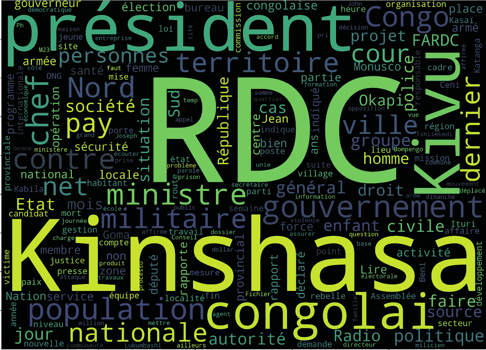

# 新闻数据的自然语言处理分析——以 Okapi 电台为例

> 原文：<https://blog.devgenius.io/nlp-analysis-on-news-dataset-case-of-radio-okapi-1a8e5b22080b?source=collection_archive---------2----------------------->

*图 Okapi 电台最常用的词*

在本文中，我们将继续我们在上一篇文章中开始的讨论， [**有什么新闻？—从 Okapi**](https://levelup.gitconnected.com/whats-on-the-news-732a275e3a3e?source=your_stories_page-------------------------------------) 电台收集和分析出版物。在那里，我们从通过网络抓取来获取我们的数据集，到查看每月出版物、它们的类别和长度等见解。我们的前提是，每日新闻只能让我们对当下的故事有这么多的了解，我们可以通过分析一段时间内分享的所有新闻，对新闻媒体分享的更大叙事有更广泛的理解。在这篇文章中，我们将把我们的分析集中在试图回答这个问题“在新闻的传递中是否表达了情感，如果有，它是积极的还是消极的？”试着了解对教育和体育等话题的正面或负面情绪的主要趋势，然后试着将它们与更广泛的叙述联系起来。

对于情感分析，我们将使用专为情感分析而优化的 BERT 模型和称为 VADER 的词典方法。我们将讨论这两种方法的见解，并对它们的结果进行比较分析。

# **使用 BERT 模型进行情感分析**

[BERT](https://arxiv.org/abs/1810.04805) (语言的双向转换器)是一个预训练的通用深度学习模型，可以针对特定任务的 NLP 使用进行微调，如情感分析、实体识别、问题回答和其他一些应用(预训练的 BERT 包含一些语言知识，在微调过程中会保留和传递这些知识)。伯特模型是建立在[变压器架构](https://neptune.ai/blog/bert-and-the-transformer-architecture)上的，除了不像其他变压器，它只有编码器部分，不需要解码器。现在，与人不同的是，编码器不会连续阅读文本。相反，它一次读取整个单词序列。这使得模型能够将单词置于上下文中，即基于周围的单词来解析单词。伯特拥有的另一个变压器属性是“注意力”。注意单词周围的单词。该模型能够识别单词的意思如何从一个句子转移到另一个句子。从这篇[文章](https://link.medium.com/6bremFwb5tb)中，你可以探究几种不同的伯特注意力模式。然而，值得注意的是，并不是所有的注意模式都有利于伯特中的某些任务训练；模型修剪是一种处理这种特殊限制的技术[Kovaleva 等人，2021]。

虽然基于 BERT，但我们正在使用的发表在 John Snow Labs 的 spark-NLP 上的[情感分析分类器](https://nlp.johnsnowlabs.com/2021/09/08/classifierdl_bert_sentiment_fr.html)模型是使用 Twitter 数据集训练的，该数据集的情感标签是从 AWS understand API 获得的。这意味着，正如训练准确性受训练数据集质量的限制一样，在这里，它受 AWS Comprehend 的预测标签的限制。

## **我们用例的 BERT 限制:**

从高层次来看，推特平均不到 200 个字符。这就限制了一条推文只能提及一个主题。用于训练我们使用的模型的 tweet 数据集的长度约为 157 个字符。这意味着，对于我们的用例，积极或消极情绪所指的目标主题可能是一个主题，而对于我们要分析的文章，平均长度为 1600 个字符，大约是 10 倍长，尽管内容可能是报道一个关键事件/新闻，但如果独立进行，我们可能会有多个主题和潜在的不同情绪。在 BERT 模型的情况下，对于最好的情况，我们假设文章中的主题对整个文档的分类有更大的影响。

另一个限制在于预测标签。使用的 BERT 模型没有“中性”标签。有可能，一些文章没有表达作者的倾向，应该被归类为中性的。

## **培训性质**

“重新思考新闻中的情感分析:从理论到实践再到实践”这篇论文探讨了新闻文章的情感分析任务的范围问题，因为它与情感分析模型通常用于训练的训练数据集(电影或产品评论，推文)有一些关键差异[Balahur 和 Steinberger，n.d.]。一些关键挑战包括:

*   与新闻写作相比，评论的撰写相当开放，作者小心翼翼地在文章中注入他们的主观性(他们的观点经常以相当微妙的方式表达，例如省略一些没有上下文就无法被人类察觉的事实，更不用说机器了)。
*   鉴于区分新闻中表达的两极分化的新闻和两极分化的情绪的细线，注释训练数据的过程通常是有缺陷的。
*   紧接着上述观点，有可能注释事实——然而，他们持有情绪的能力是值得怀疑的。我们的模型无法验证某件事是事实还是前沿观点。自闭症患者自残的可能性是非自闭症患者的三倍，只是秋天的一片落叶。

这些限制提出了一些问题，如“我们如何定义好消息或坏消息，这与对目标表达的好情绪或坏情绪有所不同吗？”，“我们如何在不需要世界知识的情况下分析表达的观点？”。

这两个主要的限制，以及潜在的许多其他限制，可以通过记住这些问题来训练模型(微调模型)来解决。

## **关键见解**

综上所述，我们发现 **66%** 的文章被归类为正面， **34%** 被归类为负面(图 2)。

图 2 —用[花饰制作。工作室](https://flourish.studio/)

图 3—使用[花饰创建。工作室](https://flourish.studio/)

霍加皮电台的文章被分为 37 类，包括教育、体育、安全等。相比之下，其他文章被简单地归纳为一个称为新闻的类别，并且未进行分类，如图 2 所示。回想起来，文章不能归类为新闻类或未归类类。文章的主题可以分为政治、环境、体育等多个类别。在我们的案例中，霍加皮电台将他们 47%的文章归类为简单新闻或未归类。对这些文章进行适当分类的尝试将需要使用具有更明确类别的文章数据集来训练分类器。因此，我们可以对每个类别所传达的情感有一个更准确的印象。

让我们看看面积图中的峰值。

在上面的峰值，我们有工作搜索类别，这个类别中 95%的文章倾向于正面。实际上，这听起来很准确，因为列出工作机会时用词的选择。紧随乔布斯之后的是文化类文章，90%的文章表达了积极的情绪。我们对每个类别做了进一步的分析，以寻找这些年来所表达的情感的任何模式。下图是 2010-2022 年的求职情况。

图 4——创建时带有[花饰。工作室](https://flourish.studio/)

正如我们所料，招聘信息一直是积极的。

在低端，我们有教育。在这一类别中，我们的负面文章比正面文章多:55%比 45%，使其成为拥有最多*负面*内容的类别。让我们放大教育，看看这些年的趋势。教育类文章一直都是负面的吗？

图 5——用[创造的繁荣。工作室](https://flourish.studio/)

看起来最积极的教育文章是在 2012 年，60%对 40%的两极分化，在 2010 年差不多是同样的百分比。在 2014 年和 2016 年，文章大多是负面的，70%对 30%，这是一个相当大的差距。2011 年，没有发表任何教育文章，在其余几年里，所表达的观点似乎保持了平衡。

如果我们遵循 BERT 模型，Okapi 广播电台在所有类别中都持续发布更多积极的文章，但教育除外，这是指大量未分类的文章。

图 6-用[创建的花枝招展。工作室](https://flourish.studio/)

## **使用 VADER 词典进行情感分析**

基于词典的方法是不需要任何训练数据的情感分析。它包括从文本中出现的单词、短语或整个文档的语义方向计算观点。在这种方法中，单词所表达的情感是根据单词的极性来推断的——单词级分析。该方法利用基于词典的方法，其中使用词典词典来找出正面意见词和负面意见词。我们使用 VADER(用于情感推理的效价感知词典)情感分析来计算输入文章的情感得分。 [VADER](https://github.com/cjhutto/vaderSentiment) 结合了一个将词汇特征映射到情绪强度的字典——情绪得分和极性(积极/消极)。该模型的评分范围从[-4]非常负面到[4]非常正面。我们使用词典文档中推荐的标准化阈值来对句子进行分类。正面情绪复合得分为> = 0.05，负面情绪复合得分为< = -0.05，中性情绪复合得分为> -0.05 至< 0.05 的复合得分。

## **VADER 词典在我们用例中的局限性。**

*   **情感强度词典**

根据所传达的上下文，单词具有不同的强度级别。它不同于人们对文本中表达的情感感到赞同或不赞同。该词典为单词提供了一套规范的情感评级。

*   **上下文感知**

与 BERT 模型不同，该模型受益于来自其训练的语言知识，并且可以根据上下文给予单词不同的重要性级别，词典方法仅依赖于所使用的每个单词的平均情感。为了提高情感分析性能，需要更深入地理解词汇属性，例如词类，以获得更多的上下文意识。

## **来自我们的词典方法的见解。**

图 7 —用[花形创建。工作室](https://flourish.studio/)

查看上面的面积图(图 7)，我们可以看到大约 50%的文章是积极的情绪，随着时间的推移变化很小，标准偏差为 5 篇文章。正面情绪峰值之间的差距很大，在一个极端月份中，最高峰值达到 78%，最低峰值达到约 20%。

另一方面，负面情绪的文章平均约为 47%，有 5 篇文章略有变化。在高峰时期，负面情绪文章达到了发表文章总数的 80%。而且，在低峰值(高积极情绪峰值)中，发表的消极情绪文章可能低至总发表文章的 18%。

累积起来，我们发现 50%的文章被归类为正面，47%被归类为负面，3%被归类为中性。

让我们看看下面图 8 中数据集情感分析的分类。

图 8——用[花形创建。工作室](https://flourish.studio/)

图 9——用[创造的繁荣。工作室](https://flourish.studio/)

看一下峰值(图 9)，求职类别下的大多数出版物主要是正面的，占该类别发表的文章总数的 96%。文化和选举分别以 81%和 80%紧随工作类别。在较低的峰值部分，司法和安全类别记录了具有负面情绪的已发表文章的最高百分比，分别为 28%和 27%。这可能表明，由于安全和司法系统崩溃，刚果人面临安全问题。

让我们深入挖掘这些确凿的证据；安全和司法类别(分别见图 10 和图 11)。

图 10——用[创造的繁荣。工作室](https://flourish.studio/)

从上面图 10 的高端概览来看，2016 年至 2018 年发表的正面新闻文章较少，2017 年最低。这预示着这段时间内可能发生的无数事情，例如，这可能是一个激烈的政治季节或冲突。因此，这可能是一个有趣的话题，以探索和理解在这一时期发生的事件，促成了低积极的安全新闻。如下图 11 所示，每月进一步细分这一类别，可以看出高度安全挑战的级别极低。

图 11 —创建时带有[花饰。工作室](https://flourish.studio/)

2016 年 3 月，只有 9%的正面新闻文章发表。当我们看下面图 12 中的司法部门时，正面新闻文章的发表从未超过 43%。

图 12——使用[花饰创建。工作室](https://flourish.studio/)

2014 年(如图 12 所示)，没有发表司法新闻文章。2015 年发表的负面正义文章比例最高，高达 75%。让我们来看看这个类别每月发表的文章。

图 13 —使用[花饰创建。工作室](https://flourish.studio/)

图 13 中的月度分析揭示了司法类新闻文章发表的不一致性和缺陷。或者，大多数司法文章可以被归类到新闻类或未归类。这意味着两件事，要么是新闻媒体有偏见，要么是司法部内部的障碍限制了这一类别的新闻文章的数量。

# **Lexicon vs BERT**

我们已经分析了这两种方法的结果，现在我们需要比较和对比，也许可以决定采用哪一种模型。

*   使用 BERT，66%的文章被标记为积极的，而在 Lexicon 中只有 56%。
*   正如我们之前强调的，在 BERT 中，教育的负面多于正面。然而，有了 Lexicon，这一推论被大大推翻，68%的教育文章被归入正面。
*   使用 Lexicon 时，在多个班级中，负面情绪似乎盖过了正面情绪，这与 BERT 结果截然不同，如下所示:

*   然而，这两个模型似乎在体育项目上意见一致，只是他们的百分比略有不同。

现在，当你对同一个问题得到如此不同的结果时，你会想权衡哪个回答者更好。为此，我们决定抽取 80 篇文章，自己进行注释，然后将我们的注释与 BERT 和 Lexicon 的注释进行比较。你会问，我们是如何得到这个非常小的样本的，几乎不到整个数据集的 10%？我们首先从我们的数据集中抽取了 4000 篇文章的随机样本，这相当于我们数据的 5%。从这些文章中，我们获得了 BERT 和 Vader 不同意的文章子集——1500 篇文章(因为我们试图比较这两个模型，所以我们使用了这两个模型不同的文章)。其中，我们审查了 80 个，约占 1500 个的 5.3%。理想情况下，我们应该至少使用 10%，但是考虑到本文的时间和目的——对作者来说是一个学习和探索的机会:)，这就够了。

当我们承担起阅读和标记文章的任务时，我们发现自己经常与对方的情感洞察力相抗衡。我们纠结于，这是积极的情绪还是简单的好消息？这是一种消极的情绪还是有任何情绪表达？这种情绪是针对谁或什么的，如果有的话？最终，我们确定了一个处理文章的结构，大大减少了我们的分歧点:我们同意先确定文章的主题，然后评估作者对它的看法。有了这个，我们对我们在样本文章上所做的注释就有信心了。我们队里有一个刚果人，这也提高了我们的准确性。

我们将 80 篇文章的评论与伯特和 VADER 的结果进行了对比。50%的情感标签与伯特模型相符，只有 34.6%与 VADER 一致。剩下的 15.4%两者都不同意。我们推断伯特对我们的文章做了更好的情感分析。

对这一主题进行更深入的研究，解决上面指出的一些限制，可以更准确地描述这个故事。现在，可以肯定地说，我们对奥卡皮电台作者关于刚果民主共和国重大事件状态的观点有了相当的认知。根据这些信息，我们可以推断出刚果民主共和国的主要问题是什么？

**作者:** [艾曼纽](https://www.linkedin.com/in/emmanuel-murairi/)，[艾曼纽](https://www.linkedin.com/in/emmanuel-okorwoit-183b9219b/)，[马塔尔](https://www.linkedin.com/in/marthar-nderitu-5a702b215/)

感谢您阅读我们的作品！欢迎给我们留下一些评论。我们是来自毛里求斯 GDSC 非洲领导学院的团队写作；你可以从我们的 Linkedin 页面[和我们的作者在 medium 上的账户来关注我们的旅程。](https://www.linkedin.com/company/google-developer-student-club-african-leadership-college/?viewAsMember=true)

**资源**

Beri，A. (2020)。*使用 VADER 的情感分析——走向数据科学*。【在线】中等。可从以下网址获得:[https://towards data science . com/感伤分析使用维达 a 3415 fef 7664](https://towardsdatascience.com/sentimental-analysis-using-vader-a3415fef7664)【2022 年 10 月 22 日获取】

卡尔德龙出版社(2017 年)。 *VADER 情绪分析讲解—皮奥·卡尔德龙—中*。【在线】中等。可在:[https://medium . com/@ piocarderon/Vader-情操-分析-解释-f1c4f 9101 CD 9](https://medium.com/@piocalderon/vader-sentiment-analysis-explained-f1c4f9101cd9)【2022 年 10 月 22 日访问】

巴拉胡和斯坦伯格。重新思考新闻中的情感分析:从理论到实践。【在线】可在:[https://people . cs . Pitt . edu/~ huynv/research/aspect-sensation/re thinking % 20 opinion % 20 mining % 20 in % 20 news % 20 from % 20 theory % 20 to % 20 practice % 20 and % 20 back . pdf](https://people.cs.pitt.edu/~huynv/research/aspect-sentiment/Rethinking%20Opinion%20Mining%20in%20News%20from%20Theory%20to%20Practice%20and%20Back.pdf)【2022 年 11 月 7 日访问】。

塞缪尔斯和麦格尼卡尔。*新闻舆情分析*。[在线]可在:[https://arxiv.org/pdf/2007.02238.pdf](https://arxiv.org/pdf/2007.02238.pdf)[2022 年 10 月 22 日访问]

scholar.google.com。(未注明)。*伯特终结者:扰乱变形金刚的异常维度*。【在线】可在:[https://scholar.google.com/citations?view_op=view_citation&HL = en&user = x1vrdlsaaaj&citation _ for _ view = x1vrdlsaaaj:kNdYIx-mwk oc](https://scholar.google.com/citations?view_op=view_citation&hl=en&user=X1vRDLsAAAAJ&citation_for_view=X1vRDLsAAAAJ:kNdYIx-mwKoC)【2022 年 11 月 7 日访问】。