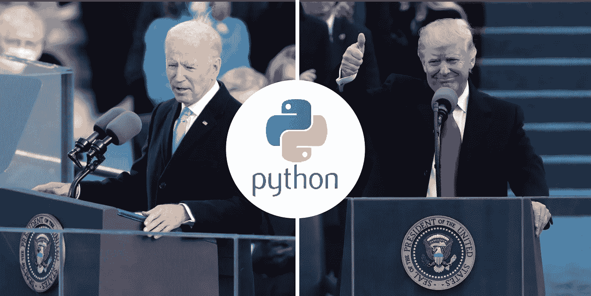
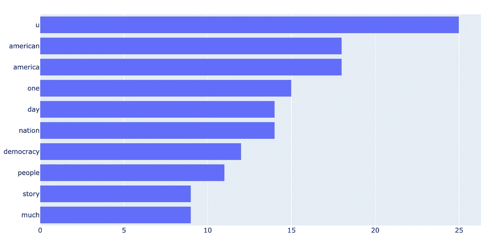
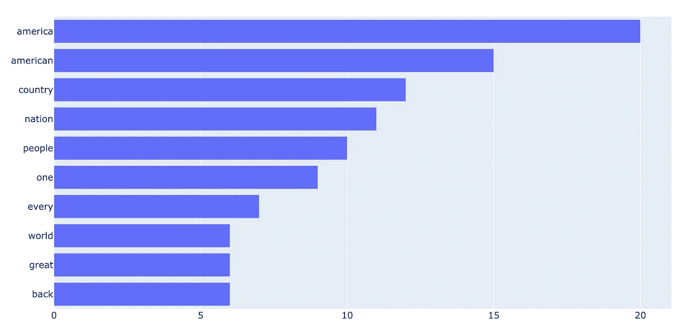
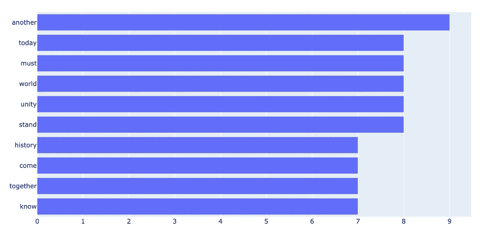
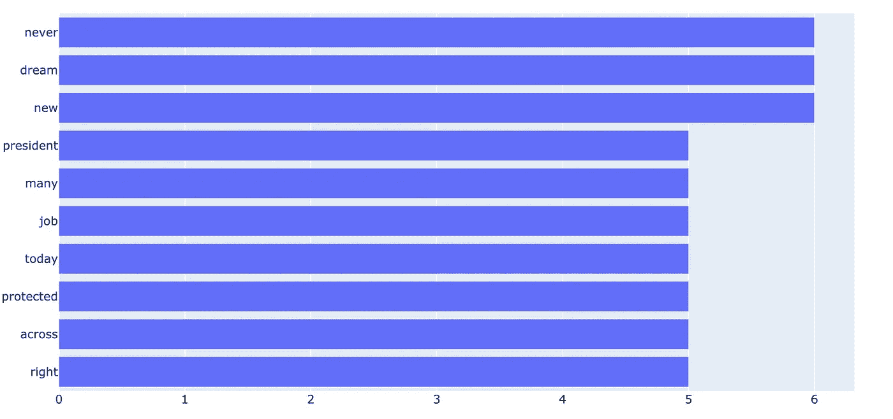
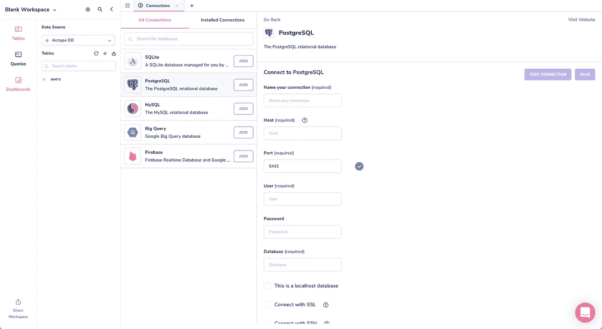

# 用 Python 学习 NLP:拜登与特朗普就职演说中的前 20 个词

> 原文：<https://blog.devgenius.io/nlp-with-python-biden-vs-trump-inauguration-speech-top-20-words-3394d2a8b37?source=collection_archive---------4----------------------->



Python 能团结民族吗？

昨天，我们目睹了我国第 45 次成功的总统交接。

这标志着一场竞争激烈的选举的结束，在这场选举中，我们的国家有时感到比以往任何时候都更加分裂。

但是，当我今天和父母坐在客厅里，观看拜登的就职演说时，我感到充满希望。

> *“有时候你需要帮助。有时候我们会被召唤伸出援手。这是必须的，这是我们为彼此所做的。如果我们这样做，我们的国家将会更强大，更繁荣，为未来做好更充分的准备。我们仍然可以不同意。”—* [*乔·拜登 2021 年就职演说*](https://www.yahoo.com/now/full-transcript-joe-bidens-inauguration-175723360.html)

作为一个公民，乔对一个团结的国家的承诺激励着我。

但是作为一名开发人员，我开始思考——我能量化这种希望吗？

就职演说是总统第一次向全国发表讲话。这篇演讲是由一个作家团队精心撰写的，旨在捕捉国民的情绪和我们面临的最紧迫的问题。

这篇演讲中使用的具体词汇能让我们洞察未来的道路吗？

我将拜登演讲中最常见的 20 个词与特朗普 2017 年就职演说中最常见的 20 个词进行了比较，以比较我们国家现在与四年前的状况，以及未来四年的预期。

# 使用 Python 找到最常见的 20 个单词

下一节是 Python 分析的教程。如果自然语言处理没有让你兴奋，那么你可能想跳到结尾(但是它也只有 20 行代码，所以学习起来可能很有趣！)

这种分析的目的是获取每一篇就职演说并找出最常见的词。分析由两部分组成:

1.  用美汤从网上刮下演讲稿
2.  使用 NLKT 处理单词

如果您想在家里运行代码，您需要完成以下设置:

1.  [安装 python 3](https://www.python.org/downloads/)
2.  用`pip3 install`安装`requests`、`BeautifulSoup`和`nltk`
3.  `brew install jupyter`然后运行`jupyter notebook`打开一个 [jupyter 笔记本](https://jupyter.org/)。现在，您可以在 jupyter 笔记本中运行下面的所有命令了！

如果您想跳过清理和清理，请[下载 Arctype](https://arctype.com?utm_campaign=speech-analysis&utm_medium=blog&utm_source=medium) 并使用最后的数据库凭证来访问数据。

## 1.美汤刮网

[网络搜集](https://realpython.com/beautiful-soup-web-scraper-python/)是从网络上收集信息的过程。在这个场景中，我们将搜集每位总统就职演说的文字记录。

您可以在以下网站找到每位总统的演讲:

我们首先使用`requests`包从每个网站抓取完整的 HTML 代码。

```
import requestsURL = 'https://www.yahoo.com/now/full-transcript-joe-bidens-inauguration-175723360.html'page = requests.get(URL)
```

恭喜你已经建立了你的第一个网页抓取工具！

这段代码发出一个 HTTP 请求，从存储演讲的服务器上检索 HTML 代码。

现在，我们必须从这些乱七八糟的 HTML 中找出每位总统演讲的文本。我们可以用 Python 漂亮的汤包轻松做到这一点。

```
from bs4 import BeautifulSoupbiden_speech = BeautifulSoup(page.content, 'html.parser')
```

在上面的代码中，我们将之前的 HTML 转换成了一个漂亮的、易于解析的 soup 对象。

现在我们必须找到包含我们正在寻找的文本的特定 HTML 块。我们可以使用浏览器的 DevTools 控制台来做到这一点。

在浏览器的新标签页中打开演讲，然后按`cmd+option+I`打开 DevTools 控制台。突出显示您正在查找的文本，您将能够在右侧的控制台中看到包含该文本的 HTML 标记。

对于拜登的演讲，我们可以看到它包含在一个带有`caas-body`类名的`<div>`标签中。切换回 Python，我们可以使用前面漂亮的 soup 对象的`find_all`方法找到那个标签。

```
biden_speech_content = biden_speech.find_all('div', class_='caas-body')
```

当我们查看`biden_speech_content`对象时，我们仍然会发现其他与演讲无关的 html 标签，例如:

```
<div class="caas-readmore caas-readmore-collapse">
   <button aria-label="" class="link rapid-noclick-resp caas-button collapse-button" data-ylk="elm:readmore;slk:Story continues" title="">
    Story continues
   </button>
</div>
```

为了只找到拜登演讲的文本，我们可以过滤掉没有分类的`<p>`标签:

```
biden_speech_content_v2 = biden_speech_content[0].find_all('p', attrs={'class': None})
```

现在我们有了所有的文本，但是字符串`<p>`被附加到每个句子的开头。我们可以用美汤`get_text`方法去掉这些 HTML 标签:

```
biden_speech_str = ""for sentence in biden_speech_content_v2:
   text = sentence.get_text() biden_speech_str = biden_speech_str + " " + text
```

最后，我们应该留下一个干净的讲话，我们可以用`nlkt`包进行分析。

## 2.用 NLKT 寻找词频

我们马上就要结束了！最后的步骤是使用 Python NLP 包进行一些基本的自然语言处理(NLP)技术。

我们现在可以对语音进行频率分析，但这将显示像“我”、“我们”和“the”这样的词作为最常见的词。在自然语言处理中，这些被称为*停用词。*

我们可以使用 NLKT 的[英语停用词列表](https://gist.github.com/sebleier/554280)来找到我们感兴趣的词。

```
from nltk.tokenize import word_tokenize
from nltk.corpus import stopwords
from nltk import FreqDistbiden_words = word_tokenize(biden_speech_str.lower())filtered_biden_speech = [w for w in biden_words if not w in stop_words and w.isalpha()]
```

让我们来分解一下代码在做什么:

1.  使用`.lower()`将整个语音转换为小写，这样就可以与停用词进行比较
2.  用`word_tokenize`将字符串分成单个单词
3.  删除停用词:`if not w in stop_words`
4.  删除句点和逗号等标点:`w.isalpha()`

现在我们有了一个可以统计的单词列表！

```
freq = FreqDist(filtered_biden_speech)print (freq.most_common(20))
```

但是当你浏览这个列表时，你可能会发现类似的单词，如“country”和“countries ”,有不同的计数。为了把这些算作一个单词，我们必须把每个单词转换成它的基本单词。

```
from nltk.stem import WordNetLemmatizerlemmatized_biden = [wordnet_lemmatizer.lemmatize(word) for word in filtered_biden_speech]freq_lemma = FreqDist(lemmatized_biden)
print (freq_lemma.most_common(20))
```

搞定了。在支持民主的同时，你已经成功地从网上搜集了数据并用 NLP 进行了分析。让我们来看看结果。

# 拜登与特朗普的就职演说:最常用词

```
k,v = zip(*freq_lemma.most_common(10))fig = px.bar(x=v,y=k, orientation='h') fig.update_layout(yaxis=dict(autorange="reversed"))
fig.show()
```



拜登就职演说中出现频率最高的 10 个词

最上面的词被 lemmatizer 扭曲了，但这个词是“我们”。

以下是特朗普 2017 年演讲中的前 10 个词:



特朗普 2017 年就职演说中出现频率最高的 10 个词

让我印象深刻的是，两位总统的前 10 个单词中有 50%是相同的:

我乐观的一面看着这些数据，看到了一个拥有共同价值观的国家。我们关心我们的国家，我们互相关心。

但与此同时，我们都面临着自己独特的问题。如果我们看下每位总统演讲中最常见的 10 个单词，我们会发现一些不同之处。

**拜登演讲:**



拜登最常用的 10-20 个词

**特朗普的演讲:**



特朗普最常用的 10-20 个词

不可否认，拜登的演讲是一个号召，要把我们的国家`together`带入`unity`。另一方面，我们可以看到特朗普对那些面临威胁、需要保护生计和家庭的美国人有吸引力。

数据显示两组人面临着各自的挑战，但我也看到了一个有着共同价值观的民族。

我们出发去看看能否量化“希望”。我相信我们找到了答案。

如果两个政治观点截然相反的总统能用 50%的相同词汇吸引他们的支持者，那么仍然有希望团结在我们的相似之处周围。

> *我们作为美国人喜欢的、定义我们为美国人的共同事物是什么？我想我们知道。机会、安全、自由、尊严、尊重、荣誉，是的，还有真相。—乔·拜登，2021 年就职演说*

# 与 Arctype 的完整语音比较

我分享了前 20 个词，但是拜登的就职演说中有 500 多个独特的词。如果你想看到更多的分析，我们已经将所有的语音数据上传到了 [Arctype](https://arctype.com?utm_campaign=speech-analysis&utm_medium=blog&utm_source=medium) 中，所以你可以跳过清理和清理。

数据集包括两个表:

*   **频率表**:两次演讲词频的完整列表
*   **句子表**:整理了两次演讲的句子，这样你就可以自己分析了

以下是连接数据的方法:



1.  下载免费的 [Arctype SQL 客户端](https://arctype.com?utm_campaign=speech-analysis&utm_medium=blog&utm_source=medium)
2.  在 Arctype 中输入以下凭据以连接到数据库
3.  运行查询！

**数据库凭证**:

*   主持人:`arctype-pg-demo.c4i5p0deezvq.us-west-2.rds.amazonaws.com`
*   端口:`5432`
*   用户:`root`
*   密码:`HC9x0OkI9vVO4wqprscg`
*   数据库:`inauguration_2021`

你看完数据后，在下面留下你自己带走的评论吧！

*原载于 2021 年 1 月 21 日*[*https://blog.arctype.com*](https://blog.arctype.com/python-analysis-inauguration-speech/)*。*