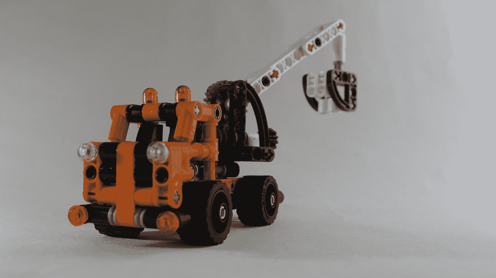

# “无代码”开发不会偷走你的工作

> 原文：<https://blog.devgenius.io/no-code-development-will-not-steal-your-job-5252c251c709?source=collection_archive---------26----------------------->

照片由 [Unsplash](https://unsplash.com?utm_source=medium&utm_medium=referral) 上的 [Adyant Pankaj](https://unsplash.com/@thelegolad?utm_source=medium&utm_medium=referral) 拍摄

不写代码怎么能构建软件？

这是大多数开发人员最近问自己的问题。“无代码”使用完全由算法和人工智能组装的软件，欺骗性地构建了一个没有开发人员的工作场所。不出所料，这与事实相去甚远。

术语“无代码”指的是使用现成的软件块来构建一个可工作的软件。本质上，它是用预先构建的代码块组装一个全功能的程序，每个代码块在整体中执行不同的功能。这些块可以使用 GUI 工具定制，也可以手动编辑。使用预先测试的代码块使最终的软件更有弹性，因为原始代码中的错误已经被识别和处理。

我们不能如实地说我们没有预料到。随着 Bootstrap、Vue 等开源框架，甚至 Python 等完整语言的兴起，现代开发人员已经很少从头开始编写，而是选择已经可用的庞大、防火的库。无代码只是这一趋势的下一次迭代，使得非开发人员也能按需构建高性能的软件。

但真正的问题是对于我们现有的开发人员，他们仍然手工编写代码——下一步是什么？

我很高兴地说，对于开发者来说，无代码是自开源以来最好的东西。现在，IDE 或无代码/低代码平台可以代替手动编辑大量代码。这必然会开辟新的就业空间，总需要一个有技术头脑的员工(就是你)。

而且，这对于大多数人来说应该是显而易见的。今天的无代码平台仍然是由*传统开发人员*编写的，用老式的方式编写代码。人类还远没有到软件开始写软件的地步，所以你的工作保障至少在未来十年是有保障的。

虽然由此带来的编写代码的便利性会吸引非开发人员去尝试，但最好是有人知道 GUI 下发生了什么，因为错误肯定会出现。

对于现代开发人员来说，无代码可以节省大量时间。现在，他们可以把更多的时间花在真正的工作上——规划系统架构。这将不可避免地带来更好的代码，以及为用户增加更多价值的更好的软件。

总之，开发者应该拥抱无代码运动。这不仅会使我们的工作更容易(唷！谢了。)但它将鼓励更好的系统设计，增加创造力和创新。最终，我们创造软件来帮助人们，而无代码正是这样做的。

感谢阅读。