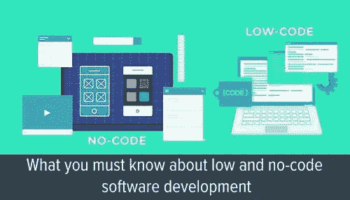

# 无代码还是低代码？

> 原文：<https://blog.devgenius.io/no-code-or-low-code-90c2f0d93596?source=collection_archive---------11----------------------->

我们真的想走这条路吗？

来自 https://new.qq.com/omn/20200709/20200709A0CMLY00.html[的](https://new.qq.com/omn/20200709/20200709A0CMLY00.html)

# 无代码与低代码

无代码和低代码频繁出现在数据科学和自动化领域，大多是倡导一些可视化编程工具，使用户能够通过拖放来进行数据分析、可视化和自动化，不需要以前的编程知识。

无代码和低代码的区别就像它们的名字所暗示的那样简单，你仍然需要在低代码环境中编写一些代码。例如，在无代码和低代码中，您都可以将一个循环元素拖动到画布中，然后拖动循环中的某个动作，以便多次执行该动作。只有在低级代码中，动作可能是一段代码，而不是一个精心准备的动作；或者，您可以在原始操作上添加一些代码，使其以不同的方式或更智能的方式执行。

无代码和低代码都是为了对传统的代码编程说“不”而发明的，在传统编程中，拖放是 Visual Basic 等编程语言中的一个古老思想。即使在 Visual Basic 中，拖放也只限于用户界面设计，只能带您到一个没有编码的可关闭窗口。

# 无码/低码真的是趋势吗？

我强烈怀疑。

有几个原因:

1.  所有无代码/低代码工具或平台都是用代码编写的，之所以这样称呼它们，只是因为有人为你做了繁重的工作。
2.  你越依赖这些工具，你对自己能力的控制就越少。
3.  无代码或低代码只能把你带到他们的设计者希望你去的地方。这意味着你也受限于他们的能力和意愿。
4.  工具的能力和智能越强，一旦出故障就越危险。如果你愿意，可以叫我人工智能阴谋种族主义者，但我绝对拒绝智能家居的想法，原因有二，一是为什么我希望窗帘自动打开和关闭，而我自己完全有能力做到这一点？第二个是别人远程控制我的窗帘怎么办？
5.  我个人已经走上了这条路，并在几个月后转向编码。正如我在[RPA](https://medium.com/p/the-deception-of-rpa-59926491e7d3)的欺骗中提到的，我加入 RPA 工作团队要感谢 UiPath，但是在一年徒劳的努力之后，从那以后我转向用 Python 编写每个 RPA 项目的代码。

当然，你可以争辩说，这些只是我个人的原因，普通大众仍然会接受一个无代码/低代码的世界，并把脏活留给极少数专业程序员。几年前我说比特币是一个庞氏骗局时，或者今天我仍在怀疑元宇宙时，我可能都错了。但是我站在我的立场上，即使别人都在拖拖拉拉，我也会坚持编码。

# Python 真的要死了吗？

作为一个非技术背景的人，我成为了一名业余程序员，一路上我经历了几种编程语言，包括 VBA、Java、JavaScript，直到我最终抛弃了其他一切，坚持使用 Python。我的论点是 Python 已经可以为我做任何事情，如果它不能，足够聪明的人会发明一个包来实现它。我的第二个论点是，生命太短暂，无法学习多种编程语言(或一般的语言，这就是为什么我现在对自己的双语能力感到满意，中文和英文，这可能涵盖了世界人口的 50%)。

我看到过关于 Python 如何垂死挣扎，或者说 Julia 如何在各方面都优于 Python 的文章，尤其是速度。当我使用 Python 的时候，第一个速度从来都不是问题，只要它能在短得多的时间内完成我的工作，并且有高得多的效率和效果，我就很满意。第二，我仍然相信 Julia 或另一种语言中任何特别好的东西要么会被 Python 采用，要么对我来说无关紧要。最后，只要 Python 一直出现在“*最流行的编程语言*”列表的顶端，我就是正确的。当 Python 不再流行的那一天到来时，那将是我不再需要编程并且可以安息的一天。

# 儿童编程训练观察

当我的孩子五岁的时候，我开始教他编程。现在他快 7 岁了，已经可以解决一些 12 年前的编程问题了。

当然，他不是用代码编程，他几乎不能在键盘上打出一个完整的句子。但他可以将代码块拖放到画布上，并解决一些相当困难的问题，例如使用嵌套循环以最少的步骤收集所有宝石。在我看来，这就是无代码真正有用的地方，教孩子们如何不用代码，通过编程解决问题。

我已经在我的 iPhone 和 iPad 上试用了许多儿童编程应用程序，其中大多数只是 Scratch 的不同版本，但它们能给孩子带来多少乐趣和成就，这是一个巨大的差异。一个成功的儿童编程应用应该具备以下品质:

1.  他们采用循序渐进的方法，从“向前移动一步”开始，到“跳跃”、“向左转”或“向右转”等。
2.  他们通过轻松实现 3 星或 5 星系统来提供胜利感。
3.  有一个故事情节是好的，比如拯救你的朋友或击败怪物，但太多的故事和视频和叙事真的没有必要。此外，6 岁以下的孩子往往害怕怪物。
4.  不要让它变得不必要的困难。在一些儿童编程应用程序中，有一些级别连我自己都觉得很难完全完成，例如，一系列活动在开始时不会显示重复的模式，但如果你故意做出不必要的移动或跳跃，你可以用少得多的步骤解决问题。请记住，我们不会像成年人一样在编程中使用这些技术，这只不过是在炫耀。
5.  不要试图在它们中加入太多的人工智能。我见过一些试图整合人脸识别、手势识别等功能的儿童编程应用。除了可能侵犯孩子的身份之外，它们很糟糕。
6.  最后，儿童编程不仅教孩子们如何编程，还教他们一些基本的生活中解决问题的技巧，比如把大问题分解成小问题。我的孩子甚至通过它学会了如何区分“左”和“右”。我仍然清楚地记得他是如何站起来移动自己的身体，然后才弄清楚他应该使用“左转”还是“右转”块。

所以我的结论是，让我们把无代码和低代码留给孩子们，让我们一起编码，让世界变得更美好。