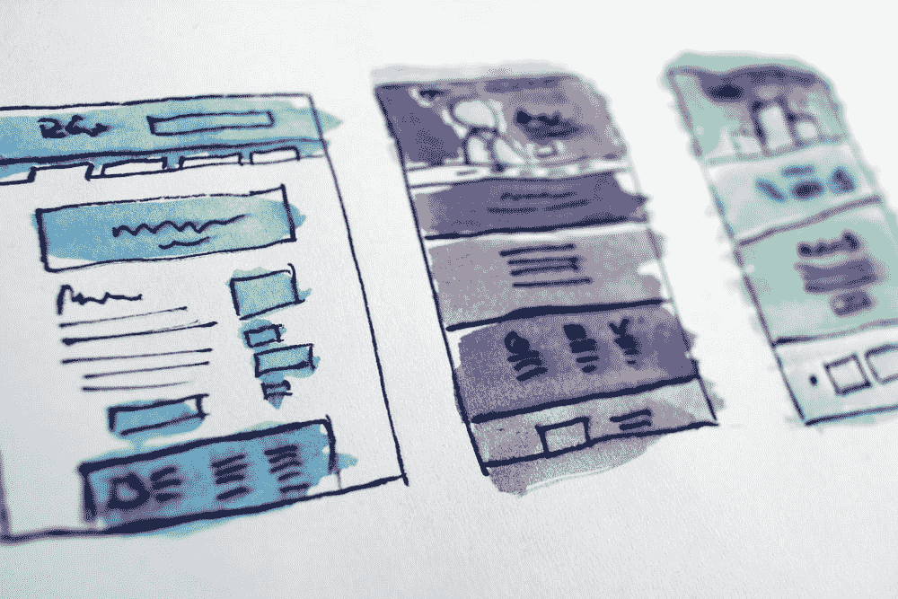

# 无代码工具将使每个人受益

> 原文：<https://blog.devgenius.io/no-code-will-give-the-power-to-ux-designers-501328557cbb?source=collection_archive---------9----------------------->

## 也不知道它是如何创造工具来保持和平的

在 [Unsplash](https://unsplash.com/s/photos/design?utm_source=unsplash&utm_medium=referral&utm_content=creditCopyText) 上由[halance](https://unsplash.com/@halacious?utm_source=unsplash&utm_medium=referral&utm_content=creditCopyText)拍摄的照片

牛津大学教授 Carl Benedikt Frey 和 Michael A. Osborn 进行的一项研究预测，至少有 702 种职业可能很快实现自动化。

数百万份工作处于危险之中，将由计算机来完成。

这不是什么新鲜事。每个人都听说过机器取代了制造商。

第一个代替人类工人工作的机械臂被命名为 Unimate。由乔治·德沃尔发明，60 年代初安装在新泽西尤因的通用汽车工厂。在通用电气公司是在 60 年代。尤尼马特比工厂里的任何人都更有效率，最终卖出了 8500 台。至少同样多的人失去了工作。

从那以后，很多活动，主要是重复和无聊的活动，都消失了。要么被机器人取代，要么被电脑取代。

在这种大换血的情况下，唯一不会拿自己的工作冒险的人是那些对组织有权力的人。任何组织都有三种权力:

*   第一种是决策权，由公司领导、首席执行官和股东拥有。他们决定什么应该做，什么不应该做，因此什么工作应该被计算机取代，当然，他们不会用机器取代自己。
*   第二种是权威力量。这取决于你作为专业人士的可信度。这就是为什么我们尊敬医生、顶级作家、成功的首席执行官，他们成功了，他们的观点很重要，他们是不可替代的。Telsa 今天不会解雇 Elon Musk，因为人们将他视为榜样，他的声明和项目决定了 Telsa 的价值。
*   第三种力量是知识。这才是每一个开发者真正的力量。对任何一个非技术人员来说，在 it 部门工作的人看起来就像是对矩阵说话的巫师。他们的知识似乎很难掌握，只有被选中的人才能理解。

但这种知识的阴暗面是，你成为了唯一一个人们认为只要和信息学挂钩就能做出简单东西的人。

> “你能帮我弄一下我的应用吗？”“我想我感染了病毒，你能帮我查一下吗？”
> “我的电脑慢……”
> “我打印不出这个视频，请帮帮我！”

在 [Unsplash](https://unsplash.com/s/photos/bored-computer?utm_source=unsplash&utm_medium=referral&utm_content=creditCopyText) 上 [engin akyurt](https://unsplash.com/@enginakyurt?utm_source=unsplash&utm_medium=referral&utm_content=creditCopyText) 拍摄的照片

这是一个巨大的领域，有数百种不同的工作和技能，但对大多数人来说，你只是“IT 人”。这可能是出于委托简单任务的需要，一个前所未有的案例出现了:它通过创建无代码工具，有意识地用计算机部分取代了自己。

## 什么是无代码？

帮助您设计网站或应用程序而无需编写任何代码的工具。

这并不新鲜，自 2014 年以来，谷歌通过仅使用 excel 管理数据的 appsheets 提供了这种可能性，像 WordPress 这样帮助你建立博客或简单网站的网站自 2003 年以来一直在运行。

照片由[爱丽丝·迪特里希](https://unsplash.com/@alicegrace?utm_source=unsplash&utm_medium=referral&utm_content=creditCopyText)在 [Unsplash](https://unsplash.com/s/photos/design?utm_source=unsplash&utm_medium=referral&utm_content=creditCopyText) 上拍摄

人们不再需要学习语言来创建网站或应用程序，这对于需要互联网可视性的人和不必一次又一次做同一种项目的开发人员来说都是很好的。

大多数时候，企业需要的网站或应用程序的类型是相同的:

*   小型企业的 vitrine。主要目的是解释公司是做什么的，怎么联系。
*   在线销售产品的市场
*   一种出于各种目的(如工作或约会)将人们联系起来的社交媒体。

帕特里克·托马索在 [Unsplash](https://unsplash.com/s/photos/website?utm_source=unsplash&utm_medium=referral&utm_content=creditCopyText) 上拍摄的照片

有了无代码工具，任何人都可以在几周内从头开始做这种简单的项目。

*   要制作一个 vitrine 网站，我建议你使用 Webflow，它非常容易学习，已经被设计师用来制作作品集
*   要做社交媒体 app，Bubble.is 很棒。它提供了很多功能，并由一个插件库完成，这将帮助你个性化你的网站。它主要用于制作网站，但你也可以将其改造成适合手机的。
*   如果你的目标主要是网上销售，Etsy 和亚马逊都是你的解决方案。

很多时候，一个商业项目的起点要求并不高。当然，如果你长大了，或者你的创业需要内部工具，最好有一个 it 部门。

这就是为什么即使用无代码工具放弃了一些知识力量，它也是安全的。一个大公司不能没有技术人员，但如果放在更大规模的问题上，技术人员会被更好地利用

[rupixen.com](https://unsplash.com/@rupixen?utm_source=unsplash&utm_medium=referral&utm_content=creditCopyText)在 [Unsplash](https://unsplash.com/s/photos/marketplace?utm_source=unsplash&utm_medium=referral&utm_content=creditCopyText) 上拍照

## 现在呢？

这种权力的重新分配将有利于两类专业人士。

*   第一个是企业家:
    过去，很多人受限于创办公司所需的技术背景，因为没钱雇人制作网站或应用程序而放弃创业。
    有了自己动手的可能性，这种人会推出他们想法的 MVP 版本，并在必须创建 IT 部门之前开始赚钱。
*   第二类是 Ux/Ui 设计师:
    拥有创造完美设计的技能是很好的，但是拥有发布这些设计的真实版本的能力更好。如果你是一名 Ux/Ui 设计师，你应该学会使用 Bubble.is 或 Webflow，这不仅是为了获得一项新的销售技能，也是因为它将帮助你理解数据在你的设计背后是如何工作的，即使它不像真正的编码那样困难，这将帮助你更好地理解开发人员的工作，最终简化你未来的合作！

查尔斯·德鲁维奥在 [Unsplash](https://unsplash.com/s/photos/ui?utm_source=unsplash&utm_medium=referral&utm_content=creditCopyText) 上拍摄的照片

> 通过为非技术人员创建无代码工具，它拒绝了工作中最无聊的部分:制作无聊的网站和应用程序。
> 
> 开发人员仍将学习制作工具的技巧，但是随着无代码工具的流行，他们将被雇佣来关注更多的技术问题，更令人兴奋的项目。
> 
> *随着区块链、深度学习、虚拟现实和增强现实的兴起，是时候把其中无聊的部分委托给别人了。*

照片由[戴恩·托普金](https://unsplash.com/@dtopkin1?utm_source=unsplash&utm_medium=referral&utm_content=creditCopyText)在 [Unsplash](https://unsplash.com/s/photos/electronic?utm_source=unsplash&utm_medium=referral&utm_content=creditCopyText) 上拍摄