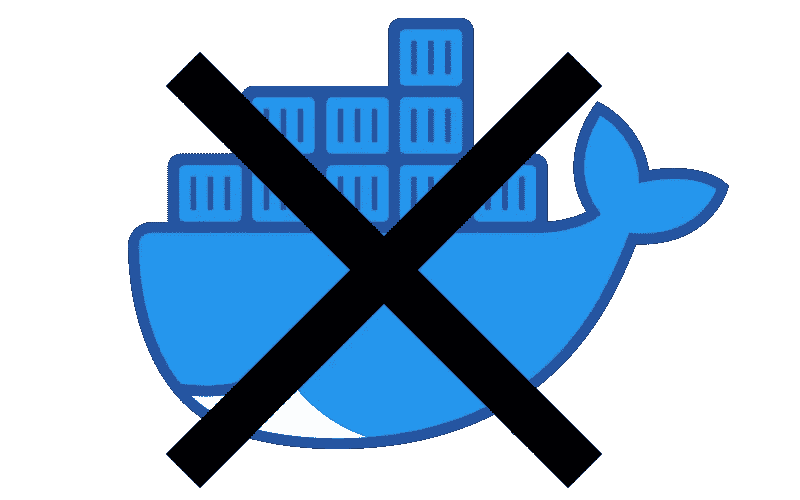
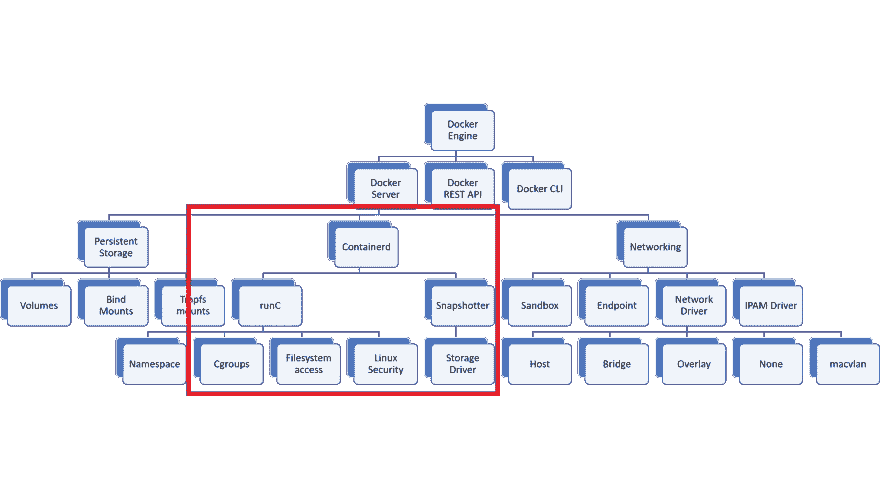

# 不，多克没有死

> 原文：<https://blog.devgenius.io/no-docker-isnt-dead-2b9ee45d5833?source=collection_archive---------1----------------------->

是的，Kubernetes 是在贬低 Docker 的支持，但它的影响可能没有听起来那么戏剧性。

有时候一条推文就足以让人关注。随着 Kubernetes v1.20 即将发布，Kubernetes SIG 安全联席主席[伊恩·科尔德沃特](https://twitter.com/IanColdwater)在 Twitter 上扔了一颗炸弹，让 Kubernetes 社区陷入混乱:

这条推文淹没了对 1.20 版本的其他报道，详细介绍了一些不错的改进，如[节点的优雅关闭](https://sysdig.com/blog/whats-new-kubernetes-1-20/)和[高效重启](https://sysdig.com/blog/whats-new-kubernetes-1-20/)。巨大的混乱随之而来，直到两个新的博客帖子出来澄清反对通知:

*   [别慌:Kubernetes 和 Docker](https://kubernetes.io/blog/2020/12/02/dont-panic-kubernetes-and-docker/)
*   [Dockershim 反对常见问题解答](https://kubernetes.io/blog/2020/12/02/dockershim-faq/)

简而言之，对 Docker API 和 Kubernetes 容器运行时接口(CRI)之间的桥梁 *dockershim 的支持正在被放弃，取而代之的是其他 CRI，如 [containerd](https://github.com/containerd/containerd/) 和 [CRI-O](https://github.com/cri-o/cri-o) 。这意味着通过`docker build`构建的现有 Docker 映像将继续工作(以及其他构建选项，如 [img](https://github.com/genuinetools/img) 、 [buildah](https://github.com/containers/buildah) 或 [kaniko](https://github.com/GoogleContainerTools/kaniko) )，但 Docker 运行时(提取和运行您的映像的组件)将在 2021 年末的 1.22 版本中删除。*

# 等等，什么？

如果您仍然感到困惑，这可能是因为随着时间的推移，Docker 已经成为容器的同义词，尽管它实际上是指整个技术栈。Docker 是在 Kubernetes 之前推出的，用来普及 Linux 容器模式。这意味着 Docker 最初设计时没有考虑到 Kubernetes，留下了一些不兼容的部分和一些多余的部分。

另一方面，Kubernetes 是一个容器编排器，旨在与 Docker 之外的更广泛的容器生态系统合作。在考察 Docker 架构时，Kubernetes 实际上只使用了 Docker 技术栈的一小部分:

图片来源:[太田康平](https://dev.to/inductor/wait-docker-is-deprecated-in-kubernetes-now-what-do-i-do-e4m)

这里最关键的是 containerd，Docker 用来拉取和运行图像的容器运行时元素。不幸的是，Docker 目前不支持 Kubernetes 的 CRI 标准，因此 Kubernetes 的维护人员编写了一个层来支持这一点(dockershim)。然而，dockershim 是一个临时解决方案，长期维护成为一个问题，因为它变得与新功能(如 cgroups v2、用户名称空间)不兼容。这就是为什么 Kubernetes 的维护者不支持 dockershim(因此也不支持 Docker ),而是鼓励迁移到符合 CRI 的运行时。

那么这对你意味着什么呢？

# 对于开发人员

好消息是，一切都不会改变。最有可能的是，你和 Docker 的互动是本地发展和建立 Docker 形象。Docker 构建的映像是开放容器倡议(OCI)兼容的映像，Kubernetes 支持的其他运行时知道如何获取和运行该映像。

如果您使用 Docker 插座(`/var/run/docker.sock`)，可能会出现边缘情况。Docker 中的 Docker 场景(可能是用 Gitlab 运行人员在一个开发集群上运行集成测试)。在这种情况下，寻找替代的容器解决方案，如 [img](https://github.com/genuinetools/img) 、 [buildah](https://github.com/containers/buildah) 或 [kaniko](https://github.com/GoogleContainerTools/kaniko) 。

# 对于 Kubernetes 管理员

如果您正在管理一个 Kubernetes 集群，您将需要在 2021 年末的 v1.22 版本之前用一个兼容 CRI 的运行时来替换 Docker，比如 containerd 或 CRI-O(或[其他 CNCF 替代品](https://landscape.cncf.io/category=container-runtime&format=card-mode&grouping=category))(v 1.20 将只显示一个警告)。好消息是，托管的 Kubernetes 提供商如 GKE 和 AKS 已经支持 containerd，EKS 很可能会跟进，因为 Fargate 已经支持 containerd。充分的测试是必要的，但是迁移到 containerd 应该相对容易，因为 Docker 也在底层使用 containerd。

# TL；速度三角形定位法(dead reckoning)

长话短说，没必要恐慌。Kubernetes 将继续使用您现有的 Docker 容器，Kubernetes 管理员还有几个月的时间来推出必要的更改。Dockershim 要走了，但是 Docker 没有死。