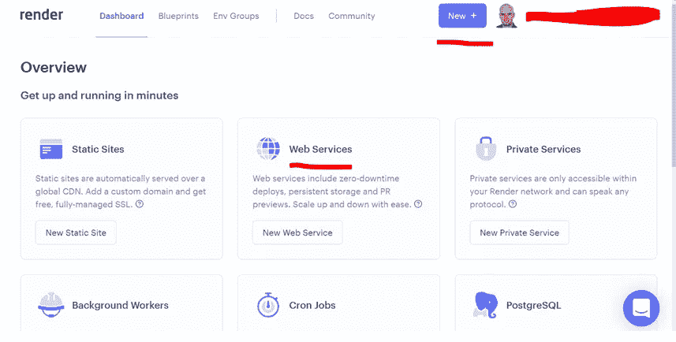

# 不再有自由的 Heroku？如何将你的节点后端迁移到 Render.com——弗兰·彼尔托

> 原文：<https://blog.devgenius.io/no-more-free-heroku-how-to-move-your-node-backend-to-render-com-fran-prieto-fdbac3b09177?source=collection_archive---------7----------------------->

最近我在审查我的 spotiapp 项目的代码，基于 Spotify API。它并没有完全 100%响应，但它是我感到更自豪的应用程序之一，当我第一次观看它的直播时，我感觉太棒了。当然可以更好，但正如我所说，我为此感到自豪。

我的后台托管在 [Heroku。](https://www.heroku.com/)我对 Heroku 为我提供的服务非常满意，但是当我想对后端代码做一些小的改动时，我发现了这条消息:

这意味着， **Heroku 自 2022 年 11 月 28 日**起不再提供免费计划。当然，我不能责怪他们:公司应该赚钱，所以我相信他们有充分的理由这么做。

但是我现在失业了。这个“spotiapp”只是出于教育目的制作的，是为了将它放入我的作品集，并向潜在的雇主或客户展示我能做些什么；所以正如你所猜测的，这不仅对一个免费计划来说足够了，而且我不能开始付费来托管我构建的每一个应用程序。

让我声明，这不是一个*“寻找一些免费的选项，然后你可以避免支付”*教程。我觉得好的服务一定是要付费的。我们是开发者，我们都喜欢被支付，不是吗？我自己支付托管，以包括我所有的项目和我的投资组合。它是一个可靠的提供商，提供出色的服务，我可以在那里托管我所有的应用程序；但不幸的是，我不能在那里构建基于节点的服务器。

将来，当我开发出可以帮助我赚钱的商业应用时，我当然会升级我的账户，但是现在，为了测试、小应用和学习，正如我所说的，我不能用我编写的基于节点的后端为每个应用付费。

老实说，我只有 Heroku 托管这个应用程序。我的大部分后端是用 PHP 完成的，所以没有问题，我的实际付费主机做这项工作；但我是一名前端 Angular 开发人员，为了成为一名更全栈的开发人员，我想开始构建更多的 node-express 后端。

## HEROKU DYNOS 模型

根据他们的模型(至少我是这么理解的)，你必须为每个“dyno”(你的应用程序使用的容器)付费。根据大小和需求，您的应用程序可能需要一个或多个 dynos。如果你不得不支付，例如每月 7 美元的爱好计划，你有 20 个应用程序在 heroku 上运行他们的后端，也许现在你可能根本负担不起，就像我的情况一样。

有关“dynos”的更多信息，请点击此处:

 [## 赫罗库·达诺斯

### 应用程序开发人员依靠软件抽象来简化开发和提高工作效率。说到跑步…

www.heroku.com](https://www.heroku.com/dynos) 

## 带[Render.com](https://render.com/)的免费选项

正如你所猜测的，有很多选择。我会向你推荐这篇优秀的文章，他们会比我解释得更好。我将重点教你如何将一个基本的后端从 heroku 迁移到 Render.com，我选择的提供商，它仍然允许一个免费的计划，非常容易使用，并且很好地用 GitHub 实现。

## Render.com 会收我钱吗？

我们可以看到免费计划是如何工作的:

https://render.com/docs/free#free-web-services

> **当您超过免费使用限额(即使用小时数和/或带宽)时，您帐户中的免费服务将自动暂停，并且不再提供流量服务，直到它们升级为付费计划或在日历月末重置免费使用，以先到者为准。**每月 1 日重置免费使用，所有因使用限制暂停的免费服务自动恢复。

所以我想我们是安全的。另外**注册**不需要信用卡或借记卡，就像你在这里看到的，所以它确实给了我一些宁静。

## 如何将我们的后端从 HEROKU 转移到 RENDER？计算机输出缩微胶片

所以，让我们继续吧。

在你什么都不做之前，当你在 Render.com 注册的时候，我推荐你 [**阅读 docs**](https://render.com/docs) ，因为它会对你帮助很大而且很快。

如果您想制作一个关于如何部署 node/express 后端的**小教程**，在**文档的快速入门部分**，我们将选择这个:

这将提示我们一个超级简单的教程，您可以在其中派生一个现有的 repo，以及部署所需的所有步骤:

这并不意味着您必须对所有项目使用完全相同的命令。例如，在我的后端，你可以看到我有 package.json 文件，这意味着我们的依赖项将通过 **npm install** 而不是 **yarn 安装。**两者都是不同的包管理器，你可以在这里了解更多。

 [## 纱线 vs NPM:综合比较(7 分比较)

### Yarn 和 NPM 是使用 Node.js 的 JavaScript 开发人员最流行的包管理器

phoenixnap.com](https://phoenixnap.com/kb/yarn-vs-npm) 

好吧，我假设你有一个 GitHub 或者 GitLab 的个人资料，并且你已经在 Render.com 注册了。

无论你是否制作教程，注册后的第一件事就是将你的 GitHub 账号和你的个人资料连接起来。在那里，您可以选择是访问您的所有回购协议，还是只访问选定的回购协议。

因此，我们进入设置并连接到 GitHub

一旦你连接上，它会问你的许可或你想让哪些回购访问。但是，您可以从自己的 GitHub 配置文件中控制它:

进入你的 GitHub 设置，点击集成/应用

在那里，您可以配置渲染应用程序:

此选项将允许我们授予一个或多个回购的权限。当然，在我们这样做之前，如果我们还没有后台代码，我们必须把它推到 GitHub。

这是我的 Heroku 后端。很简单:

*   答。js 文件，包含连接 spotify API 等所需的所有逻辑。
*   json 和 package-lock.json 文件，帮助您安装后端所需的依赖项。
*   [Procfile](https://devcenter.heroku.com/articles/procfile) 。这是一个 Heroku 专有文件，它在启动时执行应用程序的命令。当然，Render.com 不需要这样。

在我的例子中，我将删除 Procfile，因为正如我所说，它是一个 Heroku 文件，不再需要。

好了，让我们回去在 GitHub 中配置我们的渲染安装应用程序

现在你可以管理渲染对你的仓库的访问。在我的例子中，我只允许这个后端的回购和我之前做的教程的回购:

现在，我们保存，并返回渲染页面，到我们的仪表板。

我们可以选择“新建”，然后选择“网络服务”选项，或者直接点击“网络服务”。两者都会这么做。

现在它会要求你连接一个你之前在 GitHub 上授予权限的库。我们将选择我们的节点后端服务器进行渲染

现在它会要求我们提供一些数据

*   这个名字不一定要和你的 GitHub repo 的名字一样，我会简单地写“spotiapp-backend”
*   根目录将保持原样
*   环境将是节点

下一个选项:

让区域和分支保持原样。**现在重要的是构建命令。默认情况下通常显示为“纱线”。**但是，你记得我们有 package.json 吗？这意味着依赖项必须随“npm install”一起安装。

接下来的步骤也很重要。启动命令将与您在终端上运行应用程序时使用的命令相同。在我的例子中，主文件叫做“index2.js ”,为了运行这个节点服务器，我们将使用“node”命令。

还要检查自由计划类型。

正如他们提醒你的，**记住免费计划，就像在 Heroku 发生的一样，在一段时间不活动后关闭你的应用程序，当他们不得不重新激活时，需要比平时长一点的时间。**

现在点击页面底部的“创建 Web 服务”:

这将引导您进入另一个屏幕，在那里您的应用程序将被部署。应用程序的 URL 现在应该被复制到你的前端代码或者你之前指向 heroku 旧地址的任何地方。

等到它完成，记住，**一旦你在你的代码中需要的任何地方从你的旧的 web 服务器上修改了旧的 heroku 地址**，你现在就有一个免费的、工作的 Node/Express 后端可以使用了🙂

## 缺点

我仍然没有足够的测试，但我现在发现的唯一缺点是[如果你想使用 CRON JOBS，你必须付费。](https://render.com/docs/cronjobs)

*   [CRON JOBS](https://www.hivelocity.net/kb/what-is-cron-job/) 非常有用，如果你有一个用户可以发布或编辑数据的测试应用程序，并且你想安排这些数据每隔一定时间重置，这样你就可以确保只有你提供的测试/默认数据最终会被保留。这不包括在免费计划中，但正如我所说，公司是为了赚钱，所以如果我需要，我可能会为此付费。
*   此外，网络有时有点慢，并抛出一些错误，但现在没有什么重要的。

因此，我希望这篇文章能够帮助您在 Heroku 的免费替代品上轻松部署您的节点服务。然而，请记住，如果你开始用你的应用赚钱，请重视其他人的努力，升级你的计划。

节点图片由 [CopyrightFreePictures](https://pixabay.com/es/users/copyrightfreepictures-203/?utm_source=link-attribution&utm_medium=referral&utm_campaign=image&utm_content=736399) 在 [Pixabay](https://pixabay.com/es//?utm_source=link-attribution&utm_medium=referral&utm_campaign=image&utm_content=736399) 中找到

*原载于 2022 年 11 月 11 日 https://portfolio.avanzartewebs.com***。**