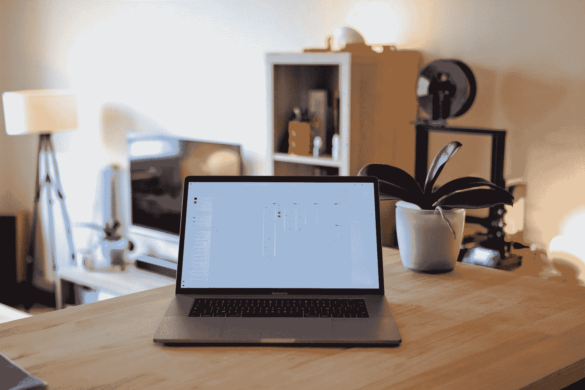
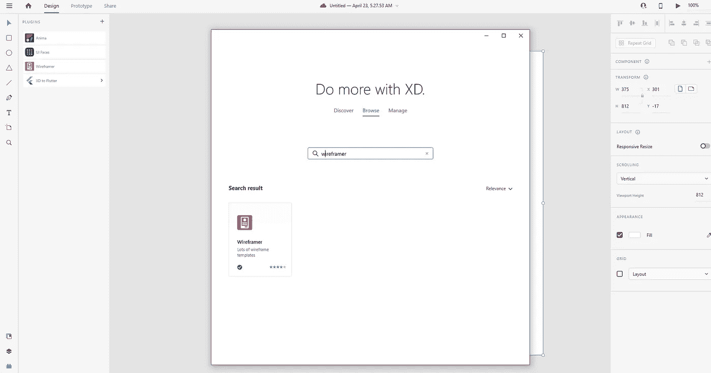
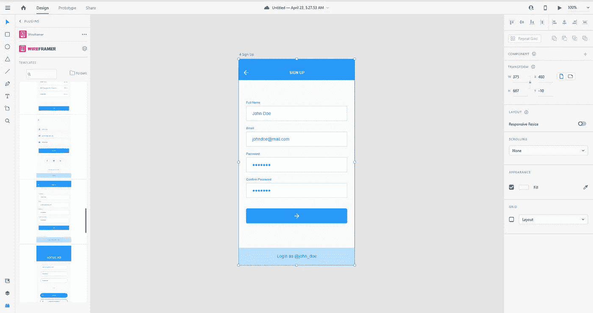
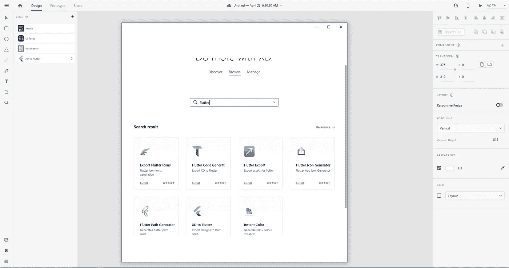
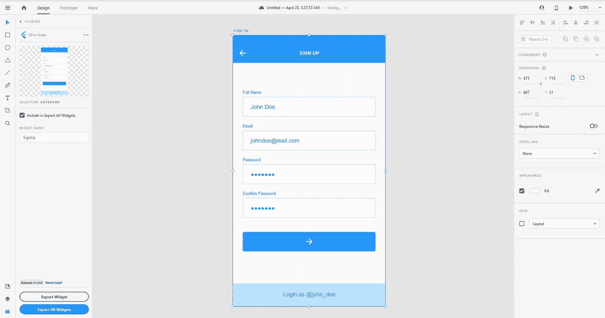
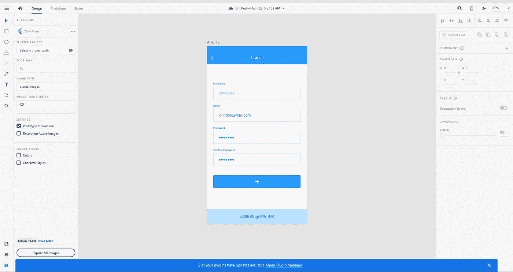
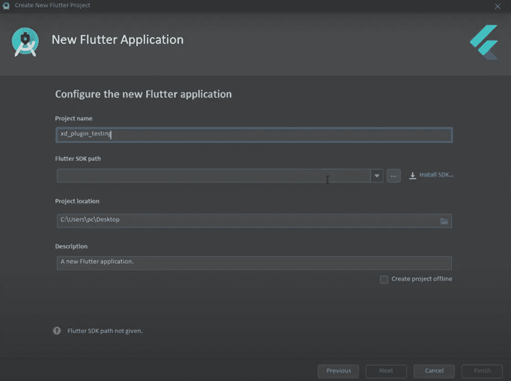
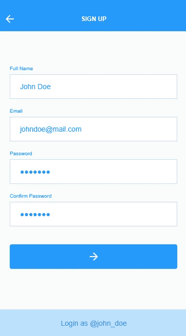

# 没时间犹豫了

> 原文：<https://blog.devgenius.io/no-time-for-flutter-developer-632b72ea58b8?source=collection_archive---------0----------------------->

## 将 Adobe-XD UI 转换为 Flutter 代码

阿尔瓦罗·雷耶斯在 [Unsplash](https://unsplash.com?utm_source=medium&utm_medium=referral) 上拍摄的照片

对于开发者来说，Flutter UI 设计是一项相当复杂的任务。如果这个复杂的任务一下子变得对每个人都很容易，会发生什么？

听说这项困难的任务可以轻而易举地完成，我自己也感到非常惊讶。在不知道任何进展的情况下。不懂开发技巧的 Flutter UI 设计有点像做梦。

但这是事实。Adobe Xd 设计工具让梦想成真。这个设计工具将设计转换成 flutter UI 设计。

你不需要知道任何关于颤振的发展。

## 您需要的工具

1.  Adobe-XD
2.  XD 到 Flutter 插件
3.  安卓工作室

## **什么是 Adobe-XD？**

我已经说过 adobe xd 是一个设计工具。它可以建造一个看起来真实的飞行器，一个设计可以非常有效地与另一个术语交流。这是世界上最好的协作工具，一旦你知道它是如何绘制草图的，它就变得非常简单。

照片由 [Elise Bouet](https://unsplash.com/@elisebouet?utm_source=medium&utm_medium=referral) 在 [Unsplash](https://unsplash.com?utm_source=medium&utm_medium=referral) 上拍摄

如果你不是技术人员，这没什么大不了的。一天或几分钟就能学会。要添加任何原型功能，您需要安装扩展，还需要订阅第三方服务。

然而，这个插件仍然不是它的第一个版本，但是他们现在称之为早期版本。

现在让我们来看看如何使用这个插件，一旦我们用它创建了一些东西，我们将做一些分析，我们将看到它是多么有效和高效。

## **什么是颤振？**

Flutter 是由 Google 创建的一个软件开发工具包，用于从单一代码库开发适用于 android、mac、windows、ios、Linux、google fuchsia 和 web 的应用程序。Flutter 是一个免费开源的 UI 框架。它被称为谷歌跨平台，这意味着一种编程语言和一个代码库来创建两个不同的应用程序。

## 让我们将 adobe-xd UI 转换为 flutter

**线框安装**

图片来源:作者

这是 Adobe Xd 的截图，我正在使用 Adobe Xd 的线框插件来制作应用程序设计。

首先，我们必须选择一个插件选项，你可以在屏幕截图左下方看到，如果你没有这个，你需要安装它。

对于安装，你必须点击加号按钮，这是所谓的添加按钮，然后点击浏览选项浏览和搜索线框已安装在我的电脑上。如果您还没有安装，您可以从这里安装。

**从线框中选择一个屏幕**

图片来源:作者

安装这个线框或插件后，点击这个选项，你可以看到许多屏幕模板，你可以选择其中任何一个转换成真正的应用程序。

因此，从这个线框，我必须点击一个屏幕注册，但你可以选择其中任何一个。我选择这个是因为有一个标题、文本、按钮和文本字段。

在这个设计部分之后，我们必须下载 Xd 到 flutter 插件。

**下载 Xd 到 flutter 插件**

图片来源:作者

为此，我们必须返回到添加按钮，需要浏览和搜索插件，只需编写 flutter 并安装 xd 到 flutter 插件。

**UI 面板**

图片来源:作者

安装后，我们必须点击这个插件，我们必须首先进入存在 xd 的 UI 面板，这里我们首先需要给出 flutter 项目路径。

这里，我们首先需要给出 flutter 项目的路径，但是我们现在没有。但是我们必须先做一个，它会给这个项目提供参考。

然后我们有了代码路径，但它实际上是项目中的目录，在那里我们有项目的所有文件。

所以通常我们在 lib 文件夹中有所有的 dart 文件，这就是为什么我们必须在这里给出 lib，然后我们有图像路径，所以如果我们有任何图像。

然后我们必须去目录。存储图像的地方，但在这些屏幕下面没有任何图像，所以我们可以就这样。

**我们来配置路径**

图片来源:作者

这是小部件名称的前缀，所以我们可以使用 XD_ 这是默认的前缀，最后在这个前缀下你可以看到三个方格。

一个是屏幕上的原型交互，我已经选择了，没有原型交互，所以我们可以不选中它。

下一个是分辨率图像。我们可以看到这些截图没有任何图像，所以我们也可以离开它。最后导出颜色资产，所以我们的项目是基于屏幕的，所以我们不需要这个。

**创建颤振项目**

图片来源:作者

现在来到 flutter 项目路径，打开你的 android 工作室，点击开始新的 flutter 项目。

创建一个新项目，选择一个 SDK 路径并成功创建您的项目，然后返回 adobe xd 并给出项目的路径。如果在 adobe_xd 的 pubspec.yaml 中显示任何依赖项的警告。

这意味着它说警告是在验证你的 flutter 项目在 pub spec 或 adobe xd 中找不到依赖项时产生的。

现在，我们必须搜索 google adobe_xd pub 并复制依赖项，然后返回到您的 flutter 项目 pubspec.yaml 并粘贴它，然后单击 packages get 这将安装软件包。

然后它会将设计转换成真正的颤振应用，而不会给出任何警告。然后，我们必须单击“export all widgets ”,返回到项目并运行该项目，您将看到与您在 adobe xd 上看到的相同的输出。

**最终输出**

图片来源:作者

这是我们的应用程序的最终界面的结果。

**结束语:**希望这篇帖子对你有所裨益。

谢谢你。