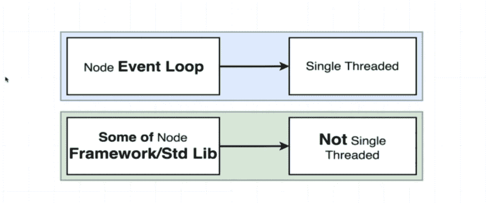
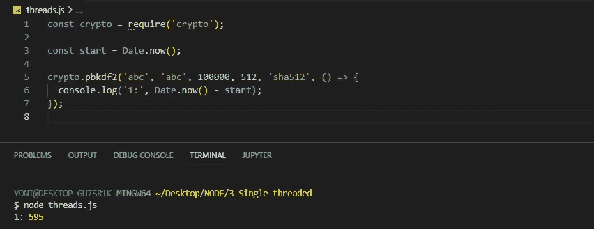
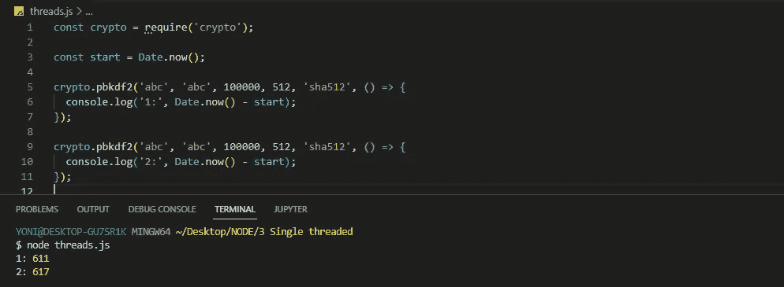
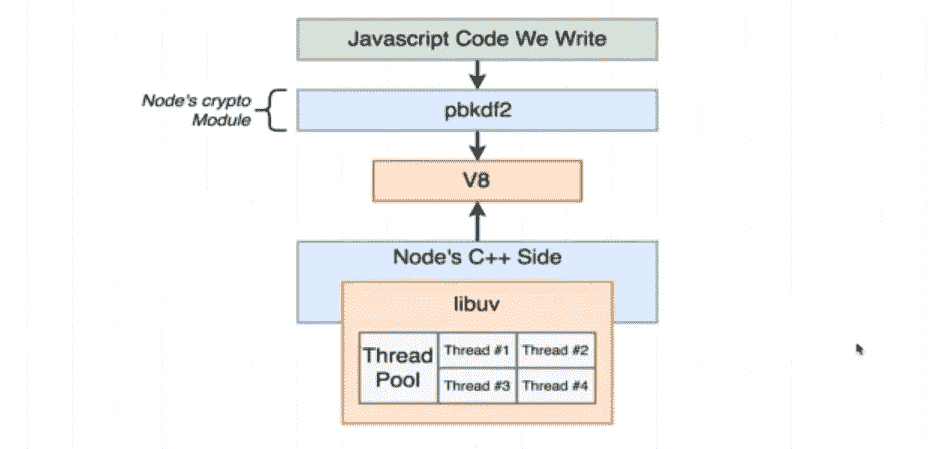

# 节点不是单线程的！

> 原文：<https://blog.devgenius.io/node-is-not-single-threaded-d73fa6a1450a?source=collection_archive---------6----------------------->

你可能经常在网上读到节点是单线程的。

人们说 node 是单线程的。然而，这并不是故事的全部。事实要复杂得多。因此，在这一节中，我们将开始研究 node 是否是真正的单线程。

当我们用 node 启动一个程序时，事件循环的单个实例被创建并放入一个线程中。

这通常被认为是一件坏事，因为这意味着我们的程序只能在 CPU 的一个内核上运行。因此，如果我们的计算机上有许多 CPU 内核，那么 node 不会自动利用这些内核。

换句话说，我们的程序可能无法尽可能快地运行，因为它被限制在一个单线程中。

然而，node 标准库中包含的一些函数实际上并不是单线程的。

换句话说，我们运行的节点中包含的一些函数，运行在事件循环和单个线程之外。

事件循环使用单个线程，但是您和我编写的许多代码实际上并不完全在那个线程中执行。

所以简单的宣称 node 是单线程并不是绝对正确的。

为了证明这一点，让我们看看下面这个简单的例子。

我们获取开始时间，我们调用函数，然后当回调被触发时，我们获取新的当前时间，我们减去旧的时间，我们应该得出计算这个哈希值用了多长时间(毫秒)。

您可以看到它花了大约 600 毫秒完成(结果可能因您的机器而异)。

现在，让我们再次复制并粘贴散列函数，并再次运行代码。

你将会看到两个与原始时间非常接近的时间。

首先，当我们运行这个文件时，两个函数将几乎同时被调用。

请记住，一个线程对我们的 CPU 来说代表一系列线性指令，所以 CPU 必须按照它们出现的顺序来执行它们。

我们知道，调用 PBKDF2 一次大约需要 0.6 秒。

如果这真的是一个单线程系统，我预计整个过程总共需要 1.2 秒，我们得到 0.6 秒用于完成第一个调用，然后在 0.6 秒后，我们应该看到第二个控制台日志出现。

然而，事实并非如此。

当我们运行我们的代码时，我们非常清楚地看到这两个日志基本上是在同一时间发生的，并且花费的时间与函数的最初运行时间差不多。

实际情况是，我们在零秒启动程序，然后这两个函数调用到回调只花了 0.6 秒。

很明显，这表明发生了一些事情，表明我们正在脱离 node 的单线程设置，因为如果我们只有一个单线程，我们会看到第一个函数调用完成，然后第二个函数启动。

我们将稍微扩展一下这个例子，并弄清楚为什么我们会看到这种行为。

首先，让我们来看一个图表，它显示了一个 **PBKDF2** 函数在幕后实际发生了什么。

如果你去 Github 上的节点**，你会发现一堆不同的文件和文件夹。但是有两个文件夹与我们现在正在尝试做的事情非常相关，分别是 **lib** 和 **src** 文件夹。**

****lib** 文件夹包含了你我在项目中需要的所有函数和模块的 JavaScript 定义。在 **src** 目录中是所有这些函数的 C++实现。**

**src 目录是 node 实际放入 **libuv** 和 **V8** 项目的地方，并且实际上清除了你我使用的所有模块的实现。**

**所以对于我们上面的例子， **PBKDF2** 函数实际上把所有要做的工作都委托给了 C++端。这就是实际的散列过程发生的地方。**

**向你展示 node 如何在内部使用 **libuv** 会让这篇文章有点长，所以我把它留给你。**

**如果您还记得上一篇[文章](https://yonatan-merkebu.medium.com/internal-of-snode-js-b3d2d1b2b7b3)， **libuv** 给了节点**一些对底层操作系统的**访问。**

****libuv** 模块还有另一个职责，与标准库中**一些**非常特殊的函数相关。**

**对于**一些**标准库函数调用，**节点 C++端**和 **libuv** 决定完全在事件循环之外进行昂贵的计算。**

**取而代之的是，他们使用一种叫做**线程池**的东西。**

****线程池**是一系列四个线程，可用于运行计算密集型任务，如 **PBKDF2** 。**

**默认情况下， **libuv** 会在这个线程池中创建四个线程。这意味着除了用于事件循环的线程之外，还有四个**其他线程可以用来卸载需要在我们的应用程序内部进行的昂贵计算。****

**许多函数，包括节点标准库，将自动使用这个线程池。正如你可能想象的那样， **PBKDF2** 函数就是其中之一。**

**如果**事件循环**负责完成这项计算密集型任务，这意味着当我们运行 **PBKDF2** 函数时，我们的节点应用程序完全不能做任何其他事情。因此，通过使用**线程池**，我们可以在其他繁重的计算发生时，在我们的**事件循环**中做其他事情。**

**这表明 node 实际上并不完全是单线程的。在下一篇文章中，我们将更深入地研究**线程池**以及我们如何有效地使用它们。所以一定要遵守。**