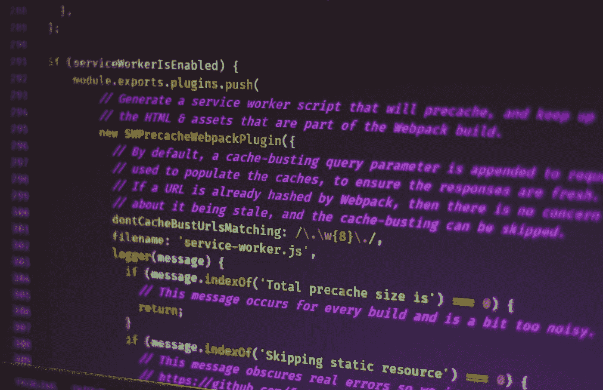

# Node.js 最佳实践—安全性和配置

> 原文：<https://blog.devgenius.io/node-js-best-practices-security-and-config-c212c3e2cea8?source=collection_archive---------6----------------------->


弗洛里安·伯杰在 [Unsplash](https://unsplash.com?utm_source=medium&utm_medium=referral) 上拍摄的照片

像任何类型的应用程序一样，JavaScript 应用程序也必须写得很好。

否则，我们以后会遇到各种各样的问题。

在本文中，我们将看看在编写节点应用程序时应该遵循的一些最佳实践。

# 阻止跨站点请求伪造

我们应该阻止跨站点请求伪造。

这是一个攻击者，攻击者可以试图通过自己的站点将数据放入应用程序。

攻击者创建一个带有表单或其他输入的请求，这些表单或输入创建针对应用程序的请求。

为了减少跨站点请求伪造，我们可以使用 csurf 包。

例如，我们可以写:

```
const express = require(‘express’);  
const csrf = require('csurf');const app = express();app.use(csrf());app.use(function(req, res, next){ 
 res.locals.csrftoken = req.csrfToken(); 
 next();
});
```

我们使用`csrf`中间件，所以我们可以用`csrfToken`方法获得 CSRF 令牌。

然后我们可以在模板中使用它:

```
<input type="hidden" name="<i>csrf" value={{csrftoken}} />
```

# 不要使用邪恶的正则表达式

邪恶的正则表达式包括分区分组、重复和重叠交替。

当应用于某些不匹配的输入时，这些模式可能需要指数级的时间来计算。

这些模式的例子包括:

*   `(a+)+`
*   `([a-zA-Z]+)*`
*   `(a|aa)+`

如果检查像`aaaaaaaaaaaaaaaaaaaaaaaaaaaaaaa`这样的输入，那么我们将挂起我们的应用程序。

完成模式检查可能需要几秒或几分钟。

我们可以用以下方法审计邪恶的正则表达式:

*   [RXRR](http://www.cs.bham.ac.uk/~hxt/research/rxxr.shtml)
*   [SDL RegEx Fuzzer](https://www.microsoft.com/en-us/download/details.aspx?id=20095)

# 添加速率限制

速率限制将保护我们免受 DOS 攻击。

我们不希望攻击者用大量请求轰炸我们的应用程序，让它们全部通过。

为了限制从一个 IP 地址对我们的应用程序的请求数量，我们可以使用 express-limiter 包。

例如，我们可以写:

```
const express = require('express');
const redisClient = require('redis').createClient();const app = express();const limiter = require('express-limiter')(app, redisClient);limiter({
  lookup: ['connection.remoteAddress'],
  total: 100,
  expire: 1000 * 60 * 60
})
```

我们使用`limiter`中间件来限制每个 IP 地址每小时最多 100 个请求。

`total`是请求数。

`expire`是重新设定限值的时间。

# Docker 撰写

我们可以创建 Docker compose 配置，将 Nginx 与我们的应用程序一起安装。

例如，我们可以写:

```
web:
  build: ./app
  volumes:
    - "./app:/src/app"
  ports:
    - "3030:3000"
  command: pm2-docker app/server.js
  nginx:
    restart: always
    build: ./nginx/
  ports:
    - "80:80"
  volumes:
    - /www/public
  volumes_from:
    - web
  links:
    - web:web
```

我们用 Docker compose 文件一次性安装 Nginx 和我们的应用程序。

# 在业务逻辑和 API 路径之间保持清晰的分离

我们应该在业务逻辑和 API 路径之间保持清晰的分离。

我们绝对不应该在我们的 API 路由中包含我们的逻辑，因为路由可以做很多事情。

我们需要一个包含所有业务逻辑的服务层，这样我们就可以分别使用和测试它们。

此外，我们可以更容易地使用一切。

# 对配置文件使用 config 文件夹

配置文件应该在一个`config`文件夹中，这样我们可以将所有的配置添加到一个地方。

这样很容易发现和改变。



由[费伦茨·阿尔马西](https://unsplash.com/@flowforfrank?utm_source=medium&utm_medium=referral)在 [Unsplash](https://unsplash.com?utm_source=medium&utm_medium=referral) 拍摄的照片

# 结论

当我们创建节点应用程序时，应该考虑到邪恶的正则表达式和文件夹结构。