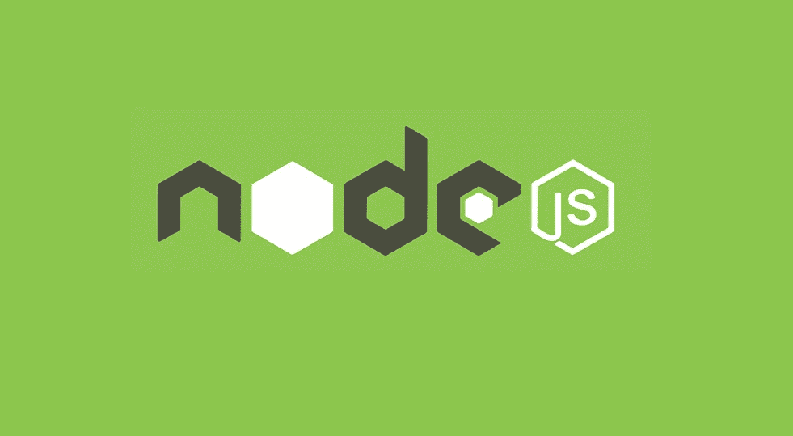

# 节点。Js:固定节点的特点、好处和技巧。Js 开发流程

> 原文：<https://blog.devgenius.io/node-js-features-benefits-and-tips-to-fasten-your-node-js-development-process-b31b16e62207?source=collection_archive---------16----------------------->

节点。Js 是一个 JavaScript 运行时环境，在移动和 web 应用程序的前端和后端开发中非常流行。这个开源的、跨平台的环境建立在 Chrome 的 V8 JavaScript 引擎之上。对于全球开发者，Node。Js 符合“小包裹带来大惊喜”这句话。它的事件驱动架构和异步 I/O 给开发人员留下了深刻的印象，非常适合构建动态和可伸缩的 web 应用程序。

节点。Js 在短时间内获得了巨大的人气，今天，它被互联网世界中一些最知名的名字所使用，包括网飞、沃尔玛、Medium、LinkedIn、PayPal 和 IBM。对于正在寻找强大的后端技术 Node 的人来说。Js 看起来是最可行的选择，但是人们不禁想知道它有什么特别之处。

# **快速查看节点。Js 特性**

追求节点的主要原因。Js 是因为它的尖锐和直的特点，这使它具有竞争优势和潜力。正确使用这些特性将会巩固你的节点。Js 开发过程，将使您创建用户友好的和功能更加一致的应用程序。尽管 Node 充斥着应用程序开发框架、工具和特性，但这里有一些值得注意的:

**-简单的节点应用程序开发概要:** Node 自带一个内置的概要分析器，它使用 V8 的概要分析器在程序执行期间对堆栈进行采样。它也会记录结果。

**-丰富的库:**多亏了 npm(节点包管理器)，Node 的生态系统激增。目前，它为开发者托管了超过 10，000，000 个开源包。

**-事件循环:**节点的事件循环特性赋予其高可伸缩性。它还负责执行 I/O 操作。它的 I/O 操作本质上是异步和非阻塞的。

**-使用不同文件系统的能力:**不同的文件系统有不同的行为方式，这可能会扰乱您的编码。节点。Js 提供了智能的技术方法来工作和处理不同的文件系统，这样开发人员可以保持代码简洁明了，并且可以坚持 Node。Js 编码最佳实践。

多几个节点。值得注意的 Js 特性是大量的社区支持、丰富而简洁的文档和调试工具。开发人员更喜欢使用节点应用程序开发来创建:

-流媒体应用和复杂的单页应用

-实时聊天应用程序以及协作工具

-微服务-基于架构的应用

-基于 JSON API 的应用程序

## **节点应用开发的优势**

尽管应用程序开发行业可以求助于其他几种编程语言，Node。Js 提供了一些明显的好处，使得开发者转向它。

**1)易于掌握:**运行前端应用程序将需要 JavaScript，这也是开发人员努力掌握 Node 的原因。而不是把时间花在学习服务器端语言上。对于初创企业，Node。Js 作为一个好的、有经验的节点，是最好的 app 开发工具之一。Js 开发人员可以有效地处理前端和后端。

**2)3cs:**3cs 代表 Node.Js 更干净、一致的编码，由于 Node 使用单一的代码库，开发人员可以很容易地在客户端和服务器端之间同步数据。开发人员使用相同的工具和相同的命名约定，这极大地减少了总体编码时间，也使得源代码更加一致和干净。

**3)适合开发微服务:**由于其轻量级和可伸缩的结构，使用 Node 变得很容易。开发和维护微服务架构的 Js。这意味着开发者可以独立处理、测试和操作应用。这不仅有助于降低风险，而且证明在降低开发成本和时间方面是有效的。

强大的企业支持:我们已经招募了一些知名企业来利用这个资源丰富的运行时环境。但是，Node 获得的企业支持是巨大的。2015 年，包括微软、SAP 和 IBM 在内的多家公司成立了 NodeJS 基金会，通过升级和构建高级节点来促进节点应用程序的开发。JS 核心工具。多年来，越来越多的公司转向 Node 来维护他们的后端服务。

## **紧固节点的技巧。Js 流程**

节点。JS 听起来是一个很好的工具，但是没有一个工具是没有缺陷的。开发商确实要面对节点。Js 编码挑战作为技术缺陷，无论多么微不足道，总是存在的。但是，这些挑战可以通过一些外部帮助和一些内部调整来解决。

因此，这里有三个有价值的提示，将帮助您更好地编码，并将固定您的节点。Js 开发流程也是。

**1)使用集群模块**

节点。Js 不使用系统上可能有的不同内核。这是因为默认情况下，它是在单核处理器上运行的。但使用核心集群模块将使应用程序能够在多个核心上运行。集群还能够处理大量请求。这反过来增强了服务器的性能，并使节点应用程序的开发更好。

**2)利用缓存**

缓存是一种有效的技术，可以避免服务器重复执行相同的功能。如果您处理的数据变化不大，但输出相同，那么缓存可以加快节点应用程序的开发速度。它还通过减少命令的响应时间来提高应用程序的性能。

**3)进行自动化测试**

编写和执行自动化测试可以节省大量时间。每当向代码中添加新元素或者修改任何部分时，自动化测试使得运行测试变得更加容易。自动化测试拓宽了测试范围，因为它们运行在算法上，并且不像手工测试那样容易出错。此外，它们对应用程序的上市时间有重大影响。

**4)查询优化**

节点。Js 因其庞大的数据库而蓬勃发展，一个错误的查询就足以减慢数据获取过程。因此，开发人员有必要关注查询优化，以避免应用崩溃之类的情况。

**总结**

一个节点的开发。Js app 不仅仅是利用了几个特性。JavaScript 运行时环境的最大优化需要经验、技能和适当的技术组合。除了它的内置工具之外，开发人员还使用了 Atom 和 Webstorm 等顶级 ide 来放大开发过程。

既然您已经熟悉了 Node 的优点。Js 以及其他细节，与有经验的[节点合作。Js web 开发公司](https://www.hiddenbrains.com/nodejs-development.html)将帮助您利用该平台的优势，构建可伸缩、安全和动态的 web 应用程序。