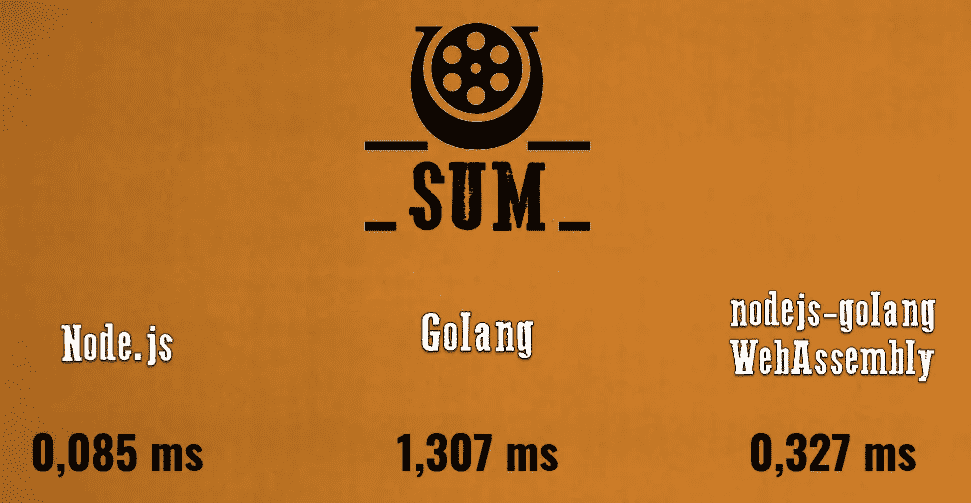
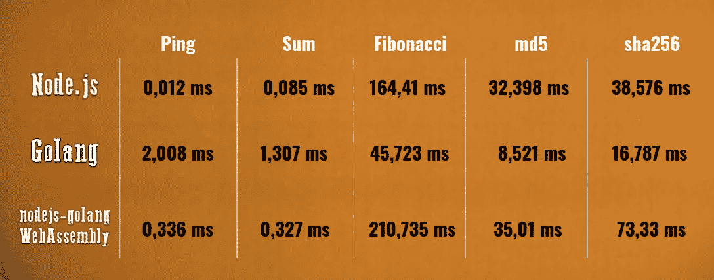

# Node.js:我们相信围棋

> 原文：<https://blog.devgenius.io/node-js-in-go-we-trust-7da6395776f2?source=collection_archive---------0----------------------->


# 碑文

> **口琴:** *【面对三个男人】*还有弗兰克？
> Snaky:法兰克派我们来的。
> **口琴:**你给我带马了吗？
> **Snaky:**…看起来我们…
> *【士力架】* **Snaky:**…看起来我们是害羞的一匹马。
> **口琴:** *【摇头】*你多带了两把。
> (西方往事，1968)

# 问题

Nodejs 适合 I/O 密集型任务，但不适合 CPU 受限的任务。同时，我们有很多选项来处理这样的任务(子进程/集群、工作线程)。此外，有可能使用其他语言(C，C++，Rust，Golang)作为单独的服务/微服务或通过 WebAssembly 脚本。在本文中，我想谈谈 Golang 在 Node.js 应用程序开发和运行一些 CPU 密集型任务(简单求和、斐波那契数列和像 md5 和 sha256 这样的散列函数)中的用法

# 选择

1.尝试用[**node . js**](https://nodejs.org/)only
2 解决 CPU 绑定任务。在 [**Golang**](https://go.dev/) 上创建单独的服务，并通过请求/队列等
3 将其连接到应用程序。使用 Golang 构建 [**wasm**](https://webassembly.org/) 文件来运行 Node.js 中的一些方法

# 速度和金钱

我是老的意大利西部片的粉丝，尤其是好的、坏的和丑陋的 T42。在这篇文章中我们有 3 个选择，在电影中有 3 个英雄。
那么……我们来说一个**速度**金钱决定一切的地方……
**狂野西部**


# Node.js(好的)


优点:
1。前端和后端使用相同的语言
2。I/O 操作大师——超快速事件循环
3。最大的武器库- [npm](https://www.npmjs.com/)

# Golang(坏人)


优点:
1。在谷歌
2 设计的。几乎所有操作系统都支持。Golang 中的特殊函数，它与其他函数或方法同时运行(适用于 CPU 绑定的任务)
4。简单-只有 25 个关键字

# nodejs-golang/WebAssembly(丑陋的)


优点:
1。随处可得
2。补充 JavaScript
3。有可能用不同的语言编写代码并使用。JavaScript 中的 wasm 脚本

**我们来谈谈最后一个选项。**T5【戈朗码】可构建为。wasm 文件，方法是将**操作系统**设置为“js”，将**架构**设置为“wasm”(可能的 GOOS 和 GOARCH 值列表在此为):

```
GOOS=js GOARCH=wasm go build -o main.wasm
```

要运行编译好的 Go 代码，你需要 ***wasm_exec.js*** 中的粘合代码。在这里找到了:

```
${GOROOT}/misc/wasm/wasm_exec.js
```

为了实例化，我使用了[**@ assembly script/loader**](https://www.npmjs.com/package/@assemblyscript/loader)，并创建了模块[**nodejs-golang**](https://www.npmjs.com/package/nodejs-golang)(btw @ assembly script/loader 是它唯一的依赖)。该模块帮助创建、构建和运行可在 JavaScript 代码中使用的独立 wasm 脚本或函数

顺便说一下，其他语言也可以用同样的方式创建一个. wasm 文件。

```
**C:** emcc hello.c -s WASM=1 -o hello.html**C++:** em++ hello.cpp -s WASM=1 -o hello.html**Rust:** cargo build --target wasm --release
```


# 让我们来看看谁是狂野西部最快的枪…

> “直到一个人或一个西瓜受到重击，你才能知道他们有多好。
> ——罗伊·比恩

**为此，我们需要创建 2 台服务器**

**1。Golang 服务器**


**2。Node.js 服务器**


我们将测量每个任务的执行时间——对于 Golang 服务器，它将是函数的直接执行时间+网络请求延迟，而对于 Node.js 和 WebAssembly，它将只是函数的执行时间

# 最后的决斗

**1。“ping”请求**(只是检查请求执行将花费多少时间)


节点. js

戈朗

诺杰斯-戈朗

结果:


**2。接下来将是两个数的简单和**


节点. js

戈朗

诺杰斯-戈朗

结果:



**3。接下来是斐波那契数列**(得到第 100000 个数字)


节点. js

戈朗

诺杰斯-戈朗

结果:


**4。让我们继续讨论传统的散列函数。第一个** - **md5** (10k 字符串)


节点. js

戈朗

诺杰斯-戈朗

结果:


**5。…最后是 sha256** (10k 弦)


节点. js

戈朗

诺杰斯-戈朗

结果:


# 和最终结果



# 所以，我们今天学到了:

1.还有 Node.js，做的很好
2。有一种 Golang 做得很好
3。有一个 WebAssembly(现在也是我的 [nodejs-golang](https://www.npmjs.com/package/nodejs-golang) 模块)很好地完成了它的工作
4。Golang 可以作为一个独立的应用程序，作为一个服务/微服务，作为 wasm 脚本的源代码，然后可以在 JavaScript
5 中使用。Node.js 和 Golang 有现成的在 JavaScript 中使用 WebAssembly 的机制

# 结论

> “快固然好，但准确才是最重要的。”-怀亚特·厄普

1.如果有可能不使用 Node.js 运行 CPU 绑定的任务，最好不要这样做
2。实际上，如果可能的话，最好不要做任何任务。如果你需要在 Node.js 应用程序中运行 CPU 相关的任务——试着用 Node.js 来做这件事。在性能(使用其他语言)和可读性(继续在纯 JavaScript 团队中保持纯 JavaScript 代码)之间，最好选择可读性。如果你是唯一熟悉一门新语言的人，那么在项目中增加这门语言并不是一个好主意。“一个好的架构师会假装还没有做出决策，并塑造系统，使得这些决策仍然可以尽可能长时间地推迟或更改。一个好的架构师会最大限度地增加未决策的数量。”-罗伯特·c·马丁的《清洁建筑》
6。对我来说，最好是“分开来”。为硬计算创建服务/微服务-如果需要，扩展此类服务将非常容易
7。WebAssembly 首先对浏览器有好处。Wasm 二进制比 JS 代码更小，更容易解析，它是向后兼容的等等

感谢阅读。请随意评论，我希望我们能好好讨论。
请鼓掌跟我来，以免错过新文章。

要了解更多信息，并有可能通过自己运行脚本来检查结果，请访问 GitHub 知识库

[](https://github.com/novokhatskyioleksii) [## 新哈茨基奥利克西

### Node.js 中使用 wasm 运行 Golang 脚本的模块

github.com](https://github.com/novokhatskyioleksii) 

还要检查 npm 中的[**nodejs-golang**](https://www.npmjs.com/package/nodejs-golang)模块

[](https://www.npmjs.com/package/nodejs-golang) [## 诺杰斯-戈朗

### Node.js 中使用 wasm 运行 Golang 脚本的模块

www.npmjs.com](https://www.npmjs.com/package/nodejs-golang)