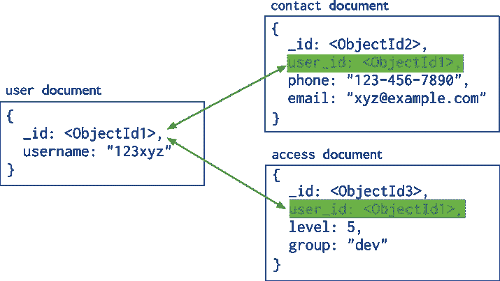
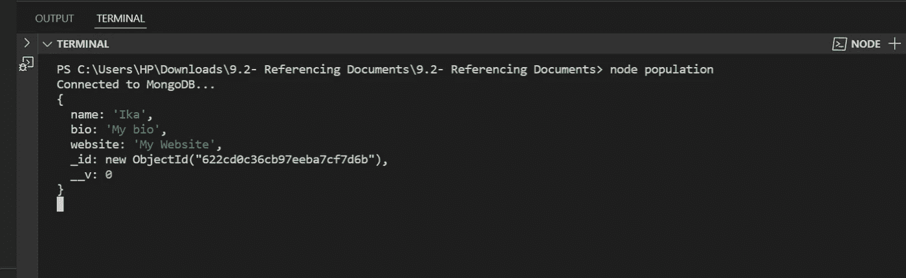

# Node JS:建模连接数据之间的关系 mongoDB

> 原文：<https://blog.devgenius.io/node-js-modeling-relationalship-between-connected-data-mongodb-9dc208a950e6?source=collection_archive---------2----------------------->

# 建模关系

数据建模的主要挑战是平衡应用程序的需求、数据库引擎的性能特征和数据检索模式。在设计数据模型时，始终要考虑数据的应用程序用法(即数据的查询、更新和处理)以及数据本身的固有结构。

为 MongoDB 应用程序设计数据模型的关键决策围绕着文档的结构以及应用程序如何表示数据之间的关系。MongoDB 允许将相关数据嵌入到单个文档中。

# 参考文件

引用通过包含从一个文档到另一个文档的链接或*引用*来存储数据之间的关系。应用程序可以解析这些[引用](https://docs.mongodb.com/manual/reference/database-references/)来访问相关数据。概括地说，这些是*标准化的*数据模型。



参考文件

```
//MODEL AUTHORconst Author = mongoose.model('Author', new mongoose.Schema({name: String,bio: String,website: String})); //MODEL COURSE was relationalship with Author model const Course = mongoose.model('Course', new mongoose.Schema({name: String,authorId:{type: mongoose.Schema.Types.ObjectId,ref:'Author'}}));
```

创建作者模型

```
async function createAuthor(name, bio, website) { const author = new Author({name, bio, website }); const result = await author.save();console.log(result);}createAuthor('Ika', 'My bio', 'My Website');
```

创建课程模型

```
async function createCourse(name, authorId) { const course = new Course({name, authorId}); const result = await course.save();console.log(result);}createCourse('Node Course', '622b551b1b348da807f723c0')//(nameCourse , authorId)
```

列出课程

```
async function listCourses() {const courses = await Course.find().populate('authorId')// find all populate in author model.select('name');console.log(courses);}listCourses();
```

。populate()用于显示关系表中的所有人口。在中，将按关系 authorId 显示表 author 的所有内容。



结果。填充()

# 嵌入文档

为了对连接的数据之间的关系进行建模，我们可以引用一个文档或者将它嵌入到另一个文档中。当引用一个文档时，这两个文档之间确实没有关系。因此，引用不存在的文档是可能的。当您想要实施数据一致性时，引用文档(规范化)是一个好方法。因为数据库中只有一个对象实例。但是这种方法对查询性能有负面影响，因为在 MongoDB 中，我们不能像在关系数据库中那样连接文档。因此，为了获得一个文档及其相关文档的完整表示，我们需要向数据库发送多个查询。嵌入文档(反规范化)解决了这个问题。我们可以通过一个查询读取文档的完整表示。所有必要的数据都嵌入在一个文档及其子文档中。但这也意味着我们将在不同的地方有多个数据拷贝。虽然目前存储不是问题，但拥有多个副本意味着对原始文档所做的更改可能不会传播到所有副本。如果数据库服务器在更新过程中死机，一些文档将会不一致。对于每一项业务，对于每一个问题，你都需要问这样一个问题:“我们能容忍数据在短时间内不一致吗？”如果没有，你必须使用参考。但同样，这意味着您的查询会更慢。

**引用单据**

```
async function listCourses() {const courseSchema = new mongoose.Schema({ author: { type: mongoose.Schema.Types.ObjectId, ref: ‘Author’ } })
```

**引用文档**

```
const courseSchema = new mongoose.Schema({ 
author: {   
       type: new mongoose.Schema({             
       name: String,              
       bio: String         
      })   
    } 
}) const Course =
```

嵌入的文档没有保存方法。它们只能保存在其父对象的上下文中。

**更新嵌入文档**

```
const course = await Course.findById(courseId);
course.author.name = ‘New Name’; 
course.save();
```

embedding.js 的所有代码

```
const mongoose = require('mongoose');//CONNECTION DATABASEmongoose.connect('mongodb://localhost/playground').then(() => console.log('Connected to MongoDB...')).catch(err => console.error('Could not connect to MongoDB...', err));//MODEL AUTHORconst authorSchema = new mongoose.Schema({ name: String, bio: String, website: String  });const Author = mongoose.model('Author', authorSchema);//MODEL COURSEconst Course = mongoose.model('Course', new mongoose.Schema({ name: String, authors:[authorSchema]})); //CRUD//CREATE COURSEasync function createCourse(name, authors) {const course = new Course({ name, authors });const result = await course.save();console.log(result);}//READ COURSESasync function listCourses() {const courses = await Course.find();
console.log(courses);}//UPDATE COURSEasync function update(courseId) {const course = await Course.findById(courseId);course.author.name="Ika sari apriliyani";course.save()console.log(course);}async function addAuthor(courseId,author) {const course=await Course.findById(courseId);course.authors.push(author)course.save()}//DELETE COURSEasync function removeAuthor(courseId,authorId) {const course=await Course.findById(courseId);const author = await course.authors.id(authorId)author.remove()course.save()}//createCourse(name, authors)//listCourses()// update('622cc20af81c5e7c38e80a3a')// createCourse('Node Course', [new Author({ name: 'Ika' })]);// addAuthor('622ccaa98004b2252cee4310', new Author({ name: 'Amy' }));// removeAuthor('622ccaa98004b2252cee4310','622ccb54ec686c07c6038c18')
```

# 处理

我们在 MongoDB 中没有交易。为了实现事务，我们使用一种称为“两阶段提交”的模式。如果你不想手动实现这个模式，使用福恩·NPM 包:

使用 Fawn 实现事务

```
 try {    
         await new Fawn.Task()        
         .save(‘rentals’, newRental)       
         .update(‘movies’, { _id: movie._id }, 
{ $inc:numberInStock: -1 }})                                              .run(); } 
catch (ex) {     // At this point, all operations are automatically rolled back}
```

# 对象 ID

ObjectIDs 几乎是唯一的。理论上，两个 ObjectIDs 有可能相等，但对于大多数现实应用程序来说，这种可能性非常低(1/16，000，000)。

ObjectIDs 由 MongoDB 驱动程序生成，用于唯一地标识文档。它们由 12 个字节组成:

*   4 字节:时间戳
*   3 字节:机器标识符
*   2 字节:进程标识符
*   3 个是:柜台

验证 ObjectIDs

```
mongoose.Types.ObjectID.isValid(id);
```

要使用 joi 验证 objectid，请使用 joi-objectid NPM 包。

*主 Reff 从节点 JS 航向代码带 Mosh*