# 节点 JS:节点模块系统

> 原文：<https://blog.devgenius.io/node-js-node-module-system-57f9a0022d?source=collection_archive---------10----------------------->

# 节点 JS:节点模块系统

# 全局对象

Node.js 全局对象本质上是全局的，它们在所有模块中都可用。我们不需要在应用程序中包含这些对象，而是可以直接使用它们。

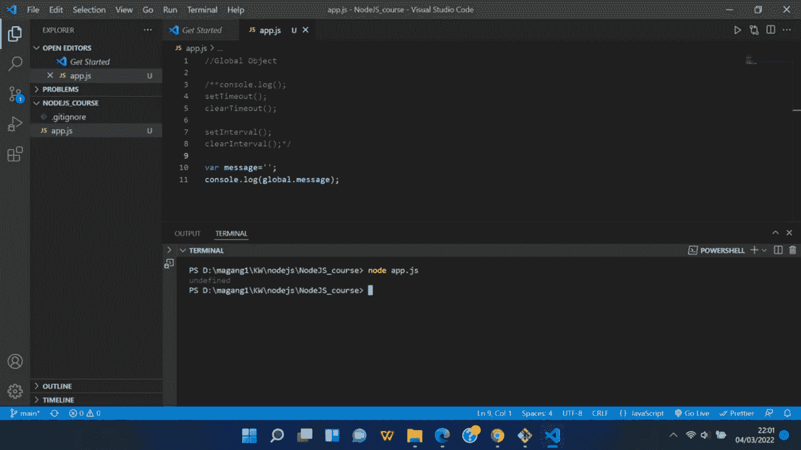

全局对象

# 组件

Node.js 中的模块是一个简单或复杂的功能，组织在单个或多个 JavaScript 文件中，可以在整个 Node.js 应用程序中重用。

Node.js 中的每个模块都有自己的上下文，所以不能干扰其他模块，也不能污染全局范围。此外，每个模块可以放在单独的。js 文件放在单独的文件夹下。

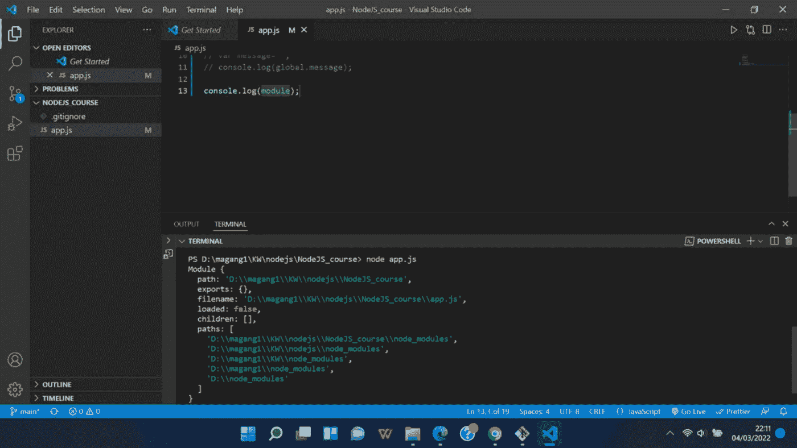

组件

# 创建模块

要访问模块特性，您要做的第一件事就是导出它们。这是使用[导出](https://developer.mozilla.org/en-US/docs/Web/JavaScript/Reference/Statements/export)语句完成的。

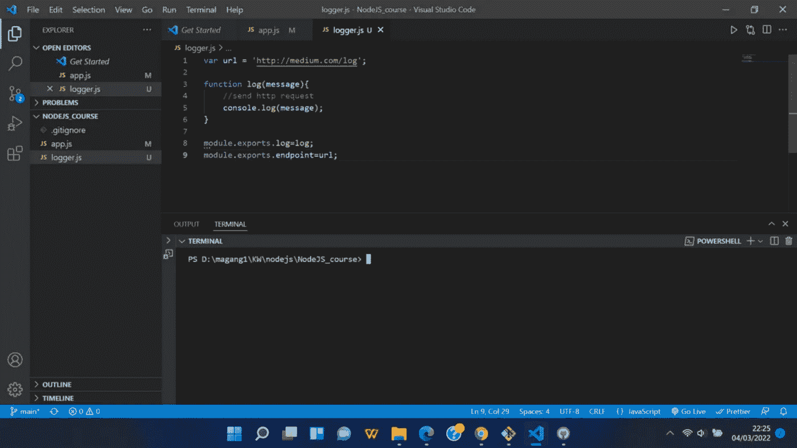

创建模块

# 装载模块

运行 app.js 查看结果。

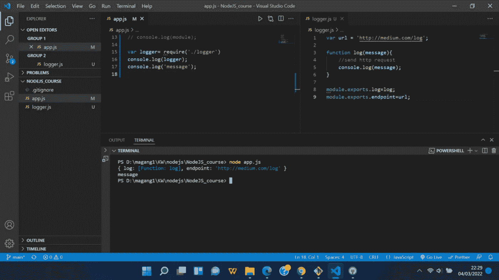

加载模块

# 模块包装函数

在 Node.js 中，每个文件都有一个包装，它用一个函数来执行每个文件，因此 console.log(arguments)打印 Node 传递给包装函数的 5 个参数。

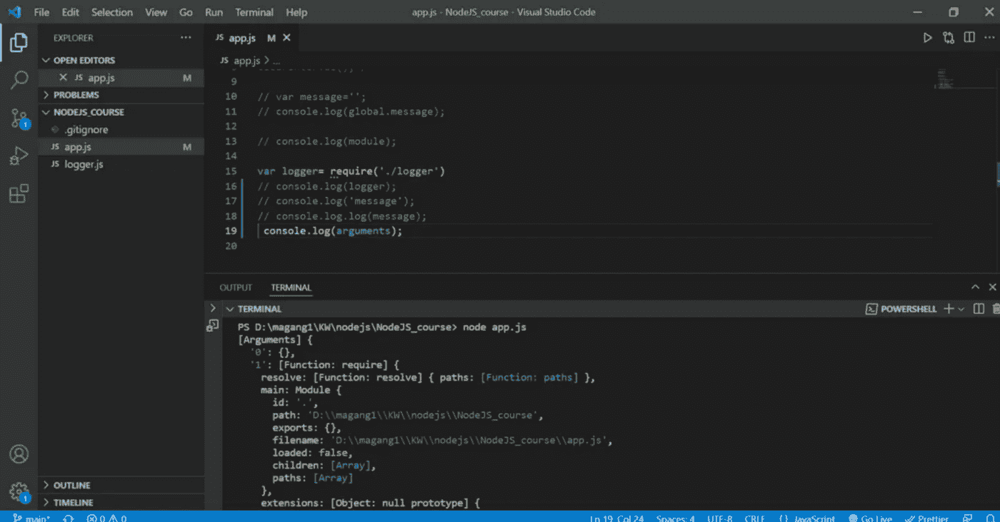

模块包装函数

有趣的是，你可能在这里或那里使用过其中的一些，但是像我一样，你现在才发现为什么会发生这种情况。

模块和导出可以用来改变当前模块本身。模块有一个名为 exports 的对象，其默认值为{}

require 用于将其他模块导入您的文件/应用程序

__filename 和 __dirname 是当前文件和当前工作目录的路径

# 路径模块

path 模块提供了使用文件和目录路径的实用程序。可以使用以下方式访问它:

```
const path = require('path');
```

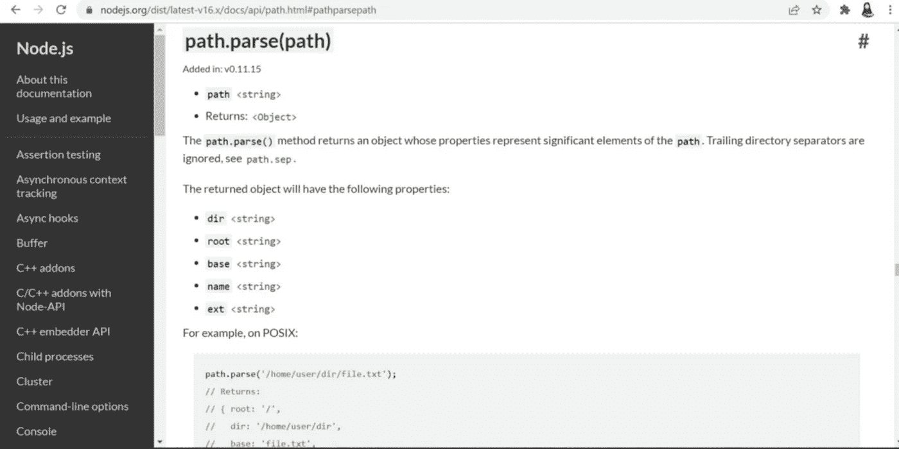

路径模块

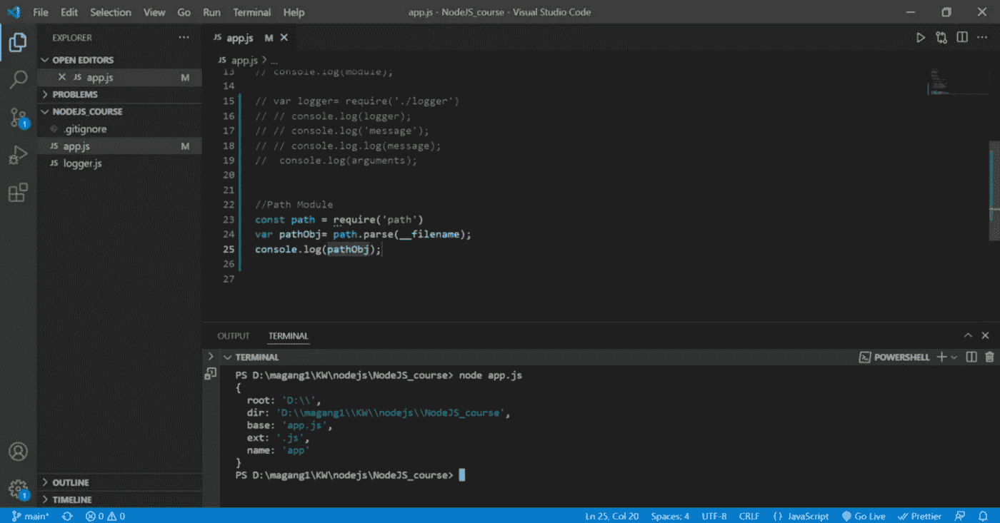

path.parse()

# 操作系统模块

`os`模块提供了操作系统相关的实用方法和属性。可以使用以下方式访问它:

```
const os = require('os');
```

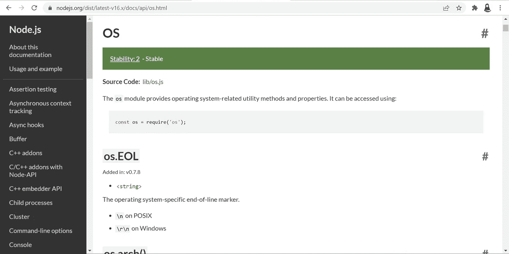

操作系统模块

os.module 示例

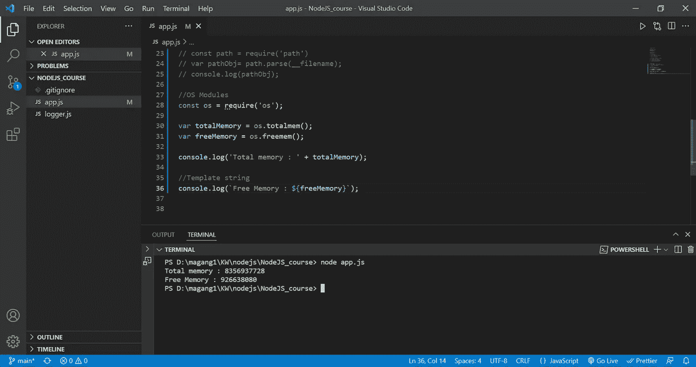

操作系统（Operating System）

# 文件系统模块

`fs`模块支持以一种基于标准 POSIX 函数的方式与文件系统交互。

要使用基于承诺的 API:

```
import * as fs from 'fs/promises';
```

要使用回调和同步 API:

```
import * as fs from 'fs';
```

所有文件系统操作都有同步、回调和基于承诺的形式，并且可以使用 CommonJS 语法和 ES6 模块(ESM)进行访问。

# 许诺示例 [#](https://nodejs.org/dist/latest-v16.x/docs/api/fs.html#promise-example)

基于承诺的操作返回一个承诺，该承诺在异步操作完成时实现。

```
import { unlink } from 'fs/promises';try {
  await unlink('/tmp/hello');
  console.log('successfully deleted /tmp/hello');
} catch (error) {
  console.error('there was an error:', error.message);
}
```

# 回调示例 [#](https://nodejs.org/dist/latest-v16.x/docs/api/fs.html#callback-example)

回调表单将完成回调函数作为最后一个参数，并异步调用操作。传递给完成回调的参数取决于方法，但第一个参数总是为异常保留。如果操作成功完成，那么第一个参数是`null`或`undefined`。

```
import { unlink } from 'fs';unlink('/tmp/hello', (err) => {
  if (err) throw err;
  console.log('successfully deleted /tmp/hello');
});
```

当需要最大性能(在执行时间和内存分配方面)时，基于回调的`fs`模块 API 比使用 promise APIs 更好。

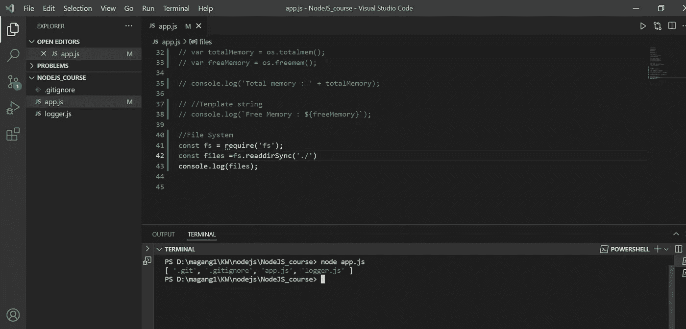

fs.readdirSync

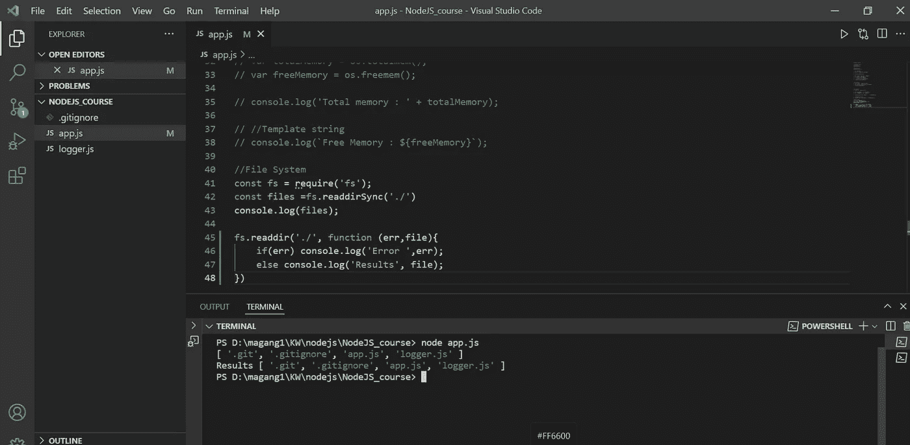

fs.reddir

# 模块事件

Node.js 核心 API 的大部分是围绕惯用的异步事件驱动架构构建的，在该架构中，某些类型的对象(称为“发射器”)发出命名事件，这些事件导致调用`Function`对象(“监听器”)。

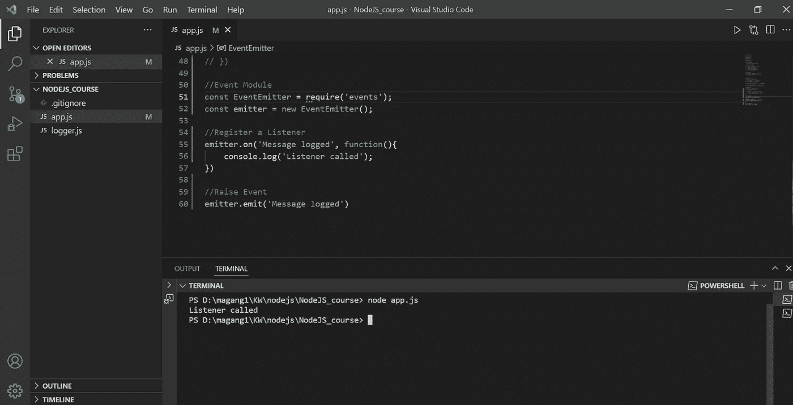

事件模块

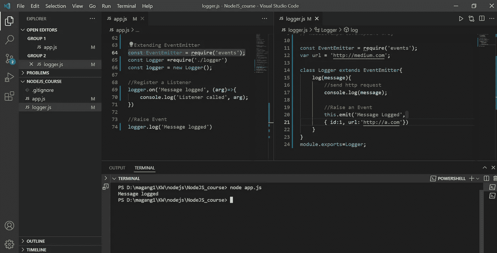

扩展 EventEmitter

# HTTP 模块

要使用 HTTP 服务器和客户端，必须使用`require('http')`。

Node.js 中的 HTTP 接口旨在支持传统上难以使用的许多协议特性。尤其是大的、可能是块编码的消息。该接口很小心，从不缓冲整个请求或响应，因此用户能够传输数据流。

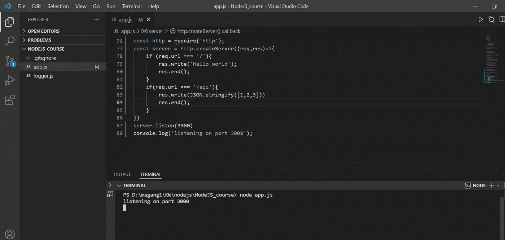

http 模块

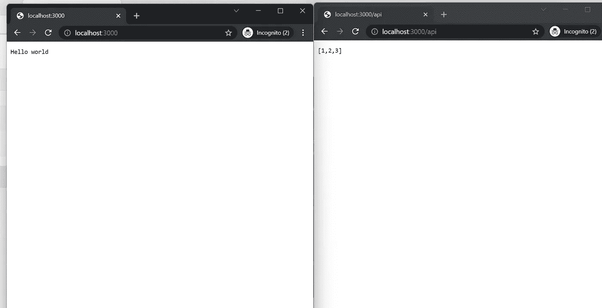

浏览器上的 res