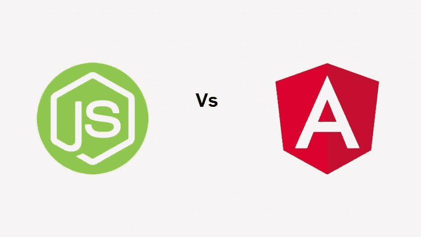

# 节点。JS 或 Angular:应该知道的主要区别

> 原文：<https://blog.devgenius.io/node-js-or-angular-the-major-differences-one-should-know-1685f642e33b?source=collection_archive---------10----------------------->

节点。JS 因其易用性、可用于前端和后端开发的多功能性及其众多的应用程序而在开发人员中广受欢迎。但是给它激烈的竞争是 Angular，以前基于 JavaScript 的框架用 TypeScript 重写，现在由 Google 维护。

Angular 也是开发人员的首选，因为它能够满足各种应用程序的需求，并且它提供了大量的工具来进行简洁的前端开发。

在过去的几年里，这两个[节点。JS](/node-js-features-benefits-and-tips-to-fasten-your-node-js-development-process-b31b16e62207) 和 Angular 已经取得了指数级的增长，并且已经声名鹊起，两者之间正在展开一场势均力敌的竞争。两者都有一套非常强大的特性，有助于构建灵活、可伸缩和结构良好的 web 应用程序。

但是当一个人不得不在这两者之间做出选择时，困境就出现了，因为他们都有这样一个优势。因此，为了做出正确的选择，我们需要了解这两种应用程序开发技术之间的主要区别。

在这里，我们通过列举两种技术的关键方面对它们进行了比较，从而帮助用户了解 Node 的实用性。JS 和 Angular 并做出正确的决定。

## **#1 基础知识**

两个节点。JS 和 Angular 本质上是开源和跨平台的，但是它们的基本结构不同，因为 Node。JS 是一个运行时环境，工作在 Chrome 的 V8 引擎上，在 web 浏览器之外运行 JavaScript 代码。另一方面，Angular 是一个 web 应用程序开发框架，其核心重点是前端开发。

## **#2 编程语言**

尽管 JavaScript 是 Node 的基础。JS，它并不是唯一一种用于创建它的语言。节点。JS 是用 C 和 C++以及 JavaScript 编写的。

现在 Angular 的主要语言是 JavaScript，这就是为什么它的早期版本被称为 AngularJS，但当前版本使用 TypeScript，这是由微软开发和维护的，被认为是 JavaScript 的语法超集。

## **#3 部署**

作为节点。JS 是一个运行时环境，所以要使用 Node。JS，Node.js 开发者必须在他们的系统上安装它。但是 Angular 就不是这样了，因为它不需要安装就可以使用。开发人员只需要添加必要的 Angular 文件和工具来用于他们的应用程序开发。

## **#4 应用类型**

节点。JS 用于为客户端和服务器端创建灵活和可伸缩的网络应用程序，而 Angular 主要用于构建客户端应用程序和 spa(单页应用程序)。

While 节点。JS 是创建小型应用程序的首选，Angular 被认为是开发包括 PWAs(渐进式 web 应用程序)在内的高度交互式 Web 应用程序的理想选择。

## **#5 框架可用性**

使用节点时。JS，一个人可以找到不同类型的 web 框架，其中一些完全构建在 Node 上。一些著名的框架有 Express.js、Socket.io、Nest.js、Meteor.js、Total.js 和 Hapi.js。

另一方面，Angular 本身是一个框架，但是你可以找到不同的有用的开发工具和技术，比如 Ngx-Bootstrap、Karma、量角器、Mocha。JS 和 Djangular。

## **#6 结构与建筑**

Angular 有一个基于组件的架构。这意味着在 Angular 中，一个大的应用被解耦成完全可重用的不同组件。因此，这些组件可以在应用程序的其他部分重用。

因为这些组件大部分是相互独立的。由于这种结构，角码有利于良好的可测试性。节点。另一方面，JS 遵循 JavaScript 的事件驱动架构。

事件驱动架构允许非阻塞操作，使节点。JS 是一个优秀的开发平台。此外，Node 是单线程的，这意味着请求在同一个线程上处理和执行。

## **#7 数据功能正常**

Angular 具有双向数据绑定功能。这意味着应用程序中的组件可以找到共享数据的方法。借助双向数据绑定，组件之间的值可以同时更新。

但是 Angular 不支持编写数据库查询。同时节点。JS 允许开发人员编写数据库查询(如 MongoDB ),从而使 web 开发变得更加容易。

## **节点和角度作为平均堆栈的一部分**

节点。JS 和 Angular 拥有许多相似的属性，但彼此又如此不同。在它们的许多相似之处中，一个是它们都非常高效，并且能够开发实用的 web 应用程序。

也许这就是为什么它们都是 JavaScript 软件栈 MEAN (MongoDB，Express)的一部分的原因。JS，角度和节点。JS)栈，大量用于动态 web 应用程序和网站的开发。

由于这个堆栈的所有技术都以这样或那样的方式支持 JS，因此用 MEAN 构建的应用程序能够用一种语言编写前端和后端。

# **如何挑选合适的？**

选择合适的平台时，首先要考虑的因素是应用程序的要求。然而，一个显而易见的因素是，如果您更关注前端开发，那么 Angular 肯定是一个强有力的竞争者。

但是，如果您正在寻找一种统一的 web 应用程序开发，使用一种编程语言同时进行服务器端和客户端开发，那么 Node。JS 绝对是不二之选。

同样，如果你的重点是减少可重用组件的工作和更好的可测试性，那么 Angular 是一个不错的选择。但是如果你正在构建需要更好的网络的应用，比如浏览器游戏和实时通信应用，那么 Node。JS 是更好的选择。

重点是，在选择一个之前，制作一个应用程序开发所需的重要功能的清单，例如:

*   基本功能
*   数据库的使用
*   应用交互性
*   应用安全性
*   应用类型(水疗、简单网络应用、网络应用、游戏应用、PWA 等。)

拥有一份清单将有助于您更好地了解这两种技术，并帮助您做出正确的决定。

## **结论**

有了这么多的 JavaScript 技术，用户经常会对使用什么、不使用什么和节点感到困惑。JS 和 Angular 就是两个这样的平台。但是，通过对两者进行详细的比较，比如它们的结构、架构、工具和框架的可用性、部署以及应用程序的要求，人们可以做出合理的决定。

然而，人们总是可以选择咨询 Node 这样的专业人士。JS 开发人员或 Angular 开发人员来更好地了解这个主题。