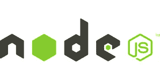
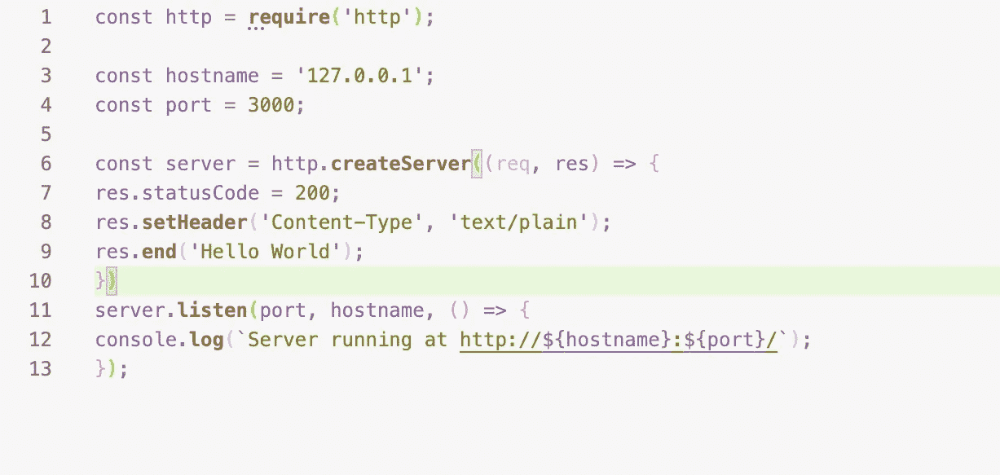
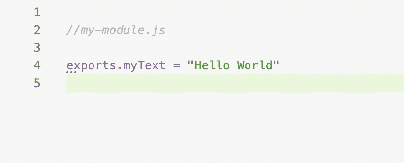
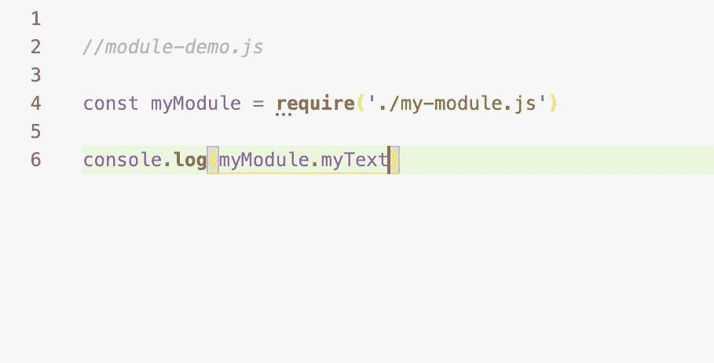
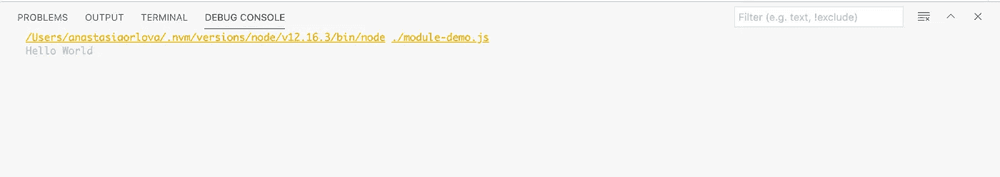

# Node.js:初次相遇

> 原文：<https://blog.devgenius.io/node-js-the-first-encounter-f09bf5493da2?source=collection_archive---------8----------------------->

从 Flatiron Bootcamp 毕业后，我倾向于更多地磨练我已经掌握的技能，而不是学习新的东西。这是一个明智的选择，但最近我感到迫切需要研究一些新概念。我就是这样开始钻研 Node.js 的。

那么，这个 Node.js 到底是什么？

嗯，首先，它不是一个框架，不像有些人(包括我自己)认为的那样。Node.js 是一个开源的服务器环境，运行在各种平台(Windows、Linux、Unix、Mac OS X)上，在服务器上使用 JavaScript。

使用 Node.js 的主要优点是:

1.  它很轻
2.  它是免费的
3.  您可以创建可重用的代码
4.  你可以用同一种语言——JavaScript——编写你的前端和后端
5.  由于 JSON 是 JavaScript 的一部分，它使得 web 应用程序的前端和后端都非常理想(并且您可以轻松地在它们之间传递数据，无需任何转换)
6.  Node.js 使用异步编程。这里有一个很好的例子，由官方的 [Node.js](http://nodejs.org) 网站提供。

正如我们所看到的，许多连接可以同时发生。每次连接时，都会触发回调，但是如果没有工作要做，Node.js 将会休眠。

**如何入门 Node.js？**

1.  进入官方 [Node.js](http://nodejs.org) 网站。它对所有类型的操作系统都有非常清晰的安装说明。
2.  安装完成后，通过在终端*中键入 *node-v* 来检查是否一切就绪。它会显示你已经安装的 Node.js 版本。*
3.  我们先创建两个文件: *my-module.js* 和 *module-demo.js* 。实际上，它们不仅仅是文件——它们是两个可重用的模型，可以相互访问(在某种意义上，这类似于 React JS 中组件的概念)。

在 *my-module.js* 中，我们创建了一个我们想要的文本 console.log。

在 *module-demo.js* 中，我们调用 *my-module.js* 。

这是控制台日志，我们找到了！

同样的方法也用于更复杂的项目。使用 Node.js，您可以构建许多类型的动态和智能 web 应用程序。Node.js 的功能给我留下了深刻的印象，所以我很想了解更多。

**来源:**

1.  [官方 Node.js 网站](https://nodejs.org/en/)
2.  [W3School Node.js](https://www.w3schools.com/nodejs/nodejs_intro.asp)
3.  [LinkedIn Node.js 简介](https://www.linkedin.com/learning/learning-node-js-2)