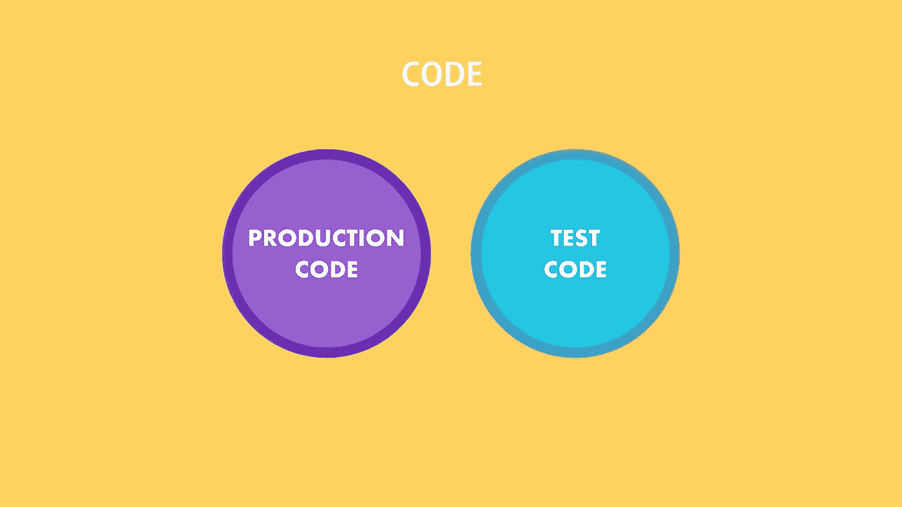
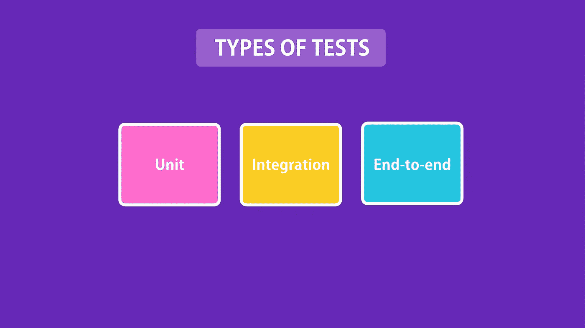
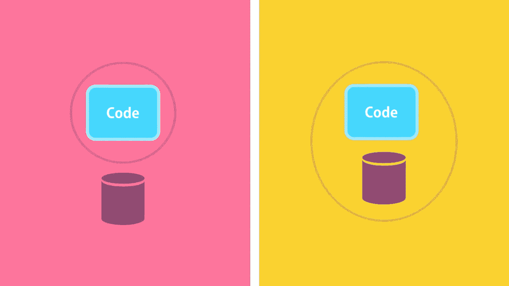
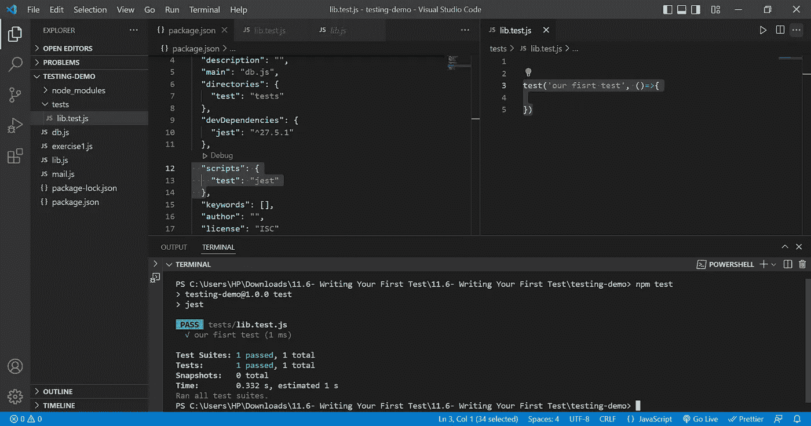
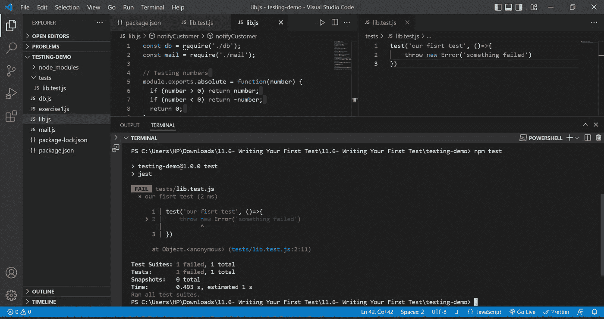
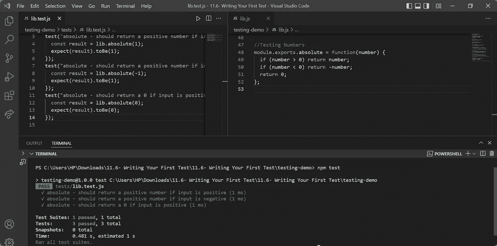
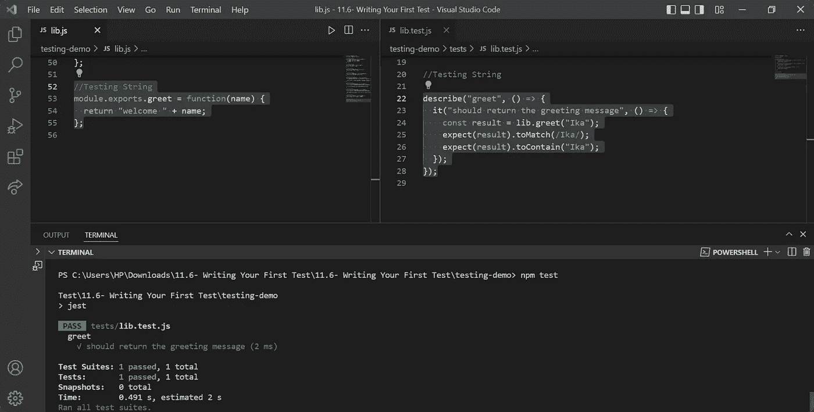

# 节点 JS:单元测试

> 原文：<https://blog.devgenius.io/node-js-unit-testing-758b5ed3f323?source=collection_archive---------2----------------------->

# 什么是自动化测试？

它是人工测试的替代品吗？编写代码来测试我们的代码，然后以自动化的方式运行这些测试的实践。自动化测试我们的源代码由应用程序代码组成，也称为生产代码和测试代码。自动化测试是编写代码来测试我们的代码的实践。自动化测试帮助我们交付错误更少、质量更好的软件。它们还帮助我们自信地重构代码。



自动化测试

**自动化测试的好处**

*   用更少的时间频繁测试您的代码
*   在部署之前捕获 bug
*   放心部署
*   自信地重构:重构意味着在改变代码的行为之前改变代码的结构
*   更加注重质量

**测试类型**



测试类型

*   单元测试:在没有外部依赖的应用程序上测试一个单元，这种单元测试写起来很便宜，执行起来很快，不会给人太多信心。
*   集成测试:对应用程序及其外部依赖项的测试需要更长的时间来执行，但是更有信心。



单元测试与集成测试

*   端到端测试:通过 UI 驱动应用程序。在这个测试中给你最大的信心，但它非常慢，非常脆弱

**测试金字塔**

测试金字塔是一种思考如何使用不同种类的自动化测试来创建平衡的投资组合的方式。它的要点是，通过 GUI 运行的低级单元测试应该比高级单元测试[多得多。这个测试金字塔给你 3 个建议:](https://martinfowler.com/bliki/BroadStackTest.html)

1.  偏爱单元测试胜过 e2e 测试
2.  用集成测试覆盖单元测试缺口
3.  谨慎使用端到端测试

**工装**

为了编写测试，我们使用框架测试。正确的测试我们需要一个测试框架一个测试为我们提供了一个库，其中包含了一系列实用函数函数来编写测试，它还为我们提供了一种测试方式，这基本上是一个程序，我们可以从命令行测试运行程序运行它，并为我们提供一个报告，告诉我们找到了多少个测试。这里面有几个框架最受欢迎，比如:

*   Jasmine :Jasmine 是一个行为驱动的开发框架，用于测试 JavaScript 代码。它不依赖于任何其他 JavaScript 框架。它不需要 DOM。它有一个清晰、明显的语法，所以你可以很容易地编写测试。
*   Mocha (chai，sinon) : Mocha 是一个运行在 Node.js 和浏览器中的 JavaScript 测试框架。它是 Node.js 社区中最流行的测试框架之一，非常容易学习和理解。Chai 是一个断言库，它有助于扩展测试框架，如 Mocha，使编写某些类型的测试更容易。像 Mocha 这样的大多数测试框架也有自己的断言函数，但是我们选择展示 Chai，因为它使编写更复杂的测试变得更容易。
*   Jest :Jest 是一个令人愉快的 JavaScript 测试框架，专注于简单性。它与项目一起使用:，[类型脚本](https://www.typescriptlang.org/)，[节点](https://nodejs.org/)，[反应](https://reactjs.org/)，[角度](https://angular.io/)， [Vue](https://vuejs.org/) 等等！。Jest 是脸书推荐的流行测试框架。它提供了编写自动化测试所需的一切。

**编写第一个单元测试**

在这里，我们将使用 Jest 进行测试。

*   `npm i jest --save-dev`
*   在 package.json 中修改`"scripts":{"test":"jest"}`
*   mkdir 测试然后添加新文件 lib.test.js

```
test('our fisrt test', ()=>{})
```

*   那就跑

```
npm test
```



第一个单元测试通过



单元测试失败

**测试号**

文件 lib.js

```
//Testing Numbersmodule.exports.absolute = function(number) {if (number > 0) return number;if (number < 0) return -number;return 0;};
```

你可以像这样重构 lib.js

```
//Testing Numbersmodule.exports.absolute = function(number) {return number >= 0 ? number : -number;};
```

库测试

```
test("absolute - should return a positive number if input is positive", () => {const result = lib.absolute(1);expect(result).toBe(1);});test("absolute - should return a positive number if input is negative", () => {const result = lib.absolute(-1);expect(result).toBe(1);});test("absolute - should return a 0 if input is positive", () => {const result = lib.absolute(0);expect(result).toBe(0);});
```



结果测试

**分组测试**

测试是源代码中的一等公民。

下面是分组测试的例子。

```
**describe("absolute", () => {**it("should return a positive number if input is positive", () => {const result = lib.absolute(1);expect(result).toBe(1);});it("should return a positive number if input is negative", () => {const result = lib.absolute(-1);expect(result).toBe(1);});it("should return a 0 if input is positive", () => {const result = lib.absolute(0);expect(result).toBe(0);});**});**
```

**测试管柱**

文件 lib.js

```
//Testing Stringmodule.exports.greet = function(name) {return "welcome " + name;};
```

文件 lib.test.js

```
describe("greet", () => {it("should return the greeting message", () => {const result = lib.greet("Ika");expect(result).toMatch(/Ika/);expect(result).toContain("Ika");});});
```



结果

**测试阵列**

文件 lib.js

```
//Testing  Arraymodule.exports.getCurrencies = function() {return ["USD", "AUD", "EUR"];};
```

文件 lib.test.js

测试不应该太笼统也不应该太具体。如果它们太笼统，就不能给你足够的信心让你相信你的代码是可行的。如果它们太具体，它们会变得脆弱，很容易破碎。当您编写代码时，您必须花费额外的不必要的时间来修复这些损坏的测试。

```
//Testing Arraydescribe("getCurrencies", () => {it("should return support currencies", () => {const result = lib.getCurrencies();//Too generalexpect(result).toBeDefined();expect(result).not.toBeNull();//To specificexpect(result[0]).toBe("USD");expect(result[1]).toBe("AUD");expect(result[2]).toBe("EUR");expect(result.length).toBe(3);/Proper wayexpect(result).toContain("USD");expect(result).toContain("AUD");expect(result).toContain("EUR");//Ideal wayexpect(result).toEqual(expect.arrayContaining(["EUR","USD","AUD"]));});});
```

**测试对象**

文件 lib.js

```
//Testing Objectmodule.exports.getProduct = function(productId) {return { id: productId, price: 10 };};
```

文件 lib.test.js

`.toBe`比较原始值或检查对象实例的引用身份。另一方面，`toEqual`寻找深度平衡。

```
//Testing Objectdescribe("getProduct", () => {it("should return the product with the given id", () => {const result = lib.getProduct(1);expect(result).toEqual({ id: 1, price: 10 });expect(result).toMatchObject({ id: 1, price: 10 });expect(result).toHaveProperty("id");});});
```

**测试异常**

文件 lib.js

```
//Testing Exceptionsmodule.exports.registerUser = function(username) {if (!username) throw new Error("Username is required");return { id: new Date().getTime(), username: username };};
```

文件 lib.test.js

```
//Testing Exceptionsdescribe("getUser", () => {it("should throw if username is falsy", () => {const args = [null, undefined, NaN, "", 0, false];args.forEach((a) => {expect(() => { lib.registerUser(a)}).toThrow();});});it("should return user object is valid username is passed", () => {const result = lib.registerUser("ika");expect(result).toMatchObject({ username: "ika" });expect(result.id).toBeGreaterThan(0);});});
```

**连续运行测试**

每次我们对测试代码进行更改时，您都必须返回终端并再次运行 npm 测试这是大型复杂应用程序，或者在您的测试中会自动运行您的测试，您可以更改 package.json 文件中的脚本

```
"scripts": {"test": "jest --watchAll"}
```

模仿是用一个假的或模仿的函数替换一个函数的真实实现。它允许我们将应用程序代码与其外部资源隔离开来。

流行的笑话匹配器功能:

//相等

期待(…)。toBe()；

期待(…)。to equal()；

//真实度

期待(…)。tobe defined()；

期待(…)。tobe null()；

期待(…)。tobe truthy()；

期待(…)。toBeFalsy()；

//数字

期待(…)。toBeGreaterThan()；

期待(…)。toBeGreaterThanOrEqual()；

期待(…)。tobelesthan()；

期待(…)。toblessthanorequal()；

//字符串

期待(…)。to match(/regular exp/)；

//数组

期待(…)。to contain()；

//对象

期待(…)。toBe()；

//检查对象引用是否相等

期待(…)。to equal()；

//检查属性是否相等

期待(…)。toMatchObject()；

//异常

expect(() => { someCode })。to throw()；

*reff: codeWithMosh*