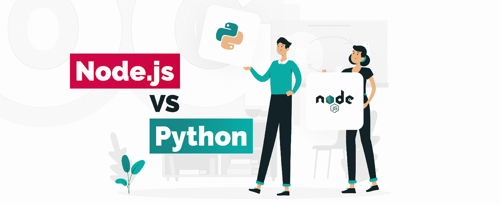
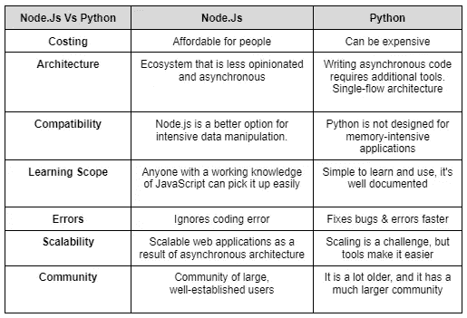

# Node Js Vs Python:你的产品需要哪种后端技术？

> 原文：<https://blog.devgenius.io/node-js-vs-python-which-backend-technology-does-your-product-requires-2e233e1c9493?source=collection_archive---------8----------------------->

**Nodejs vs python** ，你的产品需要哪种后端技术？由于普遍的市场需求，印度的几家应用开发公司已经开发了有助于产品开发的技术。产品开发过程的一个重要方面是选择满足您业务需求的正确技术。

然而，对于像 Node 和 Python 这样的后端开发技术，选择适合您的长期和短期目标的技术可能会变得具有挑战性。然而，如今最受欢迎的选择之一是**节点。JS & python。**这篇文章详细介绍了这些技术的用途，以及它们如何适用于您的产品。

**图片来源:** [科技魔术](https://www.techmagic.co/blog/node-js-vs-python-what-to-choose/)

# 选择您的技术

为您的产品选择正确的技术对其成功至关重要。如果你在寻找一个不会倾家荡产的高性能解决方案，Node.js 是一个很好的选择。然而，如果您需要尽可能最好的性能，Python 是一个不错的选择。

为您的产品选择正确的技术非常重要。你总是可以 [**雇佣一个节点开发者**](https://www.valuecoders.com/best-magento-ecommerce-development-services-company-india) 来帮助你的产品获得更好的结果。那么如何决定哪一款适合自己的产品呢？

在决定是否需要雇用节点开发人员时，需要考虑以下几点:

1)哪种数据需要存储在您的数据库中？

2)您的数据库中需要存储多少数据？

3)安全性对您来说重要吗？

4)一次会有多少用户访问网站？

2)如果您需要少于 100MB 的数据，用户群是 50 还是 5000 可能并不重要。

如果你没有具体需求，最好是**雇佣一个 node js 开发者**来帮你选择哪种后端技术最适合你的产品。

*也可阅读:* [*使用 NodeJS*](https://www.valuecoders.com/blog/outsourcing-and-off-shoring/top-10-advantages-of-using-nodejs/) 的十大优势

# 你的产品更适合 Node 吗？Js 还是 Python？

Python 是一种很棒的通用语言，但它可能不是您产品的最佳选择。Node.js 是一种流行的**后端技术**，以快速和可伸缩而闻名。如果你不确定使用哪种技术，你可以聘请**[**node js development company**](https://www.valuecoders.com/node-js-development-company-india)**来指导你做任何这样的决定。****

****以下是在 Node.js 和 Python 之间进行选择时需要考虑的一些事情:****

*   ****如果您的产品需要在短时间内传输或检索大量数据，Node.js 将为您提供速度****
*   ****Node.js 开发人员也有助于提高可伸缩性，因为 Node.js 同时处理请求，而不是像 Python 或 Ruby on Rails 那样一次处理一个请求****
*   ****你还需要考虑你的代码是否会是事件驱动的，实时数据处理是否重要；节点。Js 比 Python 更适合这种类型的环境，因为它具有异步能力****

****在社区支持方面，node js 再次获胜，因为更多的人在使用它，所以如果有必要，更容易找到 Node Js 开发人员。****

# ****为什么使用 Node.js 作为你产品的后端技术？****

****后端技术**有很多**，但是 node.js 是你产品后端技术的一个很好的选择。它快速、可扩展且高效。node.js 是产品后端技术的最佳选择，这有几个原因。****

****Node.js 也很容易学习，并且在开发人员社区中相对流行，这使得它成为您的产品后端开发的可靠选择。就整体代码复杂性而言，它比 Python 更具可伸缩性，因为它会随着产品的增长而增长。****

****与 Python 相比，它的一个主要优势是 Node.js 使用的资源更少，这意味着在共享服务器平台上，应用程序的性能更高，用户的响应时间更快。也就是说，它可能更适合构建后端模块，而不是复杂的应用程序或有大数据需求的产品，因为 Node.js 用于大数据处理的库比 Python 少。****

*****必读:* [*Node.js 对于实时应用开发:为什么是个好选择*](/node-js-for-real-time-application-development-why-its-a-good-choice-3486a8fe6759)****

# ****为什么使用 Python 作为你产品的后端技术？****

****Python 对于初学者来说很容易学习，并且有许多模块和库，允许健壮的后端开发。Python 在开发社区中很受欢迎，因此寻找开发您产品的人才应该不难。如果你在印度寻找 node js 开发公司，有很多不错的选择。****

****这是另一种流行的后端技术，经常用于电子商务网站。另外，它很容易阅读，所以如果你知道如何用 Python 编码，你会发现学习新语言很容易。您可以使用 Python 来构建快速且可扩展的产品，以满足您的用户今天的期望，并在未来与他们一起成长。****

****您可以使用各种可用的框架和库构建任何东西，从成熟的应用程序到小型脚本。最重要的是，Python 足够灵活，可以满足任何需求或功能——它具有命令式和面向对象的编程风格。****

# ****你的产品更适合 Node.js 还是 Python？****

****作为印度的一家 node js 开发公司，我们经常被问到哪种后端技术最适合某个特定的产品。答案当然取决于产品。****

****以下是决定时需要考虑的一些因素:****

*   ****你的应用需要处理什么类型的数据？****
*   ****最终用户将在任何给定时间处理多少数据。****
*   ****你希望用户如何与你的应用程序互动(手机、网络)？—您希望世界各地的用户还是特定地区的用户使用它？****
*   ****你对开发人员的预算是多少？****

****虽然有便宜的 **Node.js 开发者**，但是你应该记住某些东西总是比其他东西贵(例如，通过服务器发送和检索数据永远不会是免费的)。****

****Python 开发是昂贵的，并且不是所有的公司/开发者都适合你的预算。如果你想从[经验丰富的 python 开发者](https://www.valuecoders.com/hire-developers/hire-python-developers)那里寻找高质量的工作，通常投资更多是值得的。如果你的预算不多，Node.js 会是一个很好的解决方案。如果竞争激烈，你应该致力于打造更好、更高效的产品。****

*****又读:* [*十大 NodeJs App 开发公司*](https://www.valuecoders.com/blog/technology-and-apps/top-node-js-app-development-companies/)****

# ****节点间的对比分析。Js 和 Python****

********

****你选择的后端技术将取决于你对它的适应程度。例如，如果您第一次使用 Node.js 或 Python，坚持使用其他语言可能是明智的，因为这些语言需要不同的编码风格，这可能需要一些时间。****

*****你可能会觉得这个很有意思:* [*PHP vs. Node。JS:后端开发哪个好？-信息图*](https://www.valuecoders.com/blog/technology-and-apps/php-vs-node-js-which-is-better-for-backend-development/)****

# ****使用这两种技术****

****如果你需要一个大型社区的简单易学的语言，用 Python 吧。如果你想两全其美，就使用这两种技术吧！Node 非常适合低延迟需求，Python 非常适合没有太多请求的情况。****

****总之，更多的是你的个人喜好，而不是其他。当决定哪种后端技术适合你的产品时，请记住许多不同的因素都在起作用，所以在做决定之前要仔细考虑。****