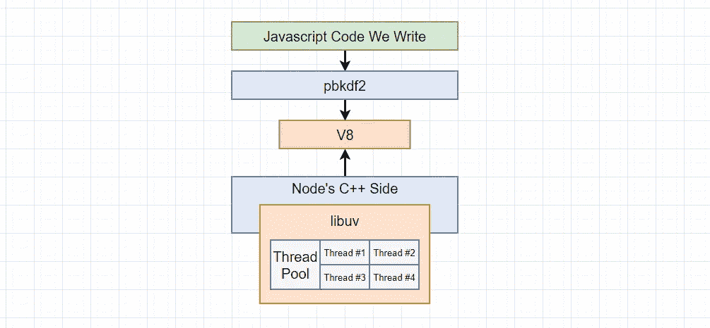
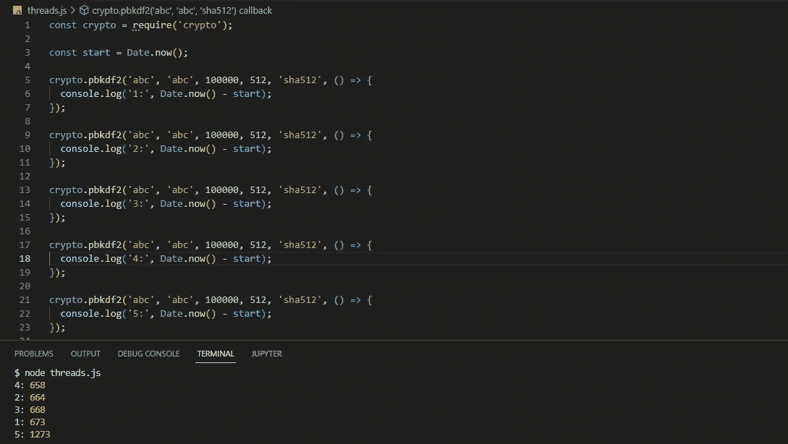
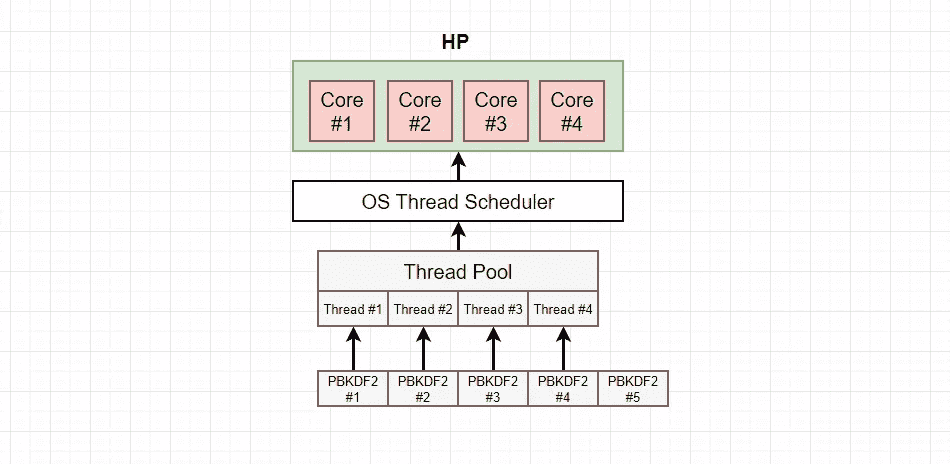
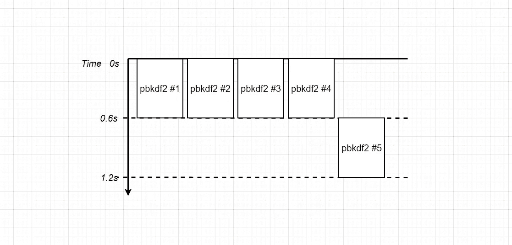
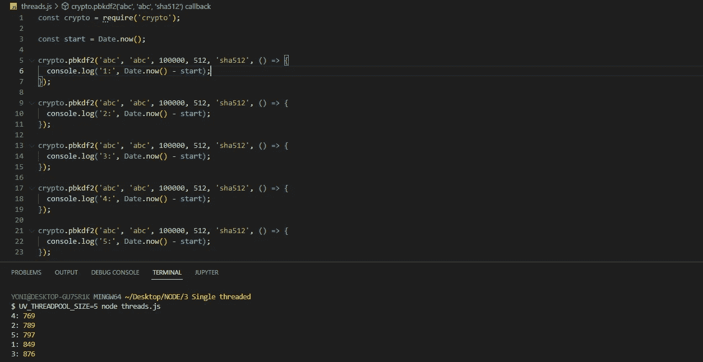
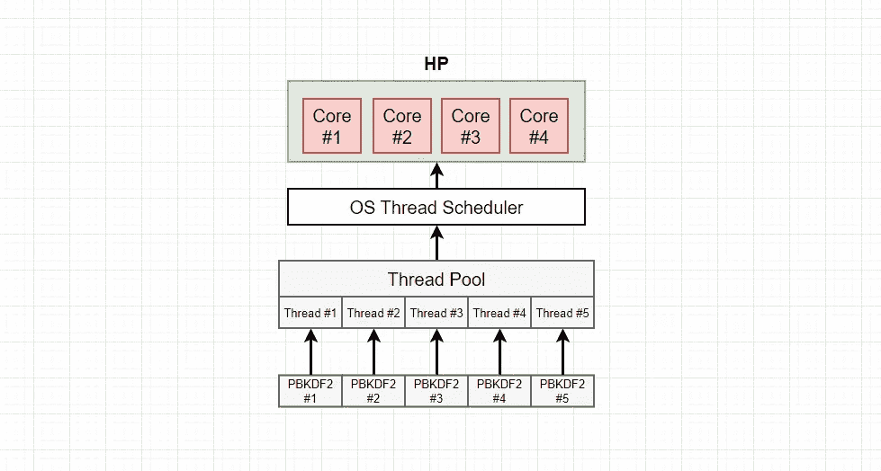

# Nodejs 和 libuv 的线程池

> 原文：<https://blog.devgenius.io/nodejs-and-libuvs-thread-pool-69b2cc225738?source=collection_archive---------3----------------------->



在上一篇[帖子](/node-is-not-single-threaded-d73fa6a1450a)中，我们谈到了 **libuv** 如何提供一个**线程池**来卸载在非常昂贵的函数调用上完成的工作。在这篇文章中，我们将检测这四个为我们自动创建的线程的存在。

让我们再复制粘贴三次 **PBKDF2** 散列函数并运行它。



我们得到第一个**四个**结果，稍作停顿，然后第五个结果突然出现**。**

我们可以使用这些结果来推测一些关于**线程池**及其工作原理的信息。

一个小提示。根据您机器的 **CPU** ，您可能会在这里看到一些不同的结果，这完全是 **OK** 。让我给你解释一下我的电脑是怎么回事，然后你也可以推断出你自己的电脑是怎么回事。

首先，注意第一个**四个**电话都花了完全相同的时间，它们花的时间与之前(之前[帖子](/node-is-not-single-threaded-d73fa6a1450a)上)的时间大致相等。

我希望您注意的第二件事是，第五次**呼叫花费了额外的 0.6 秒。**

我要给你看一张我的电脑图。通过理解我的计算机内部的硬件，我们将对为什么我们在所有这些函数调用中看到不同的计时有更好的理解。



我的电脑有一个四核处理器。另外，记住默认情况下 **libuv** 会创建**四个线程。**

对 **PBKDF2** 的第一个**四个**调用各自被分配到**线程池中各自的**线程**。**然后这些**线程**中的每一个都在 CPU 的**一个**内核中执行。

一旦这些都完成了，前四个任务也完成了，node 就可以继续进行第五个**函数调用了。因此，可能该内核被分配给**四号线程**，然后四号线程被分配给**二号内核**。这就是第五**功能**延迟执行的原因。**



我们现在要继续前进一点，弄清楚我们如何使用和定制**线程池**。

我们将添加一点代码来处理一些线程，这些线程是在我们启动程序时创建的。

运行 threads.js 文件时，我将更新一个环境变量。所以我会像这样运行它。

```
UV_THREADPOOL_SIZE=5 node threads.js
```

链接:[https://nodejs.org/api/cli.html#uv_threadpool_sizesize](https://nodejs.org/api/cli.html#uv_threadpool_sizesize)

这将告诉 **libuv** 每当它创建线程池时，它应该在那里创建**五个**线程。



这次看起来花了一段时间，但当它最终解决时，总共花了大约 0.75 秒，所有事情几乎在同一时间完成。

我们现在的情况是这样的。



我们有与散列函数调用数量相等的线程数量。因此，每个散列函数调用都会立即分配到自己的线程。

我们的 CPU 可以使用它内部的所有内核在多个线程之间处理工作。操作系统调度程序决定了如何平衡所有可用内核背后的工作。所以在一天结束时，所有五个线程获得大致相等的 CPU 时间。这就是为什么我们同时看到了所有的东西。

一个内核处理一个哈希需要 0.6 秒。因此，当我们同时有五个哈希时，用四个内核计算大约需要 0.75 秒。

这就是这篇文章的内容。在下一篇文章中，我们将看到集群和工作线程，所以请务必关注。