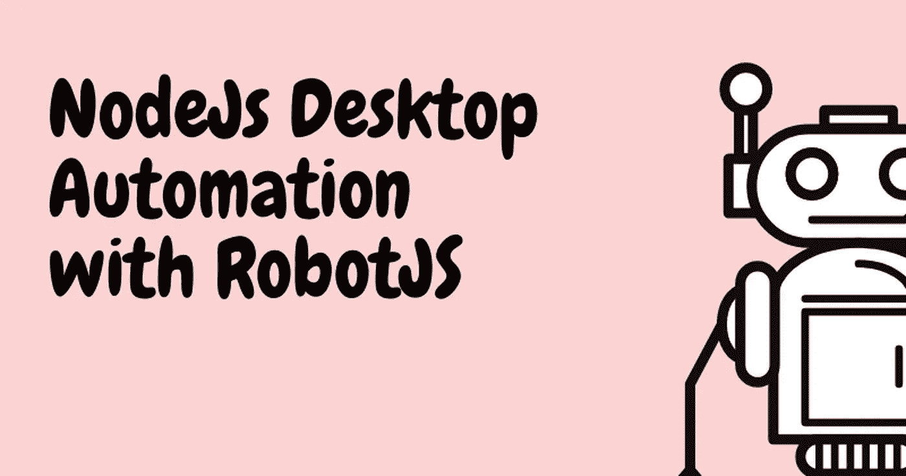

# NodeJS 桌面自动化与 RobotJS，(但与一个程序，可以让你 h̶i̶r̶e̶d̶被解雇😄)

> 原文：<https://blog.devgenius.io/nodejs-desktop-automation-with-robotjs-but-with-a-program-that-could-get-you-h%CC%B6i%CC%B6r%CC%B6e%CC%B6d%CC%B6-fired-9f9fd4641d92?source=collection_archive---------18----------------------->

不久前，我看到了一个名为“软件工程师的一天”的 meme 视频，其中工程师编写了一个脚本，让他的电脑自动打开，打开 Slack，并在他睡觉时定期移动鼠标，以使其看起来像是在同时在线和工作。



我们将使用[RobotJS 模块](【http://robotjs.io/】)用 NodeJS 编写一个类似的程序。RobotJS 是一个跨平台的桌面自动化库。

这只是出于教育目的。😊

# 步伐

*   运行`npm install yargs robotjs`安装所需的依赖项。
*   创建一个`app.js`文件并粘贴下面的代码。(我来解释代码):

```
// app.js
const yargs = require("yargs");
const { hideBin } = require("yargs/helpers");const arg = yargs(hideBin(process.argv))
  .command("$0 [interval]", true, (yargs) => {
    yargs
      .positional("interval", {
        type: "number",
        describe: "the interval in second",
      })
      .default("interval", 60); // 60 seconds default
  })
  .usage("runs a desktop automator to run key your  mmouse move at interval")
  .example(
    "$0 -mk 3",
    "moves the mouse and press the keyboard after three seconds"
  )
  .option("m", {
    description: "enable the mouse",
    type: "boolean",
  })
  .option("k", {
    description: "enable the keyboard",
    type: "boolean",
  })
  .default("m", true)
  .help("h").argv;
```

上面的代码配置了我们的应用程序需要的参数选项，还定义了一个 CLI 接口来描述运行`node app.js -h`时的应用程序。我们将选择只运行键盘按键('-k ')、鼠标移动('-m ')或两者都运行('-mk ')，并以秒为单位定义事件的时间间隔。我在这里写了一篇关于解析 NodeJS CLI 参数的文章。

*   我们将定义布尔变量来确定要执行的操作:

```
let is_both;
let is_mouse;
let is_keyboard;
```

*   接下来，我们将定义移动鼠标和按键盘的函数:

```
function moveMouseBackAndForth() {
 robot.moveMouseSmooth(200, 200);
  robot.moveMouseSmooth(400, 400);
}function pressKeyBoard() {
  robot.keyTap("shift");
}
```

*   然后我们将根据传递的参数调用函数。整个代码将如下所示:

```
const yargs = require("yargs");
const robot = require("robotjs");
const { hideBin } = require("yargs/helpers");let is_both;
let is_mouse;
let is_keyboard;const arg = yargs(hideBin(process.argv))
  .command("$0 [interval]", true, (yargs) => {
    yargs
      .positional("interval", {
        type: "number",
        describe: "the interval in second",
      })
      .default("interval", 60); // 60 seconds default
  })
  .usage("runs a desktop automator to run key your  mmouse move at interval")
  .example(
    "$0 -mk 3",
    "moves the mouse and press the keyboard after three seconds"
  )
  .option("m", {
    description: "enable the mouse",
    type: "boolean",
  })
  .option("k", {
    description: "enable the keyboard",
    type: "boolean",
  })
  .default("m", true)
  .help("h").argv;let { m, k, interval } = arg;
// multiply seconds by 1000 to get milliseconds
interval = interval * 1000;if (m && k) is_both = true;
else {
  if (m) is_mouse = true;
  else if (k) is_keyboard = true;
}function moveMouseBackAndForth() {
  robot.moveMouseSmooth(200, 200);
  robot.moveMouseSmooth(400, 400);
}function pressKeyBoard() {
  robot.keyTap("shift");
}if (is_both) {
  setInterval(() => {
    moveMouseBackAndForth();
    pressKeyBoard();
  }, interval);
} else if (is_keyboard) setInterval(pressKeyBoard, interval);
else {
  setInterval(moveMouseBackAndForth, interval);
}
```

*   每隔 3 秒运行`node app.js -m 3`移动鼠标。

感谢您通读。你愿意让程序做别的事情而不是按键盘吗？

> 你可以从这个 [Github gist](https://gist.github.com/zt4ff/741c98081f5802997fca1244b0a1b6bf) 中得到代码。

我将感谢您的反馈和问题。