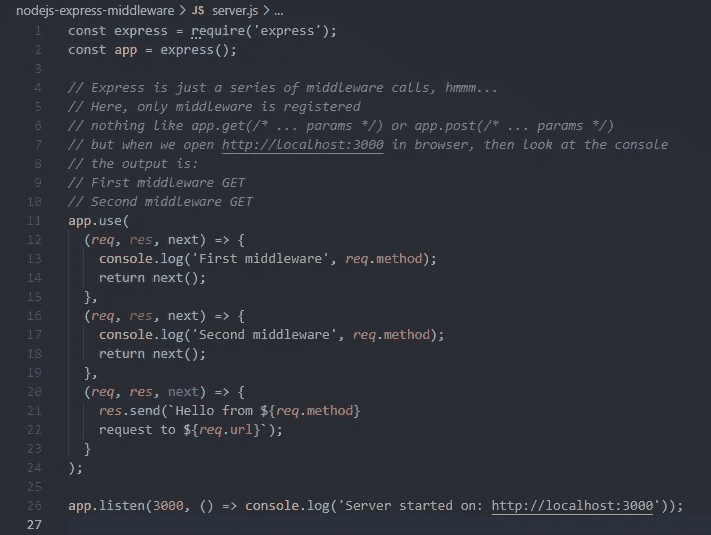

# NodeJS 快速中间件

> 原文：<https://blog.devgenius.io/nodejs-express-middleware-2815cd93a73d?source=collection_archive---------6----------------------->

Express 应用程序本质上是一系列中间件功能调用。“我认为这是一个有趣的说法，它实际上是如何工作的？



NodeJS Express 中间件调用—程序代码

# 快速路由

路由是我们在 express 中学习的第一件事，它看起来像这样:

```
const express = require('express')
const app = express()app.get('*', (req, res) => res.send('hello world'))app.listen(3000, () =>
  console.log(
    'Server is running on: [http://localhost:3000](http://localhost:3000)'
  )
)
```

我们学到第二件事是，这就是你如何声明 GET 请求路径。

然后，我们学习 POST 请求，它们看起来像这样。

```
const express = require('express')
const app = express()app.get('*', (req, res) => res.send('hello world'))
app.post('/user', (req, res) => {
  /* Logic to add user */
})app.listen(3000, () =>
  console.log(
    'Server is running on: [http://localhost:3000](http://localhost:3000)'
  )
)
```

然后我们想，好吧，这些是路线，路线是由 app.get 或 app.post 等声明的…

但是当我们看到这样的代码示例时，我们会感到困惑。

```
const express = require('express')
const routes = require('./routes')
const app = express()app.use('/', routes.index)app.listen(3000, () =>
  console.log(
    'Server is running on: [http://localhost:3000](http://localhost:3000)'
  )
)
```

我对这个 app.use 的想法是，这不是一条路线，因为它没有使用 app.get 或 app.post 或任何其他类似的东西。那是什么呢？

我们不需要这个问题的答案，我们需要回答这个问题:这个中间件到底是什么？它在哪里？

# 快速中间件

既然 express 只是一系列的中间件，那我们就做一个 ***只有*** 有中间件的 app 吧。

```
const express = require('express');
const app = express();*// Express is just a series of middleware
// calls, hmmm...
// Here, only middleware is registered
// nothing like app.get(/* ... params */)
// or app.post(/* ... params */)
// but when we open
// http://localhost:3000 in browser,
// then look at the console
// the output is:
// First middleware GET
// Second middleware GET*app.use(
  (*req*, *res*, next) => {
    const method = req.method
    console.log('First middleware', method);
    return next();
  }, (*req*, *res*, next) => {
    const method = req.method
    console.log('Second middleware', method);
    return next();
  }
);app.listen(3000, () =>
  console.log(
    'Server started on: [http://localhost:3000](http://localhost:3000)'
  )
);
```

现在我们一个 app，浏览器一打开，这些中间件就跑了。我们没有路由，但是中间件在运行。

这很有趣，因为如果没有声明路由，服务器如何知道处理哪些路由？很简单，处理所有请求，或者用一种恰当的方式来表达，对每个请求运行非路由处理程序。

在浏览器中打开下一个 URL:

*   [http://localhost:3000](http://localhost:3000)
*   [http://localhost:3000/ASD](http://localhost:3000/asd)
*   [http://localhost:3000/ASD/dfg](http://localhost:3000/asd/dfg)

对于其中的每一个，我们都有这样的输出:

```
First middleware GET
Second middleware GET
```

这太神奇了，这意味着我们甚至不用处理请求就可以访问**请求**和**响应**对象。

下面是通过中间件对 ***【路由处理器】*** 的模拟。

```
const express = require('express');
const app = express();*// Express is just a series of middleware
// calls, hmmm...
// Here, only middleware is registered
// nothing like app.get(/* ... params */)
// or app.post(/* ... params */)
// but when we open
// http://localhost:3000 in browser,
// then look at the console
// the output is:
// First middleware GET
// Second middleware GET*app.use(
  (*req*, *res*, next) => {
    const method = req.method
    console.log('First middleware', method);
    return next();
  }, (*req*, *res*, next) => {
    const method = req.method
    console.log('Second middleware', method);
    return next();
  }, (req, res, next) => {
    res.send(
      `Hello from ${req.method} 
      request to ${req.url}`
    )
  }
);app.listen(3000, () =>
  console.log(
    'Server started on: [http://localhost:3000](http://localhost:3000)'
  )
);
```

如果我转到[http://localhost:3000/ASD](http://localhost:3000/asd)，我会看到***“Hello from GET request to/ASD”***，然后如果我转到控制台，我会看到:

```
First middleware GET
Second middleware GET
```

# 结论

在 express 中，要扩展功能，只需添加中间件。如果我们需要每个请求的通用行为，这就是我们需要的。

完整的例子可以在[https://github . com/srele 96/sk-experiments/tree/develop/nodejs-express-middleware](https://github.com/srele96/sk-experiments/tree/develop/nodejs-express-middleware)找到。