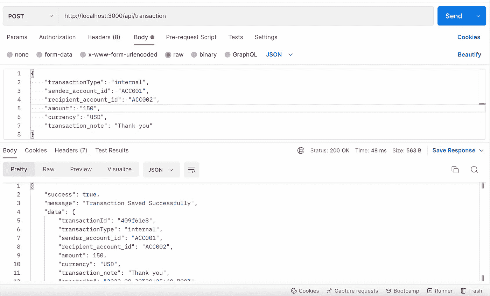
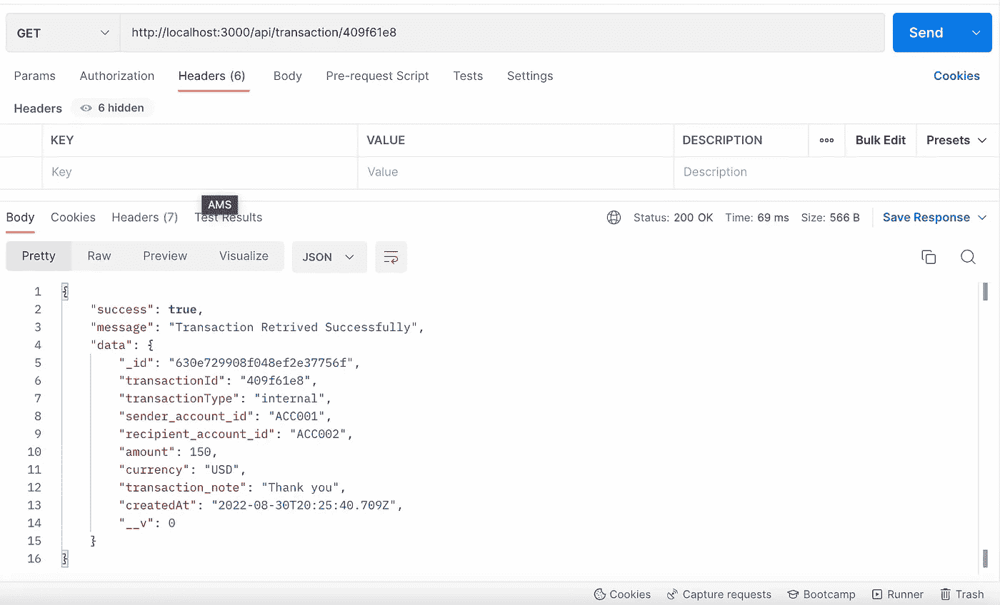
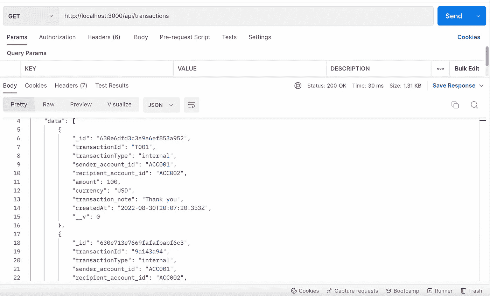
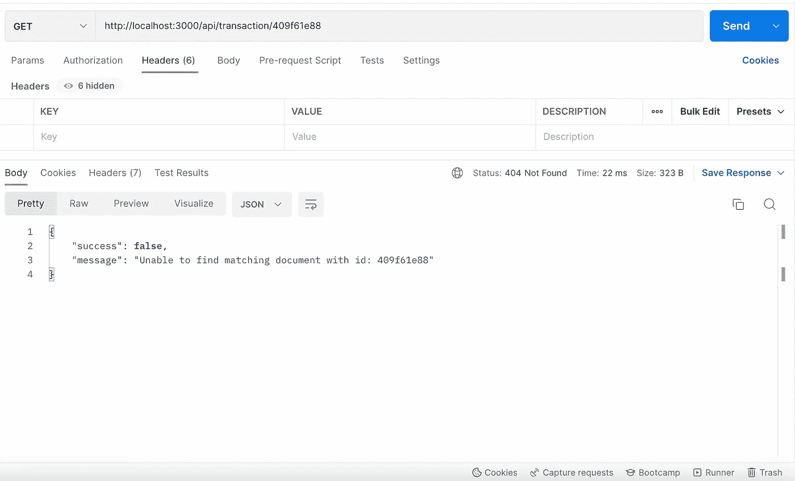

# NodeJS 网关—第 2 部分:设置我们的数据库(MongoDB)

> 原文：<https://blog.devgenius.io/nodejs-gateway-part-2-setting-up-our-database-mongodb-f947e5746a4b?source=collection_archive---------11----------------------->


[Rubaitul Azad](https://unsplash.com/@rubaitulazad?utm_source=unsplash&utm_medium=referral&utm_content=creditCopyText) 在 [Unsplash](https://unsplash.com/s/photos/mongodb-and-typescript?utm_source=unsplash&utm_medium=referral&utm_content=creditCopyText) 上拍摄的照片

NoSQL 数据库使得用基本模式开始开发你的项目或应用程序变得容易，并且由于一致性可以用这种类型的数据库跳过，随着我们的变量和交互的增加，扩展变得容易，这就是为什么我们使用 MongoDB 作为我们的网关。这也是因为 API 应用程序(参考下面关于我们正在构建的项目的链接)将是保存所有最终事务或交互数据(Postgres)的应用程序。

如果您对我们正在开发的内容感到困惑，请访问下面的链接:

[](https://medium.com/@nkunzecaleb/how-i-build-a-payment-gateway-using-javascript-2e4f3e52b7cd) [## 我如何使用 Javascript 构建支付网关。

### 在我的大学/学院学习之后(大约 5 年前)，我渴望建立一个项目，不仅是为了创收…

medium.com](https://medium.com/@nkunzecaleb/how-i-build-a-payment-gateway-using-javascript-2e4f3e52b7cd) 

在前一篇文章(第 1 部分)中，我们能够将`mongodb`和 mongose`npm`模块添加到网关中。在这篇文章中，我们将专注于创建集合的模式，保存、检索、更新和删除数据库集合中的数据。

如果您想知道什么是集合，您可以将它们与 SQL 数据库中的表或关系相关联。因为 NoSQL 数据库是由类似 JSON 文档类型的数据库组成的非表格数据库，而 MongoDB 是其中的一部分。因此，记录(在 SQL 数据库中)或条目是 NoSQL 中的文档，集合是一组文档(记录)。我希望这不会引起混淆。你可以在这里查看更广泛的解释 [NoSQL 解释](https://www.mongodb.com/nosql-explained)、 [TechTarget](https://www.techtarget.com/searchdatamanagement/definition/NoSQL-Not-Only-SQL) 和 [NoSQL 数据库](https://www.couchbase.com/resources/why-nosql)。

我们将看到为一个基本的演示内部(app)传输事务插入数据，该事务具有`transaction_id` `transaction_type` `sender_account_id` `recipient_account_id` `amount` `currency` `transaction_note`然后是`date_time`。

首先，我们将从创建一个模式开始，简单地说，这个模式就是要保存在数据库中的数据的格式。让我们继续为我们的事务数据创建一个模型文件`transactionModel.ts`,并添加以下代码。

从代码中，我们看到除了可选的交易记录之外，所有的输入都是必需的。在定义了模式`transactionSchema`之后，我们在第 13 行创建了`transactionModel`，它将用于搜索、保存和检索交易相关数据。请记住，这是基本的，我们将继续添加更多的值或变量。

让我们继续测试我们的模型，看看我们是否可以从数据库中保存和检索数据。为此，我们将创建 3 个路由来保存和检索我们的事务数据。

*   `POST /api/transaction`创建交易
*   `GET /api/transaction/:id`获取单笔交易的交易数据
*   `GET /api/transactions`获取所有交易

这部分更多的是关于数据库，所以我们不会深入到路线。现在，我们可以用基本的路由来测试我们的模式。为此，我们将添加一个`body-parser`模块，它将帮助我们制作一个中间件，将我们的请求数据转换为 JSON 格式进行存储。使用下面的命令。

```
npm install body-parser --save
```

现在我们可以将下面的代码添加到我们的`app.ts`文件中

```
const bodyParser = require('body-parser');app.use(bodyParser.json());
app.use(bodyParser.urlencoded({ extended: true }));
```

所以我们有看起来像这样的`app.ts`

然后我们在 routes 文件夹中创建一个`transactions`路由文件`transactions.ts`。最后，我们将下面的代码添加到它:

您可以运行`npm run start`来构建并启动我们的服务器。

从上面的代码中，保存通过对收到的请求体数据调用`mongoose start()`函数而创建的事务，并且当保存过程成功或失败时，这将向客户端发送回一个响应。请看下面来自《邮差》的截图。



保存交易明细的过帐请求(成功)

为了获得一个事务，我们在 route 中传递了`id`参数，该参数用于搜索类似于在事务创建期间生成的`transactionId`的事务。请看下面来自《邮差》的截图。



检索单个事务的 GET 请求(成功)

然后，我们还可以通过在 mongoose 的`find()`函数中不传递任何参数来查询所有要返回的事务。请看下面来自《邮差》的截图。



检索所有事务的 GET 请求(成功)

在 postman 中，失败的操作将如下所示。



检索单个事务的 GET 请求失败。

这一路走来做得很好，我们已经看到了我们将如何与我们的数据库交互，在其他部分，我们将看到从数据库中修改和删除我们的数据。

我想再次感谢你完成这篇文章，你可以鼓掌，甚至跟随我看更多这样的文章，因为我穿越了我创建支付网关的旅程。请随时纠正我的错误。学习是要走的路。

接下来，我们将着眼于路由、中间件，希望还有控制器。我试着让这些尽可能短，以避免一口气有一个完整的教科书🤩。

如果你想看到完成的代码(到目前为止)，你可以使用下面的链接从 repo 获得。

[](https://github.com/Cank256/payie) [## GitHub - Cank256/payie:支付解决方案项目

### 支付解决方案项目。在 GitHub 上创建一个帐户，为 Cank256/payie 开发做贡献。

github.com](https://github.com/Cank256/payie) 

直到下一个帖子😎。