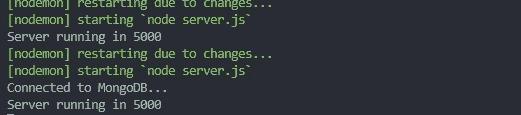

# NodeJS—制作完整的身份验证 API —完整指南

> 原文：<https://blog.devgenius.io/nodejs-make-full-authentication-api-the-complete-guide-76ef3215ed68?source=collection_archive---------0----------------------->


NodeJS —完全身份验证—完整指南

嗨朋友们，让我们再来谈谈 NodeJS。

在我们谈论我们的主要话题之前，我上周刚刚写了一篇文章，也谈到了 NodeJS。实际上，我推荐你阅读这篇文章，因为我们要实现文章中的代码，好吗？以下是链接:

[](https://medium.com/dev-genius/nodejs-make-your-api-response-nicely-f562f78cb67) [## NodeJS——让您的 API 响应更加完美

### 嗨，朋友们，自从一年前我写了一篇关于 Laravel API 的文章已经有一段时间了，下面是这篇文章，我写于…

medium.com](https://medium.com/dev-genius/nodejs-make-your-api-response-nicely-f562f78cb67) 

但是如果你不读那篇文章，我将在这篇文章中解释一下那篇文章。

# 遵循这篇文章的要求

1.  非常基础的 JavaScript。
2.  非常基础的 NodeJS / ExpressJS。
3.  非常基础的 API。
4.  非常基础的 MongoDB。
5.  非常基础的 MVC 模式(常用 JavaScript)。你不需要知道。

# 跟随这篇文章的必备工具

## 1.NodeJS

重要的是 **NodeJS** 本身，你可以在这里下载(【https://nodejs.org/en】T2)。我推荐安装 **LTS** 版本，我目前用的是 v12.2.0 *。*

## 2.邮递员

Postman 是一个强大而友好的用户界面应用程序，可以在这里下载([https://www.postman.com](https://www.postman.com/))。

## 3.文字编辑器

有很多文本编辑器，我更喜欢使用可以在这里下载的**vs code**([https://code.visualstudio.com](https://code.visualstudio.com/))。
如果你想使用像 **Sublime Text** 或 **Atom 这样的文本编辑器，没关系，**只需选择适合你的工具。

## 4.MongoDB

MongoDB 是一个 NoSQL 数据库，我使用它是因为它更适合于 ExpressJS，并且开发速度更快，尤其是当你与数据库本身交互时。你可以在这里下载 MongoDB([https://www.mongodb.com/try/download/community](https://www.mongodb.com/try/download/community))。只是想让你知道，我们只是把它用于本地开发。

## 5.MongoDB 指南针(可选)

MongoDB Compass 只是用于管理我们的 MongoDB 的 GUI，因为有了 GUI，它与用户的交互更加友好。但是，如果你想使用其他工具，这很好。你可以在这里下载(【https://www.mongodb.com/products/compass】T21)。但对你来说是完全可以选择的。

# 主要事物

> 首先，这篇文章将会又长又复杂，但是它的每一步都会被解释，所以你可以完全理解发生了什么。
> 
> 但是鉴于这篇文章的复杂性，我想让这篇文章更简洁，更容易理解和实现。
> 
> 我将使用 **MVC** 模式制作这个 ExpressJS 项目，但是这个 MVC 模式不会是一个类，它将是一个普通的 JavaScript。所以，如果你不知道什么是 MVC，不要担心，我会在这篇文章中解释。
> 
> 如果你想知道什么是 MVC，MVC 是**模型视图控制器**，是一种设计模式，使我们的代码更加结构化和更加可读，但是，在本文中，我们不会使用**视图**，因为我们只是要制作 API，而 API 不需要**视图。**
> 
> 事实上，我要为这篇文章做一本电子书，但是，我只是在媒体上做。
> 
> 希望你喜欢阅读这篇文章！

# 我为什么写这篇文章

老实说，我只是想为 NodeJS 或 ExpressJS 做一个入门或样板。这样我就不会重新创建一个新的项目，也不会像之前的项目那样重新编写相同的代码。

我写这篇文章的另一个原因是为了节省时间。为什么？因为如果你想用相同的文件夹结构和相同的流程开始一个新项目，你只需要克隆或下载启动项目，并在那里开始编写你自己的东西。

# 读完这篇文章你会得到什么

当然，完全认证 API 包含:

1.  注册。
2.  验证帐户。
3.  登录。
4.  重新发送新的验证令牌。
5.  获取经过身份验证的用户。
6.  忘记密码。
7.  重置密码。

通过阅读这篇文章，你将得到 6 个主要的东西，我们将使它在我们的代码中更容易实现。有趣吧？让我们跳！

# 我们开始吧

我假设你已经安装了我提到的 5 个工具。好吧，让我们编码！

## 1.制作项目文件夹

我将通过创建一个名为 **BE_FULL_AUTH_EXPRESS** 的文件夹来开始这个项目，这是我命名文件夹的方式，它代表**后端完全认证 ExpressJS** 。实际上这并不重要，这取决于你。并转到您的项目文件夹。

## **2。Init package.json**

什么是 **package.json？**简单来说，就是一个包含你的 app 信息的文件。要初始化 **package.json** ，只需在您的终端/ CMD 中键入以下代码:

```
npm init -y
```

## 3.安装依赖项

在这里，我们将为我们的项目安装一些依赖项，为此只需运行以下代码:

```
npm i -S express config jsonwebtoken bcryptjs mongoose express-validator
```

让我们迭代将要安装包。

*   **express** 是 Node.js 的 web 应用框架。
*   config 是一个包，用来处理我们内置的 JSON 数据，或者处理我们的私有数据。
*   jsonwebtoken 是一个包，用于处理我们的令牌，以便对服务器进行身份验证，并对某个服务器进行身份验证。如需进一步阅读，请点击这里(【https://jwt.io/】T2)。
*   **bcryptjs** 是一个用于散列我们的纯文本密码的包，使它更加安全。
*   mongose 是一个 ORM，用于以一种简单的方式与我们的 MongoDB 交互。
*   express-validator 是一个用于处理我们身体反应的包，在其中进行一些验证。

## 4.安装开发依赖项

安装完依赖项后，我们将安装开发依赖项。好吧，那有什么区别？**开发依赖关系**和**依赖关系**位于**开发**字处，很明显**开发依赖关系**只是针对我们的开发环境，不会在我们将应用程序部署到实际服务器时安装，希望这是有意义的。要安装开发依赖项，我们只需键入:

```
npm install -D nodemon
```

让我们迭代将要安装的包。

*   nodemon 是一个用于处理我们的 ExpressJS 服务器的包，如果我们的服务器代码有任何变化，将会自动重新启动服务器。

## 5.准备文件夹结构

我们将准备我们的文件夹结构，所以，文件夹结构将看起来像这样。


文件夹结构

我会解释那些文件夹的。

*   **app** 一个文件夹包含我们的主要应用文件夹。
*   **控制器**一个用于处理我们的控制器的文件夹。
*   **助手**一个文件夹来制作可重复使用的功能。
*   为我们的应用程序制作中间件的文件夹。
*   **models** 一个文件夹，包含与数据库交互的模型。
*   用于处理我们私有凭证的文件夹。
*   **routes** 包含我们的应用程序路由的文件夹。

## 6.配置 package.json 文件

转到 **package.json** 用下面的代码复制并替换"**脚本**"对象:

package.json 的主要配置

## 7.在 server.js 文件中编写代码

在 **server.js** 文件中，键入以下代码:

server.js，应用的核心。

通过键入以下命令运行服务器:

```
// if you configuring package.json in step 5, you can
npm run server// or if you do not, you can simply
nodemon server
```

这是结果，这意味着，服务器正在运行。很好。


服务器正在运行

## 8.生成 responseApi.js 文件

我将为这个项目制作 **responseApi.js** 文件，并将它放在 ***app/helpers*** 文件夹*中。***response Api . js***是我们未来 API 的一个帮手，让它更加一致。这是代码。我正在写一篇关于这个的文章，我放在这篇文章顶部的链接。*

*responseApi.js，让我们的应用程序更加一致。*

## *9.正在连接到 MongoDB*

*在我们跳转到 **MVC** 之前，我们将建立一个到 MongoDB 的连接，在这种情况下，我们将使用 mongoose 进行交互。我将文件放在***config****文件夹中，并将其命名为 **db.js** 。代码会是这样的。**

**db.js，用于连接 MongoDB**

**在根文件夹中更新您的 **server.js** 文件，您的 **server.js** 文件应该如下所示。**

**更新了 server.js，第一部分。**

**并且检查你的终端，你的终端日志会是这样的。**

****

**连接到 MongoDB**

**这意味着，您的应用程序已经连接到 MongoDB，非常好。**

## **10.制作 User.js 模型**

**因此，我们要制作的第一个模型是 **User.js** ，我将把它放在***app/models/user . js****中。这个模型将与 MongoDB 交互。代码将如下所示。***

**用户模型**

## **11.制作 Verification.js 模型**

**我们将制作一个验证模型，这个验证模型将包含**令牌、类型、用户 Id、**和**创建日期**。所以，你想知道一个**令牌**、**用户 Id** 和**类型**是什么？**

*   ****令牌**代表一个唯一的密钥，用于验证我们的帐户，或者可能用于重置帐户密码。**
*   ****userId** 代表将要进行验证的用户的 Id。**
*   ****类型**，在本文中，该类型将用于分隔我们的验证流程，我们将要构建的验证流程是为了在用户尝试登录时验证我们的帐户或验证用户重置密码。**

**有道理吗？我将它命名为 **Verification.js** ，并将其放在 ***app/models*** 文件夹中。代码会是这样的。**

**验证模型**

## **12.制作 AuthController.js**

**在我们开始制作控制器之前，让我们先为控制器制作一些助手。我将把这个文件命名为 **common.js** ，并将它放在***app/helpers****文件夹中。代码将如下所示。***

***助手功能***

***在上面的代码中，我们只是做了一些函数来为我们的验证令牌生成一些随机字符串，简单吧？让我们继续前进！***

***对我们的注册端点进行验证。我将在***app/middleware***文件夹中创建名为 **auth.js** 的验证中间件。代码会是这样的。***

**认证中间件，用于验证注册端点**

**为什么我要进行验证？因为我们将在 **AuthController.js** 中定义一个验证。那我们就做控制器吧。**

**因此，我们要构建的第一个控制器是 **AuthController.js** ，我将把它放在***app/controllers/API/auth controller . js***。它将包含我们应用程序的完整认证流程，我们要做的第一个方法是**注册**。临时代码是这样的。**

**AuthController，第一部分**

****寄存器**的方法不言自明，其中:**

*   **用于注册新用户。**
*   **方法是**POST**at(***API/auth/register)***。**
*   **用户可以公开访问它。**

**这就是控制器，暂时它只包含注册方法，但我们将来会做得更复杂。**

## **13.制作 auth.js 路线**

**为了使控制器工作，我们必须制定一个路线，并在路线中实现我们的中间件。我将在 ***routes/api*** 文件夹中创建一个名为 **auth.js** 的文件。代码会是这样的。**

**我们只是在解构我们的控制器和中间件，并将导出的函数传递给路由。**

**最后一件事，更新 **server.js** 文件。 **server.js** 文件会是这样的。**

**server.js，第二部分。**

# **测试我们的注册端点**

**所以，我们只是做了一个**寄存器的**端点对吗？所以，我们要测试它是否真的有效。**

**我将使用 **Postman** 和 **MongoDB Compass** 来测试这一点。我将首先使用 **Postman** 点击 **register** 端点，并确保您的 MongoDB 连接到您的本地机器。**

**确保你的**邮递员**中的所有**头**都是这样的。**Content-Type/Application/JSON**头用于发送带有 Json 的请求，并且只接受 Json。**

****

**邮递员邮件头**

**因此，在设置了这些头之后，我转向了**主体**，并用它们填充请求主体。**

****

**注册工艺路线主体。**

**在我点击 **Postman 中的 **Send** 之后，**的响应会是这样的。**

****

**注册路线结果。**

**看到了吗？令人惊奇的是，我们刚刚得到了我们请求的结果，这里的主要内容是，我们得到了**用户**对象和**验证**对象，因为这是这里的主要内容。如果我们看一下 **MongoDB Compass** ，数据应该也在那里。如果您查看 MongoDB，您的密码应该被散列为一个随机字符串。**

**那么，我们谈论的**验证**怎么样呢？所以，这是结果。**

****

**注册验证路线**

**看，厉害！你也得到了认可，客人呢？如果你用相同的电子邮件地址注册，你会得到相同的验证响应，但是，它与来自 **express-validator** 包的原始错误响应略有不同。让我们继续前进！**

# **制定验证路线**

**现在，我们将为验证未验证的帐户创建一个验证路径。**

## **14.制定验证路线**

**将这段代码添加到您的 **AuthController.js** 中，放在导出的 **register** 方法的下面。**

**验证端点。**

****验证**方法有一目了然的地方，其中:**

*   **验证将要激活帐户的用户。**
*   **方法是**在(***API/auth/verify/:token)***处获取**。**
*   **用户可以公开访问。**
*   **有一个必需的参数请求，即**令牌**。**

**上面的代码是在我们的应用程序中验证未验证帐户的方法，代码很简单，端点方法是 GET，它里面有 param，称为**令牌**。**

****所以重点是，每次有新用户时，用户必须点击这个端点来验证他们的帐户。****

**之后，可以在***routes/API/auth . js****文件中更新路线。将代码更新成这样。***

***验证帐户途径***

# ***测试验证帐户路由***

***照例可以打开**邮差**进行测试。所以下面是如何查看那个**验证**端点的结果。***

> ***所以，事情是这样的，当你在**注册**端点注册账户后，你得到里面的**验证**数据的对象，我建议你复制那个验证**令牌**开始验证账户。或者，您可以检查您的 MongoDB。***

***所以我将验证令牌传递给了 params，让我们看看下面的结果。***

******

***验证帐户途径***

***就这么简单，你的账户就被激活了。如果您不确定数据是否已经更新，您当然可以在 MongoDB 中检查您的数据，但是，我非常确定，自从我们在 **Postman** 中点击这个 **verify** endpoint 以来，数据已经更新。它还应该从数据库中删除验证令牌。***

# ***创建登录路径***

***所以，在这里，我们要用 JWT 登录！会有多兴奋。我们走吧！***

## ***15.创建登录路径***

***在我们再次跳转到 **AuthController.js** 之前，我们要先设置我们的 JWT。首先，我们将制作一个 **JWT 密钥**用于与 **JWT** 交互，我们将把它放在我们的 ***config*** 文件夹中。因此，我们将在 ***config*** 文件夹中创建一个名为 **default.json** 的文件。代码应该是这样的。***

> **你可以用你自己定制的字符串来 **JWT 秘钥。****

```
**{ "jwtSecret": "thiIsJWTSecretKeyThatUserDoesntKnow"}**
```

**这只是一个简单的代码，但是你可以在 JSON 中添加更多的键，例如，你与数据库的连接，或者你可以存储用户名或密码，用于将来的默认开发，或者更多。所以别瞎折腾了。但是对于这篇文章，我只是用它来存储 **JWT 密钥**。**

**为了使用这个文件，我们称之为已经安装的**配置**包。让我们在 **AuthController.js** 中调用这个。代码会是这样的。**

```
**const config = require('config');**
```

**将其放在 **AuthController.js** 的顶行。我们以后会用到它。**

## **16.对登录路径进行验证**

**我将把它放在***app/middleware***文件夹内的 **auth.js** 文件中，并在代码中添加一个名为 **loginValidation** 的新导出代码，如下所示。**

**登录的验证途径**

## **17.更新授权路线**

**更新****routes/API***文件夹内的**auth . js***route，代码应该是这样的。****

***更新路线。***

***这就是更新的路线，只是简单的更新。***

## ***18.更新授权控制器***

***所以，让我们更新我们的控制器，简单地添加这个新的导出方法，代码应该是这样的。***

***更新的 AuthController***

*****登录**方法有不言自明的地方:***

*   ***将要登录的用户必须首先经过验证。***
*   ***方法是**在( ***api/auth/login)*** 发布**。***
*   **用户可以公开访问。**
*   **有两个必需的正文请求，即**电子邮件**和**密码**。**
*   ****JWT** 令牌过期 1 小时，在那里是 3600 毫秒。**

**上面的代码是一个在我们的应用程序中登录用户帐户的方法，代码很简单，但它更复杂，因为我们在那里做了一些逻辑，但是，我在那里做了一个注释，所以你可以理解那个方法在做什么。**

# **测试登录路径**

**现在，我将在 **Postman** 中测试**登录**路线，我将以我在 **register** 路线中创建的用户身份登录，结果如下。**

****

**测试登录路由。**

**在你点击发送之后，你会得到这样的回复。**

****

**登录路线结果。**

**我们刚刚登录。现在，看看上面的响应，我们首先使用激活的帐户登录，我们在主体中输入数据，发出请求，然后嘣！那是我们的认证令牌。如果你想在你的前端应用程序中使用这个令牌，那就太好了。但在本文中，我将只对一个端点使用该令牌，即**获得认证用户**路由，我们将在未来创建该路由。**

**如果您想要使用尚未验证的帐户登录，您将会收到此错误消息。**

****

**未验证的帐户错误**

**因此，这是用户尚未激活时的错误消息。验证响应与往常一样。你可以自己去查。**

# **重新发送新的验证令牌**

**我们为什么要做这个？所以，我以前遇到过这样的问题，当用户开始注册他们的帐户，但有时用户忘记了他有激活帐户的令牌，然后，用户用新的电子邮件地址创建了一个新帐户，对吗？在这种情况下，我们只是为**做这个端点以防万一。但是，它将来会有用的。希望有意义，让我们编码吧！****

## **19.AuthController 中的上次更新**

**实际上，这是我们要在 **AuthController.js** 中构建的最后一个方法。所以将这段代码添加到您的 **AuthController.js** 中。**

**重新发送验证方法**

****resendVerification** 方法有不言自明的地方，其中:**

*   **向想要激活帐户的用户重新发送新的验证数据。**
*   **方法是**在(***API/auth/verify/resend)***发布**。**
*   **用户可以公开访问。**
*   **有一个必需的正文请求，即**电子邮件**。**

**上面的代码用于在用户忘记在第一次注册后获得的第一个数据的情况下，向用户重新发送新的验证数据以激活帐户。正如我所说，这种方法是**以防将来**发生，但它也会对未来产生重大影响。**

## **20.更新 auth.js 路线**

**为了使 **resendVerification** 工作，我们将把路由添加到 ***routes/api*** 文件夹中的 **auth.js** 中。实际上我会在 gist 中写完整的代码，所以这里是完整的**auth . js**route**代码。****

**完整验证**

# **测试重新发送验证路由**

**现在，我将在 **Postman** 中测试 **resendVerification** 路线，我将以我在 **register** 路线中创建的用户身份登录，结果如下。**

****

**重新发送验证路由**

**如果你按下回车键，你会得到这样的回应。**

****

**重新发送验证结果**

**看到结果了吗？没错，我们正在制作新的验证数据，并替换以前的数据(如果有的话)。如果验证数据不存在，它将创建一个新的。这里有一个令牌，你可以用它来再次验证你的帐户，就这么简单。**

# **使获得认证的用户**

## **21.更新 auth.js 中间件**

**首先，我们要制作一些中间件来检查 JWT 令牌是否有效，为此我们只需在位于**app/middleware**文件夹中的 **auth.js** 内制作一个新的导出函数。下面是 **auth.js** 中间件的完整代码。我只是在这里添加了一个名为 **auth** 的新导出函数以及一些注释和新的包。顺便说一下，代码是不言自明的。**

**完全授权中间件**

## ****22。AuthController.js 中的最后更新****

**我们在这里进入了 **AuthController** 的结尾。在这里，我们将使用用户登录时获得的 **JWT** 令牌来创建一个获得认证用户的方法。我要让它变得非常简单，这是代码。**

**获取经过身份验证的用户方法**

****getAuthenticatedUser** 方法有一个不言自明的说明:**

*   **获取令牌的基于数据的有效负载。**
*   **方法是**获取**at(***【API/auth】***)。**
*   **用户不能公开访问。**
*   **用户必须拥有访问该方法的令牌。**

## ****23。auth.js** 路线中的最后更新**

**让我们更新我们的 **auth.js** 路线，这是路线的完整代码。我只是添加了一个新的中间件，我们只是在那里，并在其中添加了一个新的路由。**

**完整的授权路径。**

**如何使用那个 **getAuthenticatedUser** ？我们再滚动一次。**

# **测试获取经过身份验证的用户路由**

**现在，我将在 **Postman** 中测试 **getAuthenticatedUser** 路由，并且我将以我在 **register** route 中创建的用户身份登录，因此，我将使用这些凭证。确保你有自己的用户数据。**

*   ****电子邮件**:huda@gmail.com。**
*   ****密码**:密码。**

****

**登录路由结果。**

**好的，我成功登录了。在那里，我们看到了令牌对象，对吗？我建议你复制并按照这个步骤使用它。**

## **1.请确保将您的标题请求更新为此。**

****

**获取经过验证的用户标题配置**

## **2.从以前的登录响应中复制您的令牌。**

**从登录响应中复制该令牌后，在您的授权值中复制它，应该是这样的。**

****

**经过验证的标头配置**

**这是你必须仔细看的东西。**

> **在**授权**中，**持有人**必须首字母大写，并且**必须**包含**一个空格**作为**令牌**的值。**

**你必须做的最后一件事，就是点击**邮递员**中的**发送**按钮，你应该会得到这样的回复。**

****

**获取经过身份验证的用户结果**

**看到了吗？我们的数据在里面。酷！**

**我们是在 **AuthController** 的边缘制作的。很有趣不是吗？如果你仍然不明白那里发生了什么，确保你在讨论中写下。让我们继续前进！**

## ****授权控制器的结论****

**我们做到了！我们正在制作具有全部功能的完整的**授权控制器**。所以，下面是 **AuthController.js** 的完整代码。**

**Full AuthController.js**

> **准备好继续生活了吗？我希望你还和我在一起。我们走吧！**

# **忘记并重置密码**

**我们在这里几乎到达文章的结尾！好吧，我来解释一下**忘记**和**重置**密码的区别。下面是一些简单的术语。**

**忘记了密码，我们将像**验证我们刚刚在那里创建的**端点一样进行验证，并获得**重置**密码的令牌。**

**并且**重置**密码，在我们从**获得忘记**密码的令牌后，我们将获得该令牌并使用该令牌让**重置**密码。**

**有道理吗？让我们跳到代码。我们将首先让**忘记**密码。**

## **24.制作 ForgotPasswordController.js**

**首先，我们将制作一个名为**forgotpasswordcontroller . js**的新品牌控制器，我将把它放在***app/controllers/API****文件夹中。代码就是这样的。***

***ForgotPasswordController，第一种方法***

***好的，让我们重复上面发生的事情。***

*   ***发送忘记密码的验证数据。***
*   ***方法是**POST**at(***API/密码/忘记)*** 。***
*   **用户可以公开访问。**
*   **端点具有名为**电子邮件**的正文请求。**

**实际上，上面的代码类似于 **AuthController.js** 中的 **verify** 方法，但是，我会让你更容易理解。你也许可以更新代码，让一个函数像助手一样在单独的控制器中被调用，对吗？我真的很鼓励你这么做。**

## **25.制作 forgotPassword.js 路线**

**在这里，我们也要创建一个新的路由，我将它命名为 **forgotPassword.js** ，我将把它放在 ***routes/api*** 文件夹中。代码应该像这样简单。**

**忘记密码路线，第一次接近**

**我想你能读懂这些代码，对吗？这就很好解释了。好了，我们继续吧！**

## **26.更新 server.js 文件**

**要使这些工作，最后一件事是更新根文件夹中的 **server.js** 文件，如下所示。**

**更新的 server.js**

**我只是顺便在 **auth** 路线下面增加新的 **app.use()** 。**

# **测试**忘记密码**端点**

**和往常一样，我在**邮递员**上测试这个，所以我要像这样填充身体反应。**

**我正在使用我的电子邮件，请确保您使用的电子邮件属于您并已在 MongoDB 中注册。**

****

**忘记密码正文**

**在你填写完你的电子邮件后，点击**发送**按钮就可以看到结果了。对了，结果是这样的。**

****

**忘记密码结果**

**好的，和**验证**一样。区别在于**型**键，也就是**忘记密码**。同样，该响应的令牌将用于**重置密码。****

**就像我说的，你可以做一个可重用的函数来提高效率，但是，我这么做是为了让你简单理解。代码非常简单明了。**

**在我们继续**之前，请确保您复制了忘记密码响应**中的令牌。**

# **设置重置密码**

**好了，我们到达了最后一个终点，多么激动啊！正如上面的标题，我们要做一个**重置密码**。**

## **27.更新 ForgotPasswordController.js**

**我还在我们刚刚制作的**forgotpasswordcontroller . js**中，我将把这段代码添加到下面导出的**忘记了**方法中。**

**首先，你必须先导入 **bcrypt** 包，把它放在这行的顶部**

```
**const bcrypt = require("bcryptjs");**
```

**您可以开始编写 **reset** 方法代码。**

**忘记密码控制器，最后一次进场。**

**好的，让我们重复上面发生的事情。**

*   **发送忘记密码的验证数据。**
*   **方法是**POST**at(***API/密码/重置)*** 。**
*   **用户可以公开访问。**
*   **端点有一个名为**令牌**和**密码**的主体请求。**

**而且实际上，应该说流程类似于**验证**。但这是为了重置密码，方法是 **POST** 。希望这有意义。**

## **28.更新 forgotPassword.js 路线**

**当然，为了让控制器工作，我们必须更新我们的路线。这是代码。顺便贴一下完整的 **forgotPassword.js** 路线。**

**忘记密码路线**

# **测试重置密码**

**还是用**邮差**，下面是测试结果。**

****

**重置密码正文**

**如您所见，您必须从**忘记密码**端点复制验证令牌，并将令牌粘贴到那里，您也可以在那里传递您的新密码。**

**之后，只需点击**发送**按钮，结果如下。**

****

**重置密码结果**

**还有就是，你最后更新你的密码，你可以用新密码登录。**

**其实这里是**forgotpasswordcontroller . js**的完整代码。**

**完整的 ForgotPasswordController.js**

## **ForgotPasswordController 的结论**

**好的，顺便说一下，在**中，ForgotPasswordController** 是不言自明的。但是 **ForgotPassword** 的核心概念仅仅是重置你的账户密码而已。**

**我在代码中加入了很多注释，这样你就能明白发生了什么。当然，如果你愿意，你可以删除那些评论。**

# ****结论****

**就是这样，多好玩啊！我希望你一直陪着我，直到这篇文章结束。**

**阅读完本文后，您应该理解身份验证是如何工作的。**

**顺便问一下，为什么我不创建**注销**？那是因为我们用的是 **JWT** ，JWT 不能显式过期！为了处理这个问题，我将 JWT 的寿命设置为 3600 毫秒，也就是 1 小时。你可以看到位于**登录**方法末尾的 **AuthController.js** 中的代码。**

**如果你想让这个样板/启动程序更灵活、更容易使用，你可以在这里给我的 repo 投稿。**

**[](https://github.com/hudaprs/be_full_auth_express) [## hudaprs/be_full_auth_express

### 使用 expressJS 进行完全认证。通过在…上创建帐户，为 hudaprs/be_full_auth_express 开发做出贡献

github.com](https://github.com/hudaprs/be_full_auth_express) 

就这样吧，希望大家喜欢，喜欢就留个掌声。如果你有一些问题，请不要犹豫，写在讨论中。下一篇文章再见。**