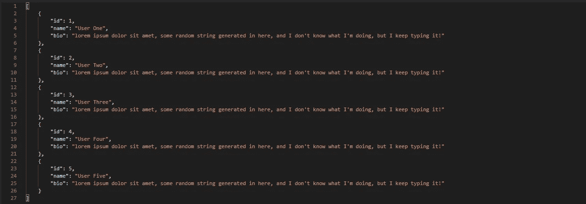

# NodeJS——让您的 API 响应更加完美

> 原文：<https://blog.devgenius.io/nodejs-make-your-api-response-nicely-f562f78cb67?source=collection_archive---------1----------------------->


响应良好的 API

嗨，朋友们，已经有一段时间没有用媒体写作了。我们来谈谈 NodeJS 中的 API，好吗？

# 遵循这篇文章的要求

1.  非常基础的 JavaScript。
2.  非常基础的 NodeJS / ExpressJS。
3.  非常基础的 API。

# 跟随本文的必备工具

## 1.NodeJS

重要的是 **NodeJS** 本身，你可以在这里下载(【https://nodejs.org/en】T2)。我推荐安装 **LTS** 版本，我目前用的是 v12.2.0 *。*

## 2.邮递员

Postman 是一个强大而友好的用户界面应用程序，可以在这里下载([https://www.postman.com](https://www.postman.com/))。

## 3.文字编辑器

有很多文本编辑器，我更喜欢使用可以在这里下载的**vs code**([https://code.visualstudio.com](https://code.visualstudio.com/))。
如果你想使用像 **Sublime Text** 或 **Atom 这样的文本编辑器，没关系，**只需选择适合你的工具。

# **我为什么写这篇文章**

你猜怎么着我只是厌倦了一次又一次地用同一个对象制作响应 API，这就像重复你以前已经做过的那样，顺便说一句，那并不好，但我做到了。多么讽刺的哈哈。不过是很久以前的事了。

让我们看看下面的响应 API，我有用户数据，其中包含:



示例响应

好了，数据没问题。但是，假设您有一个更大的应用程序，您必须有一个动态消息，当您到达某个端点时会发出，可能您需要一个状态代码，也可能您需要验证或错误对象，最后可能是，您想要配置发送到客户端的数据对象？嗯，你想象一下，如果你像这样编码:

```
res.json({code: 200, someKey: "someData", data: { someData: "word" }})
```

那很好，但是如果你有很多端点呢？那会很累，对吧？你一遍又一遍地写同样的代码。

**这篇文章对于处理那些这样的事情来说派上用场了。你还在等什么？让我们向下滚动！**

# 让我们开始吧

让我们假设你已经在你的机器上安装了这三样东西。

## 1.在文本编辑器中创建一个文件夹

在你的本地机器上创建一个文件夹，你想取什么名字都行，但我只称它为 **response-api。**

## 2.初始化 package.json

什么是 **package.json？**简单来说，就是一个包含你 app 信息的文件。要初始化 **package.json** ，只需在您的终端/ CMD 中键入以下代码:

```
npm init -y
```

## **3。安装 ExpressJS**

在这里，我们将安装 ExpressJS，为此只需运行以下代码:

```
npm install express
```

## 4.安装 Nodemon

什么是 **Nodemon？Nodemon** 是一个会自动重启服务器的包，如果我们不使用它，我们会一遍又一遍地重新运行服务器。要安装 **Nodemon** ，只需键入如下内容:

```
npm install -D nodemon
```

****-D****命令代表将我们的包安装到****package . JSON .***中的 DevDependencies 中*

*如果您已经完成了这 4 个步骤，那么您将让 **package.json** 包含:*

**

*package.json*

## *5.配置 package.json 文件*

*转到 **package.json** 用下面的代码复制并替换“**脚本**对象:*

# *让我们编码*

## *6.在 server.js 文件中编写代码*

*在 **server.js** 文件中，键入以下代码:*

*通过键入以下命令运行服务器:*

```
*// if you configuring package.json in step 5, you can
npm run server// or if you do not, you can simply
nodemon server*
```

*这是结果，这意味着，服务器正在运行。很好。*

**

*服务器正在运行*

## *7.生成 responseApi.js 文件*

*这是本文中的主要文件。不过，在根文件夹中，创建一个 **responseApi.js** 文件。在下面键入代码，或者你只是复制粘贴代码。*

*好的，我将解释一下 **responseApi.js** 文件。*

## *成功响应代码*

**

*导出成功函数*

*在这段代码中，我们创建了一个名为 success 的导出函数，用于返回一个**成功响应**对象。这些对象包含一个字符串形式的**消息**，错误**为布尔值，**代码**为数字，**结果**可以是我们发送的对象或数据数组。该函数的参数在代码注释中是不言自明的。***

## *错误响应代码*

**

*导出的误差函数*

*在这段代码中，我们创建了一个名为 error 的导出函数，用于返回一个**错误响应**对象，该对象包含一个字符串形式的**消息**，**错误**为布尔值，**代码**为数字，没有**结果**对象。为什么没有结果对象？因为错误只是为了传递一个信息，对吗？用户只是想知道服务器是否有任何错误，如“*出错，请联系服务器管理员*”，而不是读取服务器发送的对象。我希望这有意义，其余的在代码中解释。*

## *验证响应代码*

**

*导出的验证函数*

*上面的最后一段代码，用于捕捉来自服务器的任何验证请求，对象响应与上面的**成功响应**相同，不同之处在于包含的**错误**对象。但是，这个函数只接受一个参数，即包含验证/错误的对象或数组的**错误**。*

## *8.在 server.js 中创建端点*

*回到 server.js 文件并制作端点，该端点包含:*

*   *成功*
*   *错误*
*   *确认*

*在 **server.js** 中编写上面的代码 ***app.listen()****

> ***注意，**这些函数中的三个来自 **responseApi。JS** 必须包装在 **json()中，**只是为了返回 json 类型。*

## *9.在邮递员中测试*

*打开你已经安装的邮递员应用程序。*

***成功端点，**输入正在运行的 ExpressJS 的主机，我正在运行端口 5000，所以可以输入***http://localhost:5000/API/Success****，点击**发送**按钮*。回应会是这样的:***

****

**成功响应**

****错误端点，**这样我就可以键入[***http://localhost:5000/API/***](http://localhost:5000/api/success)***错误*** 并点击**发送**按钮*。*响应如下:**

****

**错误响应**

****验证端点，**我可以输入[***http://localhost:5000/API/***](http://localhost:5000/api/success)***验证*** 并点击**发送**按钮*。*响应将是这样的:**

****

**验证响应**

**看到结果了吗？我们在响应中生成了 3 或 4 个对象，而没有一遍又一遍地写，这很好，对吗？你不必在不同的端点再写一遍。现在您只需调用 **responseApi.js** 并获得**成功()**、**错误()**和**验证()**。**

**好了，app 已经完成了。哦，对了，还有一件事，如果你想修改代码，创建一个全功能的端点，这里是它的示例代码。**

****示例代码****

# **结论**

**就这样，我们制作了一个 express app，它有更多的**结构化的**和**可读的**响应 API，这只是我对制作一个具有一致性的响应 API 的看法。所以这取决于你。**

**您可以在 GitHub 中访问或贡献应用程序。也许你们对这个 **responseApi.js** 有更好的想法，告诉我。谢谢，下一篇文章再见。**

**这是 GitHub 库:**

**[](https://github.com/hudaprs/be_response_api_nodejs) [## hudaprs/be_response_api_nodejs

### 结构化节点响应 API。通过在…上创建帐户，为 hudaprs/be_response_api_nodejs 开发做出贡献

github.com](https://github.com/hudaprs/be_response_api_nodejs)**