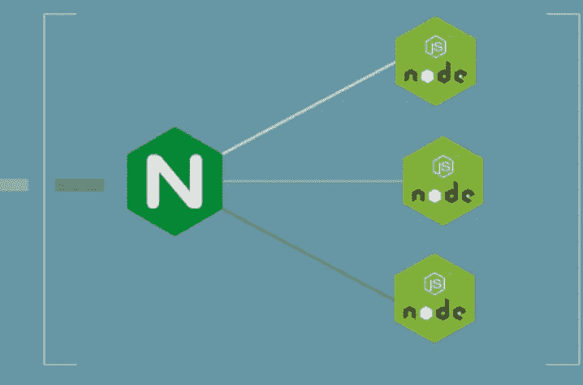

# Azure 虚拟机上的 NodeJs+ Nginx

> 原文：<https://blog.devgenius.io/nodejs-nginx-on-azure-vm-cf23d05a9b9b?source=collection_archive---------2----------------------->

这篇博客是我们从零开始讨论 **Devops** 概念的系列文章的一部分，面向的是入门知识有限的读者。这篇文章属于初学者系列，因为它涉及到简单设置 nginx 作为 Azure VM 上基本节点应用程序的简单反向代理。

本系列早期的一些博客

[**宋承宪**](https://amit894.medium.com/ssh-what-not-to-do-92c266ca430f)[**第一静态网站**](https://amit894.medium.com/public-cloud-first-static-website-7d6f7c6f794)[**本地**](https://medium.com/@amit894/k8s-on-laptop-first-proxy-f0413145c9d1)**K8** [**DNS**](https://medium.com/@amit894/the-myth-of-dns-simplified-e169a6dadc0a)



Nginx 作为反向代理

# 什么是 Node JS？

nodejs 是一个构建在 Javascript V8 引擎之上的开源后端环境，它是解决开发者后端和 UI 需求的流行工具

下面是一个基本的“ *Hello Audience* ”应用程序，用 node.js 编写，运行在 3000 端口上

为了运行相同的程序，可以使用以下命令之一

```
**Using node**node app.js**Using PM2**pm2 start app.js
```

# Nginx 是什么？

引擎 X 是一个网络服务器，可以用作多用途—负载平衡器、反向代理等，用于运行在 java/node 等上的后端应用程序。代理传递模块可用于将端口 80 上的传入重定向到端口 3000，如下例所示

# 设置和配置

## 地形模块

[**复习**](https://amit894.medium.com/public-cloud-first-static-website-7d6f7c6f794)

对于这个博客，地形环境由四个模块组成- *键。网络、虚拟机和存储。*

详细的模块可以在-

[https://github . com/Amit 894/node-VM-azure/tree/main/resources/terra form/modules](https://github.com/amit894/node-vm-azure/tree/main/resources/terraform/modules)

要安装 terraform 模块，需要从上述 git repo 的环境文件夹中运行以下执行步骤

[https://github . com/Amit 894/node-VM-azure/tree/main/resources/terra form/env/dev](https://github.com/amit894/node-vm-azure/tree/main/resources/terraform/env/dev)

```
**Steps**terrform init
terraform plan
terraform apply
```

[**进修**](https://amit894.medium.com/ansible-hello-world-8d37627758a9)

对于这个博客，剧本由两个角色 ngnix 和 nodejs 组成，在上面的远程 Azure VM 设置中进行配置。

每个角色都有以下 4 个步骤- *prereqs.yml、configure.yml install.yml 和 service.yml.*

详细的角色可以在

**节点**-[https://github . com/Amit 894/Node-VM-azure/tree/main/resources/ansi ble/roles/Node](https://github.com/amit894/node-vm-azure/tree/main/resources/ansible/roles/node)
**Nginx**-[https://github . com/Amit 894/Node-VM-azure/tree/main/resources/ansi ble/roles/Nginx](https://github.com/amit894/node-vm-azure/tree/main/resources/ansible/roles/nginx)

要安装 ansible 行动手册，需要运行以下执行步骤-

```
ansible-playbook ./playbooks/node-azure-vm.yml -i hosts
```

## 安装后验证

```
curl -v "http://104.210.136.108/" **where** 104.210.136.108=IP of the Azure VM * Mark bundle as not supporting multiuse
< HTTP/1.1 200 OK
< Content-Type: text/plain
< Date: Tue, 07 Dec 2021 16:09:48 GMT
< Connection: keep-alive
< Keep-Alive: timeout=5
< Content-Length: 14
<* Connection #0 to host 127.0.0.1 left intact
Hello Audience**%**
```

如需反馈，请发邮件至**Amit[dot]894[at]Gmail[dot]com**或联系[https://about.me/amit_raj](https://about.me/amit_raj)的任何链接

*更多内容请看*[*blog . dev genius . io*](http://blog.devgenius.io)*。*