# NodeJS —使用 ES 模块而不是 CommonJS

> 原文：<https://blog.devgenius.io/nodejs-using-es-modules-instead-of-commonjs-9c6e801e7508?source=collection_archive---------0----------------------->

不用打包使用 es 模块，NodeJS 版正式可以使用 ES 模块了！

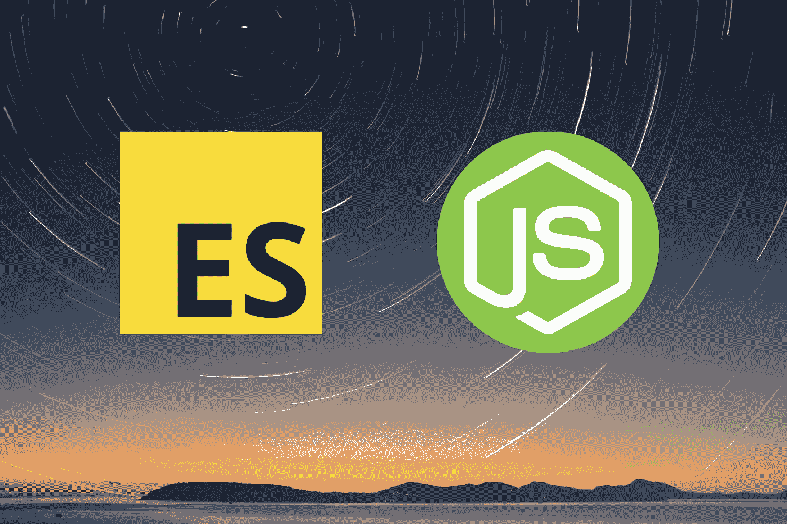

NodeJS —使用 ES 模块而不是 CommonJS

我已经有一段时间没有写文章了，那时发生了很多事情。现在没关系了，我回来了，准备再写一些！

我要再次告诉你关于 NodeJS，现在，我们集中在 NodeJS 代码，我们基本上要实现 ES 模块到我们的代码。为了什么？事情是这样的，如果你来自前端并加入后端，如果你来自 **ReactJS** 、 **AngularJS** 或 **VueJS** ，你主要在那里处理 ES 模块。你总是使用 ES 模块编码。但是，当你使用 NodeJS 到达后端时，你不能使用那种代码，比如`import`、`export default`和`export`。

在本文中，我将向您解释如何在 NodeJS 版本 14 中实现 ES 模块。在 NodeJS 低于 14 的以前版本中，你必须设置一些东西或者安装一个第三方包来使用这个 ES 模块，我认为这有点浪费时间。

在我们进入主题之前，你总是在 NodeJS 中看到这些代码吗？

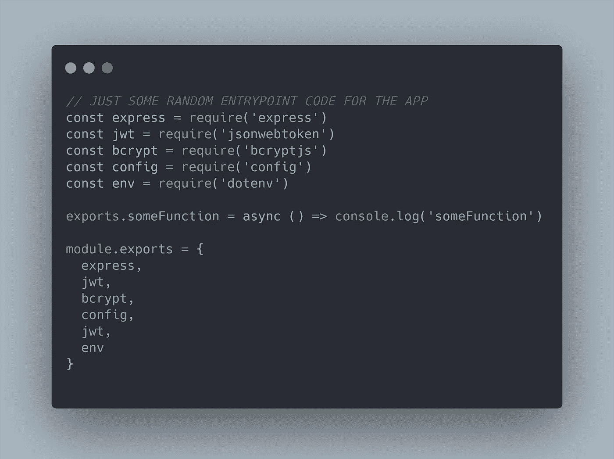

通用 JS 方法

这是一个 **CommonJS** 代码，我们在互联网上看到很多关于何时在 NodeJS 应用中启动代码的代码，特别是当使用 **ExpressJS** 框架工作时。

现在，您可以像这样开始键入代码:

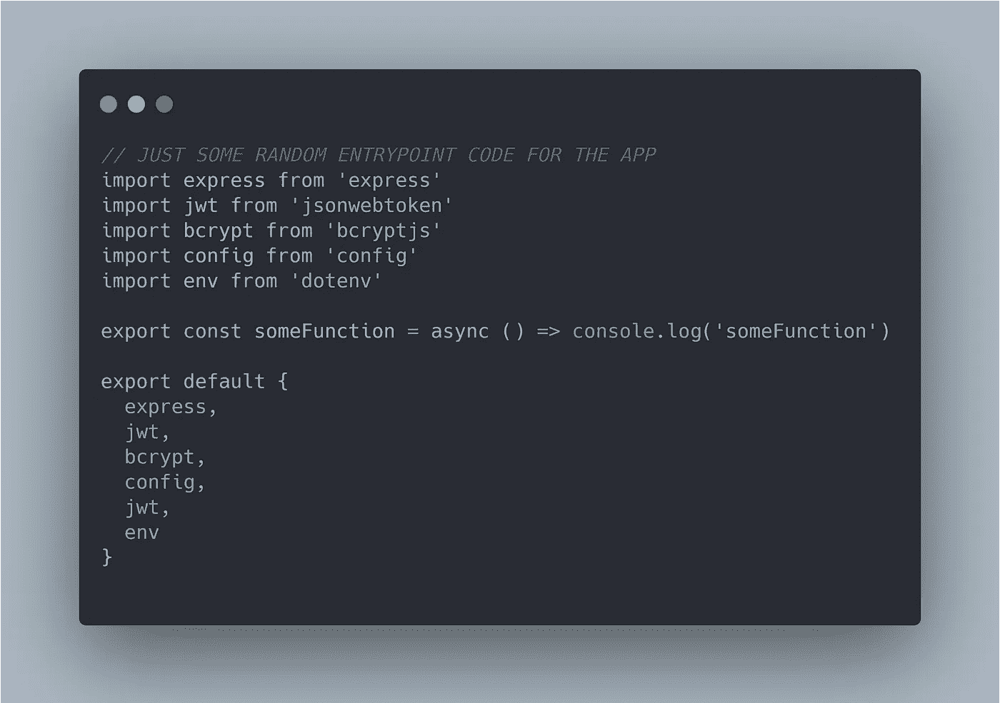

ES 模块方法

如果在 NodeJS 版本 14 中使用 EcmaScript 模块，您可以使用上面的典型语法，并且不需要任何第三方来设置。

当您来自总是使用 es 模块编码的前端时，您可以很容易地理解发生了什么。

# 遵循这篇文章的要求

1.  非常基础的 JavaScript。
2.  非常基础的 NodeJS / ExpressJS。

# 跟随这篇文章的必备工具

## **1。NodeJS**

重要的是 **NodeJS** 本身，你可以在这里下载([https://nodejs.org/en](https://nodejs.org/en/))。我推荐安装 **LTS** 版本，我目前用的是 v14.15.0 *。*

## 2.文字编辑器

有很多文本编辑器，我更喜欢使用可以在这里下载的**vs code**([https://code.visualstudio.com](https://code.visualstudio.com/))。如果你想使用像 **Sublime Text** 或 **Atom、**这样的文本编辑器，选择适合你的工具就可以了。

# 我为什么写这篇文章

当从前端移动到后端时，我遇到了一个问题，主要是如果你是一个使用 Node / ExpressJS 作为后端的全栈 javascript 开发者。当我在前端使用 es 模块而不是后端仍然使用 CommonJS 时，我会遇到一些问题，当你只是以不同的命名约定编写相同功能的代码时，这很奇怪。这就像是一个**风格的代码**，如果你去个人的方式。

感兴趣吗？下面是使用这种代码的简单方法。我假设您已经安装了 NodeJS LTS 版本 14。

## 1.初始化 package.json

创建您自己的项目文件夹，开始在您的代码中使用 ES 模块，命名您想要的任何名称，进入该文件夹，并开始在您的终端或 CMD 中键入该命令。

```
npm init -y
```

上面的代码用于为应用程序生成入口点。下面是第一次生成第一个 **package.json** 时的代码示例。

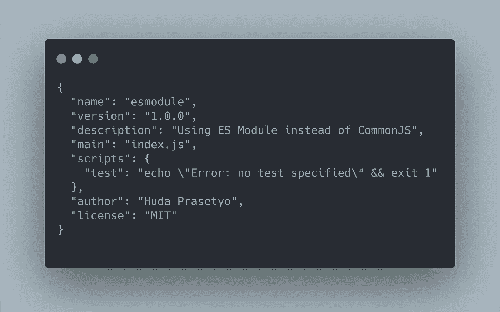

新鲜包装 JSON

因此，开始在你的应用程序中使用 ES 模块非常简单，你只需将这段代码添加到你的**包中。**

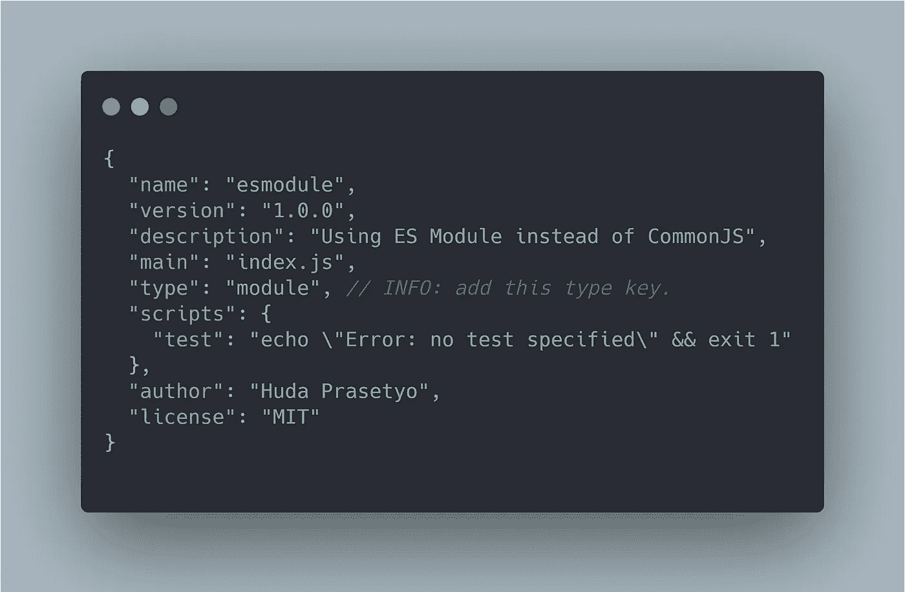

就这样？阿雅，你只要加上那个`"type": "module”` 就可以开始了。

这里有一些值得注意的地方，请阅读下一步。

## 2.导入架构

在 ES 模块中导入的常用方法很简单，对吗？就像这个例子。

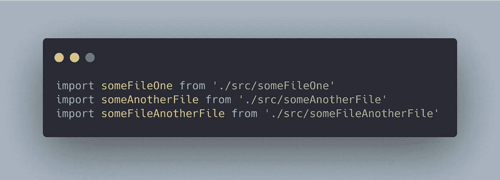

通用 ES 模块导入语法

这个代码没有任何问题。但是，当您在 NodeJS 应用程序中使用它时，您必须这样做。

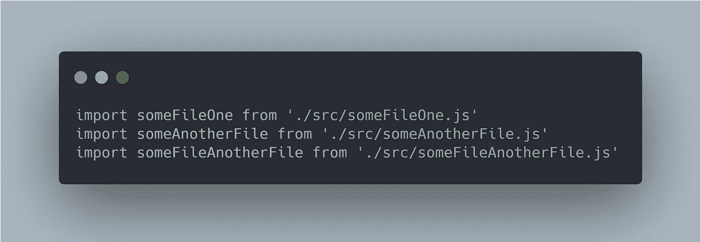

节点 Es 模块导入语法

是的，没错，你已经注意到了区别，在 NodeJS 中你必须输入**文件格式**来导入 NodeJS。这有点奇怪，但这是使用它的方法。 ***除外，如果导入第三方模块，就不需要那个文件格式*** 。

**注意:**如果您没有使用文件格式的导入，您将得到一个错误！

## 3.出口

当你开始在 NodeJS 中使用这个 ES 模块时，我想告诉你的最后一件事是当使用 export 时，想象一下，如果你有一个名为 **utils 的文件夹，在 utils 文件夹中有许多文件你必须导出才能在另一个文件中使用，在这种情况下，你想让一个 **index.js** 开始指向所有你想导出的文件。有道理吗？如果你不明白😁，下面是简单的示例代码。**

我有一个 **utils** 文件夹，其中包含一个文件。

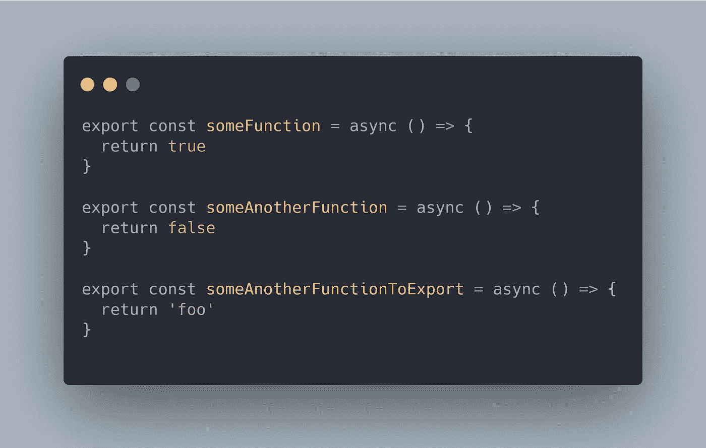

util 文件夹中导出的函数

为了使导入变得简单，你需要在 utils 文件夹中创建一个名为 **index.js** 的文件，这样当你想获得那些函数时，你只需指向该文件夹并获得你想要的任何东西。

这里有一个非常简单的代码。

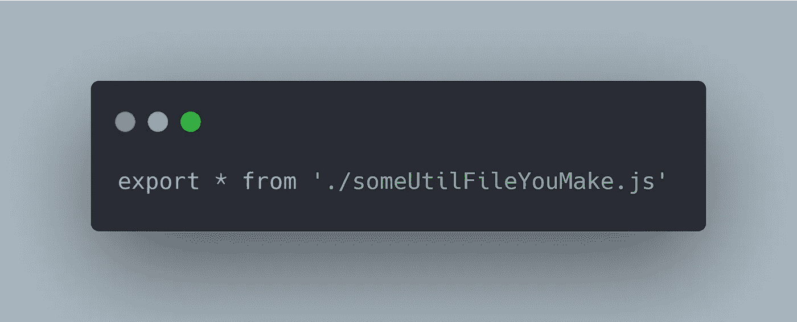

从文件中导出所有内容

好吧，明白了吗？重点是，你想在一个文件中获得所有你已经创建的导出函数，为了使导入更容易，你只需指向 **utils** 文件夹并启动一切。但是，你不能这样写你的代码。当开始使用 NodeJS 中的 es 模块时，我会感到困惑😂。

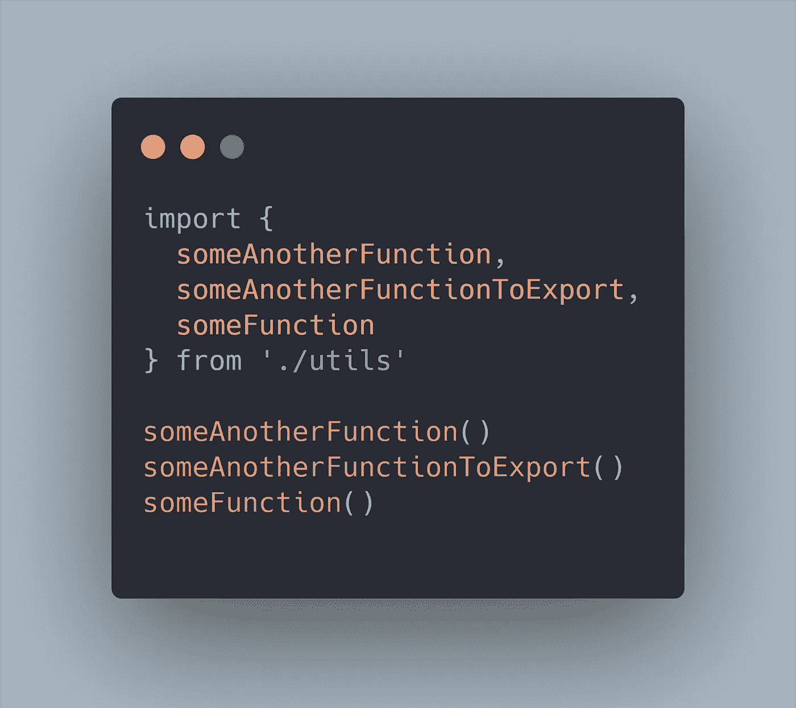

不起作用—全部导出。

如果您使用该代码，它将不起作用。它有什么问题？是快速猜测…是的，没错，你**必须**仍然导入 **index.js** 文件来工作！我是说，什么？！😶

为了让代码工作，就像这样。

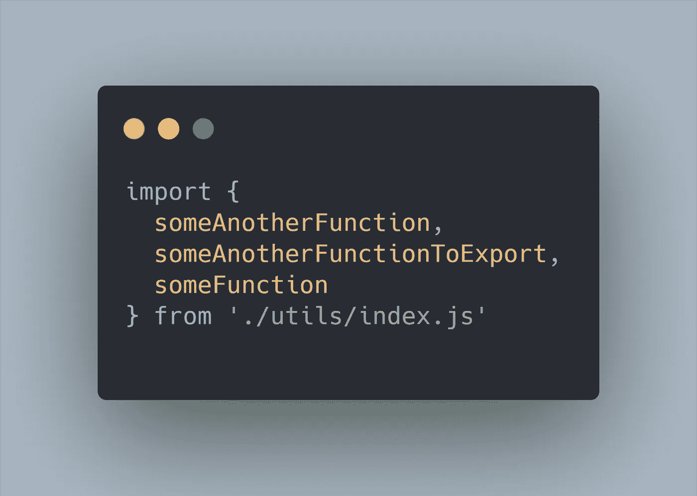

导出所有工作

什么时候开始搜索这个问题让我背疼😁，但你去那里。你可以从这种出口开始工作。

# 结论

就是它的，有一个简单的实现 ES 模块到我们 NodeJS app 的例子，没有太大的区别。不同之处在于导入和导出，您必须包括您的文件格式才能开始使用它。

要获得更深入的解释，您可以在这里访问 NodeJS 文档，有很多方法可以实现，但我写这篇文章的方式是为了简单起见，当您从前端移动到后端而不使用第三方包时。

 [## Node.js v15.0.1 文档

### 包是由 package.json 文件描述的文件夹树。该包由包含…的文件夹组成

nodejs.org](https://nodejs.org/dist/latest-v14.x/docs/api/packages.html#packages_determining_module_system) 

谢谢你，祝你愉快，下一篇文章再见！生活真美好！☕☕