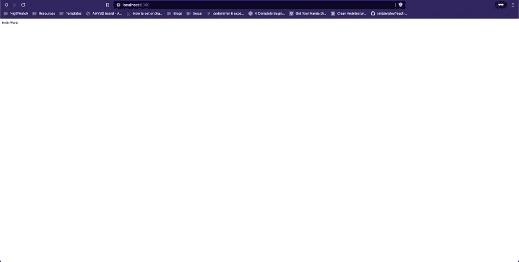

# 带有 ExpressJS 和 TypeScript 的 NodeJS 第 1 部分。

> 原文：<https://blog.devgenius.io/nodejs-with-expressjs-and-typescript-part-1-22871e2aae00?source=collection_archive---------5----------------------->

在这篇文章中，我们将看到如何用 expressJS 和 typescript 从头开始创建一个服务器，这篇文章将被分成几个部分，以使其易于理解，并彻底解释每一件事。

## 您可以从[库](https://github.com/jordanrjdev/express-typescript)中访问代码

# 入门指南

在 nodeJS 中启动项目的第一步是使用以下命令:

```
npm init -y
```

这个命令将通过创建文件 **package.json** 来启动我们的项目。

现在我们必须安装依赖项，在这种情况下，我将使用 express with typescript，让我们看看我们要安装哪些依赖项:

依赖关系:

*   表达

开发依赖项:

*   以打字打的文件
*   ts 节点
*   @类型/节点
*   @类型/快速

为什么我们把所有和 Typescript 相关的东西都安装成 devDependencies？好吧，让我们记住，即使我们将使用 Typescript 编写代码，代码也会被重新编译成标准的 JavaScript。因此，运行应用程序本身并不需要 Typescript，我们只在开发时需要它，这就是为什么它被保存为开发依赖项。

因此，让我们运行以下命令:

```
npm install express
```

并且:

```
npm install -D typescript ts-node @types/node @types/express
```

一旦我们成功安装了所有的依赖项，我们的 package.json 应该看起来像这样:

```
{
   "name": "nodejs",
   "version": "1.0.0",
   "description": "",
   "main": "index.js",
   "scripts": {
     "test": "echo \"Error: no test specified\" && exit 1"
   },
   "keywords": [],
   "author": "",
   "license": "ISC",
   "dependencies": {
     "express": "^4.17.3"
   },
   "devDependencies": {
     "@types/express": "^4.17.13",
     "@types/node": "^17.0.25",
     "ts-node": "^10.7.0",
     "typescript": "^4.6.3"
   }
}
```

> *请记住，版本会根据你阅读这篇文章的时间而变化。*

# 配置 TypeScript

```
npx tsc --init
```

我们使用前面的命令创建的 tsconfig.json 文件包含大量代码，这些代码中的大部分都被注释掉了，以便您可以根据自己的喜好进行试验和配置。但是，有几个设置我想解释一下:

*   **模块**:使用这个选项，您可以指定在生成的 JavaScript 代码中使用哪个模块管理器。如:' none '，' commonjs '，' amd '，' system '，' umd '，' es2015 '，' es2020 '或' ESNext '。最常见和默认的模块管理器是 commonjs。
*   **target** :使用这个选项，我们可以指定在您的项目中使用哪个版本的 ECMAScript。可用版本有“ES3”(默认)、“ES5”、“ES2015”、“ES2016”、“ES2017”、“ES2018”、“ES2019”、“ES2020”或“ESNEXT”。
*   **outDir** :使用这个选项，我们可以指定 Javascript 代码将在哪个路径中生成。
*   rootDir :这个选项是我们指定 TypeScript 文件的位置。
*   **strict** :该选项默认启用，启用严格类型检查选项。

您可以在 tsconfig.json 文件本身或官方的 typescript 文档中了解有关此配置的更多信息。

在我的例子中，我将在 tsconfig.json 中使用以下配置:

```
{
  "compilerOptions": {
    "module": "commonjs",
    "esModuleInterop": true,
    "target": "es6",
    "rootDir": "src/",
    "outDir": "./build",
    "strict": true
  }
}
```

# 我们的第一台带有 expressJS 的服务器

设置好 typescript 之后，是时候用 expressJS 创建我们的第一个 web 服务器了。让我们创建一个名为 index.ts 的文件。

在这个文件中，我们将有以下代码:

```
import express, { Request, Response } from 'express';
const app = express();app.get('/', (req: Request, res: Response) => {
  res.send('Hello World');
});app.listen(8000, () => {
  console.log('The application is listening on port 8000!');
});
```

首先，我们从 express 导入 express 以及请求和响应类型。

一旦完成，我们必须初始化我们的应用程序

```
const app = express();
```

现在，我们将添加一个 get 类型的端点，其中将返回一条消息，因此我们必须执行以下操作:

```
app.get("/");
```

为了以简单的方式开始，我们将有我们的应用程序，然后我们将放置我们的端点的方法，在这种情况下 **get** 这是一个接收 2 个参数的函数，然后我们可以向它添加中间件，但目前有 2 个，第一个是一个带有路由的字符串，因为我们希望它是我们的初始路由，我们只需放置一个/并表示理解这将是我们的主路由。

现在我们必须添加第二个参数，这是一个回调，这个回调接收两个参数，即请求和响应:

```
app.get('/', (req: Request, res: Response) => {
});
```

如您所见，我已经添加了类型。请记住，您为这两个参数命名，但是按照惯例，您会发现最常见的是 req 和 res。

在这个回调函数中，我们的代码将在我们访问路由时执行，现在我们将只响应文本:

```
app.get('/', (req: Request, res: Response) => {
  res.send('Hello World');
});
```

与**RES . send(‘Hello World’)；**我们所做的是告诉它用短信回复我们的呼叫。

现在让我们在浏览器中看看这个。但在这样做之前，我们需要一件事，那就是告诉我们的 express server (app)继续监听某个端口。

所以我们会写:

```
app.listen(8000, () => {
  console.log('The application is listening on port 8000!');
});
```

它接收两个参数，第一个是我们的服务器将监听的端口，第二个是当服务器准备好的时候执行的回调，现在我们只放一个 console.log。

考虑到这一点，我们将执行我们的服务器。

请记住，因为我们使用的是 typescript，所以我们必须编译成 js，以便 node 可以读取它，我们执行命令:

```
npx tsc --project ./
```

将生成一个构建文件夹。里面有我们的代码。我们可能不明白，但已经编译好了。

为了加速代码的编译，我们可以在 package.json 的脚本部分创建一个脚本:

```
"scripts": {
     "build": "npx tsc --project ./",
     "test": "echo \"Error: no test specified\" && exit 1"
   },
```

我称它为“立即编译”,我们只需执行:

```
npm run build
```

每当我们创建一个脚本，我们必须执行它:

```
npm + run + script name
```

此时，我们可以编写命令:

```
node ./build/index.js
```

我们将看到以下输出:

```
❯ node ./build/index.js
The application is listening on port 8000!
```

让我们看看我们的网络浏览器:



如我们所见，我们得到了来自端点的响应。

正如您在本文中看到的，我们已经用 expressJS 和 typescript 创建了我们的第一个服务器。

在下一部分中，我们将看到如何使用 nodemon 加速开发，我们还将看到如何响应不同类型的格式。带有其他 http 动词等的请求。

如果你对这个帖子有任何疑问，可以在评论里留下。或者，如果你有任何建议，你可以离开它。