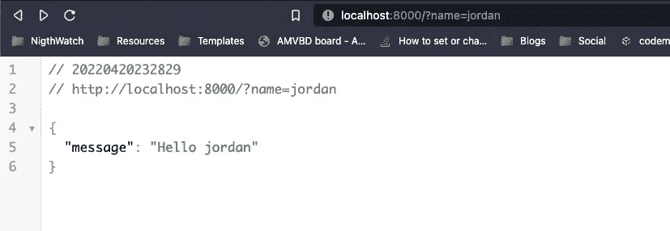
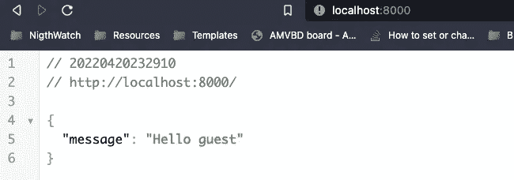

# 带有 ExpressJS 和 TypeScript 的 NodeJS 第 2 部分。

> 原文：<https://blog.devgenius.io/nodejs-with-expressjs-and-typescript-part-2-37db5ba9270c?source=collection_archive---------2----------------------->

在第二部分中，我们将了解如何增加 nodemon 的开发时间，以便不必每次在我们的服务器中进行更改时都进行编译，因为现在如果我们在代码中进行更改，我们必须中断服务器的执行并重新编译以启动它，然后为了加快速度，我们将使用 nodemon，这是一种工具，它会在每次检测到代码中的更改时自动重新启动服务器，而无需编译。

要安装 nodemos，我们必须执行以下命令:

```
npm i -D nodemon
```

记住 nodemon 是为了加速开发，所以我们只作为开发依赖项来安装。

现在我们有了 nodemon，我们将执行:

```
nodemon npx ./src/index.ts
```

这将在不生成生产代码的情况下启动我们的服务器，当我们做出更改时，服务器将自动重启。

当我的服务器启动时，我将更改控制台消息

```
app.listen(8000, () => {
  console.log('Server on port 8000!');
});
```

然后，我们将看到以下控制台输出:

```
❯ npx nodemon ./src/index.ts
[nodemon] 2.0.15
[nodemon] to restart at any time, enter `rs`
[nodemon] viewing path(s): *.*
[nodemon] seeing extensions: ts,json
[nodemon] starting `ts-node ./src/index.ts`
The application is listening on port 8000!
[nodemon] rebooting due to changes...
[nodemon] starting `ts-node ./src/index.ts`
Server on port 8000!
```

如果我们能在发展中走得更快，现在就完成了。

最后，我将在我的 package.json 中创建一个脚本:

```
"hyphens": {
    "build": "npx tsc --project ./",
    "start": "node ./build/index.js",
    "dev": "nodemon ./src/index.ts",
    "test": "echo \"Error: no test specified\" && exit 1"
  },
```

如你所见，我已经创建了 dev 命令，它只有 nodemon，我们不使用 npx。

npx:这个命令允许您在类似于通过 npm run 运行它的上下文中，从 npm 包(无论是本地安装的还是远程获得的)运行任意命令，所以当您在包中创建脚本时。json 不再需要前置 npx。

# 查询参数

查询参数是可选的键值对，出现在？在 URL 中。例如，下面的 URL 有两个查询参数，rating 和 page，分别具有值 ASC 和 2:

[http://example.com/articles?sort=ASC&page = 2](http://example.com/articles?sort=ASC&page=2)

在这个 url 中，我们看到有两个查询参数，它们的名称分别是“sort”和“page”。您可以发送许多查询参数，但是它们必须用“&”分隔，并且要用“=”赋值

查询参数允许将额外的应用程序状态序列化到 URL 中，否则这些状态将无法放入 URL 路径中。).查询参数的常见用例包括呈现分页集合中的当前页码、筛选条件或排序条件。

在 web 开发中，查询参数在 URL 中使用，如上所述，但是它们也可以在检索数据的 API 请求中使用。Ember 将它们视为两个不同的概念。

# 通过查询参数的动态响应

现在我们将看到如何在我们创建的 get 类型的端点中返回由请求的参数发送的字符串。

以前我们只返回 hello world，但现在我们将返回用户通过示例查询参数提供给我们的名称:

```
[http://localhost:8000?name=jordan](http://localhost:8000?name=jordan)
```

我们的答案应该是:

```
hello jordan
```

让我们看看我们如何能做它。

在我们的端点中，我们有一个回调函数，它接受一个请求(Request)和一个响应(Response)。

让我们将 req(请求)打印到控制台:

```
app.get('/', (req: Request, res: Response) => {
  console.log(req);
  res.send('Hello World');
});
```

现在让我们用下面的查询参数重新加载我们的服务器页面:

```
[http://localhost:8000?name=jordan](http://localhost:8000?name=jordan)
```

让我们看看控制台:

```
baseUrl: '',
  originalUrl: '/?name=jordan',
  _parsedUrl: Url {
    protocol: null,
    slashes: null,
    auth: null,
    host: null,
    port: null,
    hostname: null,
    hash: null,
    search: '?name=jordan',
    query: 'name=jordan',
    pathname: '/',
    path: '/?name=jordan',
    href: '/?name=jordan',
    _raw: '/?name=jordan'
  },
  params: {},
  query: { name: 'jordan' },
  res: <ref *3> ServerResponse {
    _events: [Object: null prototype] { finish: [Function: bound resOnFinish] },
    _eventsCount: 1,
    _maxListeners: undefined,
    outputData: [],
    outputSize: 0,
```

这只是那个巨大物体的一小部分，但是让我们看看对我们很重要的一部分，因为我们有有价值的信息。

如您所见，我们有基本 url，因为它不显示任何内容，我们有 href、原始 url，我们还有查询参数:

```
query: { name: 'jordan' },
```

这意味着我们可以通过以下方式访问它:

```
res.query.name
```

那么我们已经有了练习的答案，我们只需要验证，因为查询参数是可选的，所以我们将在端点中做一个 if，如下所示:

```
app.get('/', (req: Request, res: Response) => {
  if (req.query.name) {
    res.send(`Hello ${req.query.name}`);
  } else {
    res.send('Hello guest');
  }
});
```

现在我们可以用 res.json({message : "message"})在 json 中回答同样的问题

为了在我们的练习中实现它，应该:

```
app.get('/', (req: Request, res: Response) => {
  if (req.query.name) {
    // res.send(`Hello ${req.query.name}`); send response type text
    res.json({ message: `Hello ${req.query.name}` }); //send response type json
  } else {
    // res.send('Hello guest'); send response type text
    res.json({ message: 'Hello guest' }); //send response type json
  }
});
```

这将做的是，如果你不发送一个名字，它会回复“你好客人”

让我们看看结果如何:
带有查询参数:



不带查询参数:



如果你想知道为什么我回答 json 的时候我的浏览器是这个样子，那是因为这个扩展: [json viewer](https://chrome.google.com/webstore/detail/json-viewer/gbmdgpbipfallnflgajpaliibnhdgobh/related?hl=es)

# 挑战

作为一个挑战，我希望你发送更多的属性，并在响应中以 json 的形式发送它们。在评论中留下你的解决方案比看起来要容易得多。

记住你不知道用户可以提交什么属性，看到你的回答我很激动。

在下一篇博客中，我们将看到如何响应用户指定数量的数组，我们还将看到 posts 动词。

因此，如果您有任何问题或建议，请发表评论。记得迎接挑战，向自己展示你可以。

你可以从[库](https://github.com/jordanrjdev/express-typescript)访问代码。