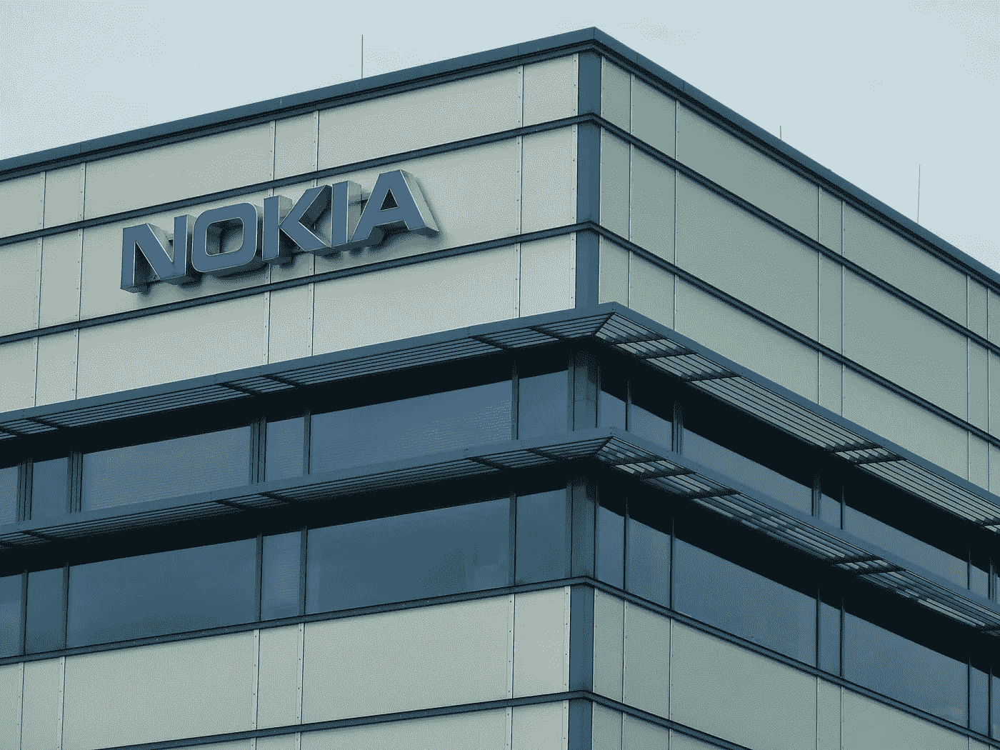
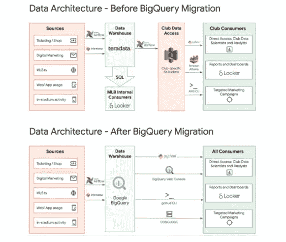

# 诺基亚将数据中心迁移到谷歌云

> 原文：<https://blog.devgenius.io/nokia-moves-data-centers-to-google-cloud-70dd0458ee84?source=collection_archive---------9----------------------->

图片来自[皮克斯拜](https://pixabay.com/?utm_source=link-attribution&utm_medium=referral&utm_campaign=image&utm_content=392706)的赫尔曼·特劳布

总部位于芬兰的电信公司诺基亚宣布，该公司与谷歌签署了一项为期 5 年的战略协议，根据该协议，诺基亚将把其内部 IT 基础设施迁移到谷歌云。诺基亚已经开始将其全球数据中心、服务器和软件应用程序转移到谷歌云上，这一过程预计将持续 18 个月至 24 个月。诺基亚预计到 2022 年秋季全部完成迁移。

谷歌云是全球第三大云服务提供商。诺基亚是谷歌云赢得的一系列客户中最新的一个。8 月初，谷歌云宣布他们已经[完成了将美国职业棒球大联盟的数据仓库](https://cloud.google.com/blog/products/data-analytics/mlb-moves-to-bigquery-data-warehouse)从基于 Teradata 的内部服务器迁移到谷歌 BigQuery。这确实是一件大事！

据该组织称，迁移始于 2019 年 5 月，进展顺利，并于当年 11 月完成，使 MLB 实现了众多优势，包括简化其数据架构、降低成本、提高性能和减少运营开销。

诺基亚也信任谷歌云作为其云合作伙伴。诺基亚全球 IT 基础设施副总裁 Ravi Parmasad 表示，该公司正在转向谷歌云，作为“T6”数字化转型道路的一部分，这将从根本上改变我们运营和做生意的方式谷歌云表示，它将“*部署战略系统集成商、解决方案专家和工程师，以确保平稳和稳定的迁移*。