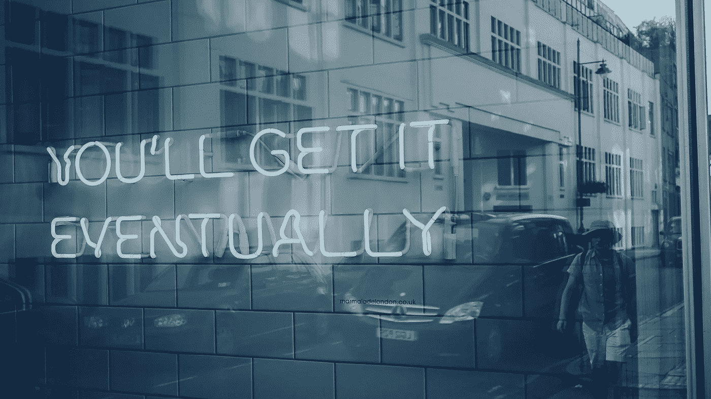
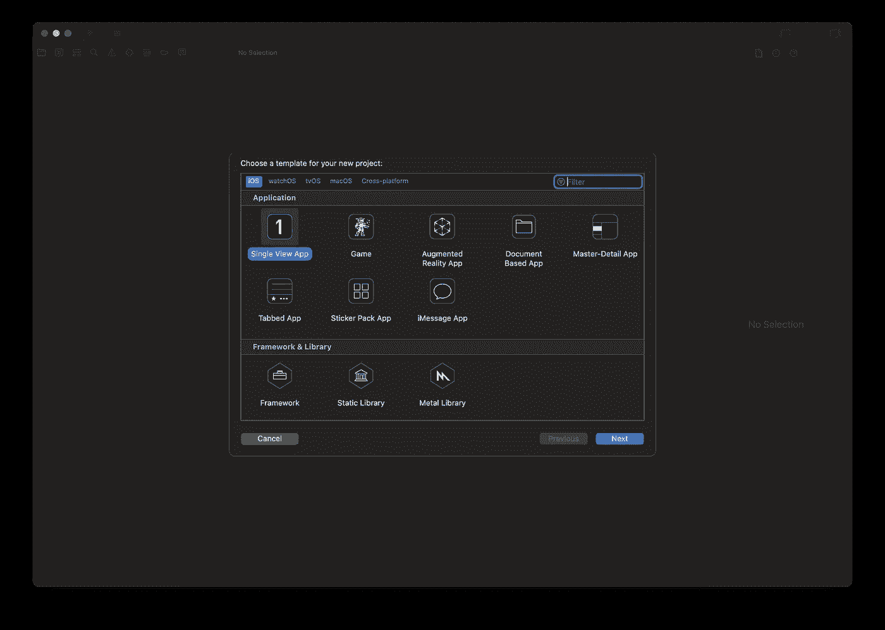
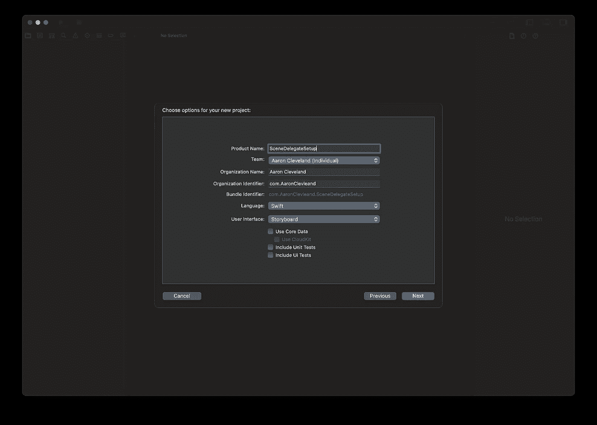
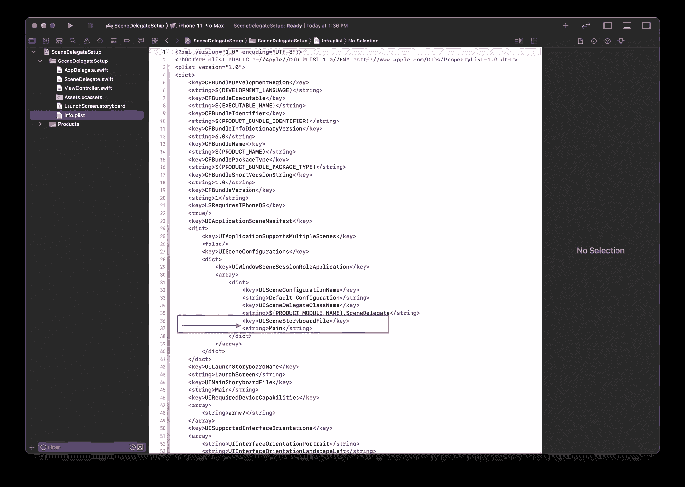
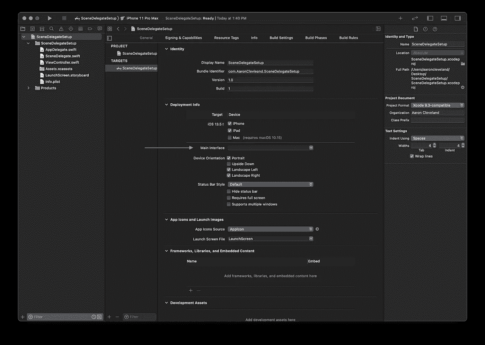

# SceneDelegate 设置为故事板-免费。

> 原文：<https://blog.devgenius.io/non-storyboard-setup-and-why-40927126f324?source=collection_archive---------2----------------------->

## 编程式用户界面、简洁的代码、风格

## UITabBarController、UINavigationController 和 UIViewController。



有时候需要时间和练习。

无论你是在使用现有的代码库还是一个全新的项目，问题都归结于哪一个更适合你的需求。现在，当我们使用用户界面时，有多个选项可供选择。

> 故事板
> 非故事板(编程设计一切)
> xib
> 所有这些的组合

现在，在这篇文章中，我们将把重点放在非故事板场景中。你可能想知道不使用故事板有什么特别之处？嗯，以编程的方式做每一件事可以让你的团队在合并时没有任何技术问题。

每个人都知道合并冲突是最难处理的事情。在大规模项目中用 XML 处理它们会让事情变得困难 10 倍。除非你喜欢做那种类型的事情，告诉我你的想法！

[](https://strawpoll.com/a1kzb4ec8) [## iOS 中的 UI 你更喜欢什么？—稻草堆

### 你有什么看法？现在投票:故事板，非故事板，xib，组合

strawpoll.com](https://strawpoll.com/a1kzb4ec8) 

# 单一 UIViewController 场景委派

首先，让我们建立一个新的“单一视图应用程序”项目，并按照步骤开始。



选择“单视图应用程序”，然后单击下一步。



在这里，我们希望保持所有设置的默认值，我刚刚将我的项目命名为“SceneDelegateSetup”，但是您可以根据自己的感觉来命名。



我把**主删除。storyboard"** 文件，这样我就知道我已经正确地设置好了一切，然后右键单击你的" **Info.plist"** 文件并作为源代码打开。在这里，我可以向下滚动到上面用红色突出显示的选项，并删除这两行。



让我们前往我们的 SceneDelegate 并设置单视图部分，这样我们就可以看到我们的屏幕！

如您所见，我们用上面的代码块替换了第一个函数中的所有内容。这里我们将 ViewController()设置为一个名为 viewController 的常量，然后将其添加到 rootViewController()。如果需要的话，这给了我们对 viewController 更多的控制。

接下来，让我们转到 ViewController，在 viewDidLoad()中，我们可以将 backgroundColor 设置为红色。当在我们的模拟器或真实设备上运行应用程序时，我们应该会看到一个红色的屏幕！

# UITabbarController 场景委派

既然我们已经介绍了如何以编程方式加载单个视图，那么让我们进入 Tabbar 的。这两个视图的设置相同，只是略有不同。来说说我们在最终代码中会看到什么。

```
let home = ViewController()
home.tabBarItem.image = UIImage(systemName: "house")
```

然后，我们希望将 tabbar 设置为 rootViewController。

```
let tabBar = UITabBarController()
window?.rootViewController = tabBar
```

这告诉 Xcode，“嘿，我们需要你使用一个 tabBar 作为主视图。”接下来，让我们告诉 Xcode 我们想要通过 tabbar 访问哪些 ViewControllers。我想补充以下内容。

```
let home = ViewController()
let settings = SettingsViewController()
let bookmark = BookmarkViewController()
tabBar.viewControllers = [bookmark, home, settings]
```

你把它们放入数组的方式就是它们的顺序。当您运行应用程序时，您可能会想，“我看到了 tabbar，但是我没有看到我的任何视图！”让我们给 tabbar 项目添加一些图像。

```
home.tabBarItem.image = UIImage(systemName: "house")
settings.tabBarItem.image = UIImage(systemName: "gear")
bookmark.tabBarItem.image = UIImage(systemName: "bookmark")
```

如果您愿意，可以选择为图标添加标题:

```
home.tabBarItem.title = "Home"
```

自然地，tabbar 具有适应亮暗模式的能力。但是我们可以为酒吧使用淡色。

```
tabBar.tabBar.barTintColor = .black // optional you can choose other colors
```

最后，如果你想知道，我希望应用程序开始在一个不同的视图。好吧，记住我们在编程中的计数方式，从零开始。所以数组看起来像[书签，主页，设置]。让我们选择主视图作为应用程序启动时的第一个视图。

```
tabBar.selectedIndex = 1
```

这就是了，一个漂亮简单的 tabbar！

# UINavigationController 场景委托

最后但并非最不重要的工作导航控制器。这些类似于单视图控制器。

```
let navController = UINavigationController(rootViewController: ViewController())
```

这为我们提供了初始的 UINavigationController，我们将它设置为 ViewController()。

接下来，我们想通过查看 ViewController()文件并设置导航控制器的属性来结束。当处理空视图时，我仍然喜欢设置背景颜色。

终于，我们完成了！显然，您可以将 tabbar 和导航控制器合二为一，两者并用。我希望你喜欢这篇文章！🚀