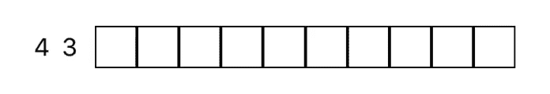

# Nonograms 和我的软件开发之旅

> 原文：<https://blog.devgenius.io/nonograms-and-my-software-development-journey-dbea8f7d1dc?source=collection_archive---------11----------------------->

大约 4 年前，我沉迷于玩数独。当我在手机上玩这个游戏时，一个名为[图片交叉](https://apps.apple.com/au/app/picture-cross/id977150768)的游戏的广告弹出来了。它展示了一个类似数独的谜题(称为 nonogram ),它由一个网格组成，你必须使用数字来解决它。因为我以前从未遇到过这样的难题，所以我急于尝试解决一些。这看起来很难，几乎不可能解决；对我来说是完美的挑战。从那以后，我一直玩这个游戏，其他人也喜欢它。

2018 年，我本科毕业后花了一年半的时间，寻找一份能让我拿到第三封也是最后一封推荐信的工作，这样我就可以进入研究生院。我学过生物学，进行过分子遗传学/病毒学研究，并在一个类似的实验室寻找一个低级职位。申请了这么多公司，参加了多次面试，却没有一个工作机会给我回音，这让我非常沮丧。然后，我看到了另一个关于 [Lambda 学校](https://lambdaschool.com/)的广告，这是一个为期 6 个多月的软件开发和计算机科学训练营，前期不需要任何费用。我总是在学习生物学或计算机科学之间左右为难，从 13 岁开始，我就一直试图自学编程语言，所以这听起来对我来说很完美。这尤其耐人寻味，因为我在大学时曾涉猎过[生物信息学](https://en.wikipedia.org/wiki/Bioinformatics)，并对我研究中常用的算法着迷。这个广告对我来说来的真是时候。

虽然 Lambda School 是为了教授全栈式 Web 开发而成立的，但我最终申请并被他们的第一批 iOS 开发和计算机科学团队录取(不幸的是，该团队最近刚刚停办)。这是一次奇妙的经历，教会了我很多东西。毕业后不到 6 个月，我就找到了两份 iOS 开发人员的工作。然而，他们都很短命。在这两份工作中，我参与的项目都是医疗保健领域的，没有一个是设计用于公共应用商店的。自从上次被雇佣以来，我一直绞尽脑汁，试图想出一个应用程序的想法，以便在应用程序商店上销售。我已经开发了很多应用程序，但从未完成过，因为这些想法对应用商店来说似乎太基础了。然后我突然想到。为什么不做我自己版本的 nonogram 应用程序呢！

我想制作自己的版本的主要原因是因为我喜欢解决将颜色融入其中的难题。但我能找到的应用程序要么只有黑色和白色，要么有不同的颜色，但你可以在每个谜题中失去有限的生命。我不喜欢玩限制你搞砸多少次的益智游戏，因为错误/试错是我学习最好的方式！

我的意图是在未来的一系列文章中记录我在构建这个应用程序时的方法和过程，所以请尽快关注这些文章！

# 什么是 Nonogram /你怎么玩？

nonogram(也称为 griddler，或 picross)是一种日本谜题，您可以通过使用网格中每行和每列旁边的数字正确填充正方形来逻辑地解决它。列和行上面和左边的数字分别对应于随后填充的方块的数量。如果一行或一列中有多个数字，则在连续填充的方块之间必须至少有一个空白方块。有许多技巧和策略可以用来解决它们，但是要做好逻辑和数学思考的准备！

*注意:我将使用我制作的应用程序的截图和视频来演示这些概念*

## 最基本的策略

当一行或一列中有一个数字超过网格总长度的一半时，您可以放心地填充中间重叠的方块。

仅显示单行规则(8)的空拼图(1x10 网格)

一种可能的解谜方法(从最左边的**开始填 8 个方块)**

另一种可能的解谜方法(从最右边的**开始填 8 个方块)**

仅有的 6 个方块保证用给定的信息填充

没有更多信息(10 列的规则)，最后一个图像中的 6 个方块是唯一可以逻辑填充的。

在玩游戏时，我喜欢从左边开始填充所有需要的方块(重新创建第二个图像)，然后数右边还有多少没有填充(在本例中是 2 个)，并擦除从左边填充的那些方块。

我的技术

这也适用于规则中有多个数字的行或列。您可以通过将所有的嵌线编号加上它们之间的最小空白方块数(1)来计算嵌线是否大于列或行中方块总数的一半。在下面的例子中，它是 4 个连续的方块(规则中的第一个数字)+ 1(空白方块的最小数量)+ 3(规则中的第二个数字)，等于 8。由于 8 大于 5(10 的一半——该行中方块的总数),我们知道这种策略会奏效。

仅显示单行规则(4 和 3)的空白拼图(1x10 网格)

解决这个难题的一个可能的方法(从最左边的正方形开始，用一个数字填充 4 和 3)

另一种可能的解谜方法(从最右边**的**方块开始，在 4 和 3 之间填入一个数字)

只有相同规则的重叠方块(4 **或** 3)仍然存在，因为它们将保证被填充

如果你注意到了，在这两种可能性中，第六个方块都被填满了。然而，这并不意味着这个特定的方块一定会被填满。这是因为在第一种可能性(第二个图像)中，规则(4)中的第一个数字填充正方形，而在第二种可能性(第三个图像)中，规则(3)中的第二个数字填充正方形。只有当**相同的**规则填充正方形时，才能保证它被填充，如本例中的第 3、第 4 和第 8 个正方形。

玩游戏时，我喜欢从左边开始填写所有需要的方块，与前面的例子非常相似，然后数右边还有多少没有填写(在本例中是 2 个)，并从左边开始擦除从**每个规则**中填写的方块。

我的技术

# 一步一步解决难题

向你介绍我使用的其他策略的最简单的方法，就是向你介绍我在解谜时采取的步骤。

一个未解的 5x5 的诺姆图

在第二行，规则是 1，1，1。这告诉我们需要填充三个方块，但是 ***之间至少要留出*** 一个方块。由于一行只有 5 个方块，所以只有一种可能的方法来解决这一行。

因为我们知道被填充的方块之间的空间不能被填充，所以我们可以在其中放上 x。

如果我们看第一列，规则说需要填写两个连续的方块。在这一列中，目前已经填充了一个方块。这意味着只有一个相邻的方块(顶部或底部)将被填充。我们还不确定是哪一个，所以我们不能填充任何一个，但是我们可以在所有其他的方格中放置 x。

最后一列与第一列完全相同，所以我们也可以对这一列进行同样的操作。

我们现在已经将第四行减少到只有三个可用的方块。因为这个规则说需要两个方块，中间有一个空方块(至少需要三个方块)，所以只有一种可能来完成这一行。

由于第二列的规则中最大的数字只有一个，我们可以将相邻方块(顶部和底部)中的 x 放在该列中唯一填充的方块中。

第四列是相同的，所以我们也可以复制这一列中的 x。

这使得最后一行只有一个方块可用；这是完美的，因为规则说，只有一个方块需要填写。当我们填充这个方块时，我们也满足了第三列的规则，而没有意识到这一点。现在我们可以把 x 放在第三列的任何一个正方形中。

放置好所有的 x 后，我们现在可以求解第三行。如果两个空格都被填满，则唯一可用的空格将满足该行的规则。这反过来又满足了第一列和最后一列的规则，所以我们可以在空的方块中放置 x。

最后，填写剩余的两个可用方块将满足所有未解决的剩余行和列(第一行、第二列和第四列)的规则。

现在谜题已经成功解开，一颗心的形象已经显现！

# 下一个

请关注未来的文章，详细介绍我的 nonogram puzzle 应用程序的构建过程！