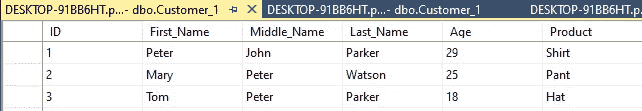

# SQL 中的规范化

> 原文：<https://blog.devgenius.io/normalization-in-sql-46ca5c0afc2d?source=collection_archive---------1----------------------->

我们为什么要标准化数据？这个问题在我们脑海里蹦出来对吧？！井数据通常是非常混乱和肮脏的，有空值、重复、空白和大量冗余数据。

现在我们来看看重复和冗余之间的区别。

## 复制是指创建一个数据的精确副本，正如您在下面看到的，第二条记录被复制，这可能会导致问题。

图 1 重复记录

## 而冗余是指数据中有两个意义相似但不重复的值。

下面是一个例子，你可以看到印度、Bharat 和 IND 的意思是一样的，但是当选择印度时，Bharat 和 IND 将被忽略。

孟买和孟买的情况类似。

图 2 冗余

数据完整性受到冗余和重复数据的挑战。

## 如何摆脱冗余？

答案很简单，你把数据标准化。

1.  **第一个规范化形式** —多值列(同一列有逗号分隔值或多值)

例子—

图 3

在这里，我想将 Watson 改为 Parker，因此为了避免冗余和多值列，我们将拆分列，使它们更加原子化。

图 4

如上表所示，我们将一列分成三列，以避免冗余和列中的多个值。

2.**第二种规范化形式—** 在同一个表中，正常键依赖于主键，即部分依赖，就会出现冗余。

为了解决这种冗余，我们将表一分为二并创建主/引用表，我们需要确保 NON_KEY 列应该直接依赖于主键。

例子—

图 5

拆分表—

图 6

**3。第三种标准化形式—**

一些冗余本质上是暂时的，这意味着非键列依赖于非键列，这违反了第三范式。

从下表可以看出，ID→州，州→国家。因此，我们推断，国家是过渡性依赖于身份证。

图 7

现在我们知道了依赖关系，我们将把表分成两个表，以规范化和解决冗余。

图 8

需要记住的一点是，标准化的增加将会降低性能。

> *这篇文章就到这里，希望你喜欢。如果您能分享这篇文章，并留下您的想法、建议和推荐，我将不胜感激，希望您能不断进步、学习和成长。*
> 
> *下次见，*

# 保持警惕。保持好奇。

# 再见