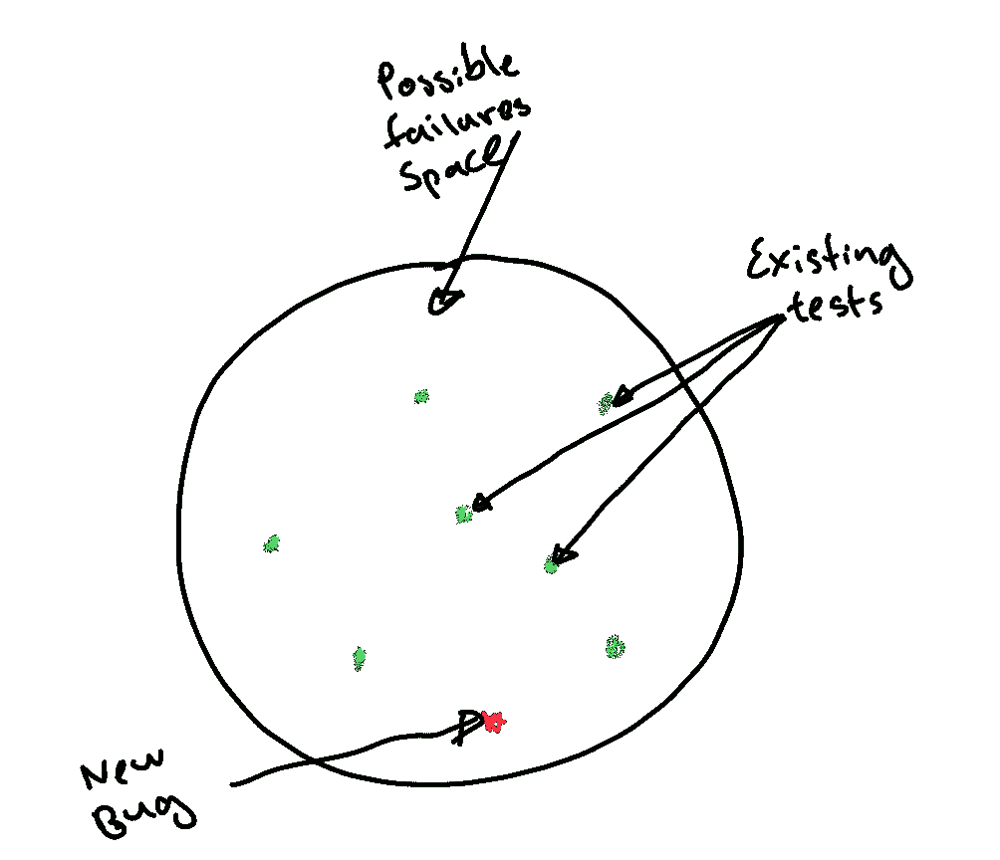

# 不是所有的测试都是相同的，或者有用的，有些甚至是有害的

> 原文：<https://blog.devgenius.io/not-all-testing-is-equal-or-useful-and-some-is-actually-damaging-9b2b130f96f3?source=collection_archive---------6----------------------->

## 软件/测试

## 让我们来探索一些流行的关于测试的信念是如何伤害我们的测试效率的，以及我们能做些什么。

如果你从事编写代码的工作，你很有可能也会为它编写测试。可能大部分都是单元测试。单元测试很小，相对容易，甚至写起来很有趣。跑得快，他们给人这种即时的满足感。哦，我喜欢看那个“绿色酒吧”！

很难低估测试在实现质量方面的重要性。但是，正如标题所说，并不是所有的测试都是平等的，或者有用的，有些甚至是有害的。在这篇文章中，我们将探索如何让天平向我们这边倾斜。

寻找平衡(图片由斯蒂芬·凯勒拍摄)

# 单元测试给了修改代码的信心

作为[白盒](https://en.wikipedia.org/wiki/White-box_testing)，单元测试可以作为变化检测器。
当无意中做出改变时，这可能是有益的。
但是当你想有目的的修改一段代码，几十次测试都失败了怎么办？

问每个开发者什么代码比较容易改？

*   几乎没有其他代码依赖它的代码
*   有很多其他代码依赖于它的代码

任何有经验的人都会认识到，依赖性小的代码更容易修改，因为会出错的地方更少。这意味着我们得到的恰恰与我们试图实现的相反。编写单元测试类似于在代码基础上浇水泥，因为每一个代码的改变都需要测试的协调改变。

> 有人声称，有一种方法可以编写测试，当底层代码发生变化时，它们不需要改变。我不知道这些测试在测试什么，但它不是底层功能，因此没有什么价值。

# 单元测试加速开发

测试不是免费的。测试是代码。我们将它们排列成包和模块。这需要设计和维护。一些研究表明，对于一些团队来说，单元测试可能会多花 30%的开发时间。这里最好有一个很好的投资回报，对吗？

继续阅读关于最大化单元测试 ROI 的技巧。

# 测试比代码更容易理解

这与一个常见的误解有关，即您可以编写比测试代码更简单的测试。一个测试不能比它测试的代码简单。因为它携带的信息比代码少，这样的测试不可能测试底层的代码。除此之外，我们还需要添加所有的‘T8’连线来运行测试(模拟、固定装置、期望等)。)我们最终会得到比被测代码多得多的测试代码。

请看下一节来理解为什么拥有大量的测试代码是不好的。

# 测试比代码更可靠(包含更少的错误)

有时我们会看到这样的说法，你可以在编写测试时更加小心，以使它们没有 bug。不管我们愿不愿意，对于任何数量的代码，我们都会引入一定数量的错误。
不同的统计数据显示，每 1KLOC 有 3 到 50 个错误。
在任何情况下，你的测试代码都会包含与生产代码相同比例的 bug。因为我们知道，通常情况下，我们的测试代码比生产代码多——测试代码比生产代码的失败率高。这意味着在任何给定的时间点，一些测试应该失败，但他们没有失败，或者测试甚至没有测试我们认为它测试的东西，因为有 bug。
这不会让你对绿色条的含义有不同的看法吗，嗯？

对于那些声称能够更好地集中注意力并编写比代码更少 bug 的测试的人来说，一个很好的建议是——在产品代码本身上使用相同的技术。

> 如果我修改了代码，在修改之后，我运行了测试，这个条变成了绿色，这意味着什么？

“如果我更改了代码，在更改代码后我运行了测试，但该条变成了绿色，这意味着什么？”

# 我们编写单元测试，因为它有助于我们发现错误

我们必须认识到，大多数时候我们只做部分的和随机的单元测试。问问你自己你怎么知道什么时候停止写测试？
当你想不出要写更多的测试，或者是时候转移到下一个特性的时候？最终，我们都使用一些(通常是不同的和任意的)“完整性”的概念，比如“每一行至少到达一次”。
问题是覆盖每一行并不能说明代码是否做了它应该做的事情。

但是如何知道它应该做什么呢？

解决方案的关键在于认识到我们不能既是编写代码的人，又是正确代码行为的先知。没有一个外部的、独立的正确行为的预言，我们只是随意猜测要写哪些测试。

# 如果你是一个面向对象的开发者，你的单元不是一个类

当我们大多数人用“OO”语言的一个变种来写的时候，我们陷入了在我们的“单元测试”中实际测试的单元是什么的陷阱。问题是在我们软件的组成单元(类)和我们可以测试的实际代码单元(方法/函数)之间存在阻抗不匹配。因此，虽然我们不能执行一个类，但我们可以执行一个函数。
但是最有趣和最有价值的错误发生在函数之间(在运行时调用函数的调用图来完成任务)。

# 总结:不幸的是，大多数单元测试并没有那么有用

*   追逐报道会适得其反
*   测试不能比代码本身更简单
*   单元测试会使改变底层代码变得困难
*   测试不能保证某样东西有效
*   测试充其量只是取样

# 最大化单元测试 ROI 的技巧

*   集中精力为关键算法编写单元测试，因为这些算法有第三方的正确性预言。系统的这些部分通常是核心，因此很少改变，所以改变的成本随着时间的推移而分摊。
*   删除您无法链接到业务价值的任何测试(如果该测试失败意味着什么)
*   回归测试，其中回归被定义为“在产品中发现并通过测试重现的 Bug”
*   删除经常失败的测试
*   删除根本没有失败的测试
*   如果某些东西可以用系统测试或单元测试来测试——最好用系统测试

此处引用的阅读材料启发了本文:

*   我最伟大的老师和导师之一詹姆斯·科普林的文章[在这里](https://rbcs-us.com/documents/Why-Most-Unit-Testing-is-Waste.pdf)和[在这里](https://rbcs-us.com/documents/Segue.pdf)
*   [测试驱动开发对程序设计和测试覆盖率影响的对比案例研究](https://www.researchgate.net/publication/4279048_A_Comparative_Case_Study_on_the_Impact_of_Test-Driven_Development_on_Program_Design_and_Test_Coverage)
*   杰里·温伯格的《完美软件》