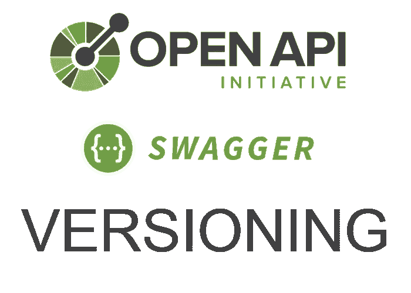
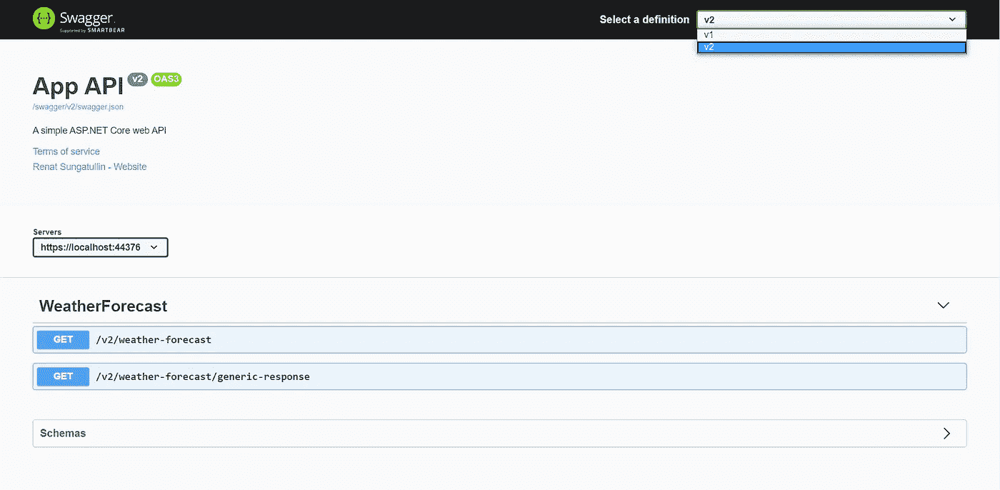
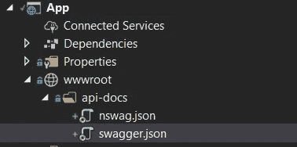

# 使用 NSwag 的多个 API 版本的 C#客户端

> 原文：<https://blog.devgenius.io/nswag-charp-client-from-multiple-api-versions-7c79a3de4622?source=collection_archive---------3----------------------->

> *其他类似文章:* [*C#客户端用泛型支持使用 ns wag*](https://medium.com/dev-genius/nswag-csharp-client-with-generics-support-6ad6a09f81d6?source=your_stories_page---------------------------)[C #保护 Swagger 端点](https://medium.com/dev-genius/csharp-protecting-swagger-endpoints-82ae5cfc7eb1)

之前我分享了一个来自 OpenAPI 规范的关于 C#客户端生成中泛型支持的解决方案。在这篇文章中，我将展示如何在 C#客户端中安排 API 版本并支持它。

*在开始这篇文章之前，我强烈推荐访问* [*上一篇*](https://medium.com/dev-genius/nswag-csharp-client-with-generics-support-6ad6a09f81d6) *。*

# 。νε版本控制

首先，我们需要我们的 *App* 带有 API 版本控制( [*NSwag* wiki API 版本控制](https://github.com/RicoSuter/NSwag/wiki/AspNetCore-Middleware#use-api-versioning))。

*启动*类有变化:

更改后的 Startup.cs

给控制器添加一些版本:

天气预报控制员 V1

天气预报控制员 V2

以下是根据前面的步骤更新的 swagger UI:

有关 API 版本的更多信息，请点击此处:

*   [*https://github.com/microsoft/aspnet-api-versioning/wiki*](https://github.com/microsoft/aspnet-api-versioning/wiki)
*   [*https://github . com/Microsoft/API-guidelines/blob/master/guidelines . MD # 12-版本控制*](https://github.com/Microsoft/api-guidelines/blob/master/Guidelines.md#12-versioning)

# C#客户端生成

现在我们应该意识到如何用这些东西制作一个 C#客户端。

客户端生成的第一个里程碑是模式。在我看来，有两种方法:

*   一个模式中存在多个版本
*   每个版本都有自己的模式

创建模式后，我打算为每个版本生成 API 客户机，然后将它们包装在一个客户机中。

让我们检查两种解决方案。

## 1.一个模式中存在多个版本

如果我们选择第一种方法，那么我们应该为所有版本创建一个统一的模式，并从中生成客户机。

*NSwag* 配置有一个选项*[*OperationGenerationMode*](https://github.com/RicoSuter/NSwag/blob/85ae862fd6d68173a201a79e0ad06e0be2ec5de1/src/NSwag.Commands/Commands/CodeGeneration/OperationGenerationMode.cs)*指定如何生成操作名和客户端类/接口。有*MultipleClientsFromFirstTagAndOperationId*可用值列表中有一个摘要:*“来自第一个操作标签和操作 Id(操作名=操作 ID，客户端名=第一个操作标签)。”***

**它非常适合这个问题，但是在这种情况下，另外，我们应该支持标记来根据版本对客户端进行分组。**

**以下是我得到的信息:**

**新版本的 *csproj* 脚本几乎是一样的:**

**修改了 *nswag.json* 和文件结构:**

****

**已更改文件结构**

**最后一步是包装客户端。随它去吧 [T4 模板](https://docs.microsoft.com/en-us/visualstudio/modeling/design-time-code-generation-by-using-t4-text-templates?view=vs-2019):**

**这是模板编译后的 API 客户端包装:**

**关于变更的几点说明:**

*   ***VersionTaggingOperationProcessor*为每个操作添加版本标签**
*   **在 *nswag.json* 中更改的*clientClassAccessModifier*隐藏了不同版本的 *ApiClients* 以防止外部使用(仅暴露 API 客户端包装)**
*   ***AppApiClientWrap.tt* 模板解析结果 *swagger.json* 以获取其中呈现的版本**

**结果解决方案你可以在这里找到。**

## **2.每个版本都有自己的模式**

**由于每个版本都应该有自己的模式和自己的客户端，所以它的生成保持不变，但会多次出现:**

**更改 *nswag.json* 配置:**

**为 API 客户端创建入口点:**

**这是模板编译后的 API 客户端包装:**

**关于变更的几点说明:**

*   **[*项目组*](https://docs.microsoft.com/en-us/visualstudio/msbuild/msbuild-batching?view=vs-2019) 替换 *csproj* 中的*属性组***
*   ***nswag.json* 有一个新的变量 *ClientNamespace* ，这是因为每个版本的 API 客户端都是独立的，不会因类名而冲突**
*   ***nswag.json* 有一个新变量 *SwaggerPath* ，它指定了在哪里可以找到特定版本的 *swagger.json***
*   **`dotnet orang replace` exec task 得到`IgnoreExitCode="true"`，因为如果目标文件中没有匹配项，工具会产生错误退出代码**
*   ***AppApiClient.tt* 模板解析 *App.csproj* 以获取*项目组*中呈现的版本**

**结果解决方案你可以在这里找到。**

# **概述**

**在本文中，我展示了如何使用 *NSwag* 在 C#生成的客户端中支持版本控制。同样的方法可以应用于 TypeScript 客户端和其他客户端。**

**这两个解决方案的最终代码可以在我的知识库中找到，链接在**参考**部分。**

# **参考**

** [## Rynaret/SwagGenSample(一个架构)

### 如何使用 NSwag 从具有泛型支持的 OpenAPI 规范生成 C#客户端的示例…

github.com](https://github.com/Rynaret/SwagGenSample/tree/feature/api-versioning-clients-from-one-schema)  [## Rynaret/SwagGenSample(多模式)

### 如何使用 NSwag 从具有泛型支持的 OpenAPI 规范生成 C#客户端的示例…

github.com](https://github.com/Rynaret/SwagGenSample/tree/feature/api-versioning-clients-from-multiple-schemas)  [## RicoSuter/NSwag

### 路线图| SDK 开发| Contribute ASP.NET(核心)中间件:自动化/CLI:GUI:NSwagStudio(Windows GUI)编辑…

github.com](https://github.com/RicoSuter/NSwag/wiki)  [## 使用 NSwag 支持泛型的 C#客户端

### 最近，我在使用 NSwag 生成 C#客户端时遇到了泛型支持的困难。我做了一些研究…

medium.com](https://medium.com/dev-genius/nswag-csharp-client-with-generics-support-6ad6a09f81d6)  [## Microsoft/aspnet-API-版本控制

### 版本控制是任何成熟 web 服务的一个重要方面。微软发布了 REST API 指南，要求…

github.com](https://github.com/microsoft/aspnet-api-versioning/wiki)  [## 微软/api 指南

### 文档编辑:约翰·戈斯曼(C+E)，克里斯·穆林斯(ASG)，加雷思·琼斯(ASG)，罗布·多林(C+E)，马克·斯塔福德(C+E)

github.com](https://github.com/Microsoft/api-guidelines/blob/master/Guidelines.md#12-versioning)**