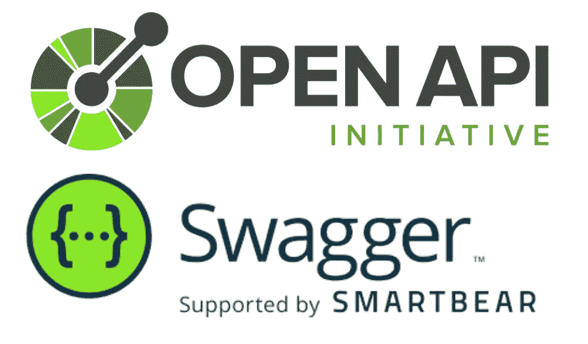
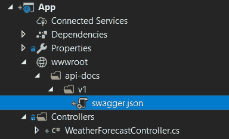
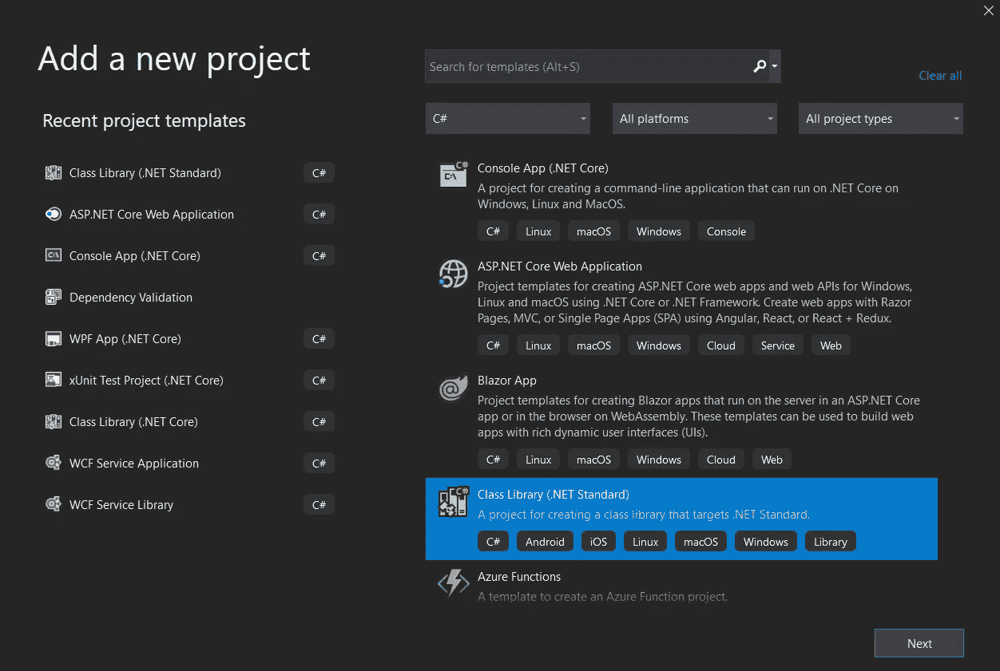
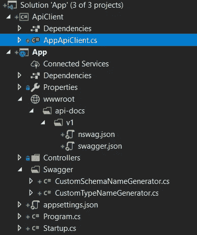

# 使用 NSwag 从支持泛型的 OpenAPI 规范中获得 C#客户端

> 原文：<https://blog.devgenius.io/nswag-csharp-client-with-generics-support-6ad6a09f81d6?source=collection_archive---------1----------------------->

> *其他类似文章:* [多个 API 版本的 C#客户端使用 NSwag](https://medium.com/dev-genius/nswag-charp-client-from-multiple-api-versions-7c79a3de4622)[C#保护 Swag 端点](https://medium.com/dev-genius/csharp-protecting-swagger-endpoints-82ae5cfc7eb1)



最近，我在使用 NSwag 生成 C#客户端时遇到了泛型支持的困难。我做了一些研究，试图找到解决办法。因此，在本文中，我将与您分享如何使用 NSwag 优化 C#客户端代码生成的解决方案。

*我使用默认的 Web API 项目作为起点(创建说明可以在* [*这里*](https://docs.microsoft.com/en-us/aspnet/core/tutorials/first-web-api?view=aspnetcore-3.1&tabs=visual-studio#create-a-web-project) *找到)。*

# 模式的生成

首先，我们需要一个模式。在 *nswag* [知识库](https://github.com/RicoSuter/NSwag/wiki/AspNetCore-Middleware)中有一个文档说明了如何从 c# ASP.NET(Core)控制器添加 OpenAPI 3.0 规范的 NSwag 生成。

Startup.cs —配置 OpenAPI

接下来，我们将自动生成*wag . JSON*文件以供进一步使用。可以通过多种方式完成。我决定选择[*ms build*](https://github.com/RicoSuter/NSwag/wiki/NSwag.MSBuild)*因为这种方法可以避免团队成员原本应该做的额外动作。 *NSwag。MSBuild* 转到包参考，并通过恢复*numget*包来安装解决方案。*

*App.csproj 添加了 NSwag。MSBuild 包和目标“SwaggerToFile”*

*构建*应用*后，出现*swag . JSON*文件:*

**

*解决方案资源管理器中的 swagger.json*

# *模式中的泛型*

*很简单，不是吗？但是仿制药呢？
如果我们希望任何 API 响应都有一个包装的响应结构，该怎么办？让我们为 API 响应创建一个新的泛型类，而不是枯燥的 [*操作结果*](https://github.com/dotnet/aspnetcore/blob/master/src/Mvc/Mvc.Core/src/ActionResultOfT.cs) *:**

*API response . cs—API 请求的自定义响应模型*

*为了测试的目的，我们在*weatherforestcontroller*上增加了以下动作:*

*WeatherForecastController.cs*

*我们在 *csproj* target 中有一个神奇的脚本，所以在构建 *App 之后，*应该会出现一个更新的 *swagger.json* 文件。下面是一个结果:*

*swagger.json*

*唉，出事了。模式中有`ApiResponseOfIEnumerableOfWeatherForecast` 。它看起来与理想世界相去甚远。我们能用它做什么？深挖问题，定制！*

*NSwag 有很多机会改变行为，无论是代码还是模式生成([文档处理器和操作处理器](https://github.com/RicoSuter/NSwag/wiki/Document-Processors-and-Operation-Processors)， [NJsonSchema](https://github.com/RicoSuter/NJsonSchema) )。*

*自定义`SchemaNameGenerator` 和`TypeNameGenerator`应该有助于解决我们的问题:*

*CustomSchemaNameGenerator.cs*

*CustomTypeNameGenerator.cs*

*关于这些类的几句话:*

*   **customschemanamegenerator . cs*更改模式名，例如`ApiResponseOfIEnumerableOfWeatherForecast` 转到`ApiResponse<IEnumerable<WeatherForecast>>`*
*   **custom typename generator . cs*在类型生成过程中跳过模式名称的任何更改，只是从模式中返回相同的名称(您可以与[*DefaultTypeNameGenerator*](https://github.com/RicoSuter/NJsonSchema/blob/958afa39a8386a6f02bf6604aca742e4d18acb61/src/NJsonSchema/DefaultTypeNameGenerator.cs)进行比较，后者删除了尖括号和其他括号)*

*剩下的最后一件事就是把它全部打开。*

*Startup.cs —使用自定义生成器更新*

*再一次 *App* 重建后， *swagger.json* 文件转化为如下:*

*定制后的 swagger.json*

*看起来好多了。*

*接下来，我们转到客户端生成部分。*

# *客户生成*

*好了，现在我们有了一个很好的模式。但是 API 客户端呢？对于客户端生成，我们可以使用相同的 *NSwag* 工具。*

**NSwag* 工具使用特定的配置文件来生成 C#客户端。我使用命令`nswag new`创建一个默认文件(更多关于命令[的信息在这里](https://github.com/RicoSuter/NSwag/wiki/CommandLine#execute-nswag-configuration-document))。*

*结果文件:*

*nswag.json*

*与默认配置文件的不同之处在于:*

```
*"defaultVariables": "OutDir="
"url": "swagger.json"
"namespace": "AppApiClient"
"output": "$(OutDir)"*
```

*然后，我们需要在 *csproj* 文件中为客户端生成添加一个新的目标:*

*添加了目标“CsharpClientGeneration”的 App.csproj*

*剩下最后的动作:创建 *ApiClient* 项目，重新构建 *App* 。*

**ApiClient* 项目是一个简单的类库。*

**

*ApiClient 项目创建*

*现在重建 *App 后，*执行 *CsharpClientGeneration* 目标，和 C#客户端出现在*/API client/appapi client . cs*中。*

**

*解决方案资源管理器中的 AppApiClient.cs*

*在 *AppApiClient.cs* 中有这样的代码行:*

*AppApiClient.cs*

*生成的客户端没有得到泛型支持，很可悲:(*

# *支持泛型*

*GitHub 上有一些问题:*

*   *[使用自定义泛型类#1139 生成 C # dto](https://github.com/RicoSuter/NSwag/issues/1139)*
*   *[增加描述仿制药的扩展#23](https://github.com/RicoSuter/NJsonSchema/issues/23)*

*现在似乎没有完美的解决方案。但是有没有变通的办法呢？*

*最简单的方法是改变生成文件的内容。还有 [*MSBuild 任务*](https://docs.microsoft.com/en-us/visualstudio/msbuild/msbuild-tasks?view=vs-2019) 和更现代的 [*dotnet 工具*](https://docs.microsoft.com/en-us/dotnet/core/tools/global-tools) 。*

*在[loresoft/msbuildtasks](https://github.com/loresoft/msbuildtasks)GitHub 资源库中有 MSBuild 社区任务项目，不幸的是它不支持 NET Core。在[natem cmaster/dot net-tools](https://github.com/natemcmaster/dotnet-tools)GitHub 存储库中有一个工具列表。*

*我选择网络工具，因为它是现代\_(ツ)_/*

*工具列表中有[JosefPihrt](https://github.com/JosefPihrt)/[Orang](https://github.com/JosefPihrt/Orang)GitHub 库，非常适合我们的案例。它的描述是*“使用的力量搜索、替换、重命名和删除目录、文件及其内容。NET 正则表达式"*。这个工具的版本是 *0.1.0-rc* ，但是据说只用于 *App* 构建，在运行时不会用到，所以 *rc 没有问题。**

*新 *csproj* 目标中的集成`orang replace`命令:*

*添加了目标“MakeItGenericAgain”的 App.csproj*

*在 *App* 重建后客户端看起来更好，现在我们已经生成了类，例如`public partial class ApiResponse<IEnumerable<WeatherForecast>>`产生了……编译错误。*

*排除问题类应该有所帮助:*

*nswag.json*

*这不是一个理想的解决方案，但是通常，d to 是与服务器共享的，不需要在客户机上生成它们。所以我创建了这样一个通用库 *App。ApiDtos* 和修改后的 *nswag.json:**

*nswag.json 和其他名称空间用法*

# *LF 和 CRLF 线结束*

*在使用 *NSwag 的过程中，*我注意到有时 git 客户端中有变化而没有变化。当然是 *LF* 和 *CRLF。**

**NSwag* 生成以 *LF* 结尾的文件。让我们在`orang`的帮助下再次修复。 *csproj* 目标*makeit generic gain:*的最后一块*

*带有更新目标" *MakeItGenericAgain* "的 App.csproj*

# *概述*

*NSwag 是一个如何编写正确库的例子。这是一个非常灵活和可定制的工具。我的文章给出了如何为我们独特的案例定制这些神奇工具的想法。当然，你们都可以更进一步，调整自己的不便之处。*

*最终的*应用*你可以在我的资源库中找到，链接在**参考**部分。*

****更新:*** 你也可以阅读 Renat Sungatullin 的《 [C#客户端来自多个 API 版本使用 NSwag](https://link.medium.com/mZ1n7x7k87) 》*

# *参考*

*[](https://github.com/Rynaret/SwagGenSample/tree/nswag-generation-with-generics) [## Rynaret/SwagGenSample

### 如何使用 NSwag 从具有泛型支持的 OpenAPI 规范生成 C#客户端的示例…

github.com](https://github.com/Rynaret/SwagGenSample/tree/nswag-generation-with-generics) [](https://github.com/RicoSuter/NSwag/wiki/AspNetCore-Middleware) [## RicoSuter/NSwag

### 包装:NSwag。AspNetCore.NETStandard 1.6+，。NET 标准 2.0，。网芯和。NET 4 . 5 . 1+NuGet 包提供了…

github.com](https://github.com/RicoSuter/NSwag/wiki/AspNetCore-Middleware) [](https://github.com/natemcmaster/dotnet-tools) [## natem cmaster/dot net-工具

### 的工具扩展列表。NET 核心命令行(dotnet CLI)，又名为’。NET 核心全球工具。提示:💡全球工具…

github.com](https://github.com/natemcmaster/dotnet-tools) [](https://github.com/JosefPihrt/Orang) [## JosefPihrt/Orang

### Orang 是一个跨平台的命令行工具，用于:所有这些命令都由。NET 正则表达式引擎…

github.com](https://github.com/JosefPihrt/Orang)*