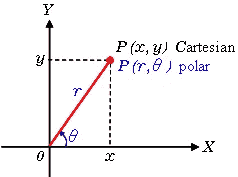
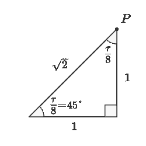

# 裸体模特第一部分:模特

> 原文：<https://blog.devgenius.io/nude-models-part-i-setters-77ac784a91f3?source=collection_archive---------8----------------------->

## 可靠的数据结构及其有争议的(写)访问。

使用对象作为数据结构是一种既定的实践，它产生了许多与软件的可维护性和发展相关的问题，并且误用了 50 年前提出的优秀概念。在这第一部分我们将反思对 ***写*** *这些对象的访问。*

在他 1972 年的经典论文[中，David Parnas](https://en.wikipedia.org/wiki/David_Parnas) 为现代软件工程定义了一个新颖且基础的概念:[**信息隐藏。**](https://en.wikipedia.org/wiki/Information_hiding)

规则很简单:

> 如果我们隐藏我们的实现，我们可以根据需要多次修改它。

在 [Unsplash](https://unsplash.com/s/photos/hide?utm_source=unsplash&utm_medium=referral&utm_content=creditCopyText) 上由 [Dmitry Ratushny](https://unsplash.com/@ratushny?utm_source=unsplash&utm_medium=referral&utm_content=creditCopyText) 拍摄的照片

在帕纳斯的论文之前，没有关于信息访问的明确规则，深入数据结构并不是一种有问题的做法，这种做法会惩罚任何具有可怕连锁反应的变化。

让我们看看如何建模一个笛卡尔点:

点结构

任何操纵这些点的软件组件都将耦合到将值保存为笛卡尔 *x* 和 *y* 坐标(**意外实现**)。

因为它只是一个没有操作的数据结构，所以根据每个程序员的标准，属性的语义会有所不同。

 [## 耦合:唯一的软件设计问题

### 对我们软件的所有故障进行根本原因分析，会发现一个有多种伪装的单一罪魁祸首。

codeburst.io](https://codeburst.io/coupling-the-one-and-only-software-design-problem-869e293a9f04) 

因此，如果我们想将点的**意外**实现更改为其极坐标模拟:

极点

同一点可以用两种不同的方式来表示

极坐标表示(√2，π/8)等价于笛卡尔坐标(1，1)

既然是现实世界中的**同一点**，那么在我们的双射中**必然**由同一个物体来表示。

 [## 唯一的软件设计原则

### 如果我们在一个单一的规则上建立我们的整个范式，我们可以保持它的简单并做出优秀的模型。

codeburst.io](https://codeburst.io/the-one-and-only-software-design-principle-5328420712af) 

双射总是依赖于我们试图建模的方面的**主观性**。为了画多边形，笛卡尔(1，1)点和极坐标(√2，π/8)点是同一点。

如果我们正在编写 [Wolfram](https://www.wolframalpha.com/) 语义，那么尝试表示几种可能的数学表示的情况会有所不同。在这种情况下,**是问题的一部分，因此它们将由不同的**对象来建模。

## 解决办法很简单。隐藏内部表示。

正如 Parnas 所预测的，许多代码可维护性问题通过**将决策**封装在定义它们的模块中得以解决。这就是这篇宏伟论文的全部内容。

## 进化的下一步

随着面向对象编程的到来，封装和信息隐藏的概念被发挥到了极致。我们不再讨论封装在一个**模块**中，而是在同一个**对象**中。

回到前面的例子，我们从:

朝向代表性的改变:

> 一个好的设计是对象与责任(**接口**)而不是表现相结合。

因此，如果我们定义一个好的点**接口**，它们可以任意改变它们的表示(甚至在运行时)，而不会传播任何连锁反应。

当表现形式改变时…

…一切都继续正常工作。

## 算法和数据

如果我们用旧规则工作:

> 程序=算法+数据结构

…然后我们可以用*设置器*和*获取器*构建优秀的软件。

本文假设我们渴望用声明性对象来构建模型，其中实现隐藏在对象的责任后面。

这些责任在这些对象和现实世界之间的映射上是相同的。

 [## 软件有什么问题？

### 软件正在吞噬世界。我们这些工作、生活和热爱软件的人通常不会停下来思考它的…

codeburst.io](https://codeburst.io/what-is-software-9a78c1172cf9) 

## 乘方；错综复杂、纠缠不清；内卷

尽管上面的例子中列出了一些好处，但当前的技术水平向我们展示了许多与耦合和纹波效应相关的问题。大多数是由使用*设置器*和*获取器*(或者简单地说:访问器)的根深蒂固的习惯产生的。

Johannes Plenio 在 [Unsplash](https://unsplash.com/s/photos/evolution?utm_source=unsplash&utm_medium=referral&utm_content=creditCopyText) 上拍摄的照片

让我们把 setters 和 getters 作为独立的问题来看。

## 安装员

改变对象的内部状态违反了不变性原则。这是不鼓励的，因为在现实世界中，对象的本质不会发生变化。

 [## 变种人的邪恶力量

### 变异就是进化。它是由查尔斯·达尔文爵士提出的，我们在软件行业中使用它。但是有些事情是…

codeburst.io](https://codeburst.io/the-evil-powers-of-mutants-f803281ef82e) 

> 唯一允许写入属性的方法是原子初始化。从那时起，变量应该是只读的。

如果我们忠实于双射，我们会注意到从来没有形式为 ***setAttribute*** 的消息..()在现实世界中。这些是程序员使用的实现技巧，它们破坏了好的模型。

> 我们永远无法从名称上向业务专家解释这些方法有什么责任。

让我们把多边形想象成一个数据结构。

> 让我们假设多边形至少有三个顶点。

作为一个数据结构，我们不能强加这样的限制。

使用我们惊人的自动代码生成 IDE，我们添加了*设置器*和*获取器*。

让我们尝试在构造函数中添加对顶点数量的约束:

从现在开始，将不可能创建少于三条边的多边形，从而实现与欧几里得几何的真实世界的双射。

除非我们用我们的二传手…

没有什么可以阻止我们运行这段代码:

此时，我们有两个选择:

1.  在构造器和设置器中复制业务逻辑。
2.  永久消除 setter，支持不变性

在接受重复代码的情况下，当我们的限制增加时，涟漪效应开始扩散。例如，如果我们把前提条件变得更强:

> 让我们假设多边形至少有三个不同的顶点。

根据我们的设计原则，正确的答案是第二个。

# 不变量验证的重复或缺失逻辑

许多对象都有不变量来保证它们的内聚性和表示的有效性，以维持真实世界的双射。允许部分设置(一个属性)将迫使我们在不止一个地方控制**中的表示不变量，生成**重复代码**，这在修改一个引用并忽略其他引用时总是容易出错。**

# 无控制生成的代码

许多开发环境为我们提供了自动生成 setters 和 getters 的可能性。这导致新一代程序员认为这是一个好的设计实践，产生了难以纠正的恶习。

 [## 懒惰 II:代码向导

### 代码生成器完成了我们的艰苦工作。但是我们不再需要它们了。

codeburst.io](https://codeburst.io/lazyness-ii-code-wizards-18cc5672b642) 

这种设施传播了问题，拥有这种工具给人的感觉是这是一种公认的做法。

# 推荐

*   不要使用*设定器*。这样做没有充分的理由。
*   拥有名为***setsometh*…()**的方法是一种代码味道。
*   没有公共属性。实际上，它就像是有*设置器*和*吸气器*。
*   没有公共静态属性。除了上面提到的，这些类应该是无状态的，这是一个*代码气味*显示了一个被用作全局变量的类。
*   避免[贫血的对象](https://en.wikipedia.org/wiki/Anemic_domain_model)(只包含属性没有责任的对象)。这是一个*代码气味*暗示双射体上有一些丢失的对象。

 [## 代码气味 01——贫血模型

### 你的对象是一堆没有行为的公共属性。

medium.com](https://medium.com/dev-genius/code-smell-01-anemic-models-f9fb5a1323b3)  [## 气味代码 28 —设定器

### 初级程序员做的第一个练习。ide、教程和高级开发人员不断教他们这种反模式。

mcsee.medium.com](https://mcsee.medium.com/code-smell-28-setters-5b0e764049aa) 

# 结论

使用 setters 会产生耦合并阻止我们的计算机系统的渐进发展。对于本文所陈述的论点，我们应该尽可能地限制它的使用。

# 吸气剂

和 setters 一样，getters 是不被鼓励的。在本文中，我们将深入探讨这一主题:

 [## 裸体模特第二部分:吸气剂

### 旧的可靠数据结构及其有争议的(读)访问。

medium.com](https://medium.com/dev-genius/nude-models-part-ii-getters-b039e5ad3427) 

这一系列文章的部分目标是为软件设计的辩论和讨论提供空间。

 [## 目标设计清单

### 这是已经发表的软件设计文章的索引。

medium.com](https://medium.com/@mcsee/object-design-checklist-47c63d351352) 

我们期待着对这篇文章的评论和建议。

这篇文章还有西班牙语版本[点击这里](https://medium.com/dise%C3%B1o-de-software/information-showing-chapter-i-setters-138deb558e5d)。