# 早期复古电脑上的裸照——可能吗？

> 原文：<https://blog.devgenius.io/nude-pictures-on-early-retro-pcs-was-it-possible-3434b5c0447e?source=collection_archive---------0----------------------->

JPEG 图像格式于 1993 年推出，GIF 于 1987 年发布。有可能在这台 1983 年生产的可爱的便携式电脑上观看裸照吗？

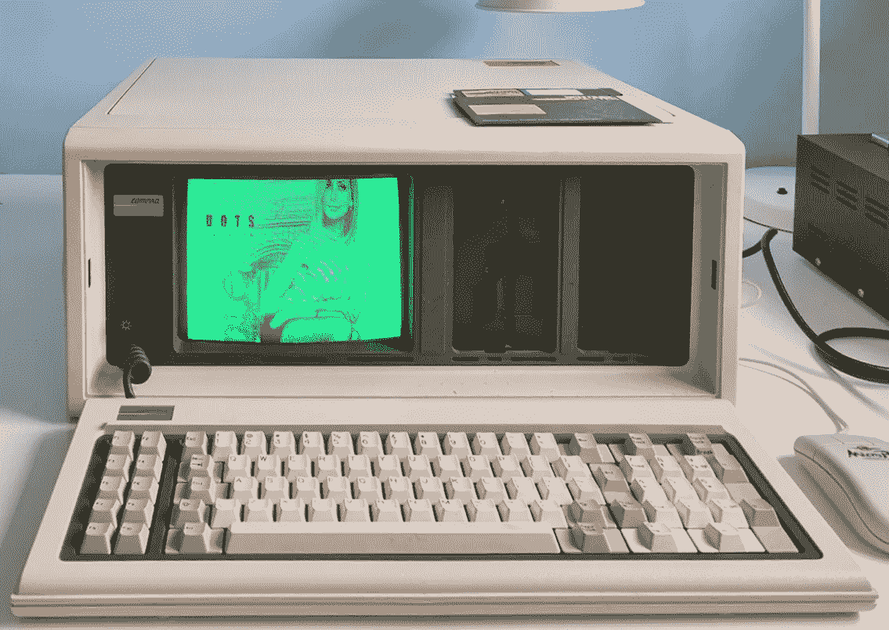

在发表了对我的康柏笔记本电脑的评测后，我收到了一位读者的提问。答案并不像我们想象的那么简单。让我们弄清楚。

# 五金器具

首先，让我们谈谈硬件和它的可能性——在早期的个人电脑上有可能观看*的任何*照片吗？显然，70 年代的大型机和超级计算机能够处理照片图像，但这些计算机并不为普通大众所用。第一台个人电脑 **Altair 8800** ，[于 1975 年发布](/how-to-write-a-program-for-altair-8800-computer-3a4583fe601e)，一位开心的主人能够使用开关进入程序，并使用 led 观看结果:

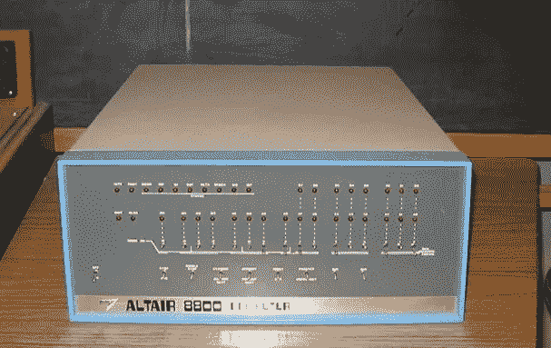

牛郎星 8800 维基百科

甚至有一些游戏是为这台机器制作的，像“杀死钻头”这样的标题可以让读者了解游戏本身，显然没有机会在这台设备上看到任何照片。

在 70 年代末，装有 CP/M 操作系统的计算机出现了，这是一个完全成熟的操作系统，有文件系统、磁盘驱动器、编译器、程序和游戏。但是有一个问题——CP/M UI 只有文本。理论上，可以使用 ASCII 图形来显示如下内容:

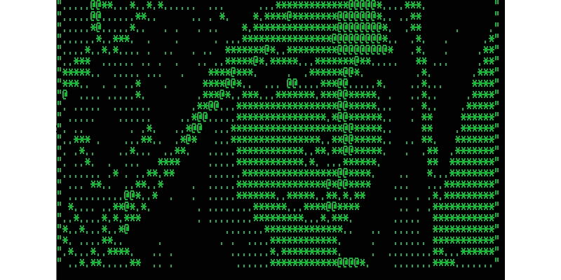

ASCII 格式的“Lenna”图像[https://en.wikipedia.org/wiki/Lenna](https://en.wikipedia.org/wiki/Lenna)

但它可以被视为一个有趣的把戏，而不是一个真正的照片。一些 CP/M 机器，像一台 [Visual 1050](https://en.wikipedia.org/wiki/Visual_1050) 计算机，实际上具有图形能力，尽管没有通用的标准。

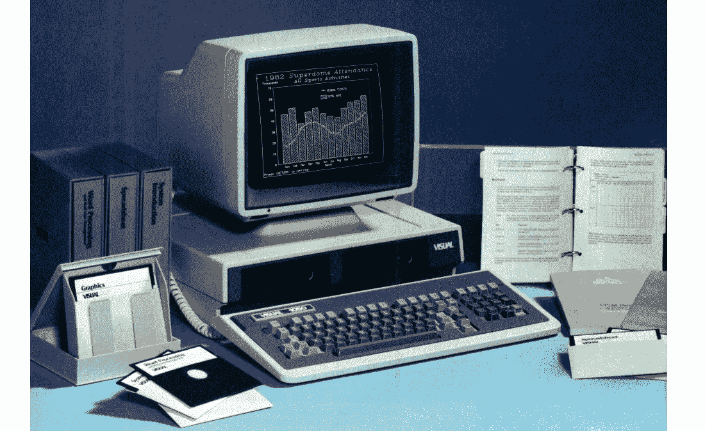

一台“视觉 1050”CP/M 计算机[https://www.vintagecomputing.com](https://www.vintagecomputing.com/)

CP/M 最早可用的格式之一是 RLE，它以 256×192 的分辨率对黑白图像进行编码。实际上，图像可能看起来像这样:

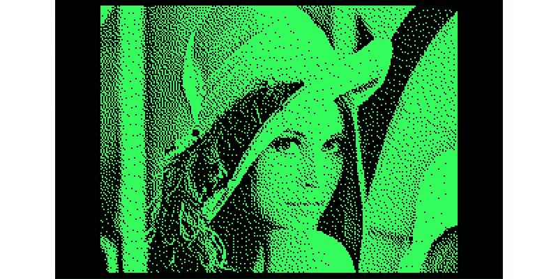

正如我们所见，它远非完美，但仍然比纯 ASCII 好得多。这种格式的单色图像大小约为 6 KB，因此在 CP/M 90 KB 软盘上，最多可保存 14 张这种质量的照片。

后来计算机硬件变得更加强大。CGA(彩色图形适配器)于 1981 年推出，MS-DOS 计算机能够以 4 种颜色显示分辨率高达 320x240 的图形。这种质量的图片可能看起来像这样:

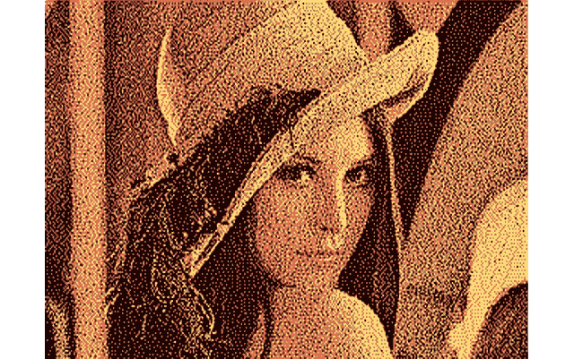

这种格式的图像大小约为 40 KB，因此在一张 360 KB 的软盘上可以放置 8 个图像。几年后，1987 年推出的 **VGA** 适配器能够显示 256 色图像，比照片真实得多:


这张图片的大小为 77 KB，因此 5-6 张图片可以保存在 720 KB 的 1.44 英寸软盘上。后来，在 80 年代末推出的 **SVGA** (超级视频图形阵列)适配器能够使用 16M 颜色显示高达 1280x1024 分辨率的照片级图像，这实际上与我们今天拥有的类似。

80 年代和 90 年代还出现了其他电脑型号(苹果、Commodore、ZX Spectrum 等)，它们都有可能显示不同类型的图形。一一列举太无聊了，我希望，读者已经对硬件有了大致的了解，现在让我们来谈谈软件。

# 图像来源

人们对 80 年代早期的个人电脑硬件性能应该或多或少有所了解，但图像本身呢？首先，让我们找到一个更基本的问题的答案——一般来说，那时有裸照吗？答案是肯定的。实际上，著名的 [Lenna 图像](https://en.wikipedia.org/wiki/Lenna)(见上图)，如今是图像处理算法测试的一种标准，是 1973 年南加州大学使用扫描仪和惠普 2100 计算机对《花花公子》杂志进行的照片扫描。

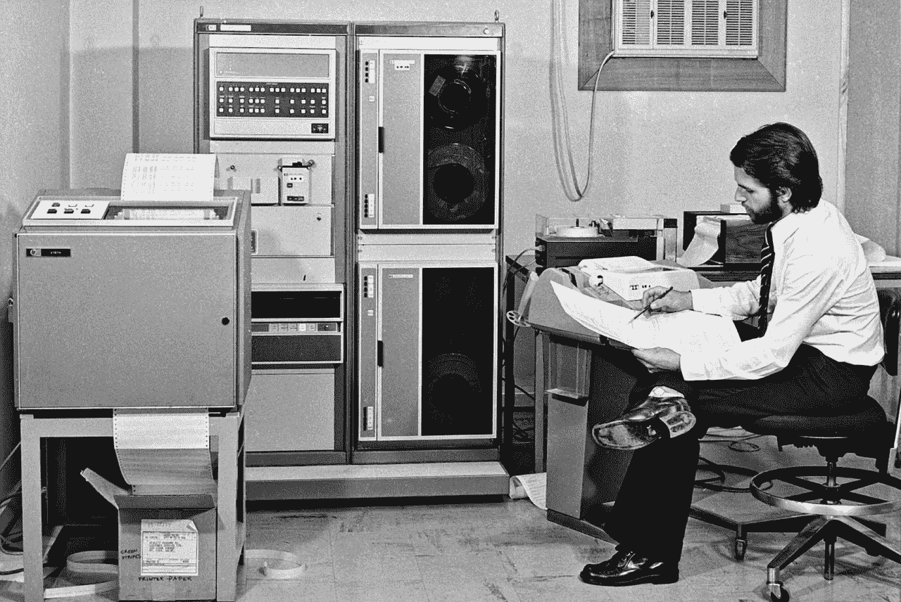

70 年代的 HP 2100 计算机[https://en.wikipedia.org/wiki/HP_2100](https://en.wikipedia.org/wiki/HP_2100)

瑞典模特 Lenna Sj Blom 显然是一个有魅力的女人(全尺寸照片可以在这里找到),但老实说，现在没有人会记得 1973 年的旧照片。只是因为这篇科学出版物，“Lenna”图片成为计算机历史上使用最多的图像之一。当然，这张照片不是为了分享裸体而扫描的，而是作为科学工作的一个例子。但不管怎样，图像扫描技术在 70 年代就已经出现了，到了 80 年代，软盘成了保存和复制文件的廉价而可靠的存储工具。这张 5-1/4 英寸的软盘大小为 360 KB，旁边放了一张 MicroSD 卡用于大小比较:

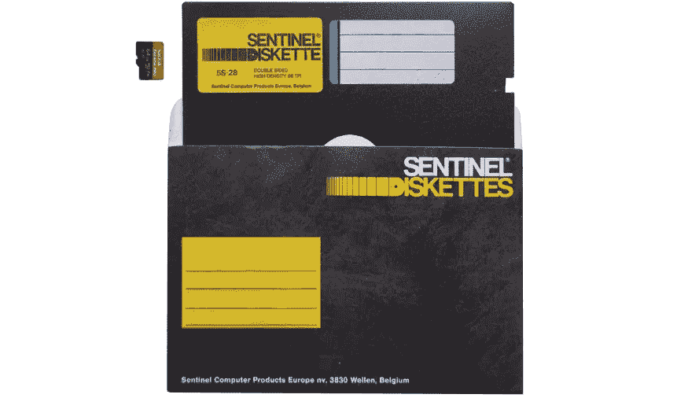

因此，我认为在 80 年代，数字图像是可用的，可以很容易地在计算机用户之间共享。当然,“成人图像”绝对是一种稀罕物，图像扫描仪并不面向大众。

# 图像格式

先有鸡还是先有蛋？图像还是图像格式？首先是图像。在最简单的情况下，不需要“格式”，单色图像只是一个比特序列:


因此，如果我们知道图像的宽度和高度，并且计算机具有图形能力，那么每个开发人员都可以编写一个程序，从二进制文件中“按原样”显示图片。

顺便说一下，在谈论“自定义”图像格式时，提到 1985 年发布的游戏“脱衣扑克”很有趣:

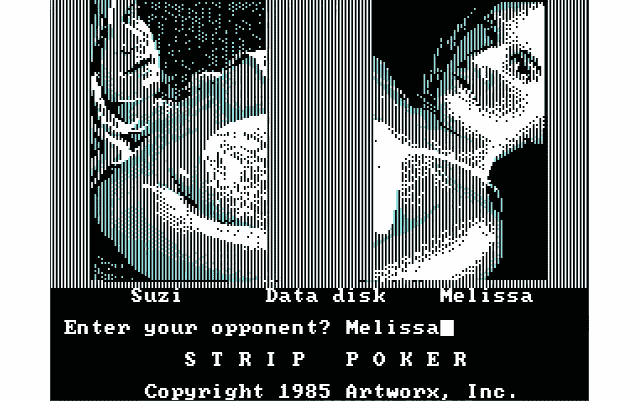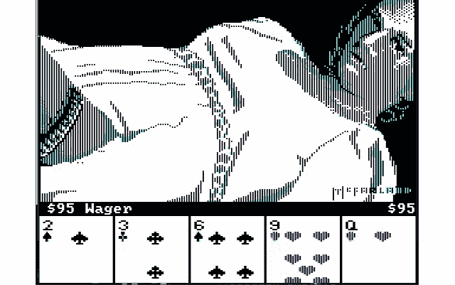

我们可以看到，在第一个屏幕上，玩家可以选择两个人物之一，“紫苏”或“梅丽莎”，第二个屏幕是游戏本身。如果我们打开游戏文件夹，很容易看到这两个角色的数据文件只是“按原样”保存，根本没有压缩，所有文件的大小都一样:

```
 1:03 AM             71 Melissa.txt
12:18 AM           5768 Melissa1.pic
12:18 AM           5768 Melissa2.pic
12:19 AM           5768 Melissa3.pic
12:20 AM           5768 Melissa4.pic
12:21 AM           5768 Melissa5.pic
 5:40 AM             35 Opn.txt
12:04 AM           5768 Opps.pic
12:59 PM          50304 Poker.exe
 1:06 AM           1288 Screen.pic
12:03 AM           5768 Stitle.pic
 5:09 AM             69 Suzi.txt
12:02 AM           5768 Suzi1.pic
 1:33 AM           5768 Suzi2.pic
12:00 AM           5768 Suzi3.pic
12:01 AM           5768 Suzi4.pic
12:00 AM           5768 Suzi5.pic
```

游戏开发人员尽了最大努力来最小化大小——每个文件的大小只有 5768 字节，这给了我们一个 320x18 的灰度图像。事实上，我们可以使用 Python 打开 pic 文件，发现许多细节都丢失了:

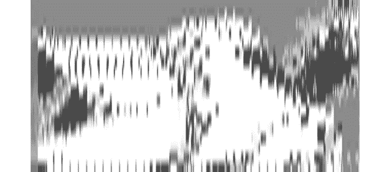

很可能这个游戏使用了一个单独的背景图像或者以编程的方式绘制了一些细节(比如垂直线)，开发者肯定使用了一些技巧来有效地在 320x240 的屏幕上显示 320x18 的图像。他们为什么花这么大力气？答案很简单——当时许多电脑根本没有硬盘，因此将游戏写入软盘的能力至关重要。正如我们已经知道的，第一张软盘只有 360 KB 大小——这对于游戏和 MS-DOS 引导文件来说都足够了。而开发者居然做到了，游戏大小只有 140 KB。

当然,“按原样”保存图像会占用大量空间，开发人员试图找到更好的保存数据的方法。最早的图像编码方法之一是 **RLE** ( [游程编码](https://en.wikipedia.org/wiki/Run-length_encoding))。在这种格式中，每个数据块都存储在“计数，值”对中，这允许更有效地保存图像。作为一个简化的例子，黑白点序列“BWWWWBWWWW”可以保存为“1B3W1B4W”。正如我们所看到的，它是*更紧凑一点，可以很好地用于图形或表格，但对于照片级的图像，“压缩”后的图像甚至会比原始图像更大。*

最早广泛使用的格式之一是 1985 年推出的 **PCX** ( [图片交换](https://en.wikipedia.org/wiki/PCX))。这种格式也使用了 RLE 编码，正如我们所看到的，报头字段存储了许多附加信息:

```
// Standard PCX header (C/C++)
struct PCXHeader {
     char   ID;           // ID, always 0x0A
     char   Version;      // The version number
     char   Encoding;     // Use of encoding (0, 1)
     char   BitPerPixel;  // 1, 2, 4 or 8
     short  X1;   // The minimum x-coordinate of the image position
     short  Y1;   // The minimum y coordinate of the image position
     short  X2;   // The maximum x coordinate of the image position
     short  Y2;   // The maximum y coordinate of the image position
     short  HRes; // The horizontal image resolution in DPI
     short  VRes; // The vertical image resolution in DPI
     char   ClrMap[16*3]; // The EGA palette for 16-color images
     char   Reserved1;
     char   NumPlanes;    // Number of color planes: 1, 3, or 4
     short  BPL;          // The number of bytes of one color plane
     short  Pal_t;
     char   Filler[58];
} Header;
```

PCX 格式实际上不太适合保存照片图像，例如，320x240 分辨率的相同“Lenna”图像在 16 色格式下的大小为 35 KB，在 256 色格式下的大小为 100 KB。

**GIF** ( [图形交换格式](https://en.wikipedia.org/wiki/GIF))发布于 1987 年，与 PCX 相比，它要先进得多。GIF 使用 LZW 的伦佩尔-齐夫-韦尔奇算法进行数据压缩，这种算法效率更高——同样的 320x240 图像，以 GIF 格式保存，只有 37 KB 大小，而 PCX 则有 100 KB。1989 年发布了 GIF 的扩展版本，它也能显示动画。令人惊讶的是，甚至今天还在使用动画 gif，甚至在本文中也可以看到这个例子——这仍然是最简单的、跨平台的将动画内容嵌入页面的方法。

最后，在 1992 年推出了 **JPEG** (由[联合图像专家组](https://en.wikipedia.org/wiki/JPEG)制作)格式。它使用有损压缩，是专门为保存照片图像而设计的。该算法使用 DCT ( [离散余弦变换](https://en.wikipedia.org/wiki/Discrete_cosine_transform))来保存数据，该方法本身是在 1972 年提出的，但正如我们所看到的，仅在 20 年后，公众对该技术的真正需求才出现。

顺便说一下，在 90 年代，色情图片的销售变成了一门生意。从技术角度来看，从 1994 年的 PC 杂志上看到这些广告很有趣:


图片来源 PC Mag 1994 年 6 月

如今，一个“超过 2500 张 VGA 图片”或“超级 VGA 1024x768x256 图片”的收藏只能引起一笑，但在当时这是一种高科技。

# 结论

让我们回到最初的问题——80 年代初在 XT 机器上看裸照可能吗？从技术上来说，答案是肯定的。这些机器能够显示图像，并配有软盘驱动器，这使得文件共享变得容易。这是在一台 1983 年生产的康柏便携式电脑上看到的过程:

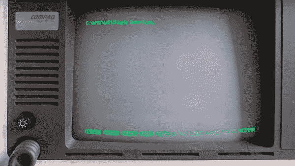

正如我们所见，它不是很快，图像加载时间约为 40s，但它仍然工作。

但实际上，这台电脑是 1983 年发布的。PCX，GIF 或 JPEG 图像格式在这个时候还没有推出。很有可能，一些定制的图像格式是可用的——编码很简单，几乎每个学生或程序员都能够制作单色图像的简单查看器。更有甚者，在 MS-DOS 之前使用的 CP/M OS 上有图像浏览器。所以，我很确定一些“成人图片”可能已经在电脑用户之间共享了，比如在校园里，但是我找不到任何证据。我能够为 MS-DOS 找到不同的图像浏览器，但它们都是在 90 年代后期制作的:

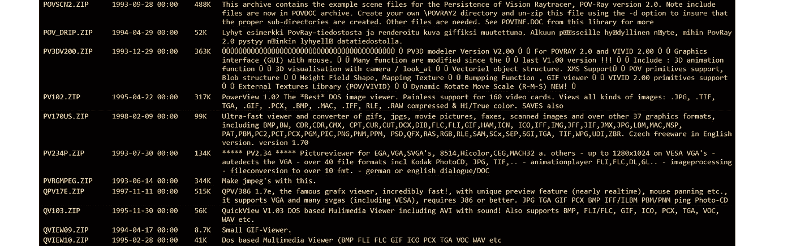

所以真正的答案还是开放的。如果有人在 80 年代使用图像扫描、浏览或编辑软件，或者有人可能有这种图像的例子，请在评论中写下，我会将这些信息添加到文章中。

感谢阅读。欢迎那些对更多细节感兴趣的人阅读这款 Compaq Plus 便携式电脑的评论。关于使用 MS-DOS 的更多信息发表在[的另一篇文章](https://debugger.medium.com/you-can-still-use-an-ms-dos-laptop-in-2021-d43fa10a8211)中。