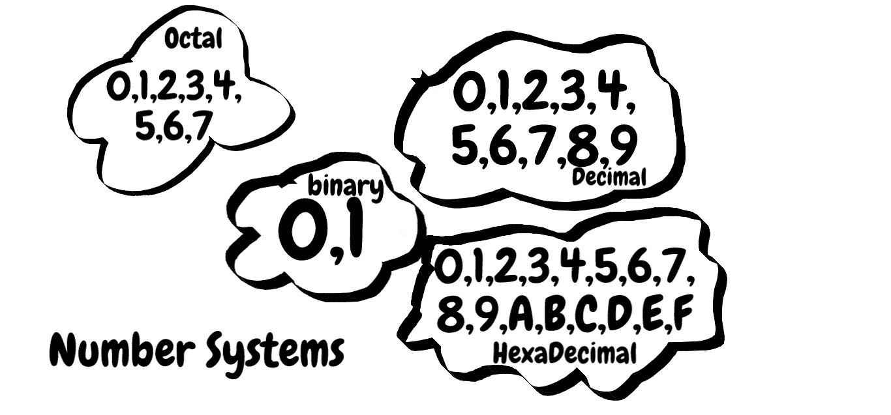

# 用 C++实现数制及其转换

> 原文：<https://blog.devgenius.io/number-systems-and-their-conversions-using-c-5b1ea99f200b?source=collection_archive---------0----------------------->

## 数系是在计算机系统中表示数字的技术。



作为一名程序员，拥有数系的基础知识是必不可少的。我们有四种主要的数字系统:

1.  小数
2.  二进制的
3.  八进制的
4.  十六进制的

## 1.小数

我们日常生活中最常用的数字系统是小数。这个数字系统以 10 为基数，所有的数字都是由十个数字组成的:0，1，2，3，4，5，6，7，8，9。在十进制数字系统中，每个位置代表 10 的特定幂。这里有一个例子:

```
1562 = 1 * 10³ + 5 * 10² +6 *10¹ +2*10⁰
     = 1*1000 + 5*100 + 6*10 + 2 
      one thousand five hundred sixty two
```

## 2.二进制的

它是一个以 2 为基数的数字系统，使用两个数字 0 和 1。在计算机科学中，单个数字被称为位，它是计算机中最小的内存单位。在二进制数中，每个位置代表 2 的特定幂。让我们看一个例子:

```
1010 = 1*2³ + 0*2² + 1*2¹ + 0*2⁰
     = 1*8 + 0*4 + 1*2 + 0*1
     = 8 + 0 + 2 + 0
     = 10
// That means 1010 in binary is equvilent to 10 in decimal number system.
```

**3。八进制**

它是一个以 8 为基数的数字系统，使用八个数字 0，1，2，3，4，5，6，7。在八进制数中，每个数字的位置都有一个权重，它等于 8 的特定幂。这里有一个例子:

```
25624 = 5*8⁴ + 5*8³ + 6*8² +2*8¹ + 4*8⁰
      = 5*4096 + 5*512 + 6*64 + 2*8 + 4*1
      = 23444
// That means 25624 in octal number system is equivalent to 23444 in decimal number system
```

## 4.六进制

十六进制数字系统，也称为 hex，是一种使用 10 个数字和 6 个字母的 16 进制数字系统:0，1，2，3，4，5，6，7，8，9，A，B，C，D，E，f。

```
HexaDecimal      decimal 
A                10
B                11
C                12
D                13
E                14
F                15
```

在计算机系统中，存储 32 位或 64 位数据是一项困难的任务。因此，这些 32 位或 64 位数据被排列成 4 位组，并转换为十六进制数字系统。十六进制中每个数字或字母的位置代表 16 的特定幂。

```
Example: 
8A1F = 8*16³ + 10*16² + 1*16¹ + 15*16⁰
     = 8*4096 + 10*256 + 1*16 + 15*1
     = 35359
//It implies that 8A1F in hex is equivalent to 35359 in decimal
```

# 转换策略

## 任何十进制数字系统

正如我们所看到的，在上面的所有例子中，每个数字或字母的位置代表新基数的特定幂。我们将利用它把任何基数转换成十进制数。

```
int toDecimal(string number,int base)
{
    int decimal= 0;
    int size = number.length();
    for(int i=0; i<size; i++) //check for each position
    {
        //calculate digit * base^position for each position

        if(number[i]>='A') // if it has more than 10 digits
        {
            ans += (number[i]-'A'+10) *pow(base,size-i-1);
        } 
        else
        {
            ans += (number[i]-'0') *pow(base,size-i-1);
        }
    }
    return ans;
}
```

## 十进制到任何数字系统

要将十进制转换为另一种基数，我们可以遵循以下步骤:

1.  用新的基数除十进制数，并将当前小数替换为商。
2.  将余数存储到一个列表中。
3.  如果十进制数不等于 0，请转到步骤 1。
4.  将所有余数以相反的顺序保存到一个字符串中。

让我们将 12(十进制)转换成二进制(二进制)

```
division         quotient             remainder
12/2              6                   0
6/2               3                   0
3/2               1                   1
1/2               0                   1list of remainders : 0 0 1 1
reverse of list    : 1 1 0 0list to string : 1100(base-2)
```

在我们的程序中，我们不是将余数存储在一个列表中然后反转它，而是在这里使用一个堆栈来保存余数。在我们的程序中，“singleDigitPreprocess”函数将根据新的基数将余数转换为数字或字母。

```
char singleDigitPreprocees(int n)
{
    if(n<10) return n+'0';
    else if(n >= 10){
        return 'A'+(n-10);
    } 
}string decimalTo(int decimal,int base = 16)
{
    stack<char> remainders;
    if(decimal == 0) return "0";
    while(decimal > 0)
    {
        char rem = singleDigitPreprocees(decimal%base);
        decimal = decimal/base;
        remainders.push(rem);
    } string any_base = ""; 
    while(!remainders.empty())
    {
        any_base += remainders.top();
        remainders.pop();
    }
    return any_base;
}
```

如果我们知道如何将一个基数为 10 的数转换成任何基数，以及如何将任何基数转换成基数为 10 的数，我们就可以将任何基数转换成任何其他基数。

假设我们要将一个基数为 2 的数转换为基数为 8 的数。一种方法是，首先，我们将把二进制数转换成十进制数，然后十进制数转换成八进制数。但是也有其他方法，将一个数制转换成另一个数制。例如，要将一个数从二进制转换为八进制，我们可以使用一个简单的技巧。诀窍是首先从最右边的位置将大小为 3 的位分组，然后将这些组转换为十进制，因为从 0 到 7 的数字在两种(十进制和八进制)数字系统中是相同的。如果一组 3 没有完成，我们可以在最左边的位置添加额外的 0。

```
Lets convert 10101(base-2) to octal
10101 => 010 101010(base-2) = 2(base-10) = 2(base-8)
101(base-2) = 5(base-10) = 5(base-8)10101(base-2) => 010 101 => 2 5 => 25(base-8)
```

所有转换的 C++代码可以在[这里](https://github.com/InternityFoundation/DS-ALGO_Rajendra_Prajapat/tree/master/Number%20System%20Conversion%20Project)找到。