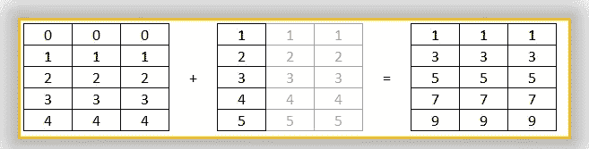
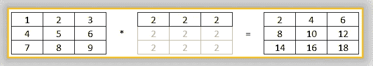
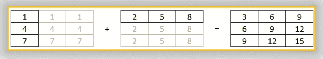

# Numpy 广播公司:寻找引擎盖下

> 原文：<https://blog.devgenius.io/numpy-broadcasting-looking-under-the-hood-64dcfd08cc8c?source=collection_archive---------23----------------------->

简单介绍 Numpy 如何在不同大小的数组之间执行计算。


Alessandro Cerino 在 [Unsplash](https://unsplash.com/s/photos/radio?utm_source=unsplash&utm_medium=referral&utm_content=creditCopyText) 上拍摄的照片

就相同形状的 n 数组之间的算术运算而言，它是无缝的。但是，当我们遇到不同形状的阵列时，我们会陷入困境，了解屏幕后面到底是什么可以让我们免于大量的头脑风暴。

在这个简短的解释中，我们将从相同形状之间的一些基本算术运算开始，然后是不同形状，然后我们将看到 Numpy 在广播其数组时遵循什么规则。

我们先来了解一下 Numpy 上下文中的“广播”到底是什么意思。

如果我们想给数组的所有值加 1，那么我们可以用下面的方法来做

```
[In]: arr = np.array([1,2,3,4,5])
[In]: arr_ones = np.array([1,1,1,1,1])
[In]: print (arr + arr_ones)[Out]:[2 3 4 5 6]
```

```
[In]: arr = np.array([1,2,3,4,5])
[In]: print (arr + 1)[Out]:[2 3 4 5 6]
```

在后一个示例中，我们在具有不同形状的 ndarrays 之间执行计算，这是通过特性**广播**实现的。

因此，基本上广播试图做的是匹配数组的形状(通过扩展更短的数组)来执行操作。让我们想象一种方式(不是 NumPy 做这件事的确切方式，只是为了更好地理解)—


图 1:向阵列广播数字

类似地，当涉及多维数组之间的操作时，扩展一个较小的数组，直到它匹配较大的数组，就像这样—

```
[In]:arr1 = np.array([[0,0,0],
                     [1,1,1],
                     [2,2,2],
                     [3,3,3],
                     [4,4,4]])
[In]:arr2 = np.array([[1],
                      [2],
                      [3],
                      [4],
                      [5]]) 
[In]:print(arr1 + arr2)[Out]:[[1 1 1]
       [3 3 3]
       [5 5 5]
       [7 7 7]
       [9 9 9]]
```



图 2:水平广播

```
[In]:arr1 = np.array([[1,2,3],
                      [4,5,6],
                      [7,8,9]])
[In]:arr2 = np.array([[1, 2, 3]]) 
[In]:print(arr1 * arr2)[Out]:[[2 4 6]
       [8 10 12]
       [14 16 18]]
```



图 3:垂直广播

当两个数组具有不同的形状时，上述技术是正确的，但是当元素的数量大致相同时，比如说，(3，1)和(1，3)，扩展两个数组，直到它们具有相同的形状。

```
[In]:arr1 = np.array([[1],
                      [4],
                      [7]])
[In]:arr2 = np.array([[2, 5, 8]]) 
[In]:print(arr1 +arr2)[Out]:[[3 6 9]
       [6 9 12]
       [9 12 15]]
```



图 4:双向广播

到目前为止，我们看到的例子遵循一定的规则，这使得广播成为可能。让我们来看看这些规则，以及如果某些阵列不符合这些规则，可以采取什么措施—

*如果数组具有不同的维数，例如(4，)& (4，3)，则在维数较小的数组的左边加 1，在这种情况下，(4，)将变成(1，4)。

*如果数组具有不同的长度，例如(1，4)和(4，3)，并且其中一个数组的长度为 1，则用另一个数组的长度替换 1。这里我们把(1，4)中的 1 换成 4(来自(4，3))得到(4，4)。

在这两个步骤之后，如果两个数组没有相同的形状，那么我们会得到一个错误，比如(4，4)和(4，3)。

```
[In]:x = np.array([1,2,3,4])
[In]:y = np.array([[0,0,0],
              [1,1,1],
              [2,2,2],
              [3,3,3]])
[In]:x + y
[out]:
-------------------------------------------------------------------
ValueError                    Traceback (most recent call last)
<ipython-input-16-cd60f97aa77f> in <module>
----> 1 x + y

ValueError: operands could not be broadcast together with shapes (4,) (4,3)
```

所以，这里有一个简单的解决方法-

只需转换较小数组的维数。在上面的例子中，(4，)在幕后被转换成(1，4)，但是相反，如果我们把它转换成(4，1)我们自己，并把下一步留给 Numpy 去把它转换成(4，3)(还记得步骤 2 吗？)，那么我们没有错误。

```
[In]:x = x.reshape(4,1)
[In]:print(x + y)[Out]:[[1 1 1]
       [3 3 3]
       [5 5 5]
       [7 7 7]]
```

上述规则可以应用于 ndarray 的任何维度。希望，这将有助于您下次在 Numpy 数组上执行任何操作时，想象屏幕后面的事情是如何进行的。

感谢阅读。