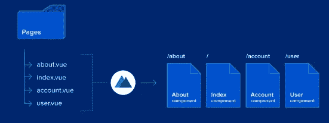

# 下一个 web 应用程序的 Nuxt.js

> 原文：<https://blog.devgenius.io/nuxt-js-for-your-next-web-application-c1ca60e52fa?source=collection_archive---------9----------------------->

[Nuxt.js](https://nuxtjs.org/)

如果你是 Vue.js 的发明者，现在你应该听说过 Nuxt.js，但是你可能不知道所有的宣传是关于什么的。你可能会问，**为什么我需要一个框架来制作一个框架？**

Vue 以前使 JavaScript 应用程序的开发更容易。Nuxt.js 背后的理念是什么？

在这篇文章中，我们将讨论为什么你可能想在未来的应用中使用 Nuxt.js 的主要原因。

## Nuxt.js 是什么？

uxt.js 是一个创建 Vue.js 应用的框架。它的目标是帮助 Vue 开发者以一种快速、简单和有组织的方式利用顶尖技术。

## 轻松创建通用应用程序🌍

> 构建通用应用程序可能会很乏味，因为您必须在服务器端和客户端都进行大量的配置。
> 
> 该框架具有开发高性能通用应用程序的优势，特别是能够在服务器端和客户端执行其代码。
> 
> Nuxt 是一个创建通用 Vue 应用程序的框架。这意味着它为您的项目提供了一个结构，为您处理更复杂的服务器配置，并允许在各种环境中部署相同的代码库。

## 神奇的文件系统路由

> 当您在`*pages*`目录中创建一个`*.vue*`文件时，您就拥有了无需额外配置即可工作的基本路由，它会根据 pages 目录中 vue 文件的文件树自动生成 Vue 路由器配置..

## 默认的大项目结构

> 默认的 Nuxt.js 应用程序结构为以可理解的方式组织应用程序提供了一个很好的起点。Nuxt 应用程序的文件夹结构包括以下文件和文件夹目录，我们将逐一查看，以确定它们代表什么。

NuxtJs 中有 **8** 个主子目录:

*   **组件:**在这个目录中，我们可以存储我们将在主应用程序中使用的所有组件。与 NextJs 或 ReactJs 不同，我们不必在 NuxtJs 中手动导入页面中的组件。js 会自动扫描组件并将其导入页面。
*   **页面:**在这个目录中，我们可以为我们的 NuxtJs 应用程序创建页面。你只需要创造一个新的。vue 文件创建一个新页面。之后，NuxtJs 将自动扫描页面，并为应用程序创建路由器。您也可以通过在“pages”目录中创建新文件夹来创建嵌套页面。
*   **资产:**在这个目录中，我们可以存储我们将在应用程序中使用的不同类型的资产，如图像、字体、音频文件、徽标和样式。
*   **插件:**在这个目录中，我们可以添加将要在 NuxtJs 应用程序中使用的插件。安装插件后，我们必须在插件目录下为插件创建一个新文件。
*   **Static:** 在这个目录中，我们将存储不会改变的静态文件，如 robot.txt、sitemaps 或 favicons。
*   **中间件:**这是一个可以在渲染页面或布局之前执行的功能。我们可能有各种各样的原因想要这样做。路由保护是一种常见的用法，我们可以检查 Vuex 存储中的有效登录或验证一些参数(而不是在组件本身上使用 validate 方法)。中间件的另一个用途是基于路由和参数生成动态面包屑。这些功能可以是异步的，这意味着在中间件解决之前，不会向用户显示任何内容。
*   **布局:**定义了我们的应用程序可以使用的所有布局。这是一个添加共享全局组件的好地方，这些组件在应用程序中使用，例如页眉和页脚。默认情况下，用于的模板。pages 目录中的 vue 文件是“default.vue”。它需要注入页面的所有组件、文本、资产和数据。
*   **商店:**包含您的 Vuex 商店文件。Vuex 商店自带 Nuxt，但默认情况下是禁用的。在这个目录中创建`index.js`文件启用存储。
*   **nuxt.config.js:** 这是您的 NuxtJs 应用程序的配置文件。您可以通过创建插件部分来添加新模块。您还可以使用这个 nuxt.config.js 文件覆盖 NuxtJs 文件的默认设置。

## 带有服务器端渲染(SSR)的 SEO

> SSR 提供了更好的 SEO、更快的初始加载和缓存页面的能力，但通常意味着更多的服务器请求和整页重新加载。将 SSR 与客户端框架(如 Vue)的优点结合起来，可以提供丰富的用户交互和 DOM 就地更新，使 Nuxt 成为一个很好的解决方案。

## 自动代码分割(预呈现页面)

> 在为 Vue.js 组件生成路由时，Nuxt.js 为每个路由和页面创建单独的构建文件，从而避免在每次页面加载时都必须加载项目中的每个组件。仅加载当前页面上的组件，从而缩短加载时间。
> 
> 这个过程被称为自动代码分割，从大代码库中创建小代码块。通过这些更小的块，Nuxt.js 以更小的单位分配内存，确保那些真正需要它的文件得到它。并且 Nuxt.js 为所有项目自动处理这个问题。

*   应用程序是预先呈现或生成的
*   不需要服务器
*   静态的。html 文件
*   免费托管(如 Github 页面、Netlify)
*   搜索引擎优化
*   快速页面加载

## 巨大的社区支持👥

> 在选择一项技术时，一件重要的事情是它背后的社区支持，因为你总是需要一个社区来共同成长。
> 
> 有一个叫做 **Nuxt 社区**的[GitHub 集合](https://github.com/nuxt-community)，它编译有用的库、模块、初学者工具包等等，让创建你的应用变得更加容易。

# 结论

所有这些特性使得 Vue.js 应用程序的开发成为一种更好的体验。事实上，如果你不需要一个通用的应用程序，并且想坚持使用 SPA，使用 Nuxt.js 仍然有好处。它可以是你的项目的主要基础，具有类似`.vue`文件、ES6 编译和许多其他功能的好处。

[***Nuxt.js 备忘单***](https://www.slideshare.net/ValeriaCastillo71/nuxtjs-cheatsheet)

我很想听听其他人对这种设置的反馈，我可以如何改进它，任何需要改变或可以做得更好的地方，等等。