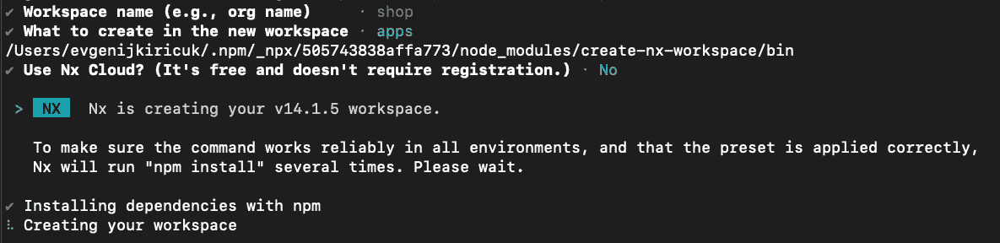
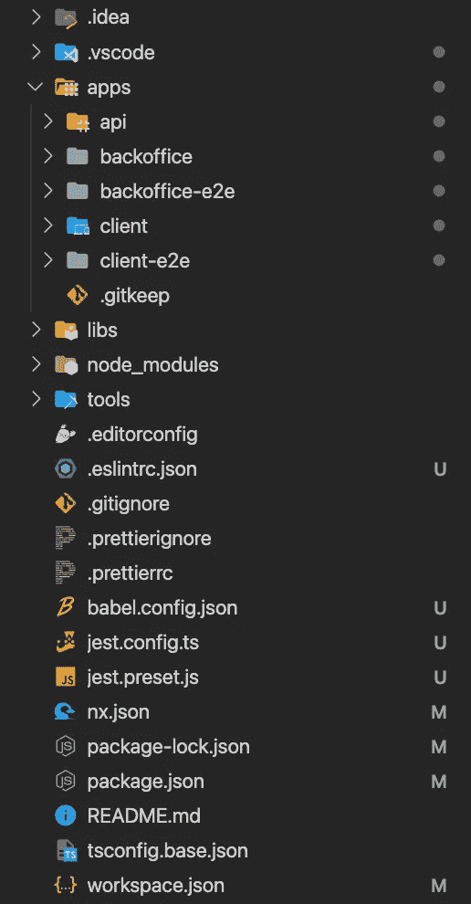
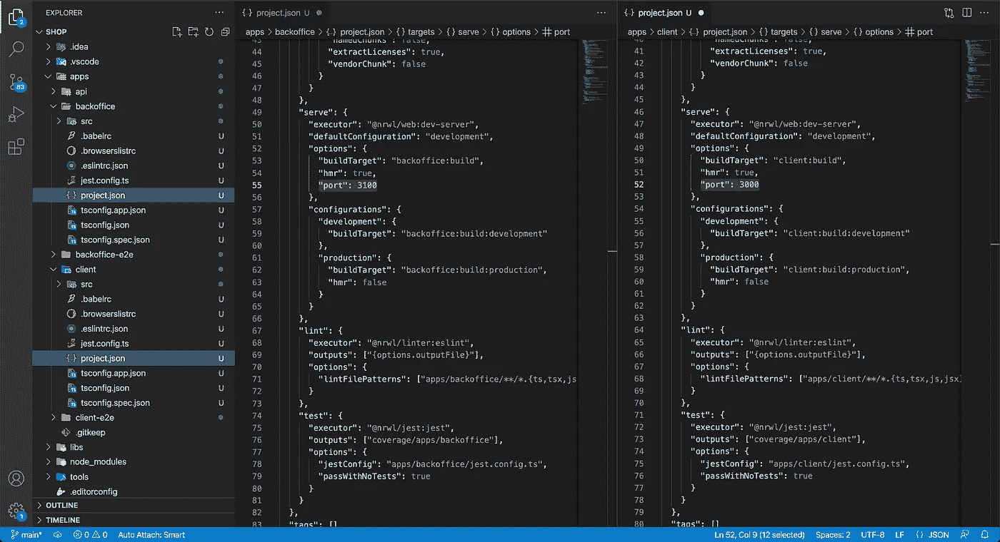
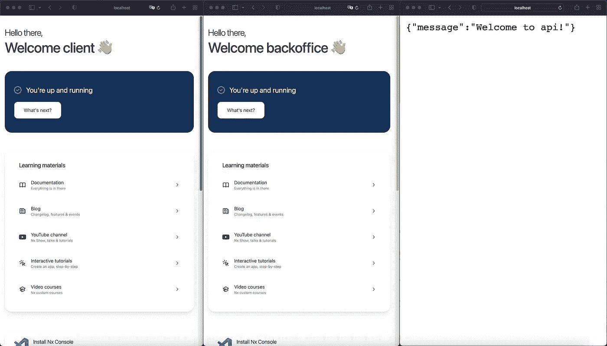
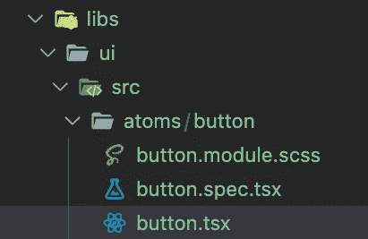

# 在 5 分钟内设置好多应用环境

> 原文：<https://blog.devgenius.io/nx-monorepo-why-and-how-71310504aa29?source=collection_archive---------3----------------------->

## Nx monorepo:如何以及为什么？

# 介绍

您是否考虑过如何在多个应用程序之间共享组件？或者如何让后端和前端应用程序使用来自同一来源的相同数据模型？所以你也想到了 monorepo 的设置。

让我向您展示如何轻松设置 monorepo，并强调这种方法的利与弊。

管理单一回购协议有很多方法。你可以在这里查看 monorepo 工具(以及更多有用的东西)的完整列表。

我选择了 [NX 构建系统](https://nx.dev/getting-started/intro)，它提供了 monorepo 管理、代码生成插件和加速开发的集成。

# NX monorepo 概念

> 典型的 Nx 工作空间由*“apps”*和*“libs”*构成。这种区别允许我们通过遵循关注点分离方法，将我们的源代码和逻辑组织成更小、更集中和高度内聚的单元，从而拥有更模块化的架构。
> 
> Nx 自动在`tsconfig.base.json`文件中创建 TypeScript 路径映射，这样它们可以很容易地被其他应用程序或库使用。
> 
> `import { Button } from '@shop/ui';`
> 
> 因此，使用库非常简单，类似于您在以前的项目中可能已经习惯的方式。
> 
> 然而，与仅仅将代码分离到文件夹中相比，拥有一个专用的库项目是一个更强的界限。每个 Nx 库都有一个所谓的*“公共 API”*，用一个`index.ts`桶文件表示。这迫使开发人员进入一种*“API 思维”*的状态，即什么应该公开，从而可供其他人使用，而什么应该在库本身内部保持私有。

在[文档](https://nx.dev/structure/applications-and-libraries)中阅读更多信息。

# 设置 monorepo

让我们用两个前端 react 应用程序和一个 nest 后端应用程序来设置项目。例如，拥有客户应用程序、后台应用程序和 API 后端服务器的在线商店。

*   生成一个空的 nx 工作空间:
    

Nx CLI 将提示您命名工作区(在我们的示例中为“商店”)，选择工作区类型(在我们的示例中为“反应”)，键入第一个应用程序名称(在我们的示例中为“客户端”)，并选择使用或不使用 Nx 云(在我们的示例中为“否”)。

*   生成后台 react app:
    `nx g @nrwl/react:app backoffice`
*   安装嵌套生成器:
    `npm install --save-dev @nrwl/nest`
*   生成服务器 app:
    `npx nx g @nrwl/nest:app api`

此时，您的文件结构应该如下所示:

为了定义应用程序将被服务的端口，向`project.json`文件的`serve.options`部分添加一个新字段`"port":3000`用于客户端应用程序，添加`"port":3100`用于后台应用程序。

是时候一起运行所有应用了:
`nx run-many --target=serve --projects=client,backoffice,api`

现在，您的终端显示了在端口 3000 和 3100 上运行的两个 react 应用程序以及在端口 3333 上运行的 server 应用程序。让我们检查一下。

## 你刚刚看到了什么？

我们刚刚使用 4 个命令在 3 分钟内创建了具有基本文件夹、文件结构以及构建、服务、lint 和测试流的 3 个应用程序吗？

是的，测试和林挺*启动器*也被创建。但是还有更多的。

 [## 每当叶夫根尼·基里丘克发表文章时，就收到一封电子邮件。

### 每当叶夫根尼·基里丘克发表文章时，就收到一封电子邮件。关于 web 开发、生产力、黑客的内容！立即加入！通过签名…

medium.com](https://medium.com/subscribe/@kirichuk) 

# 添加共享组件

为了共享组件或数据模型，我们必须首先创建库。

*   生成库:
    `nx g @nrwl/react:lib ui`
*   用一个简单的按钮组件生成一个`atoms`文件夹:
    `nx generate @nrwl/react:component button --project=ui --directory=atoms --export`

让我们检查一下`ui/atoms`库。

这是我接触 Nx 后印象深刻的一点。

唯一的命令在`ui`库中创建 atoms 文件夹、简单的`button.tsx`组件、样式表文件、测试套件和用于`ui`库导出的全局别名。该组件已经从库中导出，可供应用程序使用。一个命令，而不是没完没了地开始为每个新组件编写。

这太棒了。不是吗？

现在我们可以这样使用按钮组件:
`import {Button} from "@test/ui";`

# Monorepo 使用案例

这个列表是无止境的，所以让我突出我在 monorepo 的第一天就发现的最有用的案例。

*   几个前端应用程序之间的共享组件。
*   一个用于前端和后端应用程序的 typescript 数据模型源。
*   一个 API 为前端和后端应用程序路由源代码。

# Monorepo 优势

*   所有团队成员的透明代码库。
*   一组依赖关系。
*   无痛的项目范围重构。
*   不同的团队共享最佳实践和开发文化。
*   在一个地方配置 CI/CD。
*   入职和开发环境设置变得更快。

# Monorepo 缺点

*   不可能只允许访问特定的应用程序。
*   CI/CD 变得更加难以设置。
*   需要规则来保持提交历史的可读性。

# 结论

一旦我尝试了 monorepo，就感觉无穷无尽的新机会被打开了。

我清楚地知道，这样的方法不适合许多团队和项目。同时，我相信有很多团队和项目 monorepo 可能会带来很多好处。

如果还没有尝试使用 monorepo，请在评论中分享你的观点。

彻尔斯。

 [## 每当叶夫根尼·基里丘克发表文章时，就收到一封电子邮件。

### 每当叶夫根尼·基里丘克发表文章时，就收到一封电子邮件。关于 web 开发、生产力、黑客的内容！立即加入！通过签名…

medium.com](https://medium.com/subscribe/@kirichuk)