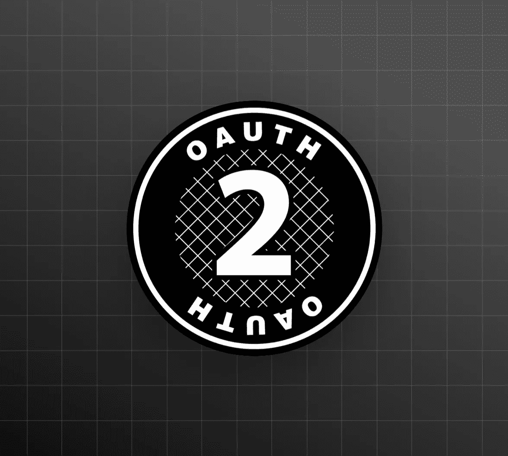
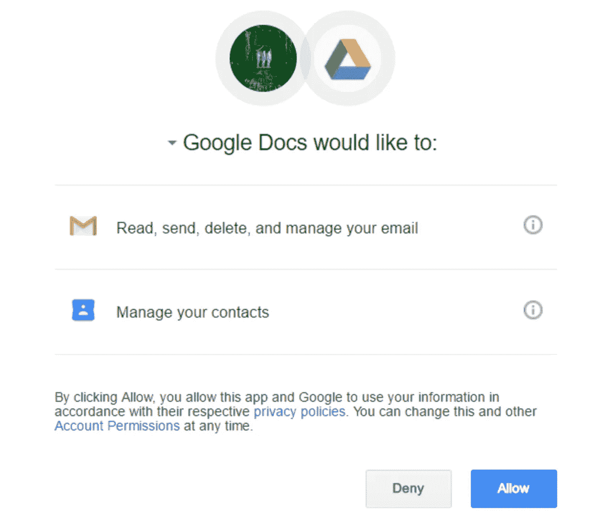
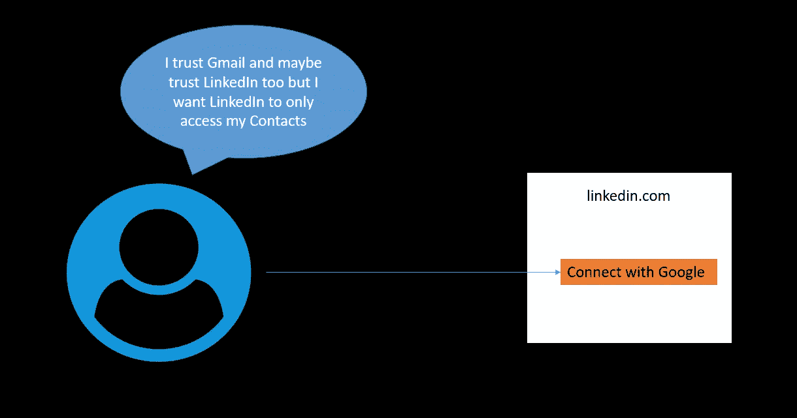
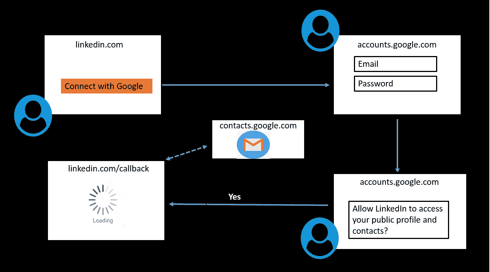
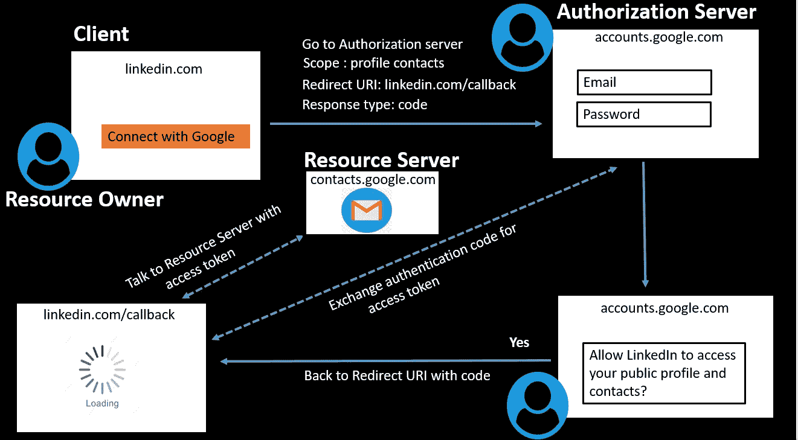

# 在 8 分钟内理解 OAuth 2.0

> 原文：<https://blog.devgenius.io/oauth-2-0-basics-26b7bc8340bb?source=collection_archive---------8----------------------->

很长一段时间以来，身份认证大多以简单的方式实现:

1.  输入您的用户名和密码
2.  然后，将根据数据库中的一组值对该组合进行验证(在将密码存储到数据库中之前，对其进行哈希运算)
3.  在验证用户信息之后，设置一个 cookie，将用户与会话 ID 相关联，并建立连接。

各个公司实现了上述机制，并自己处理认证。然而，这有一些挑战。一个是维护，另一个是努力不断适应不断变化的安全标准。

因此，开发了一些行业标准协议，如 OAuth 2.0 和 OpenID Connect 来解决这个问题。十年前，在 2010 年之前的时代，各种应用程序和网站的身份验证和授权要求可以映射到四个主要用例:

1.  简单登录(表单和 cookie)——上面讨论的那个
2.  单点登录(这利用了 SAML[安全断言标记语言] 标准。开发人员在使用该标准时遇到了一些挑战)
3.  移动应用程序登录(Cookies 在设备上不太好用。这个用例需要一个解决方案)
4.  委托授权:拥有某种授权的一方可以将该授权的子集委托给另一方。委托授权实践最初包括泄露您的密码。例如，LinkedIn 有一个功能，可以导入你的谷歌联系人，并邀请他们与你联系。过去，LinkedIn 会要求你给他们你的谷歌用户名和密码。他们会用它来代表你登录，下载你的联系人，然后注销。

正如你所猜测的，这造成了安全威胁，因为现在 LinkedIn 可以代表你登录谷歌，访问他们想要的任何内容(即使他们说他们只会访问你的联系人！！)

诸如此类的问题需要一个无需共享密码就能促进授权的标准。这为 OAuth 2.0 协议的发展让路。这给我们带来了一个问题:

# OAuth 是什么？

**“OAuth**是一种[开放的访问授权标准](https://en.wikipedia.org/wiki/Open_standard)，通常被互联网用户用来授权网站或应用程序访问他们在其他网站上的信息，但不需要给他们密码。”

它使应用程序能够在不泄露用户密码的情况下获得对用户数据的有限访问(范围)。它将身份验证与授权分离，并支持针对不同设备功能的多种使用情形。它支持服务器到服务器应用程序、基于浏览器的应用程序、移动/本机应用程序和控制台/电视。

如果你遇到了下面的屏幕或者类似的东西，你就已经体验过 OAuth 是什么了。这是一个询问它是否能代表你访问数据的应用程序。

# OAuth 2.0 的委托授权

我们现在将使用与上面相同的例子来探索 OAuth 2.0 中委托授权是如何发生的。

假设您已经登录 LinkedIn，LinkedIn 想要访问您的联系人。现在，您只想允许 LinkedIn 访问您的联系人，而不想访问其他内容。

通过 OAuth，LinkedIn 给你一个“与 Google 连接”的选项。点击后会进入 Gmail 登录页面，这意味着你需要向 Gmail(而不是 LinkedIn)提供密码。成功登录 Gmail 帐户后，会弹出一个窗口，要求您同意 LinkedIn 访问您的联系人。当你说“是”时，你会被重定向到 LinkedIn，此时，LinkedIn 可以从谷歌访问你的联系人，因为它现在有你的许可。如果它试图访问任何其他内容，它是不允许这样做的，因为它只有访问联系人的权限。

够简单吗？肯定不是。上面我们看到的只是整个过程的概述。在本文中，我们将研究上述过程中每个步骤的细节。

在我们继续之前，我们必须首先理解 OAuth 术语。我们将继续使用相同的示例作为参考):

1.  **资源所有者**:拥有数据的用户。(在上面的示例中，您是资源所有者)
2.  **客户端**:想要访问数据的客户端。它可以是最终用户，也可以是公司。(LinkedIn 是希望访问您的联系人的客户端)。

*   OAuth 术语中有两种类型的客户端:公共客户端和机密客户端。这两者之间有明显的区别。可以信任机密客户端来存储秘密。它们不在桌面上运行，也不通过应用商店发布。人们无法对它们进行逆向工程并获得密钥。它们运行在终端用户无法访问的受保护区域。公共客户端是浏览器、移动应用和物联网设备。
*   关于客户端，需要注意的另一个重要方面是**客户端注册**，这是 OAuth 的一个关键组件。(在我们的例子中，LinkedIn 可以提供“与 Google 连接”选项，因为它在 Google 注册为客户端)

3.授权服务器:我们用来授权我们的权限的系统。这是 OAuth 的主要引擎(在这种情况下，Google accounts 需要您同意 LinkedIn 是否可以访问您的联系人)

4.**资源服务器:**保存客户端所需数据的 API 或系统(在我们的例子中，是 Google contacts API)

5.**访问令牌:**访问令牌是客户端用来访问资源服务器(API)的令牌。他们注定是短命的。以小时和分钟为单位来考虑它们，而不是以天和月为单位。您可以从公共客户端获得访问令牌。它们旨在优化互联网规模的问题。因为这些令牌可以是短暂的和向外扩展的，它们不能被撤销，你只需要等待它们超时。

6.**刷新令牌:**这些要长久得多；几天，几个月，几年。为了获得刷新令牌，应用程序通常要求机密客户端进行身份验证。您正在做的是使用刷新令牌获取新的访问令牌，这些访问令牌将连接到您的资源服务器。刷新令牌可以被撤销。当在仪表板中撤销应用程序的访问权限时，您正在取消其刷新令牌。

OAuth 规范没有定义什么是令牌。它可以是你想要的任何格式。但是，通常您希望这些令牌是 JSON Web 令牌(一个[标准](https://tools.ietf.org/html/rfc7519))。简而言之，JWT(读作“jot”)是一种安全可靠的令牌认证标准。jwt 允许您使用签名对信息(称为声明)进行数字签名，并且可以在以后使用秘密签名密钥进行验证。要了解更多关于 jwt 的信息，请参见[Java jwt 初学者指南](https://stormpath.com/blog/beginners-guide-jwts-in-java)。

7.**授权**:证明用户同意访问数据。有不同类型的授权许可，但是因为我们在这里讨论的是基础知识，所以理解授权许可被用作确认用户已经给出他们的许可的标志就足够了，在这之后它与访问令牌交换。

8.**重定向 URI** :(回调或重定向 URI)资源所有者授予客户端访问资源服务器的权限后，返回的 URI。

9.**作用域:**授权服务器有一个它理解的作用域列表，(contacts。阅读，联系人。写等。).客户端可以通过请求资源所有者的批准来定义他们想要从授权服务器访问的内容。范围由应用程序开发人员在编写应用程序时进行编码，并且通常被细分到最精细的级别，以方便各种客户端仅访问他们需要的信息。(在我们的例子中，范围仅限于访问联系人)

现在我们可以说 OAuth 语言了，让我们再看一下整个过程。

在上图中，所有关键的 OAuth 组件都做了标记。你首先进入 LinkedIn 页面，点击“连接 Google ”,向授权服务器发出请求。此请求包含重定向 URI，响应类型为“代码”，范围为“配置文件联系人”。这里的代码是“代码”类型的授权许可。LinkedIn 向授权服务器请求授权代码。在您同意让 LinkedIn 访问您的公开个人资料和联系人后，LinkedIn 首先请求的授权码将被提供(这作为一个标志，让客户知道用户已经同意)，您将被带到重定向 URI。既然 LinkedIn 有了授权码，它就可以与授权服务器对话，用它来交换访问令牌。这个访问令牌被授予 LinkedIn，以便从资源服务器访问联系人。客户端现在可以与资源服务器对话，并根据最初定义的范围(访问公共配置文件和联系人)从资源服务器访问信息。然而，如果 LinkedIn 试图请求一组不同的数据，比如说它想要删除联系人，它不允许使用当前的访问令牌这样做。因此，OAuth 有助于在互联网上跨系统安全地交换许可和信息。

您一定已经注意到，身份验证代码是我们在这里添加的额外步骤，我们可以在开始时直接请求访问令牌。OAuth 的设计关注于所有可能的安全相关场景。

对于网络安全，我们有前通道(不太安全的通道)和后通道(高度安全的通道)。浏览器被认为是前通道(它们有漏洞，因此我们不能完全信任它们。通过这些渠道共享的信息可能会被不良行为者截获，并可能易于被恶意使用)

上图中的实线代表前通道，虚线代表后通道。在接收到授权码之后，交换发生在从后端服务器到授权服务器的反向信道中(客户端使用授权码发出反向信道请求)(不通过浏览器发生)。即使有人从浏览器获取了代码，也因为无法访问后台通道而无法获取访问代码。

基于用例的需求，我们有不同类型的 OAuth 流。我们上面看到的是一个授权代码流(包括前后台通道)。我们还有一个只涉及前端通道的隐式流程(这对于纯 JS 应用程序或其他可能不涉及后端的应用程序非常有用)。其他流包括资源所有者密码凭证或客户端凭证。就本文的范围而言，我们所涵盖的内容应该足以让我们对 OAuth 及其工作原理有一个大致的了解。希望你喜欢阅读这篇文章！！

# 参考资料和更多资源:

1.  OAuth 2.0 基础视频:[https://www.youtube.com/watch?v=996OiexHze0&t = 451s](https://www.youtube.com/watch?v=996OiexHze0&t=451s)
2.  OAuth 安全模型:【https://tools.ietf.org/id/draft-barnes-oauth-model-01.html 
3.  OAuth 是什么？[https://developer . okta . com/blog/2017/06/21/what-the-heck-is-oauth](https://developer.okta.com/blog/2017/06/21/what-the-heck-is-oauth)
4.  授权码授予类型:[https://developer . okta . com/blog/2018/04/10/oauth-authorization-code-grant-type](https://developer.okta.com/blog/2018/04/10/oauth-authorization-code-grant-type)