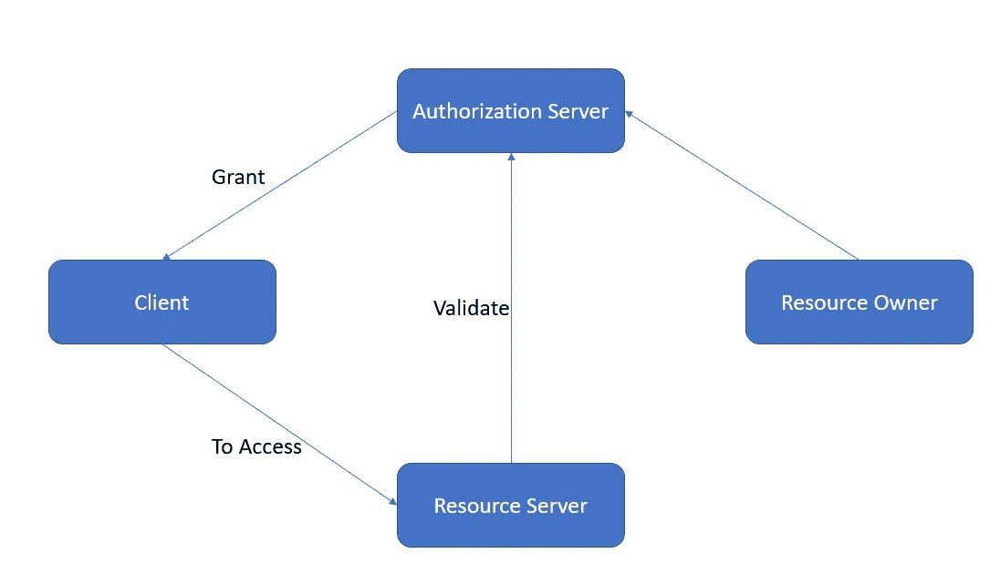
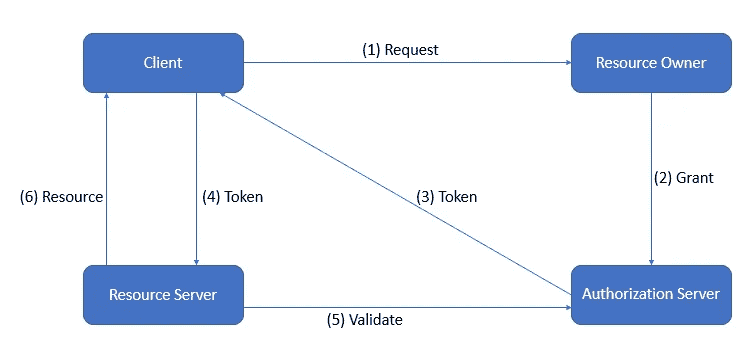
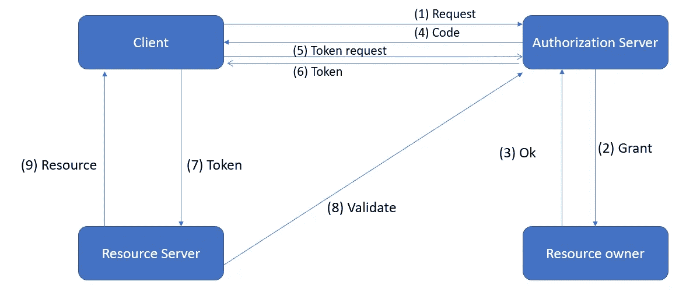
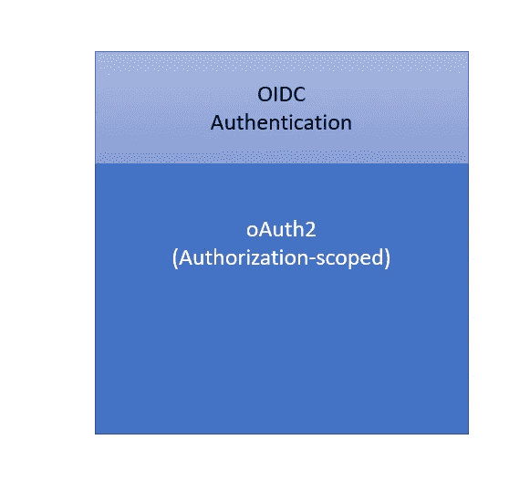

# oAuth 和 OpenID 连接

> 原文：<https://blog.devgenius.io/oauth-and-openid-connect-a87072fb602a?source=collection_archive---------9----------------------->

OAuth 2.0 和 OpenID Connect 是对 oAuth 2.0 的安全增强。这是为了防止证件被盗。在本文中，我们将讨论什么是 oAuth，什么是 open id，这两者是如何联系在一起的，有何区别，有哪些用例以及何时使用。

在我们进入这篇文章之前，让我们看看可能用到的技术术语。

*   *访问令牌:一个随机字符串，在人类阅读中没有意义*
*   *刷新令牌:与接入令牌相同，但用于在接入令牌过期后，在允许的刷新时间内更新接入令牌*
*   *Client-id / Secret:赋予 app 用于标识 app(客户端)范围:允许权限*
*   JWT:广泛使用的在服务间传递信息的机制。这也支持加密。

# oAuth 2:

*   oAuth 2 是基于令牌的授权协议。
*   这是一种无需共享凭证的授权访问方式。它可以授权客户端代表用户执行某些操作
*   从技术上讲，oAuth 并不验证用户身份。用户必须已经过身份验证才能获得访问令牌。然而，大多数提供者同时实现这两者会导致一些混乱
*   我们可以有第三方 oAuth 提供商，如谷歌，脸书，Github 或自己的 oAuth 服务器

现在让我们弄清楚 oAuth 是如何工作的

> 想象一个场景，你创建一个脸书的个人资料。然后脸书需要给你的朋友发电子邮件，告诉他们你在脸书。因此，脸书想代表你给你的朋友发电子邮件。所以脸书需要代表你进入你的账户。但是你不喜欢把你的密码给脸书。所以这就是我们要用 oAuth 2 解决的问题。

所以在 oAuth 范式中有一个资源所有者。根据上述情况，这就是你。所以我们有授权服务器，客户端和资源服务器。

真实演员

资源所有者同意授权服务器。因此，它将授权客户端访问脸书资源服务器。现在，资源服务器与授权服务器验证该访问，然后授予访问权限。

**一般流程**

流动口

1.  你可以去脸书网站，创建你的个人资料，并要求你需要邀请你的朋友

*   现在，脸书向资源所有者(您)发送请求，要求联系 gmail 服务器。

2.现在，您(资源所有者)将自动被重定向到授权服务器(在这种情况下是 gmail 服务器)。

*   因此，现在 gmail 服务器将验证您(资源所有者)的用户名和密码。

3.因此授权服务器向客户端发放令牌。

4.现在，客户端向资源服务器发送令牌

5.资源服务器将该令牌发送给授权服务器进行验证。

6.验证后，资源服务器将资源交付给客户端。

**授予类型**

*   授权码:这是最广泛使用的授权类型。
*   客户端凭据
*   含蓄的
*   密码
*   设备码

授权代码流

授权代码流

1.  客户端将请求发送到授权服务器(gmail 服务器)

2.现在授权服务器弹出一个对话框，说脸书将访问您的联系人列表。你同意还是不同意？

3.所以 gmail 有很多功能(日历/电子邮件/聊天等)，但除此之外，脸书只要求访问你的联系人。他们只能访问联系人列表。(授予 ok 后，它将重定向回授权服务器)

4.所以现在授权服务器发送代码

5.客户端再次向授权服务器发送令牌请求。

6.现在，授权服务器将令牌发送给客户端。

7.客户端将令牌发送到资源服务器。

8.资源服务器获得令牌后，将向授权服务器验证该令牌。

9.在验证过程之后，资源服务器将把相关的资源传递给客户端。

*   当资源所有者(你)不信任客户端(这里是 facebook)时，这是非常理想的
*   你现在应该知道，我们不能按照请求直接移交令牌。如果你直接从前端获得令牌，那么未授权方可以看到你的凭证。(代码共享应该只通过后端)

# OpenID 连接

*   oAuth 不是为处理认证而设计的。这是一个授权协议。(这限制了他们的能力)

*   OIDC 是与认证相关的协议。OIDC 允许客户端通过授权服务器的身份验证来验证最终用户的身份。
*   OIDC 有一个单独的作用域，叫做 Open ID o，我们可以用它来认证用户。
*   通过将 OIDC 和 oAuth 2 捆绑在一起，我们可以使用这两者进行认证和授权

参考: