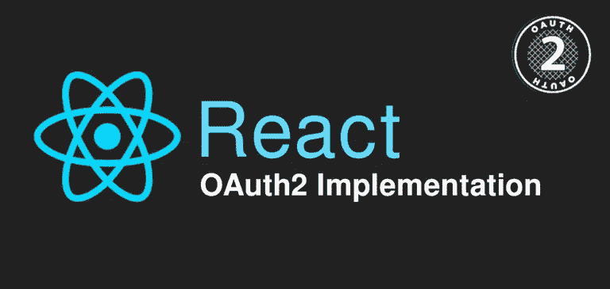
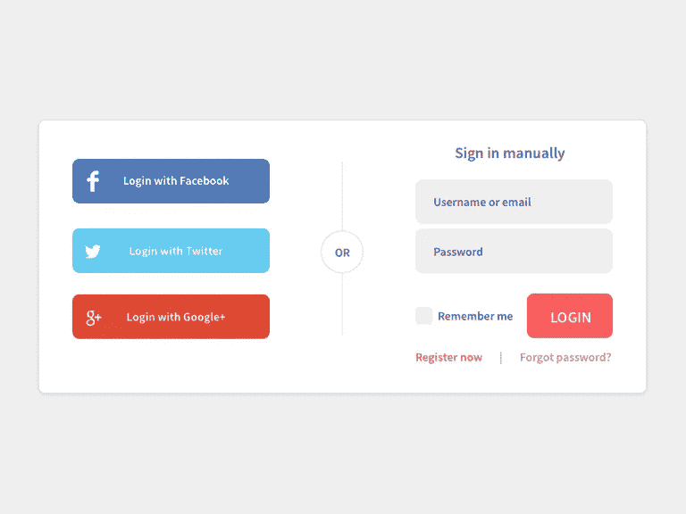

# 使用 React 进行 OAuth2 授权

> 原文：<https://blog.devgenius.io/oauth2-authorization-with-react-df276f747d5a?source=collection_archive---------6----------------------->



> *如果你想在你的 React 项目中使用* ***OAuth2*** *授权可以使用我发布的包:*[*@ tasoskakour/React-use-oauth 2*](https://github.com/tasoskakour/react-use-oauth2)*。*

# 什么是 OAuth2？

OAuth2 是授权的行业标准协议。它为我们提供了 web 应用程序、桌面应用程序、移动电话和客厅设备的特定授权流程。你可以在这里阅读更多关于框架[的内容。](https://oauth.net/2/)

# 我们在网络上的什么地方使用 OAuth2？

OAuth2 协议的主要用途之一是与第三方提供商(如谷歌、脸书、苹果等)进行认证和授权。所谓的“社交登录”。我很确定你们中的大多数人过去都使用过 OAuth2(作为一个终端用户)的社交登录。

在下面的图片中，我们可以看到用户既可以通过传统的提供用户名和密码的方式手动登录(右侧)，也可以通过脸书/推特/谷歌登录(左侧)。通过选择与这些社交提供商之一登录，他们基本上是在与该提供商进行认证，并授权应用程序访问他们的社交账户的某些信息。例如，如果他们选择登录谷歌，在成功认证后，应用程序可能知道他们的谷歌电子邮件，个人资料照片和姓名。



使用社交登录的一个好处就是简单。只需一次点击，甚至无需输入用户名和密码，我们就可以在几秒钟内开始使用应用程序。当然，我们需要确保这个应用程序是值得信任的，我们**总是需要注意这个应用程序最终会从我们的社交账户中收集什么信息。**

# OAuth2 授权类型

最常见的 OAuth2 授权类型是[授权码](https://oauth.net/2/grant-types/authorization-code/)和[隐式流程](https://oauth.net/2/grant-types/implicit/)。

**OAuth 2.0 授权码授予**

机密和公共客户端使用授权码授权类型来交换访问令牌的授权码。这个流程的步骤是:

**1)** 客户端(你的应用程序)构建并发送给用户一个授权 URL(例如对于 Google 来说是`https://accounts.google.com/o/oauth2/v2/auth`),其格式如下:

```
https://authorization-server.com/auth?
response_type=code&
client_id=CLIENT_ID&
redirect_uri=REDIRECT_URI&
scope=photos&
state=1234zyx
```

**2)** 用户看到授权提示，点击“允许”(或“拒绝”)。(可能会要求用户先进行身份验证)。

**3)** 用户被重定向到最初传递给第一步请求的`redirect_uri`，以及`code`和`state`。该 URL 将采用以下形式:

```
https://REDIRECT_URI.com/callback?
code=AUTH_CODE_HERE&
state=1234zyx
```

**注意:**`state`参数必须与步骤 1 中最初生成的状态相匹配。这是为了减轻 CSRF 的攻击。在这里阅读更多。

在这一步中，我们需要用一个实际的访问令牌来交换接收到的`code`。为了实现这一点，我们需要向授权服务器的令牌端点发出 POST 请求，其形式如下所示(例如，对于 Google 来说，它是`https://oauth2.googleapis.com/token`)。请注意，这个请求需要从我们的服务器发出，因为我们不能将`CLIENT_SECRET`暴露给前端应用程序。

```
https://api.authorization-server.com/token
grant_type=authorization_code&
code=AUTH_CODE_HERE&
redirect_uri=REDIRECT_URI&
client_id=CLIENT_ID&
client_secret=CLIENT_SECRET
```

5)授权服务器回复访问令牌和到期时间:

```
{
"access_token":"RsT5OjbzRn430zqMLgV3Ia",
"expires_in":3600
}
```

**注**:授权代码流一般被认为是安全的。然而，通过使用 PKCE ( [RFC 7636](https://tools.ietf.org/html/rfc7636) )扩展，利用`code_verifier`、`code_challenge`和`code_challenge_method`，它可以更加防弹。这个扩展超出了本文的范围。你可以在这里阅读更多关于它的信息。

**隐式流授予**

隐式流是 JavaScript 应用程序的简化 OAuth 流，其中访问令牌被立即返回，无需额外的授权码交换步骤。

这意味着隐式流程的步骤是我们上面为授权代码授权编写的步骤 1-3。还有一个区别是重定向 URL 将在 hash (#)参数中包含`access_token`,而不是在搜索(？)URL 的参数。它将具有以下形式:

```
https://REDIRECT_URI.com/callback#
access_token=ACCESS_TOKEN&
expires_in=3600&
token_type=Bearer&
state=1234zyx
```

如今，OAuth 2.0 标准推荐使用*授权码授权*而不是*隐式流*，这是由于在 HTTP 重定向中返回访问令牌的内在风险，而没有确认它已经被客户端接收。

然而，大多数主要提供商仍然支持并允许应用程序使用*隐式流*。例如，在这里你可以阅读 Google 关于客户端 Web 应用程序 OAuth 2.0 的文档，它基本上使用了一个隐式流程。

# React:用钩子实现 OAuth2

在本节中，我们将创建一个名为`useOAuth2`的 React 钩子，它将实现一个带有**授权码授权**的 **OAuth2** 。

> *如果你想在你的 React 项目中使用****oauth 2****授权你可以使用我发布的包:*[*@ tasoskakour/React-use-oauth 2*](https://github.com/tasoskakour/react-use-oauth2)*。*

为了使授权更加用户友好，我们将利用一个弹出窗口；也就是说，对第三方的授权将随着重定向在弹出窗口中发生**。**

**第一步:准备挂钩**

我们的钩子需要的道具是:

*   **authorizeUrl** :第三方授权 Url(例如对于 Google 是`[https://accounts.google.com/o/oauth2/v2/auth](https://accounts.google.com/o/oauth2/v2/auth).)` [)。](https://accounts.google.com/o/oauth2/v2/auth).)
*   **clientId** :应用程序的 OAuth2 客户端 Id。
*   **redirectUri** :确定用户完成授权流程后，第三方 API 服务器将用户重定向到哪里。在我们的实现中，将在`redirectUri`上呈现一个弹出窗口。
*   **范围** (string — *可选*):根据您的应用需求列出的范围。

让我们把这些道具放到钩子上，然后创建一个 UI 状态助手，它将包含`{loading, error}`和一个名为`getAuth`的函数。该函数将初始化授权流程，因此作为第一步，它需要将`loading`设置为真并清除任何错误。

```
// useOAuth2.js
import { useCallback, useState } from 'react'; 

const useOAuth2 = (props) => {
  const {
      authorizeUrl,
      clientId,
      redirectUri,
      scope = '',
    } = props;

  const [{ loading, error }, setUI] = useState({ loading: false, error: null });

  const getAuth = useCallback(() => {
      // 1\. Init
      setUI({
        loading: true,
        error: null,
      });
  })
}
```

**步骤 2:生成状态**

在构建授权 URL 之前，我们需要生成一个`state`参数。需要这个参数来缓解 [CSRF 攻击](https://auth0.com/docs/secure/attack-protection/state-parameters)。此外，我们还可以在这里传递我们想要的任何其他状态信息，以便在重定向之后进行恢复。

为了生成状态，我们使用了`window.crypto`函数。实现这一点的代码摘自这篇文章。

我们还需要将状态持久化到`sessionStorage`，以便我们的弹出窗口能够在重定向发生后读取它(我们也可以将它持久化到 *cookies* 或 *localStorage* )。

```
// useOAuth2.js
import { useCallback, useState } from 'react'; 

const OAUTH_STATE_KEY = 'react-use-oauth2-state-key';

// https://medium.com/@dazcyril/generating-cryptographic-random-state-in-javascript-in-the-browser-c538b3daae50
const generateState = () => {
	const validChars = 'ABCDEFGHIJKLMNOPQRSTUVWXYZabcdefghijklmnopqrstuvwxyz0123456789';
	let array = new Uint8Array(40);
	window.crypto.getRandomValues(array);
	array = array.map((x: number) => validChars.codePointAt(x % validChars.length));
	const randomState = String.fromCharCode.apply(null, array);
	return randomState;
};

const saveState = (state: string) => {
	sessionStorage.setItem(OAUTH_STATE_KEY, state);
};

const removeState = () => {
	sessionStorage.removeItem(OAUTH_STATE_KEY);
};

const useOAuth2 = (props) => {
  const {
      authorizeUrl,
      clientId,
      redirectUri,
      scope = '',
    } = props;

  const [{ loading, error }, setUI] = useState({ loading: false, error: null });

  const getAuth = useCallback(() => {
      // 1\. Init
      setUI({
        loading: true,
        error: null,
      });

      // 2\. Generate and save state
      const state = generateState();
      saveState(state);
  })
}
```

**第三步:打开弹出窗口**

现在我们将开始授权过程！

我们利用接受`authorizeUrl, clientId, redirectUri, scope, state`参数的`enhanceAuthorizeUrl`函数创建授权 URL，并打开一个指向该 URL 的**弹出窗口**。为了更好地操作弹出窗口，我们利用`useRef`来保存弹出窗口实例。

```
// useOAuth2.js
import { useCallback, useState } from 'react'; 

const OAUTH_STATE_KEY = 'react-use-oauth2-state-key';
const POPUP_HEIGHT = 700;
const POPUP_WIDTH = 600;

// https://medium.com/@dazcyril/generating-cryptographic-random-state-in-javascript-in-the-browser-c538b3daae50
const generateState = () => {
	const validChars = 'ABCDEFGHIJKLMNOPQRSTUVWXYZabcdefghijklmnopqrstuvwxyz0123456789';
	let array = new Uint8Array(40);
	window.crypto.getRandomValues(array);
	array = array.map((x) => validChars.codePointAt(x % validChars.length));
	const randomState = String.fromCharCode.apply(null, array);
	return randomState;
};

const saveState = (state) => {
	sessionStorage.setItem(OAUTH_STATE_KEY, state);
};

const removeState = () => {
	sessionStorage.removeItem(OAUTH_STATE_KEY);
};

const openPopup = (url) => {
	// To fix issues with window.screen in multi-monitor setups, the easier option is to
	// center the pop-up over the parent window.
	const top = window.outerHeight / 2 + window.screenY - POPUP_HEIGHT / 2;
	const left = window.outerWidth / 2 + window.screenX - POPUP_WIDTH / 2;
	return window.open(
		url,
		'OAuth2 Popup',
		`height=${POPUP_HEIGHT},width=${POPUP_WIDTH},top=${top},left=${left}`
	);
};

const closePopup = (popupRef) => {
	popupRef.current?.close();
};

const enhanceAuthorizeUrl = (
	authorizeUrl,
	clientId,
	redirectUri,
	scope,
	state
) => {
	return `${authorizeUrl}?response_type=code&client_id=${clientId}&redirect_uri=${redirectUri}&scope=${scope}&state=${state}`;
};

const useOAuth2 = (props) => {
  const {
      authorizeUrl,
      clientId,
      redirectUri,
      scope = '',
    } = props;

  const popupRef = useRef();
  const [{ loading, error }, setUI] = useState({ loading: false, error: null });

  const getAuth = useCallback(() => {
      // 1\. Init
      setUI({
        loading: true,
        error: null,
      });

      // 2\. Generate and save state
      const state = generateState();
      saveState(state);

      // 3\. Open popup
      popupRef.current = openPopup(
        enhanceAuthorizeUrl(authorizeUrl, clientId, redirectUri, scope, state)
      );
  })
}
```

**创建弹出组件**

让我们暂时离开`useOAuth2`钩子，让我们专注于**弹出**实现。

现在我们处于这样一种状态，用户在一个弹出窗口中，并向第三方执行授权。之后，它们将被重定向到我们在初始请求中传递的`redirect_uri`。

一个方便的做法是为那个`redirect_uri`呈现带有反应路线的弹出窗口。例如，使`redirect_uri`成为`https://your-app.com/callback`，然后创建如下代码块所示的路线。这样，授权服务器将把我们重定向回`redirect_uri`，它将只呈现我们的弹出组件。

```
// routes.js
import { BrowserRouter, Route, Routes } from 'react-router-dom';
import { OAuthPopup } from 'OAuth2Popup';

const Example = () => (
	<BrowserRouter>
		<Routes>
			<Route element={<OAuthPopup />} path="/callback" />
			<Route element={<Home />} path="/" />
            {/* ... your other routes ... */}
		</Routes>
	</BrowserRouter>
);
```

现在让我们继续 Popup 组件。它需要处理三件事:

1.  读取 URL 重定向参数`code`和`state`。如果出现错误，将会出现一个`error`参数。
2.  检查`state`参数是否与最初发送给请求的参数相匹配；我们从*会话存储*中读取参数。
3.  向父窗口 [(window.opener)](https://developer.mozilla.org/en-US/docs/Web/API/Window/opener) 反馈授权成功或失败。

为了在**弹出框**和它的**开启器**之间建立通信，我们使用了`window.opener.postMessage`函数，该函数向**开启器**可以监听的窗口发送消息。

上面的步骤被翻译成下面的代码:

```
// OAuth2Popup.jsx
import { useEffect } from 'react';
import { queryToObject } from './tools';

const OAUTH_STATE_KEY = 'react-use-oauth2-state-key';
const OAUTH_RESPONSE = 'react-use-oauth2-response';

const checkState = (receivedState) => {
	const state = sessionStorage.getItem(OAUTH_STATE_KEY);
	return state === receivedState;
};

const queryToObject = (query) => {
	const parameters = new URLSearchParams(query);
	return Object.fromEntries(parameters.entries());
};

const OAuthPopup = (props) => {
	const {
		Component = (
			<div style={{ margin: '12px' }} data-testid="popup-loading">
				Loading...
			</div>
		),
	} = props;

	// On mount
	useEffect(() => {
		const payload = queryToObject(window.location.search.split('?')[1]);
		const state = payload && payload.state;
		const error = payload && payload.error;

		if (!window.opener) {
			throw new Error('No window opener');
		}

		if (error) {
			window.opener.postMessage({
				type: OAUTH_RESPONSE,
				error: decodeURI(error) || 'OAuth error: An error has occured.',
			});
		} else if (state && checkState(state)) {
			window.opener.postMessage({
				type: OAUTH_RESPONSE,
				payload,
			});
		} else {
			window.opener.postMessage({
				type: OAUTH_RESPONSE,
				error: 'OAuth error: State mismatch.',
			});
		}
	}, []);

	return Component;
};

export default OAuthPopup;
```

**步骤 4:收听弹出消息**

让我们回到我们的`useOAuth2`钩子。

打开弹出窗口后，我们需要注册一个**消息监听器**到窗口，监听来自弹出窗口的任何消息。为了区别于所有其他窗口消息，弹出窗口将消息类型设置为`react-use-oauth2-response`。

如果弹出窗口返回一个错误，那么我们设置适当的 UI 状态，否则我们得到包含`code`参数的消息有效负载。

还有一种情况是，用户在完成授权之前强行关闭了弹出窗口。为了捕捉这一点，我们设置了一个时间间隔，定期检查弹出窗口是否被强制关闭，如果是，它会执行一些清理任务，如重置 UI，删除消息监听器等。

```
// useOAuth2.js
import { useCallback, useState } from 'react'; 

const OAUTH_STATE_KEY = 'react-use-oauth2-state-key';
const POPUP_HEIGHT = 700;
const POPUP_WIDTH = 600;
const OAUTH_RESPONSE = 'react-use-oauth2-response';

// https://medium.com/@dazcyril/generating-cryptographic-random-state-in-javascript-in-the-browser-c538b3daae50
const generateState = () => {
	const validChars = 'ABCDEFGHIJKLMNOPQRSTUVWXYZabcdefghijklmnopqrstuvwxyz0123456789';
	let array = new Uint8Array(40);
	window.crypto.getRandomValues(array);
	array = array.map((x) => validChars.codePointAt(x % validChars.length));
	const randomState = String.fromCharCode.apply(null, array);
	return randomState;
};

const saveState = (state) => {
	sessionStorage.setItem(OAUTH_STATE_KEY, state);
};

const removeState = () => {
	sessionStorage.removeItem(OAUTH_STATE_KEY);
};

const openPopup = (url) => {
	// To fix issues with window.screen in multi-monitor setups, the easier option is to
	// center the pop-up over the parent window.
	const top = window.outerHeight / 2 + window.screenY - POPUP_HEIGHT / 2;
	const left = window.outerWidth / 2 + window.screenX - POPUP_WIDTH / 2;
	return window.open(
		url,
		'OAuth2 Popup',
		`height=${POPUP_HEIGHT},width=${POPUP_WIDTH},top=${top},left=${left}`
	);
};

const closePopup = (popupRef) => {
	popupRef.current?.close();
};

const cleanup = (
	intervalRef,
	popupRef,
	handleMessageListener
) => {
	clearInterval(intervalRef.current);
	closePopup(popupRef);
	removeState();
	window.removeEventListener('message', handleMessageListener);
};

const enhanceAuthorizeUrl = (
	authorizeUrl,
	clientId,
	redirectUri,
	scope,
	state
) => {
	return `${authorizeUrl}?response_type=code&client_id=${clientId}&redirect_uri=${redirectUri}&scope=${scope}&state=${state}`;
};

const useOAuth2 = (props) => {
  const {
      authorizeUrl,
      clientId,
      redirectUri,
      scope = '',
    } = props;

  const popupRef = useRef();
  const [{ loading, error }, setUI] = useState({ loading: false, error: null });

  const getAuth = useCallback(() => {
      // 1\. Init
      setUI({
        loading: true,
        error: null,
      });

      // 2\. Generate and save state
      const state = generateState();
      saveState(state);

      // 3\. Open popup
      popupRef.current = openPopup(
        enhanceAuthorizeUrl(authorizeUrl, clientId, redirectUri, scope, state)
      );

      // 4\. Register message listener
      async function handleMessageListener(message) {
        try {
          const type = message && message.data && message.data.type;
          if (type === OAUTH_RESPONSE) {
            const errorMaybe = message && message.data && message.data.error;
            if (errorMaybe) {
              setUI({
                loading: false,
                error: errorMaybe || 'Unknown Error',
              });
            } else {
              const code = message && message.data && message.data.payload && message.data.payload.code;
              // ... Check next step to see what we'll do with the code
            }
          }
        } catch (genericError) {
          console.error(genericError);
          setUI({
            loading: false,
            error: genericError.toString(),
          });
        } finally {
          // Clear stuff ...
          cleanup(intervalRef, popupRef, handleMessageListener);
        }
      }
      window.addEventListener('message', handleMessageListener);

      // 4\. Begin interval to check if popup was closed forcefully by the user
      intervalRef.current = setInterval(() => {
        const popupClosed = !popupRef.current || !popupRef.current.window || popupRef.current.window.closed;
        if (popupClosed) {
          // Popup was closed before completing auth...
          setUI((ui) => ({
            ...ui,
            loading: false,
          }));
          console.warn('Warning: Popup was closed before completing authentication.');
          clearInterval(intervalRef.current);
          removeState();
          window.removeEventListener('message', handleMessageListener);
        }
      }, 250);

      // Remove listener(s) on unmount
      return () => {
        window.removeEventListener('message', handleMessageListener);
        if (intervalRef.current) clearInterval(intervalRef.current);
      };
    })
}
```

**步骤 5:用接入令牌交换代码**

最后一步是将收到的`code`与实际的`access_token`进行交换。

为了实现这一点，我们需要一个服务器，因为我们不能将`client_secret`暴露给前端应用程序。然后，我们的服务器将向第三方授权服务器`/token`端点发出 POST 请求，以实际获取`access_token`。

例如，对于谷歌来说，这是`https://oauth2.googleapis.com/token`。另请注意，每个提供商的规格可能有所不同。

我们需要创建的服务器路由非常简单。为了这个教程，我们将使用 [fastify](https://github.com/fastify/fastify) 框架来实现它:

```
// server.js
import Fastify from 'fastify';
import fetch from 'node-fetch';

const fastify = Fastify({
	logger: true,
});

const CLIENT_SECRET = process.env.CLIENT_SECRET;
const AUTHORIZATION_SERVER_TOKEN_URL = process.env.AUTHORIZATION_SERVER_TOKEN_URL; // e.g https://oauth2.googleapis.com/token

fastify.post('/token', async (request, reply) => {
	const { code, client_id, redirect_uri } = request.query;

	const data = await fetch(
		`${AUTHORIZATION_SERVER_TOKEN_URL}?grant_type=authorization_code&client_id=${client_id}&client_secret=${CLIENT_SECRET}&redirect_uri=${redirect_uri}&code=${code}`,
		{
			method: 'POST',
		}
	);

	reply.send(await data.json());
});

fastify.listen(3001, (error) => {
	if (error) throw error;
});// useOAuth2.js
import { useCallback, useState } from 'react'; 

const OAUTH_STATE_KEY = 'react-use-oauth2-state-key';
const POPUP_HEIGHT = 700;
const POPUP_WIDTH = 600;
const OAUTH_RESPONSE = 'react-use-oauth2-response';

// https://medium.com/@dazcyril/generating-cryptographic-random-state-in-javascript-in-the-browser-c538b3daae50
const generateState = () => {
	const validChars = 'ABCDEFGHIJKLMNOPQRSTUVWXYZabcdefghijklmnopqrstuvwxyz0123456789';
	let array = new Uint8Array(40);
	window.crypto.getRandomValues(array);
	array = array.map((x) => validChars.codePointAt(x % validChars.length));
	const randomState = String.fromCharCode.apply(null, array);
	return randomState;
};

const saveState = (state) => {
	sessionStorage.setItem(OAUTH_STATE_KEY, state);
};

const removeState = () => {
	sessionStorage.removeItem(OAUTH_STATE_KEY);
};

const openPopup = (url) => {
	// To fix issues with window.screen in multi-monitor setups, the easier option is to
	// center the pop-up over the parent window.
	const top = window.outerHeight / 2 + window.screenY - POPUP_HEIGHT / 2;
	const left = window.outerWidth / 2 + window.screenX - POPUP_WIDTH / 2;
	return window.open(
		url,
		'OAuth2 Popup',
		`height=${POPUP_HEIGHT},width=${POPUP_WIDTH},top=${top},left=${left}`
	);
};

const closePopup = (popupRef) => {
	popupRef.current?.close();
};

const cleanup = (
	intervalRef,
	popupRef,
	handleMessageListener
) => {
	clearInterval(intervalRef.current);
	closePopup(popupRef);
	removeState();
	window.removeEventListener('message', handleMessageListener);
};

const enhanceAuthorizeUrl = (
	authorizeUrl,
	clientId,
	redirectUri,
	scope,
	state
) => {
	return `${authorizeUrl}?response_type=code&client_id=${clientId}&redirect_uri=${redirectUri}&scope=${scope}&state=${state}`;
};

const objectToQuery = (object) => {
	return new URLSearchParams(object).toString();
};

const formatExchangeCodeForTokenServerURL = (
	serverUrl,
	clientId,
	code,
	redirectUri
) => {
	return `${serverUrl}?${objectToQuery({
		client_id: clientId,
		code,
		redirect_uri: redirectUri,
	})}`;
};

const useOAuth2 = (props) => {
  const {
      authorizeUrl,
      clientId,
      redirectUri,
      scope = '',
    } = props;

  const popupRef = useRef();
  const [{ loading, error }, setUI] = useState({ loading: false, error: null });

  const getAuth = useCallback(() => {
      // 1\. Init
      setUI({
        loading: true,
        error: null,
      });

      // 2\. Generate and save state
      const state = generateState();
      saveState(state);

      // 3\. Open popup
      popupRef.current = openPopup(
        enhanceAuthorizeUrl(authorizeUrl, clientId, redirectUri, scope, state)
      );

      // 4\. Register message listener
      async function handleMessageListener(message) {
        try {
          const type = message && message.data && message.data.type;
          if (type === OAUTH_RESPONSE) {
            const errorMaybe = message && message.data && message.data.error;
            if (errorMaybe) {
              setUI({
                loading: false,
                error: errorMaybe || 'Unknown Error',
              });
            } else {
              const code = message && message.data && message.data.payload && message.data.payload.code;
              const response = await fetch(
                formatExchangeCodeForTokenServerURL(
                  'https://your-server.com/token',
                  clientId,
                  code,
                  redirectUri
                )
              );
              if (!response.ok) {
                setUI({
                  loading: false,
                  error: "Failed to exchange code for token",
                });
              } else {
                payload = await response.json();
                setUI({
                  loading: false,
                  error: null,
                });
                setData(payload);
                // Lines above will cause 2 rerenders but it's fine for this tutorial :-)
              }
            }
          }
        } catch (genericError) {
          console.error(genericError);
          setUI({
            loading: false,
            error: genericError.toString(),
          });
        } finally {
          // Clear stuff ...
          cleanup(intervalRef, popupRef, handleMessageListener);
        }
      }
      window.addEventListener('message', handleMessageListener);

      // 4\. Begin interval to check if popup was closed forcefully by the user
      intervalRef.current = setInterval(() => {
        const popupClosed = !popupRef.current || !popupRef.current.window || popupRef.current.window.closed;
        if (popupClosed) {
          // Popup was closed before completing auth...
          setUI((ui) => ({
            ...ui,
            loading: false,
          }));
          console.warn('Warning: Popup was closed before completing authentication.');
          clearInterval(intervalRef.current);
          removeState();
          window.removeEventListener('message', handleMessageListener);
        }
		  }, 250);

      // Remove listener(s) on unmount
      return () => {
        window.removeEventListener('message', handleMessageListener);
        if (intervalRef.current) clearInterval(intervalRef.current);
      };
    })
}
```

# 结束了

我希望你发现这篇文章信息丰富。🙂

在接下来的文章中，我们将详细讨论如何使用 Google OAuth2 和 Google APIs 来获取用户信息。

敬请期待！

*原载于*[*https://tasoskakour.com*](https://tasoskakour.com/blog/react-use-oauth2)*。*