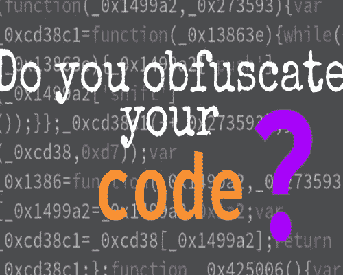

# 困惑

> 原文：<https://blog.devgenius.io/obfuscation-727d51b8a0df?source=collection_archive---------5----------------------->

大家好，我希望大家都很好，做得很好，今天我们将了解什么是模糊处理以及如何做。



**什么是混淆？**

在软件开发中，混淆是指故意创建人类难以理解的源代码或机器代码的行为。就像自然语言中的模糊处理一样，它可能会使用不必要的迂回表达式来构成语句。

**JavaScript 中的混淆**

在这里，我们将在 JavaScript 文件中进行混淆，让我们看看如何将代码转换为加密代码。

第一步:打开你最喜欢的代码编辑器

步骤 2:用 JavaScript 编写代码

第三步:在你的文件终端中安装这个模块

> npm 安装 JavaScript-混淆器

**文件名—*app . js***

```
var JavaScriptObfuscator = require(‘javascript-obfuscator’);// Obfuscatevar obfuscationResult = JavaScriptObfuscator.obfuscate(`(function(){var a=10;
var b= 20;
var c=a+b;
return c;})();`);// Display obfuscated resultconsole.log(obfuscationResult.getObfuscatedCode());
```

步骤 1:导入安装的 javascript-obfuscator 模块

步骤 2:为任何函数编写代码

步骤 3:在 javascript.obfuscator()方法下，编写您想要进行模糊处理的代码。

步骤 4:将该函数分配给一个名称或变量，这里我们有一个名为*obfunctionresult*的变量

第 5 步:最后使用 console.log()方法打印变量

最终我们的结果会是这样的，

**输出**

```
(function(){var _0x1a0461=0xa,_0x1d850b=0x14,_0x3c8211=_0x1a0461+_0x1d850b;return _0x3c8211;}());
```

谢谢大家！