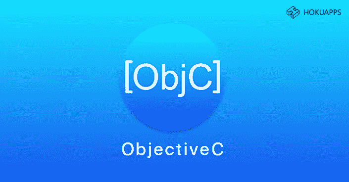
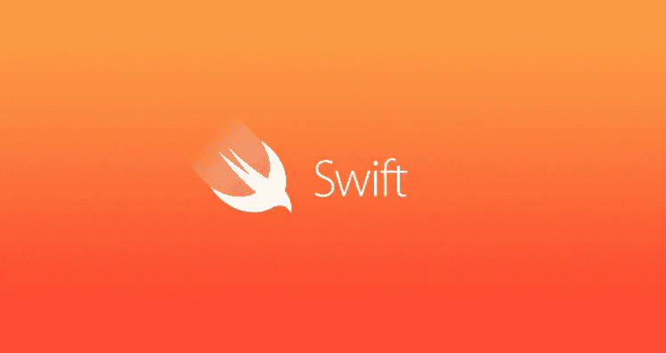

# Obj-C 与 Swift——完美 iOS 应用程序开发的比较和用例

> 原文：<https://blog.devgenius.io/obj-c-vs-swift-comparison-use-cases-for-flawless-ios-app-development-a230de1cf7a3?source=collection_archive---------6----------------------->

选择正确的技术堆栈需要考虑开发时间表、可用的技术和开发技能、项目的规模和范围以及可用的预算。他们决定了合适的技术栈应该提供什么样的开发者和商业津贴。在这方面，Obj-C 和 Swift 都有很多优点可以提供。

‍

苹果公司开发并推出了 Obj-C，作为一种基于编译器的编程语言，用于 Mac OS 应用程序开发。

Obj-C 引以为豪的是一个完全进化的、有 30 年历史的代码库，它促进了 iOS 和其他平台的编码。Obj-C 有一个庞大的库来支持它的开源开发者生态系统。

# 开发商 BENEFITS‍

## 语法(代码可读性)

Obj-C 有一个可读的语法，用 C 和基本 OOP 概念的背景知识更容易理解。

例如:

NSString *firstMessage = @""Obj-C 太牛逼了。";

NSLog(@“@”，message)；

Output- Obj-C 太牛逼了。

此外，Obj-C 将高级 C(非 OOP)编程与 OOP (Smalltalk messaging)范例结合在一起。‍

## 功能实现

Obj-C 通过向对象传递消息来调用函数。例如:-

NSMutableArray * array =[NSMutableArray array]；

[array addObject:@"hello world！"];

动态类型和绑定使对象能够接收非指定的类接口消息。对象不一定需要方法来运行。运行时对象在编译时被调用。

## 编译程序

运行时编译的 obj-C；无论是在 XCode 中，使用 Swift -Clang 编译器可执行文件——苹果官方的开源 C 语言编译器，还是使用 LLVM Clang Obj-C 编译器。

## 运行时间

Obj-C 运行时 API 允许与其他语言进行低级调试和桥接。它还有助于通过动态消息传递解决编译和运行时的依赖性。

## 错误处理

Obj-C 使用 NSError 类来处理运行时错误。Obj-C 和 Cocoa Touch 使用 NSError 对象来通知预期的运行时错误。您还可以创建 NSError 对象的实例并定义异常。

## 内存管理

就像 Swift 一样，Obj-C 没有用于优化内存的垃圾收集器，这进一步减少了 Obj-C 代码执行的延迟。但是它只在 Cocoa API 和 OOP 代码中通过 ARC 提供内存管理，而在过程 C 和非 Cocoa API 中没有

# 商业利益

‍

## 构建周期优势

Obj-C 提供了一个经过时间考验的 MVVM 应用构建环境。它不仅促进了可扩展的全栈应用程序开发，还提供了与 C 和 C++程序的向后兼容性，有助于遗留应用程序的维护。它是一种经过充分测试的编程语言，除了 Cocoa 和 Cocoa Touch 之外，它还允许开发人员访问广泛的自定义 API 和第三方框架。‍

## 建立安全性

作为一种进化的语言，Obj-C 代码不需要随着语言的变化而定期更新，这与较新的替代语言不同。因此，在某些情况下，Obj-C 可能是更好的选择，因为它提供了稳定的软件构建。‍

## 可量测性

Obj-C 通过复杂的服务器端逻辑开发、应用功能现代化和定制实现来促进可扩展的应用构建。人们可以轻松地更新 Obj-C 代码，使用定制插件和套接字编程进行应用商店部署。现代应用利用跨学科技术，Obj-C 在一定程度上提供了可扩展的应用开发。‍

## 支持的平台

虽然 Obj-C 是苹果的旗舰语言，专门用于开发 iOS 和 Mac 应用程序，但人们当然可以利用它的运行时 API 库来运行在 Android 和 Windows 等其他平台上的应用程序。‍

## 迁移

Obj-C 允许从 C 和 C++移植。Obj-C 还允许你将原生的 iOS Obj-C 应用程序转换成 Android 平台的 ARM 和 x86 机器代码。Apportable 等工具与 SpriteBuilder 游戏开发套件相集成，用于从 iOS 到 Android 的迁移。‍

## 支持社区

Obj-C 仍然有一个忠实的社区来迎合众多经过时间考验的新静态库和 API，以便在编译的最后阶段添加到应用程序代码中。‍

## 应用类型

Obj-C 在构建业务、即时消息、生产力、社交网络、多媒体等方面非常方便。Obj-C 游戏开发也有一个活跃的市场。，使用 iOS 专用引擎，如 Sparrow 和 NinevehGL，并使用跨平台引擎，如 Unity 和 Unreal，用于其他平台。

‍

Swift 很快成为 Mac、iOS、tvOS 和 watchOS 等苹果产品平台的统一脚本语言

2014 年由苹果公司推出，作为 iOS，Mac，Linux 的开源编程语言，后来在 Windows 和 Android web 和移动程序上推出。Swift 迅速成为 Mac、iOS、tvOS 和 watchOS 等苹果产品平台的统一脚本语言，因为它结合了 Obj-C、Ruby、Haskell、Rust、C#、Python、CLU 等的函数式编程能力。，具有足智多谋的错误处理和控制流(关键字)。

# 开发者利益

## 语法(代码可读性)

Swift 具有简单易学的语法，避免在关键字前使用“@”。它通过取消使用“；”进一步统一了关键字和“{ 0 }”。遗留惯例的缺失使 Swift 成为一种可读性强、类似英语的语言，这也可以减少出错的可能性。

例如:

let firstMessage = "Swift 太棒了。"

print(first message)；

输出——Swift 很牛逼。

## 功能实现

Swift 的统一函数语法允许没有参数名称的 C 风格函数，以及每个参数都有名称和参数标签的复杂 Obj-C 风格方法，这支持嵌套函数。

例如:

func outputMessageByGreeting(_ message:String){

func addGreetingAndPrint() {

打印(“你好！\(消息)")

}

addGreetingAndPrint()

}

outputMessageByGreeting("Jack ")

Swift 为方法提供了编译时(静态)类型检查和运行时(动态)类型检查。

就像在 Obj-C 中一样，Swift 允许使用 LLVM 编译器或通过 SwiftC 编译器可执行文件使用 XCode 进行编译。这两种编译器都可以对代码的依赖项进行排序，甚至可以同步方法名，这就省略了大量的手工工作。

Swift 使用 LLVM 编译器和 Obj-C 运行时，允许 C、Obj-C、C++和 Swift 代码并行运行。然而，在 Swift 中，Obj-C 方法只能被翻译成 Swift 的错误处理机制，前提是它们返回 Obj-C 对象或布尔值。

## 错误处理

Swift 以四种不同的方式处理错误——将函数错误传播给进行方法调用的代码；或者，用 do-catch 语句处理错误，或者，将错误作为可选值处理，或者断言不会有错误。

## 内存管理

Swift 通过其 ARC 为 Cocoa Touch 和非 Cocoa APIs 提供统一的内存管理。与 Obj-C 不同，使用 Swift，您不必担心内存泄漏，Obj-C 将重点放在核心逻辑上，而不是对每个对象实例进行手动内存管理。

# 商业利益

## 构建周期优势

对于用于基准测试的 FFT 和 Mandelbrot 算法，Swift 的代码处理速度几乎与 C++不相上下。用 Swift 编码干净而快速，因为它有一个人友好的语法和简单的类型语句。Swift 的单一代码库可以并行处理各种代码，这有助于增强传统应用。维护很容易，因为代码的简单性和可重用性非常重要。调试更加容易，尤其是有了 Swift 的错误处理协议和 MVVM 方法。

## 建立安全性

作为一种仍在发展的语言，Swift 在处理定制(私有)API 时不如 Obj-C 稳定。但是，它不仅仅弥补了其强大的错误处理能力。Swift 的编译器允许程序员在编写时修复错误，这有助于在错误发生之前解决它们，并产生稳定的应用程序版本。

## 可扩展性前景

使用 Swift 扩展应用程序非常简单。代码可重用性、语法可读性和 OOP 模块化编程惯例使您能够更新应用程序代码、改进业务逻辑，并根据需要添加新功能。

## 迁移

将应用从 Obj-C 迁移到 Swift 代码很容易，因为两者都使用 XCode IDE。由于编译器更改而导致的任何代码错误也可以快速解决。诸如 swift 之类的语言使用诸如拖放转换引擎和实时自动化 Obj- C/Swift 文本编辑器之类的转换工具来促进 Obj-C 到 Swift 的迁移。在开发人员的帮助下，通过将 Java 或 Kotlin 代码迁移到 Swift，您可以完美地从 Android 平台移植应用程序。服务。

## 支持的平台

Swift 支持 iOS、macOS、watchOS 和 tvOS 等苹果平台。Swift 的 LLVM 编译器确实允许使用 Scade、SwiftCore、Dispatch 和 SwiftFoundation 等框架开发 Android 应用程序，但苹果公司在这方面不提供支持。

## 支持社区

Swift 有一个非常活跃的支持社区，为扩展应用程序功能提供了大量动态库和 API。

## 应用类型

企业依靠 Swift 提供商业企业、电子学习、游戏、多媒体、活动规划、生产力、社交网络、按需服务，甚至电子商务应用。

‍‍

从上面列出的几点可以明显看出，尽管 Swift 提倡更进步的开发惯例，但它没有达到 Obj-C 的全面发展、经过充分测试的复合代码库；此外，尽管 Obj-C 对某些人来说是更值得信赖的语言，但它比不上 Swift 所能提供的一些最新的编程技术进步。反对 Obj-C 的唯一理由是它不是在今天的编程范式下构思的；反对 Swift 的唯一理由是，它没有‘Obj-C’存在的时间长，也没有经历足够的更新成为成熟的‘完全进化’的语言。

可以说，这两种语言在应用程序开发方面都有很大的贡献，并且可以根据其用途证明是有用的。

## 时间

Swift 相当容易学习和实现。但是，它没有现成的库和 API 可以用于所有目的。

Obj-C 语法需要更长的时间来理解，但是承诺了一个无所不包的 dev。生态系统，广泛提供第三方库和 API。‍

## 技术

Obj-C 作为一种语言已经相当饱和了，但是 Swift 才刚刚开始发展。当您为下一代平台开发应用程序时，Swift 是最佳选择。

作为一种完全进化的语言，Obj-C Cocoa API 提供了一种更成熟的开发工具。环境比雨燕。鉴于 Obj-C 的可可制作方式，它提供了一个比快速可可开发更稳定可靠的替代方案，而快速可可开发还没有完全发展起来。

## 发展技能

Swift Playgrounds 进一步为交互式和实验性应用程序线框化开辟了新的前景；这使得开发人员能够利用物联网和云服务等新技术迭代更多样化的应用类型。

在 Swift 出现之前，Obj-C 是苹果平台应用程序事实上的语言。因此，继续使用 Obj-C for Obj-C Apple apps 来维护和扩展遗留程序的功能是明智的。‍

## 项目规模

Swift 的快速开发周期肯定能让大型项目在期限内完成。代码库也为小型项目的可伸缩性留下了足够的空间。

大型项目有许多协同工作的编程模块来促进大型应用程序。作为一种完全进化的语言，Obj-C 的在线支持社区以及免费和高级组件、库、包和工具的现成可用性满足了端到端软件周期的需求。

## 预算

鉴于上述可扩展性优势，在预算紧张的情况下实施 Swift 应用构建项目并不困难。然而，如果 Swift 没有与您的定制 API 或任何第三方框架完美集成，仍在发展的代码库会使您的部署后维护预算紧张。

Obj-C 和 Swift 一样是开源的，两者都有一个名副其实的兼容第三方框架、插件和库的宝库，供您使用，通过自定义 API 集成构建稳定的应用程序，从而节省时间和金钱。

可以断言，基于这种情况，选择 Swift 或 Obj-C 对您的应用程序编码需求是有益的。

Tempest House 随时为您的下一个优秀应用提供 Swift 和/或 Obj-C 形式的咨询和各种应用构建服务。**日程安排一个叫** [**这里有我们的专家**](https://calendly.com/will-59/tempest-house-founder-ceo) **！** ‍‍

*最初发布于*[*https://www . tempest . house*](https://www.tempest.house/blog-posts/obj-c-vs-swift-comparison-use-cases-for-flawless-ios-app-development)*。*