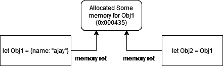
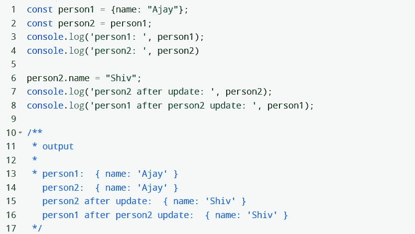
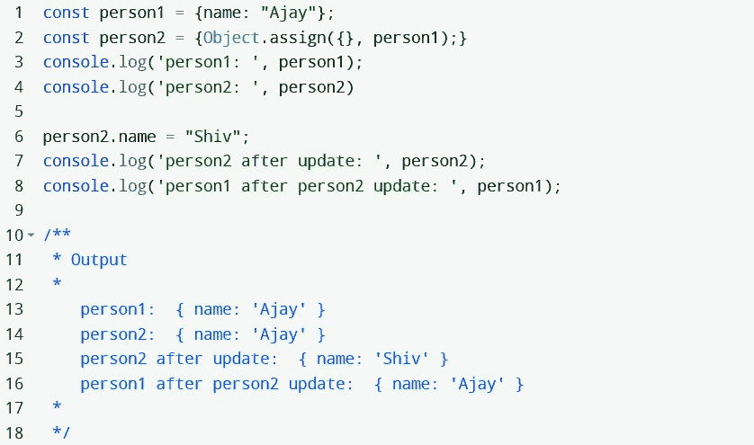
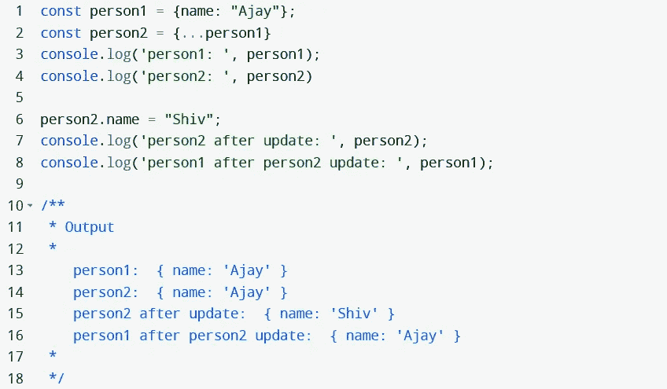
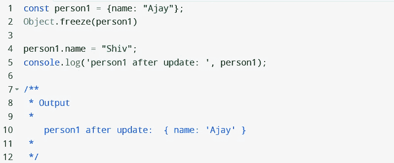

# JavaScript 中的对象突变

> 原文：<https://blog.devgenius.io/object-mutation-in-javascript-c1a4bc27dea2?source=collection_archive---------2----------------------->

Pic 信贷 BDI 资源

在 JavaScript 中，数据类型分为两组

1.  **原始数据类型** —不是[对象](https://developer.mozilla.org/en-US/docs/Glossary/Object)的数据，没有[方法](https://developer.mozilla.org/en-US/docs/Glossary/Method)或[属性](https://developer.mozilla.org/en-US/docs/Glossary/property/JavaScript)。

所有原语都是*不可变的*；也就是说，它们不能被改变。该变量可以被重新分配一个新值，但现有值不能改变。

2.**非原始/引用数据类型** —是对象和数组。JavaScript 中的引用类型是可变的，这意味着可变类型的状态和字段可以改变。因此不会创建新的实例。

## Javascript 中的对象突变

几天前，我试图复制一个对象，并修改复制的对象。我看到的是，当我试图更新复制的对象时，原始对象也在更新。这叫做物体突变。让我告诉你变异是如何工作的。当你复制任何对象时，它引用原始对象，这意味着复制的对象指向原始对象，这就是它更新原始对象的原因。你可以用下图来理解

对象的内存引用

现在让我们通过例子来理解这一点

让我们逐行理解代码

**Line1** :这里我们声明了一个对象 person1，并分配了一个 object，name 为 key。

**Line2** :这里我们声明了第二个对象 person2，并将 person1 对象赋给它。

**第 3 行&第 4 行**我们通过控制台日志检查了对象，并获得了预期值。

**第 6 行:**这里我们试图用值“Shiv”更新 person2 对象名。

**第 7 行:**这里我们再次控制台日志 person2，并得到了 person2 的值。

这里发生了真正的奇迹。我们认为预期的输出应该是 *{name: "Ajay"}* ，但是我们得到了 *{name: "Shiv"}* 。

为什么会这样？当我们更新 person2 时，person1 也发生了变化，这是因为内存引用(person2 更新了原始引用，因此指向该引用的所有对象都将得到更新)或者你可以说是对象突变，我已经用图表解释过了。

## 如何防止对象突变？

我们可以使用许多第三方库来防止对象变异。但是在这里，我将解释 2 JavaScript 技术

## [**1。**](https://developer.mozilla.org/en-US/docs/Web/JavaScript/Reference/Global_Objects/Object/assign)

此方法试图将所有参数从源对象复制到目标对象。如果使用不当，该方法会将可变对象作为输出。通过在目标参数中提供一个空对象，可以很容易地避免改变对象。

在**第 2 行**这里，我们使用了 Object.assign 方法，这个方法给了我们预期的输出。

## [**2。展开语法**](https://developer.mozilla.org/en-US/docs/Web/JavaScript/Reference/Operators/Spread_syntax)

JavaScript 扩展语法可用于防止对象突变。你可以从[这里](https://developer.mozilla.org/en-US/docs/Web/JavaScript/Reference/Operators/Spread_syntax)了解更多关于 spread 语法的知识。

在这里的 **line2** 中，我们使用了 spread 语法，这给了我们预期的输出。

## **如何防止单个对象上的变异？**

在上面的例子中，我们试图修改 const 对象。如果你有一个要求，你不希望你的对象重新分配一些其他的值呢？你会怎么做？

以上问题的解决方法是 Object.freeze()方法。这种方法可以防止数据被轻易更改，并且在我们的代码中访问数据时，都将使用原始值

## **结论**

在这里，我们学习了 3 种防止对象突变的方法。还有其他几种方法可以用来防止对象突变。如果你有任何担心或者你知道任何其他方法，请在评论中告诉我。

你喜欢这篇文章吗？如果有，通过 [**订阅获取更多类似内容解码，我们的 YouTube 频道**](https://www.youtube.com/@codingwithkrpajay?sub_confirmation=1) **！**感谢阅读。快乐编码。

同样的博客也将在[https://ajaykrp.me/](https://ajaykrp.me/)推出。