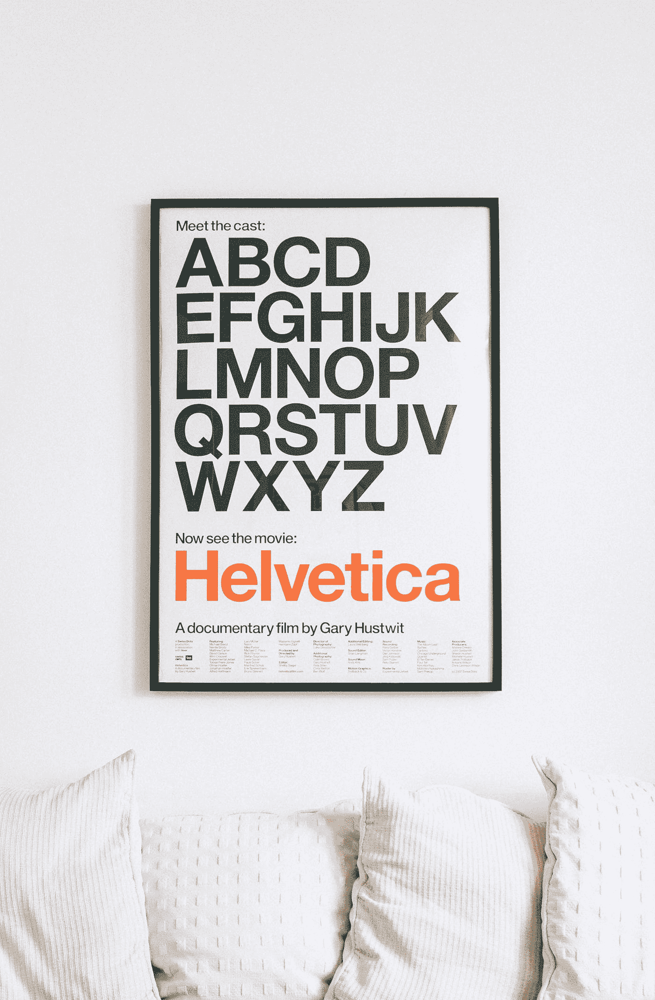

# 面向对象的 JavaScript —内置浏览器对象

> 原文：<https://blog.devgenius.io/object-oriented-javascript-built-in-browser-objects-8b35a3565135?source=collection_archive---------6----------------------->


费利克斯·科尔托夫在 [Unsplash](https://unsplash.com?utm_source=medium&utm_medium=referral) 上拍摄的照片

JavaScript 部分是面向对象的语言。

要学习 JavaScript，我们必须学习 JavaScript 的面向对象部分。

在本文中，我们将研究内置的浏览器对象。

# window.location 属性

属性让我们获得页面的 URL 并将其重定向到另一个页面。

例如，我们可以使用`location.hostname`来获取主机名。

而`href`给了我们完整的路径。

`pathname`获取查询字符串之前的段。

`port`给了我们港口。

`search`给出了一个查询字符串。

我们可以通过循环获得`location`对象的所有属性:

```
for (const key in location) {
  if (typeof location[key] === "string") {
    console.log(key, location[key]);
  }
}
```

我们用`location`对象遍历每个属性。

我们设置了`location.href`属性来重定向到一个新的 URL。

例如，我们可以写:

```
window.location.href = 'http://www.example.com';
```

此外，我们可以写:

```
location.href = 'http://www.example.com';
location = 'http://www.example.com';
location.assign('http://www.example.com');
```

`replace`和`assign`几乎一样，但是并没有创建新的浏览器历史条目。

我们可以通过书写来使用它:

```
location.replace('http://www.example.com');
```

要重新加载一个页面，我们可以写:

```
location.reload();
```

我们还可以将`window.location.hre`分配给它自己来重新加载页面:

```
window.location.href = window.location.href;
location = location;
```

# window.history 属性

属性让我们可以访问同一个浏览器会话中以前访问过的页面。

例如，在使用`window.history.length`访问当前页面之前，我们可以看到访问过的页面数量。

为了保护隐私，我们看不到实际的网址。

但是我们可以在用户会话中来回导航。

我们可以使用:

```
history.forward();
history.back();
```

分别在历史中前进和后退。

`history.back()`也与`history.go(-1);`相同。

要返回 2 页，我们可以写:

```
history.go(-2);
```

我们可以用以下内容重新加载当前页面:

```
history.go(0);
```

HTML5 历史 API 还允许我们在不重新加载页面的情况下更改 URL。

我们可以使用`history.pushState`方法来改变页面。

例如，我们可以写:

```
history.pushState({foo: 1}, "", "hello");
```

第一个参数是`stte`属性的值。

第二个是标题，不用。

第三个是 URL 路径。

然后我们可以用`history.state`得到状态。

# window.frames 属性

属性是当前页面中所有框架的集合。

它不区分框架和 iframes。

`window.frames`指向`window`，无论页面上是否有框架。

所以:

```
window.frames === window;
```

返回`true`。

如果我们有这样一个框架:

```
<iframe name="helloFrame" src="hello.html" />
```

那么`frames.length`就是 1。

我们可以得到第一帧，即`window`，用:

```
window.frames[0];
window.frames[0].window;
window.frames[0].window.frames;
frames[0].window;
frames[0];
```

我们可以用以下内容重新加载框架:

```
frames[0].window.location.reload();
```

而框架的父级是`window`，所以:

```
frames[0].parent === window;
```

返回`true`。

我们使用`top`属性来获取最顶层的页面，这是该框架中所有其他框架的页面。

所以所有这些:

```
window.frames[0].window.top === window;
window.frames[0].window.top === window.top;
window.frames[0].window.top === top;
```

返回`true`。

`self`与`window`相同，所以:

```
self === window
```

返回`true`。

同样，这些也返回`true`:

```
frames[0].self === frames[0].window;
window.frames['helloFrame'] === window.frames[0];
frames.helloFrame === window.frames[0];
```



[Martin Péchy](https://unsplash.com/@martinpechy?utm_source=medium&utm_medium=referral) 在 [Unsplash](https://unsplash.com?utm_source=medium&utm_medium=referral) 上拍摄的照片

# 结论

属性`window.location`和`window.frames`让我们分别获取和设置应用程序的 URL 和获取框架。