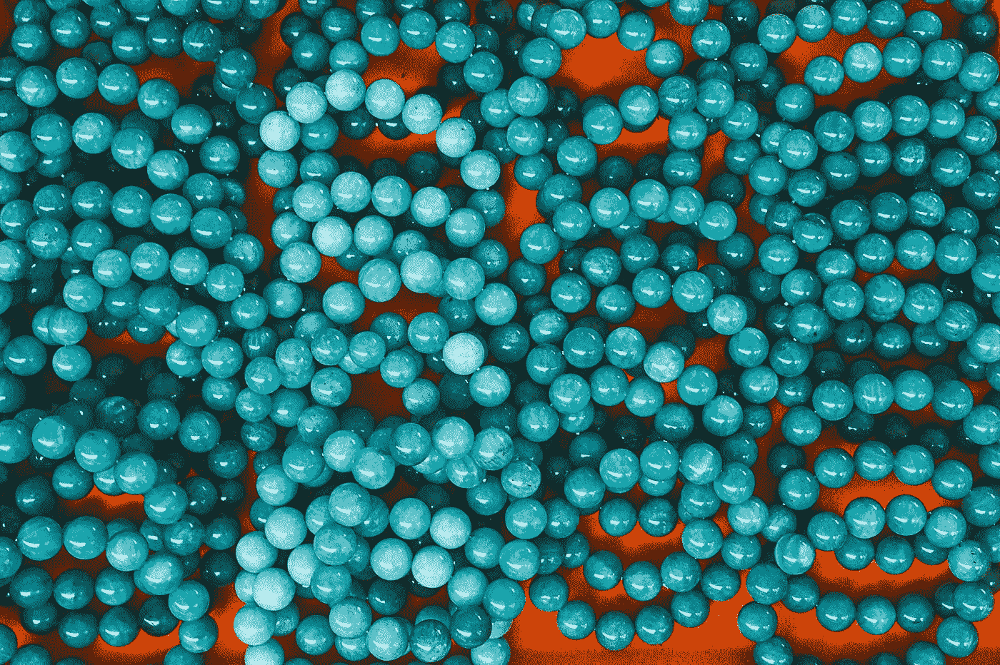

# 面向对象的 JavaScript —多重继承

> 原文：<https://blog.devgenius.io/object-oriented-javascript-multiple-inheritance-ca07df32d137?source=collection_archive---------3----------------------->



照片由 [Eric Prouzet](https://unsplash.com/@eprouzet?utm_source=medium&utm_medium=referral) 在 [Unsplash](https://unsplash.com?utm_source=medium&utm_medium=referral) 上拍摄

JavaScript 部分是面向对象的语言。

要学习 JavaScript，我们必须学习 JavaScript 的面向对象部分。

在本文中，我们将研究多重继承。

# 多重遗传

通过将不同属性的属性合并到一个对象中，然后返回该对象，我们可以很容易地实现多重继承。

例如，我们可以写:

```
function multi(...args) {
  let obj = {};
  for (const arg of args) {
    obj = {
      ...obj,
      ...arg
    };
  }
  return obj;
}
```

然后我们可以通过写来使用它:

```
const obj = multi({
  foo: 1
}, {
  bar: 2
}, {
  baz: 3
});
```

`obj`接着是:

```
{foo: 1, bar: 2, baz: 3}
```

我们传入多个对象，然后用 spread 操作符复制属性。

# 混合蛋白

Mixins 是一个可以合并到另一个对象中的对象。

当我们创建一个对象时，我们可以选择将哪个混音合并到最终的对象中。

# 寄生遗传

寄生继承是指我们将另一个对象的所有功能移植到一个新的对象中。

这个图案是道格拉斯·克洛克福特创造的。

例如，我们可以写:

```
function object(proto) {
  function F() {}
  F.prototype = proto;
  return new F();
}const baseObj = {
  name: '2D shape',
  dimensions: 2
};function rectangle(baseObj, width, height) {
  const obj = object(baseObj);
  obj.name = 'rectangle';
  obj.getArea = function() {
    return this.width * this.height;
  };
  obj.width = width;
  obj.height = height;
  return obj;
}const rect = rectangle(baseObj, 2, 3);
console.log(rect);
console.log(rect.getArea());
```

我们有返回一个`F`实例的`object`函数。

然后我们创建了包含了`baseOf`、`width`和`height`的`rectangle`函数，并将其合并到由`object`返回的对象中。

`object`将`baseObj`变为`F`的原型。

我们将自己的属性添加到`obj`，我们返回它来添加更多的属性。

这样，如果我们记录`rect`的值，我们会得到:

```
{name: "rectangle", width: 2, height: 3, getArea: ƒ
```

`rect`的`__proto__`有:

```
dimensions: 2
name: "2D shape"
```

我们也可以像在上一个控制台日志中那样调用`getArea`，我们得到 6。

所以我们知道`this`指的是返回的对象。

# 借用构造函数

我们可以从子构造函数调用父构造函数。

例如，我们可以写:

```
function Shape(id) {
  this.id = id;
}Shape.prototype.name = 'Shape';
Shape.prototype.toString = function() {
  return this.name;
};function Square(id, name, length) {
  Shape.apply(this, [id]);
  this.name = name;
  this.length = length;
}Square.prototype = new Shape();
Square.prototype.name = 'Square';
```

我们有`Shape`构造函数，它接受`id`参数。

我们用`apply`调用`Shape`构造函数，这样我们`this`就被设置为`Shape`构造函数。

这将从`Square`设置`this.id`。

然后我们可以填充我们自己的属性。

然后我们用`Shape`实例创建`Square`的`prototype`。

然后我们将`name`设置为`'Square'`，因为这是因为所有的`Square`实例而共享的。

另外，我们通过设置`Square`的`prototype`属性将属性从`Shape`复制到`Square`。


Eric Prouzet 在 [Unsplash](https://unsplash.com?utm_source=medium&utm_medium=referral) 上拍摄的照片

# 结论

我们可以用不同的继承方式创建对象。

我们可以调用父类的构造函数，合并不同对象的不同属性。